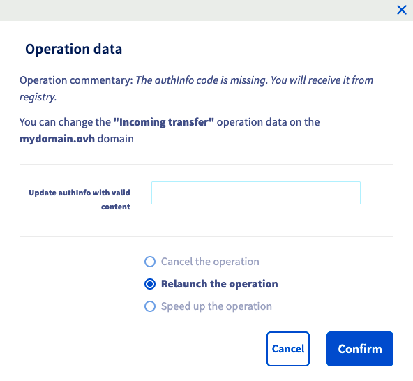

**Dernière mise à jour le 12/08/2022**

## Objectif

Lorsque vous lancez une opération sur un nom de domaine tel qu' un transfert, un changement de propriétaire ou même sa création, vous êtes susceptible de rencontrer une erreur qui nécessitera une intervention de votre part.

**Découvrez comment identifier et agir lors d'une erreur sur un nom de domaine**

## En pratique

Depuis votre [espace client OVHcloud](https://www.ovh.com/auth/?action=gotomanager&from=https://www.ovh.com/fr/&ovhSubsidiary=fr), dirigez-vous dans la rubrique `Web Cloud`{.action} puis `Noms de domaine`{.action} . Cliquez sur `Opérations en cours`{.action} au-dessus de la liste des noms de domaine.

Dans ce tableau, vous pouvez consulter toutes les opérations liées aux noms de domaine dans votre [espace client OVHcloud](https://www.ovh.com/auth/?action=gotomanager&from=https://www.ovh.com/fr/&ovhSubsidiary=fr). 

{.thumbnail}

- `Domain` : Nom de domaine concerné par l'opération.
- `Opération` :  Opération en cours sur le nom de domaine.
- `Comment` : Détails sur l'opération en cours. Instructions.
- `Processing date` : Date de création de l'opération.
- `Date of update` :  Horodatage de mise à jour de l'opération en cours	.
- `End date` : Date de fin de l'opération.
- `Status` : État actuel de l'opération.

Toutes ces opérations ne nécessitent pas votre intervention pour qu'elles se déroulent normalement. Nous allons nous intéresser aux opérations **en erreur** au travers d'exemples fréquents, dans la partie suivante.

{.thumbnail}

### Exemples

> [!primary]
>
> La liste d'exemples ci-dessous est non-exhaustive, si vous rencontrez une erreur qui n'est pas présentée: 
> - Vérifiez dans un premier temps si vous pouvez agir sur celle-ci en cliquant sur le bouton `...`{.action} à droite.
> - Assurez-vous bien qu'avec le message descriptif, vous ne pouvez pas résoudre l'erreur.
> - Vérifiez que votre nom de domaine n'est pas suspendu suite à son expiration. Cet état ne permet aucune action.
> Si aucune de ces actions ne vous permet d'agir sur le nom de domaine, nous vous invitons à ouvrir un ticket depuis votre espace client.
>

#### Demande de documents

Certaines extensions de noms de domaine nécessitent qu'on justifie leur utilisation en fournissant des documents. Lorsque c'est la cas, vous devrez transmettre les documents par l'intermédiaire de la fenêtre `Opérations en cours`{.action}.

{.thumbnail}

Pour fournir le document nécessaire, cliquez sur le bouton `...`{.action} à droite de l'opération. La fenêtre ci-dessous apparait, la partie `description` vous permettra d'avoir des détails sur le document à fournir et un bouton pour télécharger votre document.

{.thumbnail}

#### Informations manquantes

Lorsque vous enregistrez votre nom de domaine, il est parfois nécessaire de compléter les données de "contact", c'est pourquoi si ces dernières ne correspondent pas aux critères du nom de domaine, vous pouvez obtenir l'erreur ci-dessous.

{.thumbnail}

Cliquez sur le bouton `...`{.action} à droite de l'opération. La fenêtre ci-dessous apparait, complétez les champs qui apparaissent avec les informations du contact concerné.

{.thumbnail}

#### Code de transfert erroné 

Lorsque vous transférez votre nom de domaine vers OVHcloud, vous devez saisir un code de transfert (**authInfo**) lors de la commande. Si celui-ci est incorrect, l'opération est suspendue mais il est toutefois possible de relancer celle-ci avec le bon code.

{.thumbnail}

Cliquez sur le bouton `...`{.action} à droite de l'opération. La fenêtre ci-dessous apparait, renseignez le code de transfert (**authInfo**) et relancez l'opération.

{.thumbnail}

#### Erreur liée aux serveurs DNS

Lorsque vous attachez des serveurs DNS à un nom de domaine, si ces derniers ne fonctionnent pas, dans l'exemple ci-dessous, l'adresse IP du serveur DNS ne répond pas.

{.thumbnail}

Sélectionnez votre nom de domaine dans la section `Noms de domaine`{.action}, puis cliquez sur l'onglet `Serveurs DNS`{.action}. Depuis cette fenêtre, [modifiez vos serveurs DNS](https://docs.ovh.com/fr/domains/generalites-serveurs-dns/). 

#### Erreur sur un nom de domaine en **.ie**, **.de** ou **.ie** après une mise à jour DNS. 

Lorsque vous modifiez vos serveurs DNS, le registre est susceptible de vérifier les nouveaux serveurs DNS ainsi que la zone DNS associée et bloquer le nom de domaine si la configuration n'est pas conforme.

> [!warning]
>
> Ce type de blocage est initié par le registre et non par OVHcloud, c'est pourquoi le nom de domaine est actif dans votre espace client.

Pour constater le blocage dans votre espace client. Dirigez-vous vers le tableau des `Opérations en cours`{.action}.

{.thumbnail}

Pour vérifier votre nom de domaine, nous vous conseillons d'utiliser l'outil de vérification délivré par le registre :

- Pour un nom de domaine en **.de**: <https://nast.denic.de/>
- Pour un nom de domaine en **.it**: <https://dns-check.nic.it/>

> [!primary]
>
> Si votre registre ne fournit pas d'outil de vérification de serveur DNS, il est possible d'intérroger vos nouveaux serveurs DNS via la commande `nslookup`sur une « invite de commande » Windows ou la commande `dig` sur un « terminal » linux et macOS. Vous devez obtenir une adresse IP, cela indiquera que le serveur DNS est joignable. Il est, dans tous les cas, nécessaire de s'assurer auprès de l'administrateur du serveur DNS que celui-ci est bien configuré pour accueillir la zone DNS de votre nom de domaine.

Lorsque vous avez identifié l'origine de l'erreur et que vous l'avez corrigée, vous pouvez cliquer sur le bouton `...`{.action} à droite de l'opération et relancer l'opération de vérification DNS.

#### Erreur interne OVHcloud

Vous pouvez rencontrer une erreur ayant pour détails "erreur interne", vous ne pouvez pas agir sur celle-ci. Vérifier toutefois que votre nom de domaine est bien actif, ainsi que les serveurs DNS. Si vous constatez une anomalie qui n'est pas liée à la configuration des serveurs DNS ou de la zone DNS, nous vous invitons à ouvrir un ticket auprès du support OVHcloud via votre espace client pour identifier l'origine du dysfonctionnement.

{.thumbnail}

## Aller plus loin

[Transférer son nom de domaine vers OVHcloud](https://docs.ovh.com/fr/domains/transferer-mon-domaine-generique/)

[Transférer un nom de domaine vers un autre bureau d’enregistrement](https://docs.ovh.com/fr/domains/transfert-sortant-dun-nom-de-domaine-generique-ou-geographique/)

[Modifier les serveurs DNS d’un nom de domaine OVHcloud](https://docs.ovh.com/fr/domains/generalites-serveurs-dns/)
 
Échangez avec notre communauté d'utilisateurs sur <https://community.ovh.com/>.
