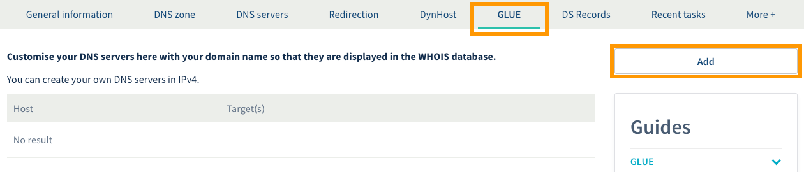
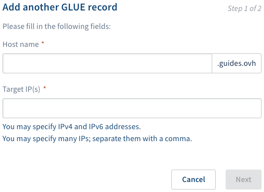
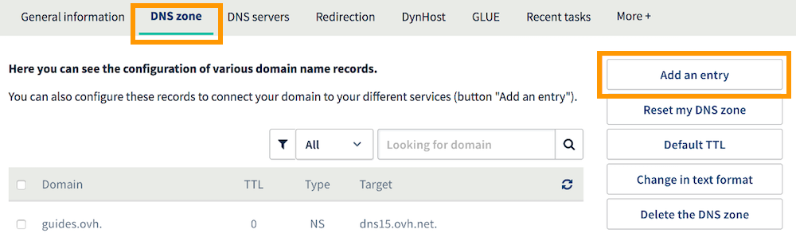
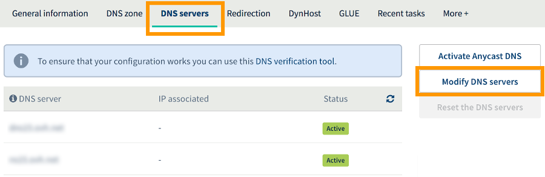

**Last updated 26th October 2018**

## Objective

DNS servers are designed to store DNS configurations for domain names. These configuration areas, which are called DNS zones, contain technical information in the form of records. DNS records are usually used to link your domain name to the server (or servers) that host your website and email addresses.

Depending on what you need them for, you may want to customise your OVH domain name’s DNS servers.

**Find out how to customise the DNS servers for your OVH domain name.**

## Requirements

- a domain name registered with OVH
- access to the [OVH Control Panel](https://www.ovh.com/auth/?action=gotomanager){.external}

## Instructions

**We strongly recommend taking great care when you customise a domain name’s DNS servers.** Incorrect changes could render your website inaccessible, and prevent your email addresses from receiving new emails. We advise following the steps below exactly as they are described, and to seek assistance if you are unsure about any changes that you would like to make.

### Step 1: Add the glue records.

First of all, log in to the [OVH Control Panel](https://www.ovh.com/auth/?action=gotomanager){.external}, ensure that you are in the `Web` section, and click `Domains`{.action} in the services bar on the left-hand side. Then select the domain name you would like to customise the DNS servers for. Next, go to the `GLUE`{.action} tab.

On the page that appears, there will be a table listing the glue records currently configured with OVH for your domain name. To add the glue record, click `Add`{.action}.

{.thumbnail}

In the pop-up window, enter the following information:

|Information|Details|  
|---|---|
|Host name|Customise the host name you would like to use as a customised DNS server.|
|Target IP|Enter the IP address (or addresses) you would like the host name to be linked to. This is the IP address of the DNS server currently used by your domain name. If your domain name uses OVH DNS servers and you do not know the server’s corresponding IP address, you can retrieve this information using our [Dig](https://www.ovh.co.uk/support/tools/dig_domain.pl){.external} tool. It will appear in `ANSWER SECTION`, next to ‘A’.|

Once you have filled in the information, click `Next`{.action}, read through the information displayed, then click `Confirm`{.action}. Repeat this step as many times as necessary, depending on the number of DNS servers your domain name uses.

{.thumbnail}

### Step 2: Create the corresponding A records.

You now need to create A records for the host names you defined in the previous step. The A record must contain the target IP address corresponding to the host name you created earlier.

You will need to do this via the interface given by the service provider managing your domain name’s DNS configuration. You now have two options:

- **If your domain name does not use the OVH DNS configuration,** you will need to contact the service provider managing your domain name. Once you have made the required changes, go to the next step.

- **If your domain name uses the OVH DNS configuration,** go to the `DNS Zone`{.action} tab. Add a new A record by clicking `Add an entry`{.action}. Then select the A record option, and follow the steps provided.  If you need to, you can follow the instructions listed in our guide to [Editing an OVH DNS zone](https://docs.ovh.com/gb/en/domains/web_hosting_how_to_edit_my_dns_zone/){.external}.

{.thumbnail}

### Step 3: Edit the DNS servers for the domain name.

Now you need to modify your domain name’s DNS servers. To do this, go to the `DNS servers`{.action} tab, then click `Modify DNS servers`{.action}. Replace your current DNS servers with those you would like to use.

Finalise these steps, and if necessary, read the instructions listed in our guide to [Editing the DNS servers for an OVH domain name](https://docs.ovh.com/gb/en/domains/web_hosting_general_information_about_dns_servers/){.external}.

Once you have modified the DNS servers, wait for this action to be propagated. Please note that the change may take up to 48 hours to fully propagate.

{.thumbnail}

## Go further

Join our community of users on <https://community.ovh.com/en/>.