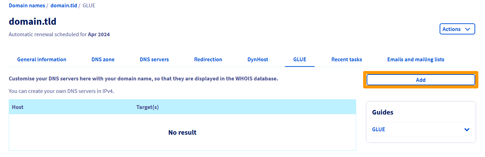
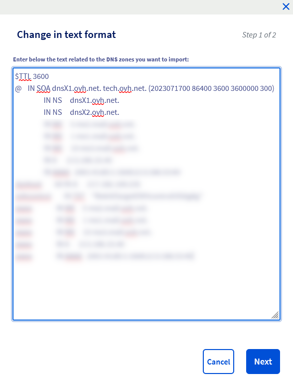

## Objective

The **DNS servers** host the DNS configurations for domain names: the *DNS zones*. 

These *DNS zones* consist of technical information: *DNS records*. In standard usage, *DNS records* allow you to:

- display your website with your domain name, using your hosting server’s IP address (DNS records of types *A* and *AAAA*).
- redirect the emails received to your personalized email address(es) with your domain name (DNS records of type *MX*).
- configure security/authentication information for your services (web hosting plan, email server, etc.) associated with your domain name (DNS records such as *SPF*, *DKIM*, *DMARC*, etc.).

For more information on these topics, please read our documentation on [OVHcloud DNS servers](/pages/web/domains/dns_server_general_information) and [editing an OVHcloud DNS zone](/pages/web/domains/dns_zone_edit).

Depending on your needs, you can customize your OVHcloud domain name’s DNS servers using **Glue Records**.

**Find out how to customize your OVHcloud domain name’s DNS servers.**

## Requirements

- A domain name registered with OVHcloud.
- You must be logged in to the [OVHcloud Control Panel](https://ca.ovh.com/auth/?action=gotomanager&from=https://www.ovh.com/sg/&ovhSubsidiary=sg){.external} and access the `Web Cloud`{.action} section.

## Instructions

> [!warning]
>
> **Customizing a domain name’s DNS servers is a sensitive procedure**: making an inappropriate change can cut access to your website and/or make it unavailable for you to receive new emails on your email addresses. 
> Please follow the steps below carefully,, or contact a [specialist provider](https://partner.ovhcloud.com/en-sg/directory/) if you have any doubts.
>

### Step 1: Retrieve the DNS servers currently used by your domain name <a name="step1"></a>

You can retrieve the DNS servers currently used by your domain name using the online DNS tool [Zonemaster](https://zonemaster.fr/en/run-test){.external}.

To do this, go to the link [https://zonemaster.fr](https://zonemaster.fr/en/run-test){.external}, enter your domain name without the *www* (e.g. *domain.tld*), then tick the `Options`{.action} button located just below the domain name entry form.

In the available options, click directly on the `Fetch NS from parent zone`{.action} button.

A result is displayed:

{.thumbnail}

Retrieve the *DNS servers* and keep **all** their associated IPv4 addresses (in the form of *X.X.X.X* where *X* is a number between *0* and *255*) and IPv6 (other IPs that are not IPv4). You will need them for the rest of this guide.

In our example shown above, the **domain.tld** domain currently uses the following **DNS servers**:

- **dnsX1.ovh.net** associated with IPv4 *111.222.333.443* and IPv6 *0000:00d0:1:0000::1*;
- **dnsX2.ovh.net** associated with IPv4 *111.222.333.444* and IPv6 *0000:00d0:1:0000::2*.

If you need more information, please read [our tutorial on the Zonemaster tool](/pages/web/domains/dns_zonemaster).

### Step 2: Add the "GLUE" records <a name="step2"></a>

> [!success]
>
> Before you begin, be aware that:
>
> - You can create custom DNS servers directly on the domain name that will use them. For example, you can create custom DNS *dns1.domain.tld* and *dns2.domain.tld* for the domain name *domain.tld*.
>
> - You can also create custom DNS servers on a domain name to use with another domain name. For example, you can create custom DNS *dns1.domain1.tld* and *dns2.domain1.tld* for the domain name *domain2.tld*. You will need to retrieve the DNS servers and their associated IPs from the *domain2.tld*.
> In addition, the *domain1.tld* must be registered with OVHcloud to set up the GLUE records.
>

Log in to your [OVHcloud Control Panel](https://ca.ovh.com/auth/?action=gotomanager&from=https://www.ovh.com/sg/&ovhSubsidiary=sg){.external}, then go to the `Web Cloud`{.action} section. In the left-hand column, click `Domain names`{.action} then choose the domain name you will use to customize the DNS server names. 

On the new page, click on the `GLUE`{.action} tab.

A table will then display the "GLUE" records currently configured at OVHcloud for your domain name (if any). To add a new GLUE record, click the `Add`{.action} button.

{.thumbnail}

In the window that opens on your screen, enter the information requested:

|Information|Details|
|---|---|
|Host Name|Customize the host name you want to use as a custom DNS server.|
|Target IP(s)|Specify the IP address(es) (IPv4 and/or IPv6) to which the host name should be attached. This is the IP address(es) of the DNS server currently used by your domain name. If there are multiple IP addresses, separate them with *commas*.|

{.thumbnail}

In the image above, taking the example from [step 1](#step1), the “GLUE” you want to add here (from the domain name *domain.tld*) is **dns1.domain.tld**. 

For this “GLUE”, the IP addresses of *target DNS server* are indicated as *111.222.333.443* (IPv4) and *0000:00d0:1:0000::1* (IPv6). These IPs correspond to one of the two DNS servers currently used for *domain.tld* (**dnsX1.ovh.net**). 

This “GLUE” is added so that **dns1.domain.tld** can ultimately replace the DNS server name **dnsX1.ovh.net** currently used by the domain name *domain.tld*.

Once you have entered this information, click the `Next`{.action} button, read the information displayed, then click `Confirm`{.action}. Repeat this step as many times as necessary, depending on the number of DNS servers your domain name uses.

In our example, you will need to repeat the operation to create the **dns2.domain.tld** glue. This will then replace the DNS server **dnsX2.ovh.net** currently associated with IPv4 *111.222.333.444* and IPv6 *0000:00d0:1:0000::2*

### Step 3: Create the A and AAAA DNS records corresponding to the custom DNS

You must create the *A* and *AAAA* records for the host names that you defined in the previous step. The *A* and *AAAA* records must target the destination IP address corresponding to the host name created earlier.

You can do this via the interface given by the service provider managing your domain name’s DNS configuration. There are two ways of doing this:

- **If your domain name does not use an active DNS zone with OVHcloud**: contact the service provider managing it. Once you have made the required changes, please move on to the next step.
- **Your domain name uses an active DNS zone at OVHcloud**: Log in to your [OVHcloud Control Panel](https://ca.ovh.com/auth/?action=gotomanager&from=https://www.ovh.com/sg/&ovhSubsidiary=sg){.external} then go to the `Web Cloud`{.action} section. In the left-hand column, click `Domain names`{.action}, then select the domain name you used to create the “GLUE” in [step 2](#step2). Go to the `DNS Zone`{.action} tab, then click `Add an entry`{.action}. Select the entry of type *A* or *AAAA* depending on the type of associated IP you want to add. Follow the steps by entering the *sub-domain* and the address *IPv4* (A) or *IPv6* (AAAA) then proceed until the addition has been validated. If necessary, please refer to our guide on [Editing an OVHcloud DNS zone](/pages/web/domains/dns_zone_edit) .

{.thumbnail}

> [!primary]
>
> In all cases, you will need to wait between 4 and 24 hours for the DNS zone modification to propagate across the entire DNS network.We recommend that you wait until the end of this period before continuing.
>

If we go back to our previous example, the “GLUE” records that we want to add (from the *domain.tld* domain) are **dns1.domain.tld** and **dns2.domain.tld**. The goal is to replace the current DNS servers **dnsX1.ovh.net** and **dnsX2.ovh.net**.

As a result, the following records are added to the active DNS zone of the domain name *domain.tld*:

 - An *A* DNS record for the *subdomain* **dns1.domain.tld** to the IP *111.222.333.443* (DNS server IPv4 **dnsX1.ovh.net**);
 - A *AAAA* DNS record for the *subdomain* **dns1.domain.tld** to the IP *0000:00d0:1:0000::1* (DNS server IPv6 **dnsX1.ovh.net**);
 - An *A* DNS record for the *subdomain* **dns2.domain.tld** to the IP *111.222.333.444* (DNS server IPv4 **dnsX2.ovh.net**);
 - A *AAAA* DNS record for the *subdomain* **dns2.domain.tld** to the IP *0000:00d0:1:0000::2* (DNS server IPv6 **dnsX2.ovh.net**).

The DNS propagation will take a while.

### Step 4: Modify your domain name’s DNS servers

You will need to modify your domain name’s DNS servers by replacing the old DNS servers with the custom DNS servers you have created.

To do this, log in to your [OVHcloud Control Panel](https://ca.ovh.com/auth/?action=gotomanager&from=https://www.ovh.com/sg/&ovhSubsidiary=sg){.external}, then go to the `Web Cloud`{.action} section. In the left-hand column, click `Domain names`{.action}, then select *the domain name for which you want to customize the DNS servers*.
 
Go to the `DNS servers`{.action} tab, then click `Modify DNS servers`{.action}. Then replace your current DNS servers with those you would like to use as custom DNS servers. 

Finalize the steps and, if necessary, refer to the instructions set out in our documentation “[Modifying an OVHcloud domain name’s DNS servers](/pages/web/domains/dns_server_general_information)”.

> [!primary]
> 
> If you have customized DNS servers on one domain name for use with another domain name that is not registered with OVHcloud, contact the service provider where your other domain name is registered to modify the DNS servers.
>

{.thumbnail}

> [!primary]
>
> A propagation delay of 24 to 48 hours is required for the change of DNS servers to take effect across the entire DNS network. We recommend that you wait until the end of this period before continuing.
>

In our example of customizing the DNS servers for the domain name *domain.tld*, we replace the DNS server **dnsX1.ovh.net** with **dns1.domain.tld** and the DNS server **dnsX2.ovh.net** with **dns2.domain.tld**, then wait for the DNS propagation to propagate.

### Step 5: Replace the NS records in your domain name’s active DNS zone

For the customization of DNS servers to be visible on the DNS network (by performing a *Whois*, a *dig ns* or through a DNS configuration analyzer), you will need to replace the *NS* records in your domain name’s active DNS zone.

You can do this via the interface given by the service provider managing your domain name’s DNS configuration. There are therefore two possibilities:

- **Your domain name does not use an active DNS zone at OVHcloud** : contact the service provider managing it to make the change.
- **Your domain name uses an active DNS zone at OVHcloud**: Log in to your [OVHcloud Control Panel](https://ca.ovh.com/auth/?action=gotomanager&from=https://www.ovh.com/sg/&ovhSubsidiary=sg){.external} then go to the `Web Cloud`{.action} section. In the left-hand column, click `Domain names`{.action}, then select the domain name for which you have customized the DNS servers. Go to the `DNS Zone`{.action} tab, then click `Change in text format`{.action}. 

A window will appear with your DNS zone in *text* mode:

{.thumbnail}

> [!warning]
>
> As a reminder, making an inappropriate change in *text* mode in your DNS zone can cut access to your website and/or make it unavailable for you to receive new emails on your email addresses. 
> Contact a [specialist provider](https://partner.ovhcloud.com/en-sg/directory/) if you have any doubts.
>

In this window, replace **only in records of type *NS*** the names of the DNS servers with your own custom DNS server names. You **also have to** increment the first numeric value in the *SOA* line by "1". Once you have made your changes, click `Next`{.action} then `Confirm`{.action}.

The change will not be visible immediately in the [OVHcloud Control Panel](https://ca.ovh.com/auth/?action=gotomanager&from=https://www.ovh.com/sg/&ovhSubsidiary=sg){.external}. Wait around 20 minutes, then log in to the OVHcloud Control Panel to ensure that your changes have been processed.

> [!primary]
>
> You will need to wait between 4 and 24 hours for the changes you make to the DNS zone to propagate across the entire DNS network.
>

To get a better understanding of this last step, let’s take a look at our example: the domain name *domain.tld* and its DNS zone in “text” mode, visible in the image above.

The following elements are observed: 

- The first numeric value of the line *SOA* is as follows: *2023071700*.
- There are two *NS* records for the domain name *domain.tld*.
- Records of type *NS* still target the two DNS servers **dnsX1.ovh.net** and **dnsX2.ovh.net**.

To finalize the customization of the DNS servers for the domain name *domain.tld*, you will need to:

- Increment the first numeric value of the *SOA* line by "1": *202307170**1*** (note that if the first numeric value was:*2023071704*, you would still increment by "1" and get the following result: *202307170**5*** ).
- Replace the target **dnsX1.ovh.net.** with **dns1.domain.tld.** only for the line that starts with **IN NS**.
- Replace the target **dnsX2.ovh.net.** with **dns2.domain.tld.** only for the line that starts with **IN NS**.

Once the modifications are made, the result of our example will be the following:

```bash
$TTL 3600
@	IN SOA dnsX1.ovh.net. tech.ovh.net. (2023071701 86400 3600 3600000 300)
                  IN NS     dns1.domain.tld.
                  IN NS     dns2.domain.tld.
```

For our domain name *domain.tld*, the DNS servers displayed after the DNS modification and propagation have been processed now are **dns1.domain.tld.** and **dns2.domain.tld.**.

If necessary, please refer to our guide on [editing an OVHcloud DNS zone](/pages/web/domains/dns_zone_edit) .

> [!success]
>
> If you have customized your DNS servers directly on the domain name that will use them, the DNS zone may not display the domain name in the targets of the *NS* records, but only the *subdomain*.
>
> For example, instead of displaying the following records:
> 
> - domain.tld IN NS dns1.domain.tld.
> - domain.tld IN NS dns2.domain.tld.
>
> The DNS zone can display records as follows:
>
> - domain.tld IN NS dns1
> - domain.tld IN NS dns2
>
> Rest assured, this is the same result and this configuration will work perfectly. This phenomenon is generated by the fact that the domain name is the same on both sides of the *NS* record.
>

## Go further

[General information on OVHcloud DNS servers](/pages/web/domains/dns_server_general_information)

[Edit an OVHcloud DNS zone](/pages/web/domains/dns_zone_edit)

For specialised services (SEO, development, etc.), contact [OVHcloud partners](https://partner.ovhcloud.com/en-sg/directory/).

If you would like assistance using and configuring your OVHcloud solutions, please refer to our [support offers](https://www.ovhcloud.com/en-sg/support-levels/).

Join our community of users on <https://community.ovh.com/en/>.
