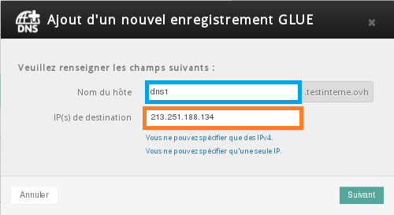
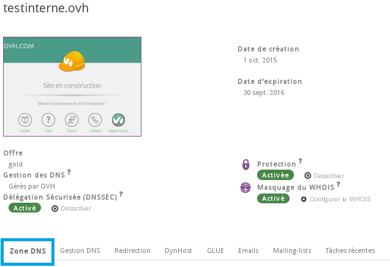
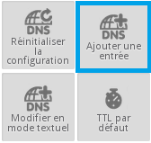
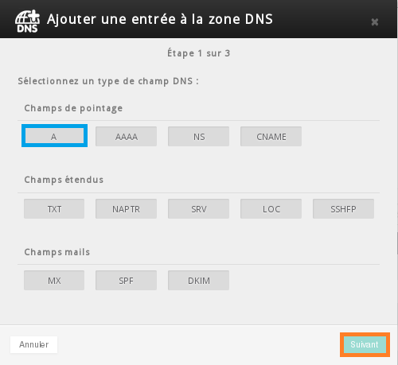
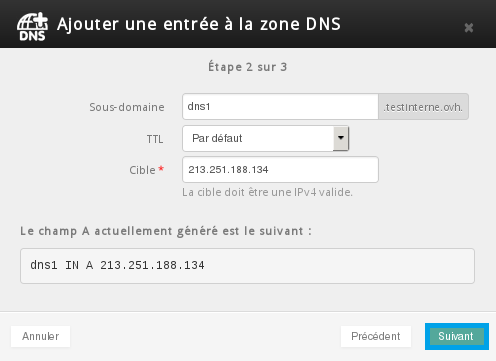

## Activer le glue Registry
Grâce au Glue Registry, vous personnalisez vos serveurs DNS avec votre nom de domaine. Votre nom s'affiche dans les bases Whois, à la place de celui de votre hébergeur. Vous pouvez créer vos propres serveurs DNS en IPv4.

La personnalisation des serveurs DNS est possible pour tous les domaines GTLD: .com, .net, .org... Pour utiliser ce service, rendez-vous directement dans votre [espace client](https://www.ovh.com/manager/web/login.html){.external}. Veuillez sélectionner le domaine concerné dans la section "Domaines" de votre espace client.

{.thumbnail}

Sélectionner l'onglet "glue" afin de pouvoir ensuite cliquer sur "Ajouter"

{.thumbnail}

Une fenêtre pop-up apparaît alors afin de configurer le glue registry.

{.thumbnail}

Il est nécessaire d'indiquer un sous-domaine et l'adresse ip d'un serveur DNS valide.

{.thumbnail}

## Création du sous domaine

> [!alert]
>
> Si vous utilisez des serveurs DNS externes à OVH, il faut créer le sous
> domaine dans la zone dns concernée et non dans la zone OVH
> 

Une fois le glue crée, il est nécessaire de déclarer un champ type "A" dans votre zone dns.

Sélectionner l'onglet "zone dns"

{.thumbnail}

Sélectionner ensuite "Ajouter une entrée"

{.thumbnail}

Cliquer sur type  **"A"**

{.thumbnail}

Selon notre exemple voici le le champ type  **"A"**  à crée et à valider.

{.thumbnail}

Un temps de propagation est ensuite nécessaire. Celui-ci est de 24/48H.