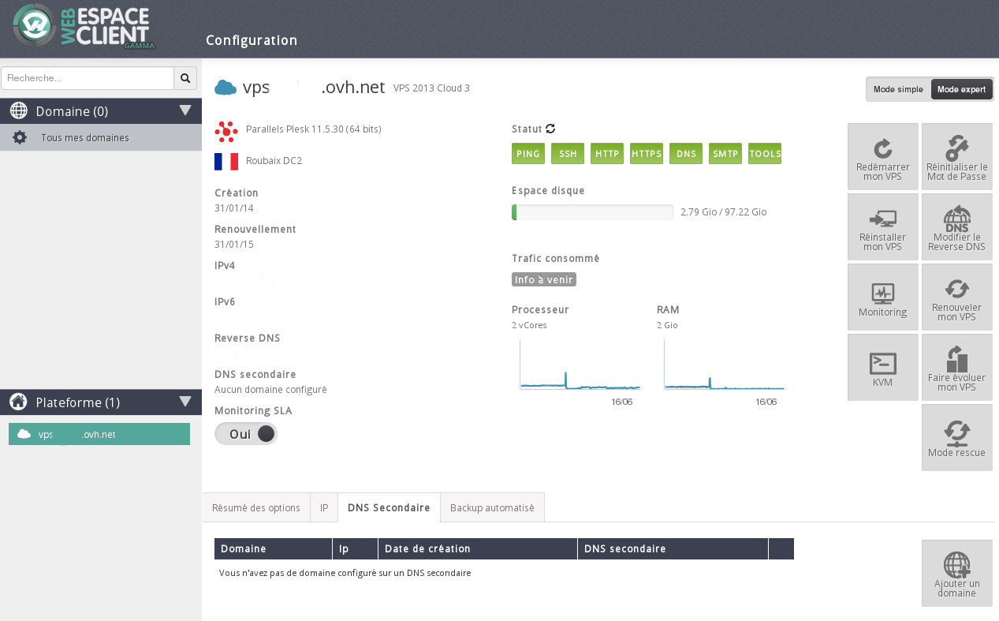
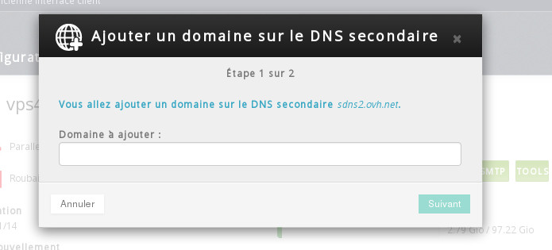
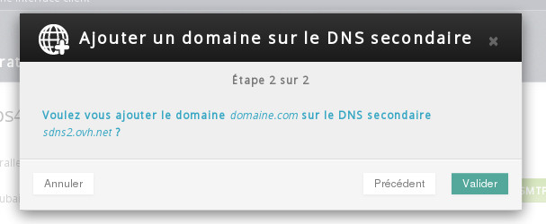
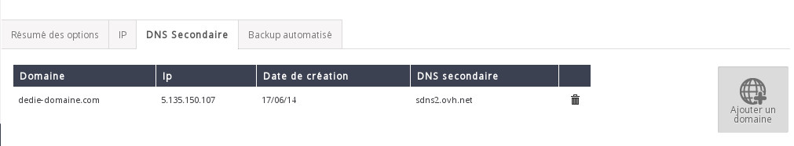

## 
OVH will give you a secondary DNS if you want to use your server as your domain's primary DNS.

You can find the secondary DNS option under the VPS section in your Control Panel.

The interface will look like this:

{.thumbnail}
On this page, you can:

- View directly the list of domains already configured with our secondary DNS.
- Add or delete a domain on our secondary DNS server.

## 1. Add a domain
To add a domain, click on Add a domain:

{.thumbnail}

- Type your domain into the field.

{.thumbnail}
Then click on Validate.

Your domain will then appear in the list, as per the below example:

{.thumbnail}
You will see the following information for every domain on the secondary DNS:

- DOMAIN: The domain configured on your secondary DNS.
- DATE OF CREATION: The date your domain was added to the secondary DNS.
- IP: The IP address of the primary DNS server for the domain.
- Secondary DNS: The name of the OVH secondary DNS on which your domain is configured.

You may be asked to verify that you are the owner of this domain. You will in this case see a message similar to the one below when you add the domain:
An error occurred when requesting to add the domain to the secondary DNS. (First we need to verify you are the owner of this domain. To do so, please add a TXT field on your DNS zone for the domain dedie-domaine.com, with the subdomain 'ownercheck' and the following value: '339ea8d0'. Once done and your zone reloaded, try again (you don't need to wait for DNS propagation).)
In this case you will need to add a TXT field for the ownercheck.yourdomain.com sub-domain in the domain's current working DNS zone:

code]ownercheck TXT "339ea8d0"[/code]

## 2. Delete a domain
To delete the domain from the secondary DNS, simply click on the Bin icon, which is to the right of every configured domain.

## 
In this guide, we've shown you how to:

- Add a domain to our secondary DNS server.
- Delete a domain from our secondary DNS server.

