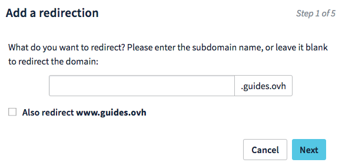
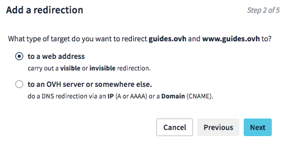
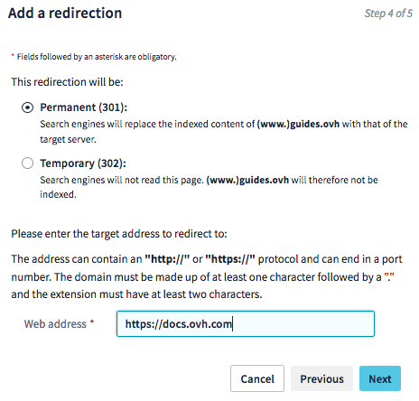
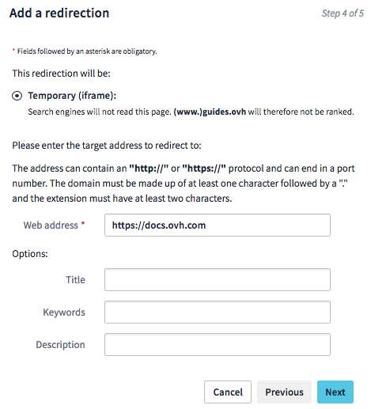

**Last updated 25th January 2018**

## Objective

You can use domain name redirection to redirect your domain to a new target. There are a variety of different redirection types, each of which is suitable for a specific need.

**Find out about the various redirection types, and how to create one for a domain name managed by OVH.**

## Requirements

- You must be logged in to your [OVH Control Panel](https://www.ovh.com/auth/?action=gotomanager){.external}.
- You must be logged in to your web hosting plan (if you would like to add an .htaccess file).

## Instructions

### Understand domain name redirection

Before you create a redirection for your domain name, it is important to understand what it is used for. You can use it to redirect your domain name to a new target – generally another domain name.

There are numerous reasons why you might want to use a redirection, but it is typically used it change the name of a website. In this case, the redirection will guide web users who are still accessing your old domain name, by automatically redirecting them to the new one.

There are two ways of creating a domain name redirection:

- **Through the OVH Control Panel,** using the configuration assistant to set your redirection.

- **Creating the redirection yourself (usually via an .htaccess file).** This will require programming skills.

Please note that setting up a redirection will affect your website’s SEO ranking. Take care with the changes you make, and contact an SEO specialist if required.

### Redirect a domain name from the Control Panel

Once you have logged in to your [OVH Control Panel](https://www.ovh.com/auth/?action=gotomanager){.external}, click your domain name in the `Domains`{.action} section of the service bar (1 on the image below). Then click the `Redirection`{.action} tab (2 on the image below) in the page that opens.

This table displays all active redirections for your domain name.

To add a redirection, click `Add a redirection`{.action} (3 on the image below).

{.thumbnail}

In the window that appears, enter the domain name (or subdomain) that you would like to redirect. This will be the redirection source.

{.thumbnail}

You must now choose the target you would like to redirect the domain name to. There are two choices:

- **Redirect to a web address**

Redirect a domain name to another domain name. This solution is ideal if you are changing your website’s domain name.

- **Redirect to an OVH server, or elsewhere**

Modify a domain name’s DNS configuration and enter another target (A record, AAAA record or CNAME record). This solution is ideal if your website is no longer hosted by the same hosting provider, but the domain name is still registered with the same registrar. 
You can also do this if your domain name uses OVH configuration, by modifying it within the Control Panel (see [How to edit my DNS zone](https://docs.ovh.com/gb/en/domains/web_hosting_how_to_edit_my_dns_zone/){.external}).

From this point onwards, we will only focus on redirections **to a web address**. For the latter option, please contact your service provider to find out which DNS records you will need to modify in order to redirect your domain.

{.thumbnail}

For redirections **to a web address**, you can now choose the redirection type that you would like to set up. There are two choices.

|Redirection type|Description|
|---|---|
|Visible|The domain name you type into your browser (the previous address) will be redirected to the new domain name. This will change the URL that appears in your internet browser, replacing it with the new address.|
|Invisible|The domain name you type into your browser (the previous address) will not be redirected to the new domain name. You will still access the previous address, which will display the website hosted on the new domain name using an overlay called *iframe*. Please note that this action is not compatible with all websites. Your website’s SEO ranking may be affected.|

{.thumbnail}

#### For visible redirection

You have two choices for **visible redirection**:

|Redirection type|HTTP Code|Description|
|---|---|---|
|Permanently visible|301|This is a standard redirection, and will continue to function for as long as it is left in place.|
|Temporarily visible|302|This redirection type can be used for a set period of time (for temporary or seasonal events, for example). Note that the SEO ranking will be lower than it would be with a 301 redirection.|

Once you have made your choice, please enter the redirection target (the URL you would like your domain name to redirect to).

{.thumbnail}

Once the information is complete, click `Next`{.action}, ensure that the information that appears is correct, then click `Confirm`{.action}.

> [!primary]
>
> The change can take 4-24 hours to fully propagate.
>

#### For invisible redirection

For an invisible redirection (HTTP code 200), fill in the information requested (as shown in the table below), then click `Next`{.action}. Check that the information you have entered is correct before clicking `Confirm`{.action}.

|Records|Description|
|---|---|
|Title|This is your website’s title, which will appear as a page title in the browser’s tab, for example.|
|Keywords|These keywords will be used by search engines to rank the page.|
|Description|This should be a description of your website that can be displayed in search engine results.|

> [!primary]
>
> The change can take 4-24 hours to fully propagate.
>

{.thumbnail}

### Redirect a domain name via an .htaccess file

.htaccess files are configuration files in which commands can be specified. When a web server (Apache) runs a code on your website, the commands are interpreted, then executed. Within these commands, you can create redirections.

Modifying an .htaccess file will require technical skills. If the file is modified incorrectly, it can render your website(s) inaccessible if you are using subdirectories as part of your web hosting plan. If you are in any doubt, or would like assistance modifying your file, we would recommend contacting a web developer who specialises in this field.

> [!primary]
>
> Please **create a backup of your .htaccess file** before you make any modifications to it, so that you can restore it to the previous version if required.
>

- **Redirect permanent**

The code sent will be an HTTP 301 code, which will ensure that search engines update their links to the new address.

Add the following code to redirect the whole website:

```
Redirect permanent / http://new-website.tld/
```

To change a directory/file:

```
Redirect permanent /old_directory http:///new-website.tld/new_directory
Redirect permanent /old_file.php http://website.tld/new_file.php
```

- **Redirect gone**

If a file no longer exists, we recommend replacing the "*404 error – document not found*" message with a more explanatory message, like "*410 error – this document no longer exists*":

```
Redirect gone /delete.html
```

- **Redirect seeother**

If you change a file’s extension, you can use *seeother* to modify the file type by sending a HTTP 303 code:

```
Redirect seeother /example.doc http://website.tld/example.pdf
```

- **Redirect temp**

You can use a HTTP 302 temporary redirection if you are temporarily moving your files to another website:

```
Redirect temp / http://other_website.tld/site/
```

## Go further

[How to edit my DNS zone](https://docs.ovh.com/gb/en/domains/web_hosting_how_to_edit_my_dns_zone/){.external}.

Join our community of users on [https://community.ovh.com/en/](https://community.ovh.com/en/){.external}.