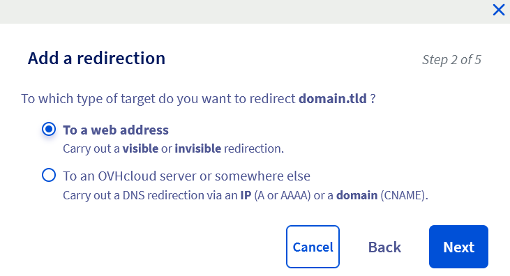
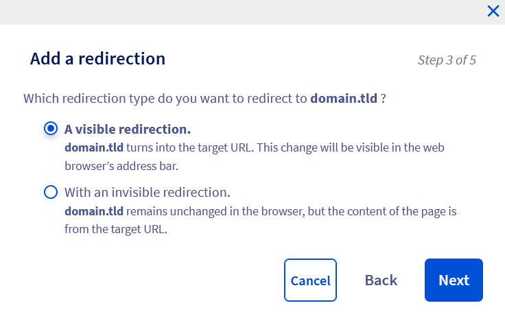
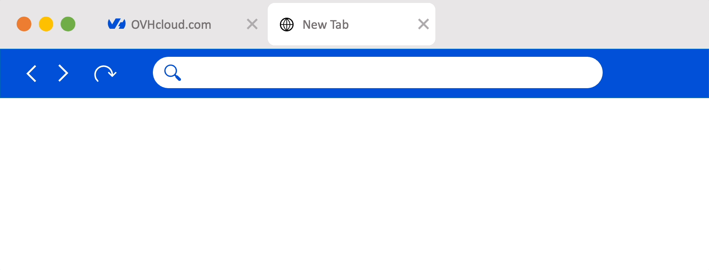

**Última actualización: 06/10/2022**

> [!primary]
> Esta traducción ha sido generada de forma automática por nuestro partner SYSTRAN. En algunos casos puede contener términos imprecisos, como en las etiquetas de los botones o los detalles técnicos. En caso de duda, le recomendamos que consulte la versión inglesa o francesa de la guía. Si quiere ayudarnos a mejorar esta traducción, por favor, utilice el botón «Contribuir» de esta página.
> 

## Objetivo

La redirección de un dominio consiste en redirigir el dominio hacia un nuevo destino. Existen distintos tipos de redirecciones, cada una de las cuales responde a una necesidad específica.

**Descubra distintas formas de redirigir su dominio**

## Requisitos

- Disponer de un [dominio](https://www.ovhcloud.com/es/domains/)
- Estar conectado a su [área de cliente de OVHcloud](https://ca.ovh.com/auth/?action=gotomanager&from=https://www.ovh.com/world/&ovhSubsidiary=ws){.external}.
- Estar conectado al alojamiento web (para una redirección a través de un archivo [.htaccess](#htaccess_rewrite)).

## Procedimiento

### Entender la redirección de un dominio

Esta funcionalidad permite redirigir un dominio/subdominio hacia:

- otro dominio o subdominio ya existente:
    - **Ejemplo**: `domain.tld`
- una URL (Uniform Resource Locator) del sitio web:
    - **Ejemplos**: `http://www.domain.tld/welcome/` o `https://www.domain.tld/welcome/` (si el dominio de destino dispone de un certificado SSL compatible).

Existen diversas formas de realizar estas acciones:

- **Desde el [área de cliente de OVHcloud](https://ca.ovh.com/auth/?action=gotomanager&from=https://www.ovh.com/world/&ovhSubsidiary=ws)**) donde hay un asistente de configuración que le permite configurar su redirección.
- **Mediante un método que requiere programación**. Usted mismo deberá crear la redirección en un fichero (normalmente un [.htaccess](#htaccess_rewrite)).

> [!warning]
>
> La redirección puede afectar al posicionamiento de su sitio web. 
> Esté atento a las operaciones que vaya a realizar o contacte con un [proveedor especializado](https://partner.ovhcloud.com/es/) en el posicionamiento, si es necesario.
>
> Atención: una redirección creada desde el [área de cliente de OVHcloud](https://ca.ovh.com/auth/?action=gotomanager&from=https://www.ovh.com/world/&ovhSubsidiary=ws) no permite redirigir una URL en `https://` a otro dominio o URL. 
> Para crear este tipo de redirección, debe pasar obligatoriamente por [una reescritura de URL](https://docs.ovh.com/us/es/hosting/web_hosting_htaccess_reescritura_de_url_con_mod_rewrite/) a través de un fichero ".htaccess", por ejemplo.
>

### Redirigir un dominio desde el área de cliente

Conéctese al [área de cliente de OVHcloud](https://ca.ovh.com/auth/?action=gotomanager&from=https://www.ovh.com/world/&ovhSubsidiary=ws){.external}, acceda al apartado `Web Cloud`{.action}, seleccione el dominio que quiere redirigir en la sección `Dominios`{.action} y haga clic en la pestaña `Redirección`{.action}.

Se mostrará una tabla con las redirecciones activas para el dominio. Puede gestionar las redirecciones existentes utilizando el botón `...`{.action} situado a la derecha de cada línea.

Haga clic en el botón `Añadir una redirección`{.action}.

{.thumbnail}

Hay tres opciones de redirección disponibles en el [área de cliente de OVHcloud](https://ca.ovh.com/auth/?action=gotomanager&from=https://www.ovh.com/world/&ovhSubsidiary=ws), cada una de las cuales se compone de **5 etapas** sucesivas. 

> La pestaña `Redirección`{.action} presenta una cuarta opción que permite hacer que su dominio apunte rápidamente a los registros DNS A, AAAA y CNAME.<br>
> Debido a que no se trata de una "redirección", esta opción no se explicará en esta guía.
>
> Para más información sobre los registros DNS, consulte nuestra documentación sobre los [registros DNS](https://docs.ovh.com/us/es/domains/web_hosting_como_editar_mi_zona_dns/).
>

A continuación se describen los tres tipos de redirecciones, que se explican paso a paso.

> [!primary]
>
> Independientemente de la opción de redirección elegida, la modificación tarda entre 4 y 24 horas en propagarse y ser efectiva.

#### Opción 1: redirección visible permanente hacia una dirección web

Esta opción permite, una vez introducido el dominio redirigido, mostrar el dominio de destino en la barra de direcciones de su navegador de internet en lugar del dominio redirigido.

- **Ejemplo**: si redirige `domain1.tld` hacia `domain2.tld`, se mostrará `domain2.tld` en la barra de direcciones de su navegador.

{.thumbnail}

> Esta redirección "estándar" devolverá un código HTTP 301.

> [!success]
> Haga clic en las pestañas de abajo para ver cada uno de los 5 pasos sucesivamente.

> [!tabs]
> **Etapa 1**
>>
>> En la ventana, su dominio a redirigir ya aparece. Introduzca el formulario **únicamente** si desea redirigir un *subdominio*.
>>
>> La casilla `Redirigir también`{.action} puede estar marcada para redirigir igualmente su subdominio en `www` hacia el mismo destino que elija para su dominio/subdominio.
>>
>> {.thumbnail}
>>
>> Haga clic en `Siguiente`{.action} para ir al etapa 2.
>>
> **Etapa 2**
>>
>> Seleccione "Hacia una dirección Web {.action}".
>>
>> {.thumbnail}
>>
>> Haga clic en `Siguiente`{.action} para ir al etapa 3.
>>
> **Etapa 3**
>>
>> Seleccione `Con una redirección visible`{.action} de las dos opciones indicadas.
>>
>> {.thumbnail}
>>
>> Haga clic en `Siguiente`{.action} para ir al etapa 4.
>>
> **Etapa 4**
>>
>> Seleccione `Permanente (301)`{.action} de las dos opciones indicadas y, seguidamente, introduzca el dominio o la URL de destino de su redirección en el formulario `Dirección web`{.action} que aparece.
>>
>> {.thumbnail}
>>
>> Haga clic en `Siguiente`{.action} para pasar a la etapa 5.
>>
> **Etapa 5**
>>
>> En esta última etapa, asegúrese de que la información mostrada es correcta.
>>
>> {.thumbnail}
>>
>> Haga clic en `Confirmar`{.action} para validar su configuración.
>> 
>> > [!primary]
>> >
>> > Si aparece el mensaje "*Hay redirecciones desde los dominios que quiere redirigir que entran en conflicto con las redirecciones que desea añadir*", puede marcar la casilla `Confirmar la eliminación de la redirección existente`{.action} para forzar la aplicación de su redirección.
>> >
>> > Atención, la antigua configuración se desactivará y eliminará.
>> >
>>

#### Opción 2: redirección visible temporal hacia una dirección web

Al igual que con la opción 1, esta opción permite mostrar, una vez introducido el dominio redirigido, el dominio destino en la barra de direcciones de su navegador de internet en lugar del dominio redirigido.

Sin embargo, se debe utilizar de forma puntual, por ejemplo para acontecimientos efímeros.<br>
En efecto, el posicionamiento en los motores de búsqueda es menos potente que con una redirección **visible permanente** de tipo 301 (código HTTP).

- **Ejemplo**: si redirige `domain1.tld` hacia `domain2.tld`, se mostrará `domain2.tld` en la barra de direcciones de su navegador.

{.thumbnail}

> Esta redirección devolverá un código HTTP 302.

> [!success]
> Haga clic en las pestañas de abajo para ver cada uno de los 5 pasos sucesivamente.

> [!tabs]
> **Etapa 1**
>>
>> En la ventana, su dominio a redirigir ya aparece. Introduzca el formulario **únicamente** si desea redirigir un *subdominio*.
>>
>> La casilla `Redirigir también`{.action} puede estar marcada para redirigir igualmente su subdominio en `www` hacia el mismo destino que elija para su dominio/subdominio.
>>
>> {.thumbnail}
>>
>> Haga clic en `Siguiente`{.action} para ir al etapa 2.
>>
> **Etapa 2**
>>
>> Seleccione `Hacia una dirección Web`{.action}.
>>
>> {.thumbnail}
>>
>> Haga clic en `Siguiente`{.action} para ir al etapa 3.
>>
> **Etapa 3**
>>
>> Seleccione `Con una redirección visible`{.action} de las dos opciones indicadas.
>>
>> {.thumbnail}
>>
>> Haga clic en `Siguiente`{.action} para ir al etapa 4.
>>
> **Etapa 4**
>>
>> Seleccione `Temporal (302)`{.action} de las dos opciones indicadas y luego introduzca el dominio o la URL de destino de su redirección en el formulario `Dirección web`{.action} que aparece.
>>
>> {.thumbnail}
>>
>> Haga clic en `Siguiente`{.action} para pasar a la etapa 5.
>>
> **Etapa 5**
>>
>> En esta última etapa, asegúrese de que la información mostrada es correcta.
>>
>> {.thumbnail}
>>
>> Haga clic en `Confirmar`{.action} para validar su configuración.
>> 
>> > [!primary]
>> >
>> > Si aparece el mensaje "*Hay redirecciones desde los dominios que quiere redirigir que entran en conflicto con las redirecciones que desea añadir*", puede marcar la casilla `Confirmar la eliminación de la redirección existente`{.action} para forzar la aplicación de su redirección.
>> >
>> > Atención, la antigua configuración se desactivará y eliminará.
>> >
>>

#### Opción 3: redirección invisible hacia una dirección web

Esta redirección permite, una vez introducido el dominio redirigido, dejarlo visible en la barra de direcciones de su navegador web en lugar de sustituirlo por el dominio de destino.<br>
**Atención: Esta acción no es compatible con todos los sitios web y afecta al posicionamiento de su sitio web.**

- **Ejemplo**: si redirige `domain1.tld` hacia `domain2.tld`, se mostrará `domain1.tld` en la barra de direcciones de su navegador.

{.thumbnail}

La redirección invisible funciona con una etiqueta HTML *iFrame*. que permite que el dominio redirigido integre en su propia página HTML el contenido de la otra página correspondiente al dominio de destino.

Esta encapsulación permite impedir que los visitantes del sitio web visualicen el dominio de destino.

> Esta opción devolverá un código HTTP 200.

> [!warning]
>
> Atención, las páginas encapsuladas con una etiqueta *iFrame* pueden no ser leidas en los smartphones. Por lo general, los motores de búsqueda no tienen en cuenta su contenido para el posicionamiento y la indexación del sitio web.
>

> [!success]
> Haga clic en las pestañas de abajo para ver cada uno de los 5 pasos sucesivamente.
>

> [!tabs]
> **Etapa 1**
>>
>> En la ventana, su dominio a redirigir ya aparece. Introduzca el formulario **únicamente** si desea redirigir un *subdominio*.
>>
>> La casilla `Redirigir también`{.action} puede estar marcada para redirigir igualmente su subdominio en `www` hacia el mismo destino que elija para su dominio/subdominio.
>>
>> {.thumbnail}
>>
>> Haga clic en `Siguiente`{.action} para ir al etapa 2.
>>
> **Etapa 2**
>>
>> Seleccione `Hacia una dirección Web`{.action}.
>>
>> {.thumbnail}
>>
>> Haga clic en `Siguiente`{.action} para ir al etapa 3.
>>
> **Etapa 3**
>>
>> Seleccione `Con una redirección invisible`{.action} de las dos opciones indicadas.
>>
>> {.thumbnail}
>>
>> Haga clic en `Siguiente`{.action} para ir al etapa 4.
>>
> **Etapa 4**
>>
>> Seleccione `Temporal (iframe)`{.action} de las dos opciones indicadas e introduzca el dominio o la URL de destino de su redirección en el formulario `Dirección web`{.action} que aparece.
>>
>> {.thumbnail}
>>
>> Tres parámetros opcionales están a su disposición en esta etapa :
>>
>> - **Título**: el de su sitio web. Se mostrará como título de la página en la pestaña de los navegadores de internet.<br>
>> - **Palabras clave**: pueden ser utilizados por los motores de búsqueda para posicionar parcialmente la página.<br>
>> - **Description** : afecta a su sitio web. Los motores de búsqueda la usarán en sus resultados.
>>
>> Haga clic en `Siguiente`{.action} para pasar a la etapa 5.
>>
> **Etapa 5**
>>
>> En esta última etapa, asegúrese de que la información mostrada es correcta.
>>
>> {.thumbnail}
>>
>> Haga clic en `Confirmar`{.action} para validar su configuración.
>> 
>> > [!primary]
>> >
>> > Si aparece el mensaje "*Hay redirecciones desde los dominios que quiere redirigir que entran en conflicto con las redirecciones que desea añadir*", puede marcar la casilla `Confirmar la eliminación de la redirección existente`{.action} para forzar la aplicación de su redirección.
>> >
>> > Atención, la antigua configuración se desactivará y eliminará.
>> >
>>

### Redirigir un dominio a través de un archivo ".htaccess" <a name="htaccess_rewrite"></a>

> [!warning]
>
La configuración, la gestión y la responsabilidad de los servicios que OVHcloud pone a su disposición recaen sobre usted. Por lo tanto, usted deberá asegurarse de que estos funcionan correctamente.
> 
> Ponemos a su disposición esta parte de la guía para acompañarle lo mejor posible en tareas habituales. No obstante, si tiene alguna duda, le recomendamos que contacte con un [proveedor especializado](https://partner.ovhcloud.com/es/). No podremos asistirle en las siguientes etapas. Más información en la sección ["Más información"](#go-further) de esta guía.
>

Los archivos ".htaccess" son archivos de configuración en los que se pueden especificar comandos. Al ejecutar el código de su sitio web por el servidor web (Apache), los comandos se interpretarán y ejecutarán de esta forma.<br>
Entre estos comandos, es posible crear redirecciones.

Manipular un archivo ".htaccess" puede inhabilitar el acceso al sitio web. En caso de duda, contacte con un [proveedor especializado](https://partner.ovhcloud.com/es/) .

Para más información, consulte nuestra guía ".htaccess" en la sección ["Más información"](#go-further) de esta guía.

> [!success]
>
Le recomendamos que antes de realizar cualquier modificación, realice **una copia de seguridad de su archivo .htaccess**. De este modo, podrá restaurar la versión anterior del archivo en caso de que se realice alguna manipulación incorrecta.
>

A continuación encontrará 4 variables para realizar redirecciones a través del archivo ".htaccess".

#### Variable 1 - "Redirect permanent"

Esta variable permite redirigir un sitio web en su conjunto, o sólo una parte de un sitio web, hacia otro sitio o parte de un sitio web. Los visitantes se redirigen automáticamente a la dirección/URL correcta cuando intentan acceder a su sitio a través de la dirección/URL histórica.

> [!tabs]
> Código que debe incluirse en el ".htaccess" 
>>
>> Para redirigir un sitio web completo:
>>
>>```bash
>>Redirect permanent / http://domainTarget.tld/
>>```
>>
>> Para redirigir un directorio hacia otro:
>>
>>```bash
>>Redirect permanent /old_folder http://domain.tld/new_folder
>>```
>>
>> Para redirigir un archivo hacia otro:
>>
>>```bash
>>Redirect permanent /old_file.php http://domain.tld/new_file.php
>>```
>>
> Código HTTP
>>
>> El script enviará un código HTTP 301. Esto evitará que los robots de los motores de búsqueda actualizen sus enlaces a la nueva dirección/URL.
>>

#### Variable 2 - "Redirect gone"

Esta variable es útil para archivos eliminados. Sustituye el mensaje *404 documento no encontrado* por un mensaje más explícito de tipo *410 el documento ya no existe*. Se informa al visitante de que el archivo que intenta llamar ya no existe.

> [!tabs]
> Código que debe incluirse en el ".htaccess" 
>>
>>```bash
>>Redirect gone /fileDeleted.html
>>```
>>
> Código HTTP
>>
>> El script enviará un código HTTP 410.
>>

#### Variable 3 - "Redirect seeother"

Si cambia la extensión de un archivo, la variable *seeother* permite modificar su tipo. El visitante que intente acceder al antiguo archivo será automáticamente redirigido al archivo con la extensión correcta.

> [!tabs]
> Código que debe incluirse en el ".htaccess" 
>>
>>```bash
>>Redirect seeother /example.doc http://domain.tld/example.pdf
>>```
>>
> Código HTTP
>>
>> El script enviará un código HTTP 303.
>>

#### Variable 4 - "Redirect Temp"

Esta variable se puede utilizar cuando mueve temporalmente archivos a otro sitio web. Los visitantes que intentan acceder a su sitio a través de la dirección o URL histórica se redirigen automáticamente a la nueva dirección o URL temporal.

> [!tabs]
> Código que debe incluirse en el ".htaccess" 
>>
>>```bash
>>Redirect temp / http://OtherWebsite.tld/site/
>>```
>>
> Código HTTP
>>
>> El script enviará un código HTTP 302.
>>

## Más información <a name="go-further"></a>

[Bloquear el acceso a mi sitio web para algunas direcciones IP a través de un archivo ".htaccess"](https://docs.ovh.com/us/es/hosting/htaccess_how_to_block_a_specific_ip_address_from_accessing_your_website/).

[Proteger el panel de administración de su sitio web a través de ".htaccess"](https://docs.ovh.com/us/es/hosting/compartido-htaccess-como-proteger-el-acceso-a-un-directorio-por-autenticacion/).

[Reescribir las URLs utilizando el "mod_rewrite"](https://docs.ovh.com/us/es/hosting/web_hosting_htaccess_reescritura_de_url_con_mod_rewrite/).

[Realizar otras operaciones con el archivo ".htaccess"]().

[Cómo editar mi zona DNS ?](https://docs.ovh.com/us/es/domains/web_hosting_como_editar_mi_zona_dns/)

Para servicios especializados (posicionamiento, desarrollo, etc.), contacte con [partners de OVHcloud](https://partner.ovhcloud.com/es/).

Si quiere disfrutar de ayuda para utilizar y configurar sus soluciones de OVHcloud, puede consultar nuestras distintas soluciones (pestañas de soporte)(https://www.ovhcloud.com/es/support-levels/).

Interactúe con nuestra comunidad de usuarios en <https://community.ovh.com/en/>.

