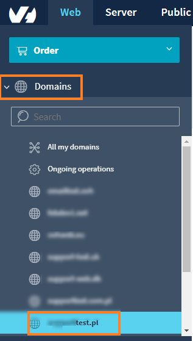
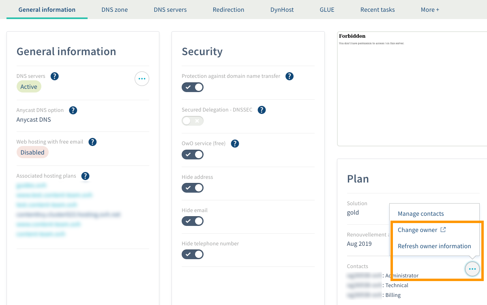

**Dernière mise à jour le 05/05/2020**

## Objectif

En dehors de la [gestion des contacts](https://docs.ovh.com/ca/fr/customer/gestion-des-contacts/), l’enregistrement d’un nom de domaine nécessite de renseigner les informations relatives au propriétaire de celui-ci. Ce guide vous détaille comment effectuer cette procédure.

**Découvrez comment changer le propriétaire d'un nom de domaine**

## Prérequis

- Être connecté à votre [espace client OVHcloud](https://ca.ovh.com/auth/?action=gotomanager){.external}
- Disposer d'un nom de domaine enregistré chez OVHcloud.
- Être le [contact administrateur](https://docs.ovh.com/ca/fr/customer/gestion-des-contacts/) du nom de domaine concerné.
- Disposer de l'accord du propriétaire actuel du nom de domaine pour effectuer le changement de propriétaire.

## En pratique

### Sélection du domaine
Sélectionnez dans la rubrique `Domaines`{.action} le nom de domaine générique (gTLD) pour lequel vous souhaitez modifier le propriétaire.

{.thumbnail}

### Changement du propriétaire
Dans l'onglet `Informations générales`{.action}, dans le cadre **Abonnement**, cliquez sur le bouton `...`{.action} à côté des contacts puis sur `Changer le propriétaire`{.action}.

{.thumbnail}

> [!warning]
>
> Toute modification des nom, prénom, organisation, forme juridique ou adresse e-mail sera
> considérée comme un changement de propriétaire.
> 

Un message d'information s'affiche ensuite, cliquez sur le bouton `Continuer`{.action}.

Une fois la commande validée, deux e-mails seront envoyés afin de valider ou de refuser cette modification :

- Un sur l'adresse e-mail renseignée pour le propriétaire actuel
- Un sur l'adresse e-mail renseignée pour le futur propriétaire

Une fois les deux e-mails validés, votre changement de propriétaire sera effectif.

> [!primary]
>
> 
> Un délai de 60 jours maximum est autorisé pour valider ces deux e-mails.
> 
> Si la modification est refusée par l'une des parties, la commande sera annulée.
> 
> 

> [!warning]
>
> En cas de modification du propriétaire, le nom de domaine sera
> verrouillé et ne pourra donc pas faire l'objet d'un transfert sortant pendant une période de 60 jours.
> 

## Aller plus loin

[« Gérer les contacts de ses services »](https://docs.ovh.com/ca/fr/customer/gestion-des-contacts/)

Échangez avec notre communauté d'utilisateurs sur https://community.ovh.com.

