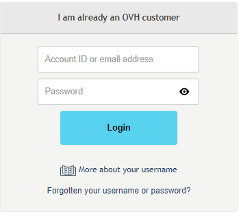

## Prérequis

- Disposer d'un nom de domaine enregistré chez OVH.
- Être l'administrateur du nom de domaine concerné.
- Disposer de l'accord du propriétaire du nom de domaine concernant le changement de propriétaire.

## Procedure de changement de proprietaire

### Connexion a l'espace client
- Connectez-vous dans [l'espace
client](https://www.ovh.com/manager/web){.external} à l'aide de votre identifiant (nic-handle) et de mot de passe.
- Cliquez sur `Connexion`{.action} pour valider l'opération.

{.thumbnail}

### Selection du domaine
- Une fois connecté, sélectionnez dans la rubrique "domaines" le nom de domaine générique (gTLD) pour lequel vous souhaitez modifier le propriétaire. pour lequel vous souhaitez modifier le propriétaire.

{.thumbnail}

### Changer le proprietaire
- Après avoir sélectionné votre domaine, dans la partie "Abonnement", cliquez sur le bouton "..." à côté des contacts, puis sur `Changer le propriétaire`{.action}.

{.thumbnail}

La plupart des domaines sont compatibles avec le changement de propriétaire par bon de commande.

Si vous tentez de modifier le propriétaire d'une de ces extensions, vous serez automatiquement redirigé sur une page de commande.

> [!warning]
>
> Toute modification du nom, prénom, organisation, forme juridique ou adresse e-mail sera
> considérée comme un changement de propriétaire.
> 

- Un message d'informations s'affiche ensuite.
- Cliquez sur le bouton `Continuer`{.action}.

Une fois la commande validée, deux e-mails seront envoyés afin de valider ou de refuser cette modification :

- Un sur l'adresse e-mail renseignée pour le propriétaire actuel
- Un sur l'adresse e-mail renseignée pour le futur propriétaire

Une fois les deux e-mails validés, votre changement de propriétaire sera terminé.

> [!primary]
>
> - 
> un délai de 60 jours maximum est autorisé pour valider ces deux e-mails
> - 
> Vous avez un délai de 60 jours pour valider ces deux e-mails
> - 
> Si un refus est constaté, votre commande sera annulée
> 
> 

> [!warning]
>
> En cas de modification du propriétaire, le nom de domaine sera
> verrouillé dans le cadre d'un transfert sortant pour une période de 60 jours.
> 

