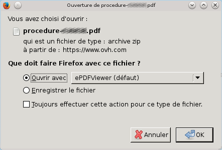

## Procedure de changement de proprietaire

### Connexion a l'espace client
- Connectez-vous dans [l'espace
client](https://www.ovh.com/manager/web){.external} à l'aide de votre identifiant (nic-handle) et de mot de passe.
- Cliquez sur `Connexion`{.action} pour valider l'opération.

{.thumbnail}

### Selection du domaine
- Une fois connecté, sélectionnez dans la rubrique "domaines" le nom de domaine générique (gTLD) pour lequel vous souhaitez modifier le propriétaire. pour lequel vous souhaitez modifier le propriétaire.

{.thumbnail}

### Changer le proprietaire
- Après avoir sélectionné votre domaine, cliquez sur le bouton "Plus +", puis sur `Changer le propriétaire`{.action}.

{.thumbnail}

### Cas 1 - Procedure par bon de commande
Actuellement 6 extensions de domaines génériques sont compatibles avec le changement de propriétaire par bon de commande (.ovh, .com, .net, .info, .biz, .org). La pluspart des domaines sont compatibles avec le changement de propriétaire par bon de commande.

Si vous tentez de modifier le propriétaire d'une de ces extensions, vous serez automatiquement redirigé sur une page de commande.

> [!warning]
>
> Toute modification du nom, prénom, organisation, forme juridique ou adresse e-mail sera
> considérée comme un changement de propriétaire.
> 

- Un message d'informations s'affiche ensuite.
- Cliquez sur le bouton `Continuer`{.action}.

Une fois la commande validée, deux e-mails seront envoyés afin de valider ou de refuser cette modification :

- Un sur l'adresse e-mail renseignée pour le propriétaire actuel
- Un sur l'adresse e-mail renseignée pour le futur propriétaire

Une fois les deux e-mails validés, votre changement de propriétaire sera terminé.

> [!primary]
>
> - 
> un délai de 60 jours maximum est autorisé pour valider ces deux e-mails
> - 
> Vous avez un délai de 60 jours pour valider ces deux e-mails
> - 
> Si un refus est constaté, votre commande sera annulée
> 
> 

> [!warning]
>
> En cas de modification du propriétaire, le nom de domaine sera
> verrouillé dans le cadre d'un transfert sortant pour une période de 60 jours.
> 

### Cas 2 - Procedure par courrier
Si il s'agit d'une extensions autre que celles élligibles à un bon de commande (.ovh, .com, .net, .info, .biz, .org), vous serez redirigé automatiquement vers une procédure papier. S'il s'agit d'une extension non compatible, vous serez redirigé automatiquement vers une procédure papier.

Si vous souhaitez changer le propriétaire d'un domaine élligible à un bon de commande (.ovh, .com, .net, .info, .biz, .org) car l'adresse e-mail actuellement renseignée n'est pas ou plus valide, vous pouvez également utiliser cette procédure afin de mettre à jour celle-ci.

> [!primary]
>
> Cette procédure est également disponible directement à cette adresse
> 

Une fois sur la page de procédure, il vous suffira de remplir celle-ci :

- Indiquez le domaine concerné.
- Cochez la case "Je veux changer le propriétaire d'un domaine".
- Cochez la case "Changer aussi l'hébergement" si vous désirez appliquer également cette procédure à l'hébergement lié au domaine.

{.thumbnail}

- Votre Email : Indiquez votre adresse e-mail pour être tenu informé sur l'avancée de la procédure.
- Votre Nic handle (ancien propriétaire) : Indiquez l'identifiant OVH de l'administrateur du domaine.
- Nic handle (nouveau propriétaire) : Indiquez l'identifiant OVH du futur propriétaire.
- Cliquez sur `Valider`{.action}.

{.thumbnail}

Suite à cela il vous faudra nous retourner par e-mail la procédure qui vous sera proposée en téléchargement ainsi que les justificatifs demandés en contactant le [support](https://www.ovh.com/fr/support/nous-contacter/){.external}.

- Le délai de traitement moyen des procédures et de 2 jours ouvrables après réception.

{.thumbnail}

> [!warning]
>
> En cas de modification du propriétaire, le nom de domaine sera
> verrouillé dans le cadre d'un transfert sortant pour une période de 60 jours.
> 