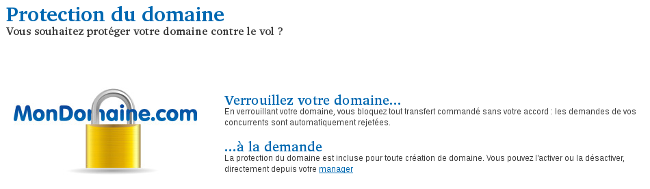
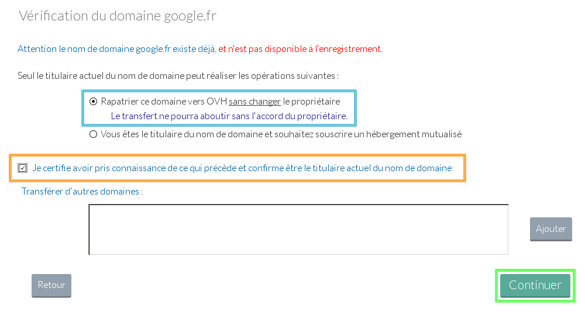
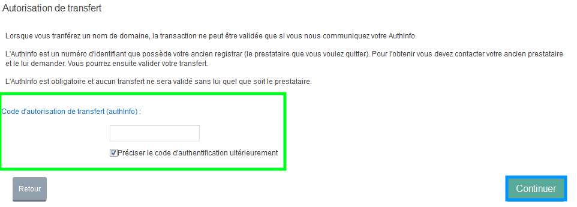
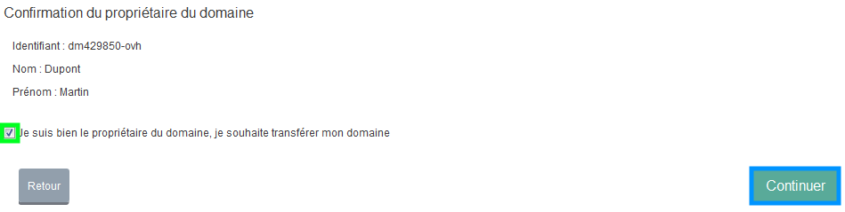
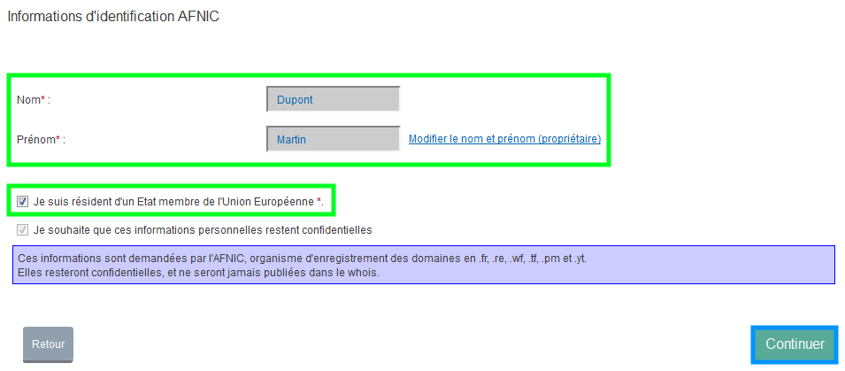
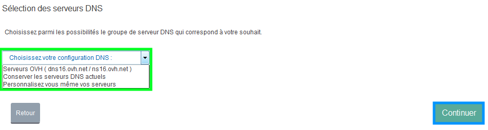
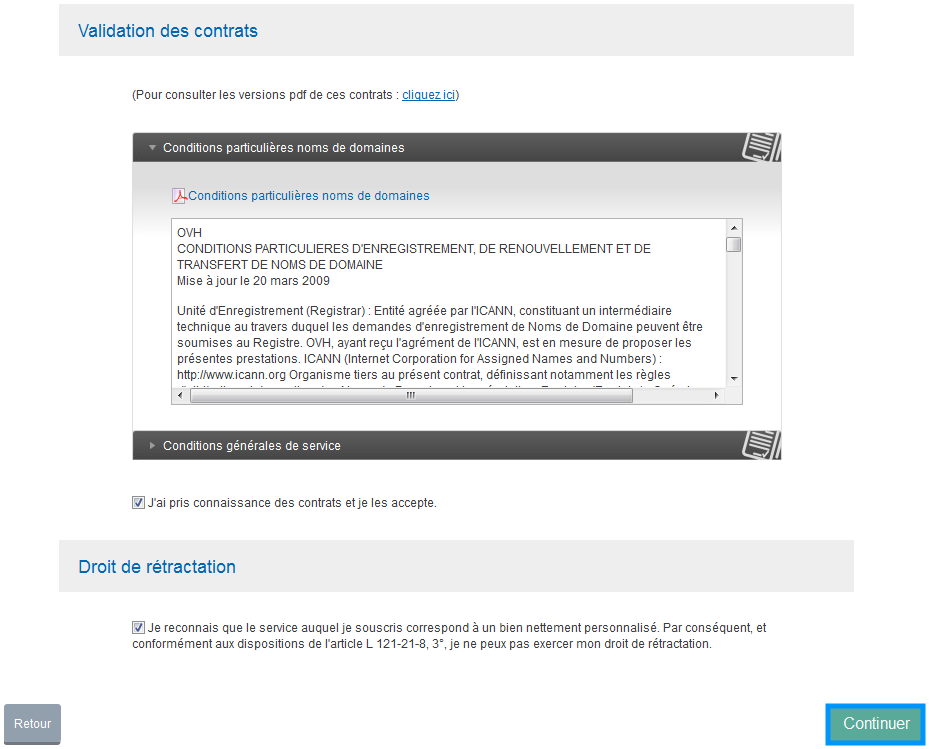
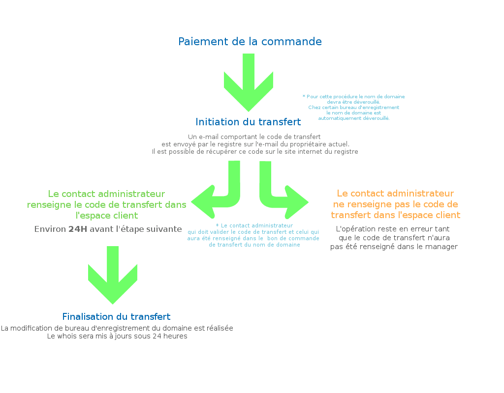
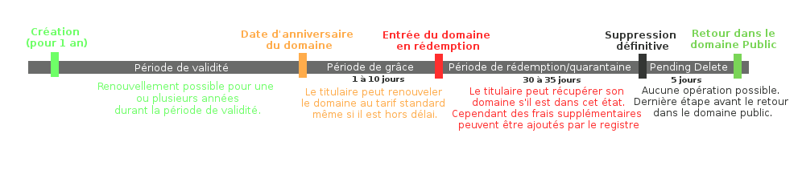

Ce guide concerne les extensions .fr, .re, .tf, .pm, .yt, .wf, .eu, .be

## Prérequis

### Généralités
*Pour rapatrier un nom de domaine géographique (.fr, .re, .tf, .pm, .yt, .wf .eu, .be) vers OVH, assurez-vous qu'il respecte les prérequis suivants :*

- Votre domaine ne doit pas être en période de rédemption ou de suppression.
- Vous n'avez pas renouvelé votre domaine il y a moins de 46 jours . (Recommandation)
- Les contacts de la base Whois ont été informés de la demande de transfert.
- Le domaine n'est pas bloqué.
- La date d'expiration est supérieure à 61 jours . (Recommandation)

Pour connaître votre registrar actuel, effectuez un [Whois](https://www.ovh.com/cgi-bin/whois.pl){.external} de votre nom de domaine.

Différentes appellations existent pour le code de transfert :  **AuthCode** ,  **AuthInfo** ,  **Code EPP** ,  **Code de transfert** ...

{.thumbnail}

## Procedure de transfert

### Étape 1 &#58; deverrouillage du nom de domaine et recuperation du code de transfert
*Pour pouvoir transférer votre domaine chez OVH, il faut tout d'abord déverrouiller votre nom de domaine et obtenir le code AUTH/INFO dans le cas d'un .fr, .re  et assimilés.*

*Le code AUTH/INFO est une clé, nécessaire afin que le registry valide le transfert de votre nom de domaine. Vous pouvez vérifier l'état de votre domaine grâce à l'outil* [Whois](https://www.ovh.com/cgi-bin/whois.pl){.external} *. Précédemment dans ce guide, les conditions requises pour que le transfert s'effectue correctement sont détaillées.*

*Afin de déverrouiller votre nom de domaine, nous vous conseillons de contacter votre ancien prestataire.*

*Quand un domaine est déverrouillé, il se reverrouille automatiquement au bout de 7 jours. Le délai est le même pour toutes les extensions.*

**Conservez ce code de transfert, il vous sera demandé lors de votre commande.**

{.thumbnail}

### Étape 2 &#58; Realisation du bon de commande sur le site d'OVH
*À ce niveau, nous allons voir les étapes importantes pour la commande d'un transfert de nom de domaine géographique (.fr, .re, .tf, .pm, .yt, .wf .eu, .be).*

- Depuis le site [d'OVH](https://www.ovh.com/fr/index.xml){.external} , vous devez dans un premier temps rechercher votre nom de domaine via la barre de recherche , puis cliquez sur le bouton "Commander / Transférer".

{.thumbnail}

- Lors de cette seconde étape, une vérification plus complète du nom de domaine est réalisée.

Vous devez certifier le fait que vous êtes propriétaire du nom de domaine.

*En effet il est possible de lancer le transfert du domaine sans en être propriétaire ; cependant si le propriétaire légitime du domaine refuse la demande, le nom de domaine ne sera pas rapatrié.*

Sélectionnez "Continuer" pour valider cette étape.

{.thumbnail}

> [!success]
>
> Ce type de transfert ne modifie pas le propriétaire du domaine. Pour cela, il faut réaliser une commande pour le changement de propriétaire de domaine géographique.
> 

- A cette étape il vous faudra choisir entre les serveurs DNS classiques ou les serveurs DNS Anycast .

Il vous faudra également choisir le type d'offre pour votre domaine.

{.thumbnail}

- Pour pouvoir transférer votre domaine chez OVH, il faut obtenir le code de transfert (AUTHINFO) auprès de votre ancien prestataire.

Vous pourrez le renseigner à ce niveau dans le bon de commande.

*Si vous choisissez de le renseigner ultérieurement, vous devrez aller dans votre Manager. Sur la page d'accueil, dans"Domaines"->"Opérations en cours", corrigez l'opération qui sera en attente de la validation du code de transfert.*

Sélectionnez "Continuer" après avoir réalisé votre choix.

{.thumbnail}

- Vous devrez ensuite choisir si vous désirez ou non prendre un hébergement avec votre domaine.

Une fois votre choix fait, passez à l'étape suivante.

{.thumbnail}

- Un résumé de votre commande sera disponible sur cette page.

Cliquez sur "Continuer" pour passer à la prochaine étape.

- Identifiez-vous ou créez un nouveau compte afin de pouvoir continuer.

{.thumbnail}

- Sur cette page, vous devrez choisir les contacts à mettre en place une fois le transfert terminé.

{.thumbnail}

- À cette étape, vous devez valider le fait que vous êtes propriétaire du nom de domaine.

Sélectionnez "Continuer" après avoir validé la demande.

{.thumbnail}

- Lorsque la demande est effectuée pour un domaine dont l'extension est ".fr .re .tf .pm .yt .wf", une demande d'identification AFNIC est réalisée.

Celle-ci peut être différente en fonction de l'extension, ou du statut légal du propriétaire. Complétez les informations puis cliquez sur "Continuer" pour poursuivre la commande.

{.thumbnail}

Il vous faudra ici faire le choix de vos serveurs DNS :

- Serveurs OVH : Vous avez au préalable configuré votre zone DNS OVH ou activé votre hébergement ainsi que vos emails.
- Conserver les serveurs DNS actuels : Vous devez vérifier que l'actuel prestataire continuera d'assurer les services associés à votre domaine une fois le transfert finalisé.
- Personnalisez vous-même vos serveurs : Vous indiquez les serveurs DNS de votre choix et vous vous êtes assuré qu'ils sont correctement configurés.

{.thumbnail}

- Afin de générer votre bon de commande, il vous faudra valider les rubriques "Contrats" et "Droit de rétractation" .

{.thumbnail}

> [!success]
>
> À savoir :
> - 
> Si vous commandez un transfert de nom de domaine et une offre
> d'hébergement, l'installation de l'hébergement est en général
> réalisée avant le rapatriement du domaine.
> - 
> Sans paiement du bon de commande de votre part, le transfert ne sera
> pas initié.
> 
> 

## Étapes de transfert

### .fr .re .tf .pm .yt .wf
Vous souhaitez rapatrier votre nom de domaine vers OVH, depuis un registrar (bureau d'enregistrement) autre qu'OVH, sans aucun changement de propriété.

Cela signifie que le contact propriétaire chez l'actuel registrar et celui qui sera renseigné chez OVH sont les mêmes (mêmes nom et prénom dans le cas d'une personne physique, même raison sociale pour une personne morale).

On parle alors de transfert simple.

Ce transfert fonctionne avec un code de transfert (vous trouverez aussi parfois code EPP, code AUTH ou code d'authentification) récupérable chez l'actuel registrar du nom de domaine.

Une fois le code renseigné chez OVH et validé, le registre des .fr, .re, .tf, .pm, .yt, .wf .eu ([AFNIC](http://www.afnic.fr/){.external} ) envoie un e-mail au registrar actuel du domaine, qui choisit de le transmettre ou non au propriétaire du domaine.

C'est ce qu'on appelle le mail d'attente ou d'opposition. Toutes les conditions et règles ci-après sont imposées par l'AFNIC, registre des extensions .fr, .re, .tf, .pm, .yt, et .wf.

Trois possibilités peuvent alors se présenter :

- la demande est validée immédiatement : le nom de domaine est transféré sous quelques heures.
- la demande n'est pas validée du tout (e-mail reçu par l'ancien registrar mais non traité) : le nom de domaine est transféré au bout de 8 jours automatiquement.

Vous avez cependant la possibilité de prendre contact avec le registrar actuel afin d'accélérer le processus de transfert. Le registrar validera alors l'e-mail qu'il n'avait jusqu'alors pas traité sous réserve de fournir des documents attestant que vous êtes propriétaire (conditions propres au registrar quitté).

- la demande est refusée : le nom domaine est transféré au bout de 22 jours (le délai démarre 24h après le jour du refus) , ceci laisse le temps aux trois parties (propriétaire du nom de domaine, ancien et nouveau registrar) de connaître et analyser le motif du refus du transfert.

Notez qu'un registrar ne peut empêcher le transfert sortant d'un nom de domaine. Il peut en effet le bloquer temporairement (pour diverses raisons : impayé, dépôt de marque, etc.), mais sera transféré après 22 jours comme indiqué ci-dessus.

Ce sera alors le rôle de l'AFNIC de statuer sur la légitimité du blocage émise par le registrar.

{.thumbnail}

> [!success]
>
> - L'opération de transfert ne peut pas être bloquée par l'ancien bureau d'enregistrement pour un domaine en .fr, .re, .tf, .pm, .yt, .wf.
> - Sans paiement de la commande le transfert n'est pas initié.
> 

### .eu .be
L'opération de transfert est initiée uniquement si le paiement de la commande a été reçu.

Il est nécessaire de déverrouiller le nom de domaine, ce qui, chez certains bureaux d'enregistrement, est automatique.

Une fois le transfert lancé, un e-mail contenant le code d'autorisation de transfert est envoyé sur l'e-mail du propriétaire actuel. Il est possible de récupérer ce code de transfert directement sur le site du registre.

Pour le .eu : rendez-vous sur [le site de l'EURID](http://www.eurid.eu/){.external}.

Pour le .be : rendez-vous sur [le site DNS.be](http://dns.be/){.external}.

Le contact administrateur doit ensuite valider le code de transfert pour finaliser l'opération.

Si le code n'est pas renseigné alors le transfert du domaine ne pourra pas aboutir.

Une fois le code validé, la finalisation du transfert est très rapide. Généralement sous quelques heures le transfert du domaine est terminé.

{.thumbnail}

> [!success]
>
> - 
> Sans validation du code de transfert, le transfert ne pourra pas
> aboutir.
> - 
> Sans paiement de la commande le transfert n'est pas initié.
> 
> 

## Informations utiles

### Cout dun transfert de domaine geographique (CCTLD)
Vous pouvez retrouver les informations relatives aux transferts de domaines géographiques, et notamment leurs tarifs [dans la partie domaine](https://www.ovh.com/fr/domaines/){.external}, du site d'OVH.

- Suite à la commande d'une offre d'hébergement Web, votre bon de commande peut être validé gratuitement*. Il faudra dans ce cas transmettre le bon de commande généré directement au support.

*Uniquement pour les extensions listées ci-après : com , net , biz , info , org , name , fr , re , eu , be , es , it , de , at , co.uk , me.uk , org.uk , nl , us , ca , cz , ch , in , lt , dk , pm , so , se , yt , tf , wf , pt*

### Duree de vie d'un nom de domaine
Voici un graphique explicatif :

{.thumbnail}