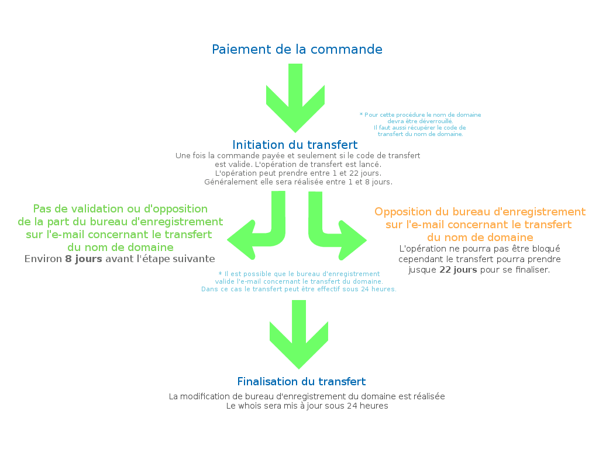

## Informacje ogólne

Aby móc przenieść domenę geograficzną (.fr, .re, .tf, .pm, .yt, .wf .eu, .be) do OVH, upewnij się, że spełnia ona następujące wymagania:

- Domena musi być aktywna. *
- Transfer można wykonać najwcześniej 46 dni po odnowieniu domeny. 
- Kontakty z bazy whois, zwłaszcza właściciel, muszą zostać poinformowani o zleceniu transferu.*
- Domena nie może być zablokowana. *
- Transfer można wykonać najpóźniej na 61 dni przed datą wygaśnięcia domeny. (zalecenie)

( *Obowiązkowo)

Należy również odblokować domenę i uzyskać kod authinfo (u obecnego operatora).

Aby sprawdzić operatora domeny, wykonaj [Whois](http://www.ovh.pl/pomoc/narzedzia/check_whois.pl) domeny.

Kod transferu może występować pod różnymi nazwami: AuthCode, AuthInfo, Kod EPP, Kod transferu... 

{.thumbnail}

## Etap 1: Odblokowanie domeny i uzyskanie kodu authinfo
Aby móc przenieść domenę do OVH, należy najpierw odblokować domenę tak, aby jej status zmienił się na OK/ACTIVE (widoczny w [Whois](http://www.ovh.pl/pomoc/narzedzia/check_whois.pl)) i uzyskać kod AUTH/INFO.

Kod AUTH/INFO to klucz niezbędny do potwierdzenia transferu domeny. 

Aby odblokować domenę, skontaktuj się z aktualnym operatorem domeny.

Odblokowana domena blokuje się automatyczne po 7 dniach. Dotyczy to wszystkich rozszerzeń.

Zachowaj kod authinfo. Należy go podać podczas transferu.

{.thumbnail}

## Etap 2: Złożenie zamówienia na stronie OVH
W tej części sprawdzimy etapy zamawiania transferu domeny geograficznej (.fr, .re, .tf, .pm, .yt, .wf .eu, .be).

## Wyszukiwanie domeny

- Na stronie [OVH](https://www.ovh.pl) należy wpisać nazwę domeny w pasku wyszukiwania. Kliknij na przycisk "Zamów / Przetransferuj".

{.thumbnail}

## Weryfikacja domeny

- Na tym etapie dokonywana jest weryfikacja domeny. Musisz potwierdzić, że jesteś właścicielem domeny. 

Transfer może zostać zainicjowany przez osobę nie będącą właścicielem domeny. Jeśli właściciel domeny odrzuci transfer, domena nie zostanie przeniesiona.

Wybierz "Dalej", aby kontynuować.

{.thumbnail}
Ten rodzaj transferu nie zmienia właściciela domeny. Taką zmianę można wykonać składając odpowiednie zamówienie: 

## Wybór opcji

- Na tym etapie należy wybrać klasyczne serwery DNS lub serwery DNS Anycast.

{.thumbnail}

## Wpisywanie kodu authinfo

- Aby móc przenieść domenę do OVH, należy uzyskać kod transferu (AUTHINFO) od aktualnego operatora. 

Kod można podać podczas składania zamówienia.

Jeśli wybierzesz opcję późniejszego podania kodu, będziesz musiał przejść do panelu klienta. W zakładce "Moje usługi" -> "Operacje w trakcie" będziesz mógł poprawić operację wpisując kod authinfo. 
Otrzymasz również e-mail w tej sprawie.

Wybierz "Dalej" po dokonaniu wyboru.

{.thumbnail}

## Wybór hostingu

- Następnie można wybrać hosting dla domeny lub wybrać opcję bez hostingu. 

Po dokonaniu wyboru przejdź do kolejnego etapu.

{.thumbnail}

## Wstępne wyświetlenie zamówienia

- Na tym etapie pojawi się podsumowanie zamówienia. Kliknij na "Dalej", aby przejść do kolejnego etapu.

## Identyfikacja

- Zaloguj się lub załóż nowe konto klienta.

{.thumbnail}

## Informacje o kontaktach

- Na tej stronie pojawią się informacje o kontaktach domeny po transferze.

{.thumbnail}

## Potwierdzenie właściciela domeny

- Na tym etapie musisz potwierdzić, że jesteś właścicielem domeny.

Kliknij na "Dalej".

{.thumbnail}

## Identyfikacja AFNIC

- Jeśli zlecenie dotyczy domeny  ".fr .re .tf .pm .yt .wf", realizowane jest zlecenie identyfikacji AFNIC.

Procedura ta może się różnić w zależności od rozszerzenia i od statusu prawnego właściciela. 

Uzupełnij informacje i kliknij na "Dalej".

{.thumbnail}

## Wybór serwerów DNS (tylko w przypadku, gdy nie wybrałeś serwerów DNS Anycast)
Na tym etapie należy wybrać serwery DNS:

- Serwery OVH: Skonfigurowałeś wcześniej strefę na serwerach DNS OVH lub masz aktywny hosting w OVH.
- Zachowaj aktualne serwery DNS : Upewnij się, że aktualny dostawca będzie dostarczał usługi przypisane do Twojej domeny po jej przeniesieniu. 
- Wybierz własne serwery DNS: Podaj wybrane serwery DNS. Upewnij się, że są prawidłowo skonfigurowane.

{.thumbnail}

## Potwierdzenie regulaminów

- Przed wygenerowaniem zamówienia należy potwierdzić "Regulaminy".

{.thumbnail}
Ważne:

- Jeśli zamówiłeś transfer domeny i ofertę hostingu, hosting zostanie zainstalowany przed przeniesieniem domeny.

- Transfer rozpocznie się po wpłynięciu płatności za złożone zamówienie.

## .fr .re .tf .pm .yt .wf
Chcesz przenieść domenę do OVH bez zmiany właściciela. 

Oznacza to, że kontakt właściciela u aktualnego właściciela i ten podany w OVH są takie same (to samo imię i nazwisko w przypadku osoby fizycznej, ta sama firma w przypadku firmy). 

Do transferu niezbędny jest kod transferu (kod EPP, kod AUTH, kod autoryzacji), który można pobrać u aktualnego operatora domeny. 

Po wpisaniu kodu authinfo w OVH, registry domen .fr, .re, .tf, .pm, .yt, .wf ([AFNIC](http://www.afnic.fr/)) wysyła e-mail do aktualnego operatora domeny, który może przesłać ta wiadomość (lub nie) do właściciela domeny.

Możliwe są 3 sytuacje:

- zlecenie jest potwierdzane natychmiastowo: domena jest przenoszona w ciągu kilku godzin.

- zlecenie nie jest potwierdzane: domena jest przenoszona automatycznie po 8 dniach.

Możesz skontaktować się z aktualnym operatorem domeny, w celu przyspieszenia procedury transferu. Operator może potwierdzić e-mail pod warunkiem dostarczenia dokumentów potwierdzających dane właściciela domeny. 

- zlecenie jest odrzucane: domena jest transferowana po 22 dniach, dzięki czemu masz czas na sprawdzenie przyczyn odrzucenia transferu. 

Operator nie może wstrzymać transferu wychodzącego domeny. Może tymczasowo zablokować domenę (z różnych powodów: brak płatności, rejestracja znaku towarowego, itp.), ale domena zostanie przeniesiona po 22 dniach. 

Zasadność blokady domeny może sprawdzić AFNIC.

{.thumbnail}

## Przypomnienie:

- Operacja transferu nie może być blokowana przez aktualnego operatora domeny .fr, .re, .tf, .pm, .yt, .wf.

- Transfer rozpoczyna się po wpłynięciu płatności za złożone zamówienie.

## .eu .be
Transfer rozpoczyna się po wpłynięciu płatności za złożone zamówienie. 

Przed rozpoczęciem transferu należy odblokować domenę u aktualnego operatora i pobrać kod authinfo.

Po rozpoczęciu transferu właściciel domeny otrzyma e-mail z kodem autoryzacyjnym. Kod ten można również pobrać bezpośrednio ze strony registry. 

W przypadku domeny .eu przejdź na [stronę firmy EURID](http://www.eurid.eu/).

W przypadku domeny .be przejdź na [stronę DNS.be](http://dns.be/).

Kontakt administracyjny musi potwierdzić kod transferu, aby dokończyć operację. 

Bez kodu authinfo transfer się nie powiedzie. 

Transfer zakończy się w ciągu kilku godzin od podania kodu authinfo.

{.thumbnail}

## Przypomnienie:

- Transfer się nie powiedzie bez potwierdzenia kodem authinfo.

- Transfer nie zostanie zainicjowany, jeśli złożone zamówienie nie zostanie złożone.

## Koszt transferu domeny geograficznej (TLD)
Cennik transferów znajduje się na [stronie OVH](https://www.ovh.pl/domeny/).

## Czas ważności domeny
Poniżej podsumowanie:

{.thumbnail}

