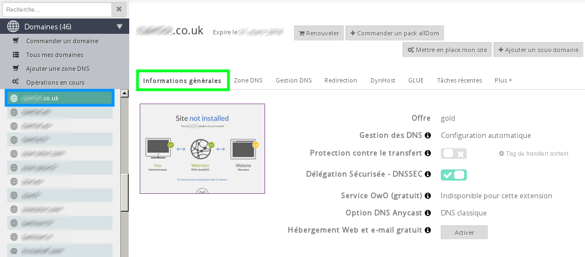
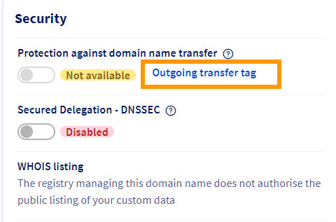
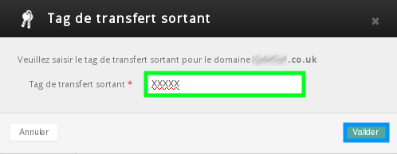

## Prerequisites
To transfer a .co.uk domain name or equivalent to another registrar, make sure that it meets the following conditions:

- Your domain must not have expired. 
- Your domain name must not be the subject of an ongoing dispute with Nominet
- Your domain must not be blocked by OVH

## Extensions in question

- .co.uk
- .me.uk
- .org.uk
- .ltd.uk
- .plc.uk
- .uk.

## Step 1: Verify domain name information
You can find the information in your control panel [here](https://www.ovh.com/manager/web/login/). 
You must log in as the administrative contact.

- Once you are logged in, you just have to click on your domain name at the top-left of the Domains section, then on General information.

{.thumbnail}

## Step 2: Change your domain TAG

- Then click on "Outgoing transfer Tag".

{.thumbnail}

- Specify the TAG provided by your future registrar, then click "confirm".

{.thumbnail}
If for whatever reason you cannot modify your domain's TAG in your control panel, you can ask Nominet to modify it for you. 

Go to this page on the Registry's website: [Manage your domain - Change registrar](http://www.nominet.org.uk/uk-domain-names/manage-your-domain/change-registrar).
Please note, you will be charged for this service.

## Step 3: Pass the information on to your new domain name provider
This is all you need to do. You now have all the information you need to transfer your domain name.

