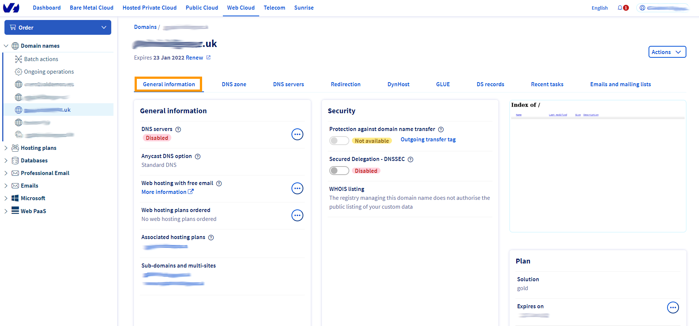
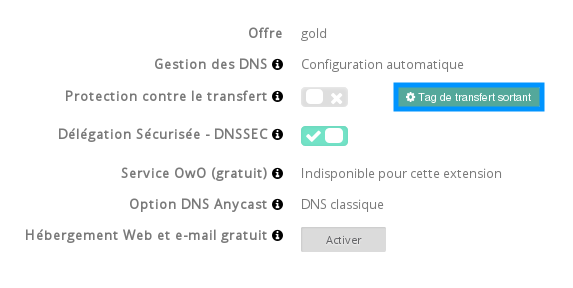

## Généralités

### Prérequis
*Pour pouvoir réaliser un transfert de domaine .co.uk ou assimilés vers un autre registrar, assurez-vous qu'il respecte les prérequis suivants :*

- Votre domaine ne doit pas être suspendu
- Votre domaine ne doit pas être avoir de litige en cours auprès de Nominet
- Votre domaine ne doit pas être bloqué par OVH

### Extensions concernees
- .co.uk
- .me.uk
- .org.uk
- .ltd.uk
- .plc.uk
- .uk.

## Procedure

### Étape 1 &#58; Verifications des informations du domaine
Vous pouvez retrouver les informations à partir de votre Espace client accessible [ici](https://www.ovh.com/manager/web/login/){.external}. Il faut vous connecter avec le contact administrateur.

- Une fois connecté, il vous suffit de cliquer sur votre nom de domaine en haut à gauche dans la partie Domaines , puis sur Informations générales .

{.thumbnail}

### Étape 2 &#58; Modification du TAG de votre domaine
- Cliquez ensuite sur "Tag de transfert sortant" .

{.thumbnail}

- Indiquer le TAG fourni par votre futur registrar, puis cliquez sur "valider" .

{.thumbnail}

> [!success]
>
> Si pour une raison particulière vous ne pouvez pas effectuer la modification du
> Tag de votre domaine dans votre espace client, vous pouvez effectuer une demande
> auprès du Registre Nominet afin que ce dernier effectue la modification pour
> vous.
> Veuillez vous rediriger vers cette page du site du Registre : Manage your domain - Change registrar.
> Attention, cette opération est facturée par Nominet.
> 

### Étape 3 &#58; Transmettre les informations a votre nouveau prestataire de domaine
Les étapes sont maintenant finies chez OVH. Vous avez maintenant toutes les informations nécessaires pour transférer votre domaine.