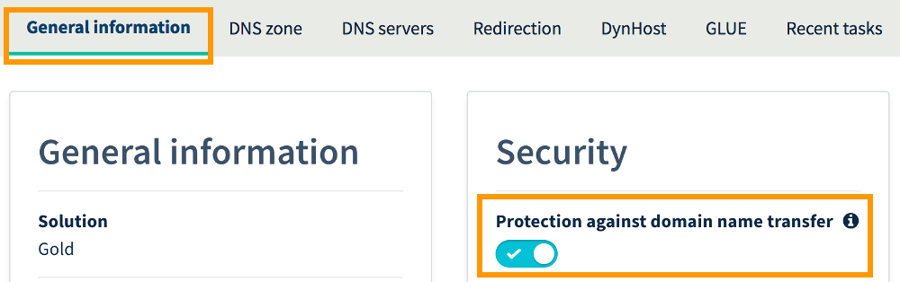
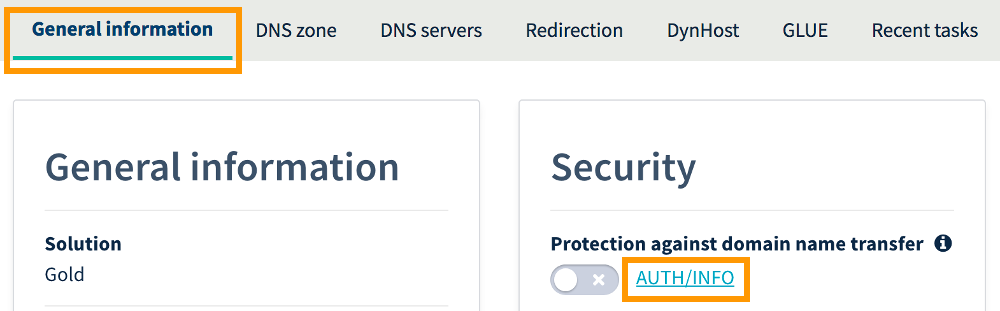

**Last updated 13th March 2018**

## Objective

It is possible to transfer an OVH domain name, allowing you to work with your preferred registrar. 

**Learn how to transfer an OVH domain name to the registrar of your choice.**

## Requirements
- You must have a domain name registered with OVH.
- You must be authorised to request the domain name transfer. Furthermore, the domain name holder and/or its administrators must be informed of the transfer request.
- You must have the appropriate permissions to manage the domain name from your [OVH Control Panel](https://www.ovh.com/auth/?action=gotomanager){.external}.
- The domain name must have been created over 61 days ago, and must not have been transferred or changed ownership during that period.

> [!primary]
>
> Some extensions are covered by a separate procedure with regard to changing registrars. If you cannot transfer your domain name using the steps set out below, please contact your new registrar for more information on the procedure to follow.
>

## Instructions

### Step 1: Remove the transfer protection for the domain name

To remove the transfer protection for your OVH domain name, when you are logged in to your [Control Panel](https://www.ovh.com/auth/?action=gotomanager){.external}, click `Web`{.action} in the service bar at the top. Go to the `Domains`{.action} section on the left, then click on the domain name in question. In the `General information`{.action} tab, untick the `Protection against domain name transfer`{.action} box, then click `Confirm`{.action}.

> [!primary]
>
> Once you have unlocked your domain name, you will have seven days to begin transferring it to the new registrar. After this seven-day period, your domain will be automatically locked again if you do not submit a request to change your domain name registrar.
>

{.thumbnail}

### Step 2: Retrieve the transfer code

Once you have removed the transfer protection, you can retrieve the transfer code for your domain name. To do this, in the `General information`{.action} tab, click on `AUTH/INFO`{.action}, next to `Protection against domain name transfer`{.action}. Refresh the page if necessary.

Retrieve the code shown in the window.

{.thumbnail}

### Step 3: Launch the transfer to the new registrar

If you have not already done so, contact your new registrar to begin the transfer of your domain name. You will need to provide the transfer code retrieved during step 3 as part of the process, which is different for each registrar.

Consult the information provided by your new registrar to find out how long the transfer will take.

## Go further

Join our community of users on [https://community.ovh.com/en/](https://community.ovh.com/en/){.external}.