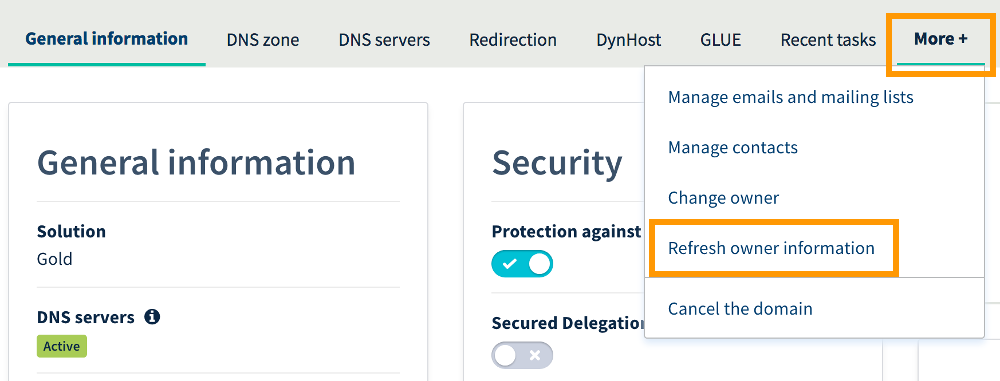

**Last updated 21st July 2022**

## Objective

**Domain transfer** refers to the process of moving a registered domain name from one registrar to another. For example, if you have ordered a domain name on our website, OVHcloud is its current registrar. An outgoing domain transfer needs to be initiated by the new registrar. 

In order to prevent unauthorised domain transfers, domain names are usually locked by having the status *clientTransferProhibited* set. This protection must be lifted in the OVHcloud Control Panel before starting a transfer.

**This guide explains how to prepare your domain name for an outgoing transfer.**

## Requirements

- A [domain name](https://www.ovhcloud.com/en/domains/) registered with OVHcloud
- Access to the [OVHcloud Control Panel](https://ca.ovh.com/auth/?action=gotomanager&from=https://www.ovh.com/world/&ovhSubsidiary=we) with the necessary permissions to manage the domain name (domain administrator)
- The registration of the domain name in question was at least 60 days ago **and** it has not been transferred or traded (i.e. change of owner) during the last 60 days

## Instructions

> [!warning]
>
> The following instructions describe the most common way to transfer a domain name, valid for most Top Level Domains (TLD). However, the specific rules for processes regarding TLDs are solely defined by the appropriate allocation authority i.e. the **registry**. Registrars such as OVHcloud must adhere to these rules and have no influence over registry decisions.
>
> The exact procedure for domain transfers may therefore vary, especially in case of some country-code TLDs (ccTLD, such as .lu, .uk, .hk, .ro) and a few special purpose TLDs (.am, .fm, etc.). Transfers might also be prohibited for various reasons, e.g. outstanding payment, abuse case or registry lock. 
>
> We recommend to consult the following resources in case of any doubt:
>
> - The website of the respective TLD registry
> - The [list of TLDs available at OVHcloud](https://www.ovhcloud.com/en/domains/tld/)
> - [ICANN's explanation of EPP Status Codes](https://www.icann.org/resources/pages/epp-status-codes-2014-06-16-en) (to find out which status codes currently apply to your domain name, carry out a *Whois* search, preferably using the respective TLD registry's website)
> - Your new registrar's website and management interface, especially for questions about a pending transfer process
>

### Step 1: Remove the transfer protection for the domain name

Log in to your [OVHcloud Control Panel](https://ca.ovh.com/auth/?action=gotomanager&from=https://www.ovh.com/world/&ovhSubsidiary=we) and select `Web Cloud`{.action}. Click `Domain names`{.action} , then choose the domain name concerned.

On the `General information`{.action} tab you can find the "Protection against domain name transfer" slider button under **Security**, set to `Enabled`{.action} by default.

{.thumbnail}

Click on the slider and confirm in the popup window that you want to remove this protection. Allow a few minutes for the status to change to `Disabled`{.action}.

{.thumbnail}

You can also refresh the page if it seems to take longer.

> [!primary]
>
> Once the status has changed, the domain name will remain unlocked for seven days. After this period, the protection will automatically turn back on. If you do not request a domain transfer at your new registrar during this time, it will be necessary to unlock the domain again.
>

### Step 2: Retrieve the transfer code

Once the status is set to `Disabled`{.action}, a link labelled `AUTH/INFO`{.action} will appear. Clicking on this link will open a window that contains your AUTH/INFO code (also known as transfer key, domain password, AUTH-CODE or EPP-Code).

{.thumbnail}

The code will be requested by your new registrar to complete the transfer process. You can verify the details with your provider.

Make sure to copy and paste the code as opposed to typing it by hand, since some characters are easily confused.

> [!warning]
>
> If the domain name has been suspended or expired, you will need to [create a support ticket](https://ca.ovh.com/manager/dedicated/#/support/tickets/new) from your OVHcloud Control Panel.

### Step 3: Launch the transfer at your new registrar

After completing the previous steps you can initiate the transfer, usually by placing an order. Afterwards, the transfer may take up to 10 days. 

You can contact your provider for more information about this process.

## Go further

[Transferring a .uk domain name to another registrar](../outgoing_couk_domain_name_transfer/)

Join our community of users on <https://community.ovh.com/en/>. 