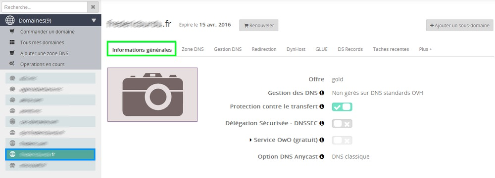
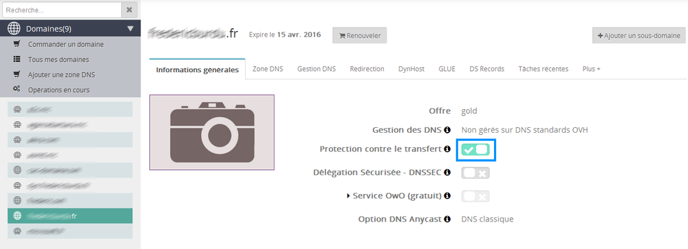
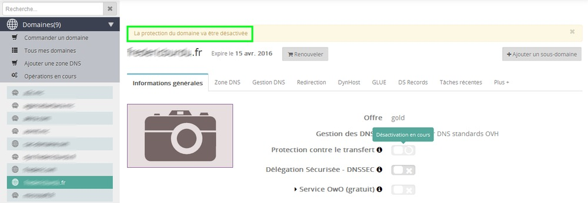
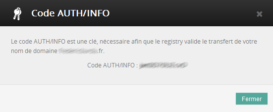

## Dominio generico (GTLD)

Prima di trasferire un dominio generico (.com, .net, .org, .info, .biz e simili) verso un altro provider, assicurati che vengano rispettati questi requisiti:

- il tuo domino non è scaduto *
- il tuo dominio è stato creato o trasferito da più di 61 giorni*
- l'organizzazione, il nome o il cognome del proprietario non sono stati modificati da meno di 61 giorni*
- non hai rinnovato il tuo dominio da meno di 46 giorni (consigliato)
- gli indirizzi email dei contatti del database Whois sono validi *
- i contatti del database Whois e del proprietario sono stati informati della richiesta di trasferimento *
- il dominio non è bloccato *
- la data di scadenza è superiore a 60 giorni*

(*Obbligatorio)

## Dominio geografico (CCTLD)

Prima di trasferire un dominio geografico (.fr, .re, .eu, .be, e simili) verso un altro provider, assicurati che vengano rispettati questi requisiti:

- il tuo domino non è scaduto *
- non hai rinnovato il tuo dominio da meno di 46 giorni (consigliato)
- i contatti del database Whois e del proprietario sono stati informati della richiesta di trasferimento *
- il dominio non è bloccato *
- la data di scadenza è superiore a 60 giorni. *

(*Obbligatorio)

## Step 1: verifica le informazioni relative al dominio
Le informazioni sono disponibili nel tuo [Spazio Cliente OVH](https://www.ovh.com/manager/web/login/).
Accedi alla sezione Domini con il contatto Amministratore, clicca sul tuo dominio in alto a sinistra e poi su Informazioni generali.

{.thumbnail}

## Step 2: sblocca il dominio
Per farlo, è necessario cliccare sul tasto di disattivazione disponibile in Protezione contro il trasferimento non autorizzato.

{.thumbnail}
Clicca su Conferma.

{.thumbnail}
Attendi qualche minuto che l'operazione venga presa in carico.

{.thumbnail}

## Step 3: recupera il codice di trasferimento
Una volta effettuata la disattivazione, compare il tasto AUTH/INFO.

{.thumbnail}
Clicca su questo tasto, compare una finestra con il codice di trasferimento AUTH/INFO.

{.thumbnail}
Il dominio resta sbloccato per 7 giorni, poi viene bloccato nuovamente.

## Step 4: trasmetti le informazioni al tuo nuovo provider
A questo punto, hai tutte le informazioni necessarie per trasferire il tuo dominio!

