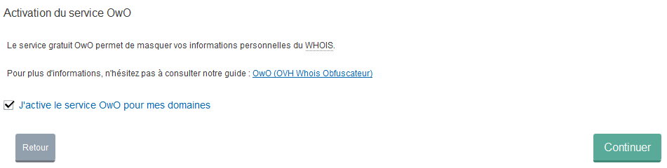
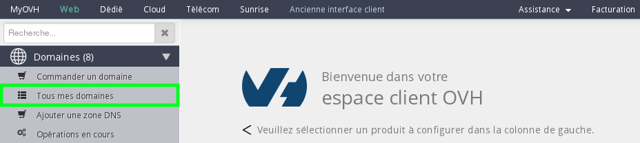
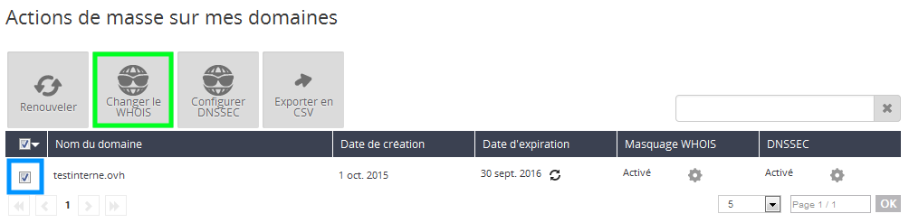
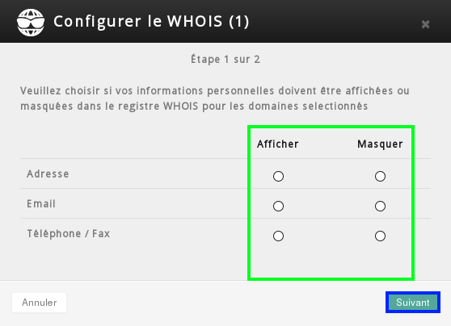
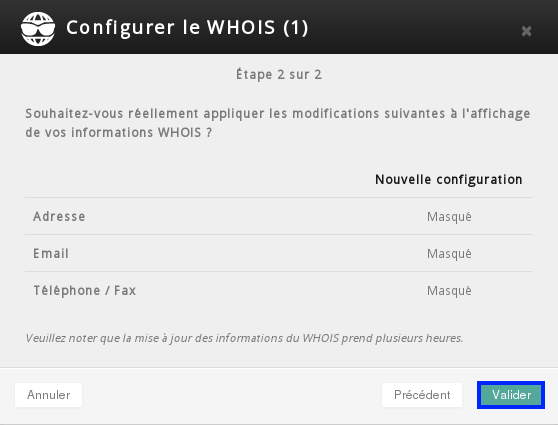

## Prerequisites

- Access to your control panel.
- Ownership of a generic top-level domain (.com, .net, .org, .info, .biz ...)[Full list here](https://www.ovh.co.uk/domains/).

## What is Whois?
Whois lets you query databases that store the addresses, emails, and telephone numbers of domain name owners.

## What is the OwO service?
Thanks to the OWO service, you can hide your details in Whois: address, email or telephone number. OVH guarantees that your data will never be published or sold.

## How it works
OwO is based on the following principles:

- The contact's address field is replaced in the Whois with an address linked to OVH and we resend the mail received to the real recipient. 
- The telephone and fax details are replaced with OVH numbers.
- The email address field is replaced with a redirection which points to the original email address. This address is regenerated regularly and a spam filter is applied to it.

## Conditions
An individual:

- The contact's details can be hidden (apart from their full name).

A company:

- Only the email can be hidden.

## When you order a domain name
When ordering a domain name, you will be asked to enable OwO if you so wish.

{.thumbnail}

## In your control panel

- Sign in to your [control panel](https://www.ovh.com/manager/web) with you nic-handle and password.

{.thumbnail}

- Click on "All my domains".

{.thumbnail}

- Select the domain to modify then click on the "Change Whois" button.

{.thumbnail}

- Choose the desired options and click next.

{.thumbnail}

- Confirm your choices.

{.thumbnail}
Please note, there may be a 24h delay before any changes take effect.

