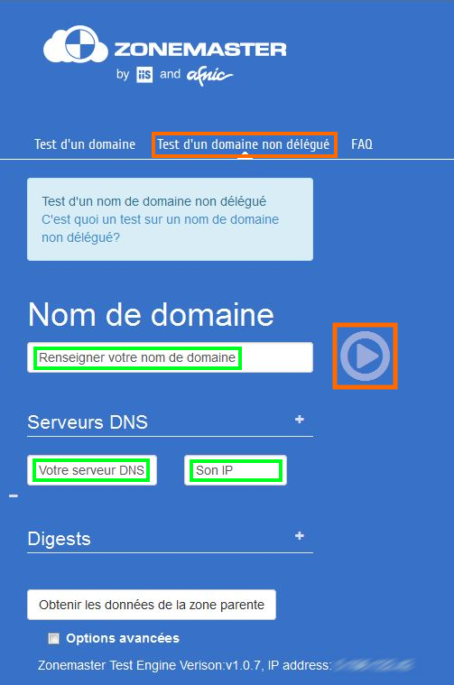
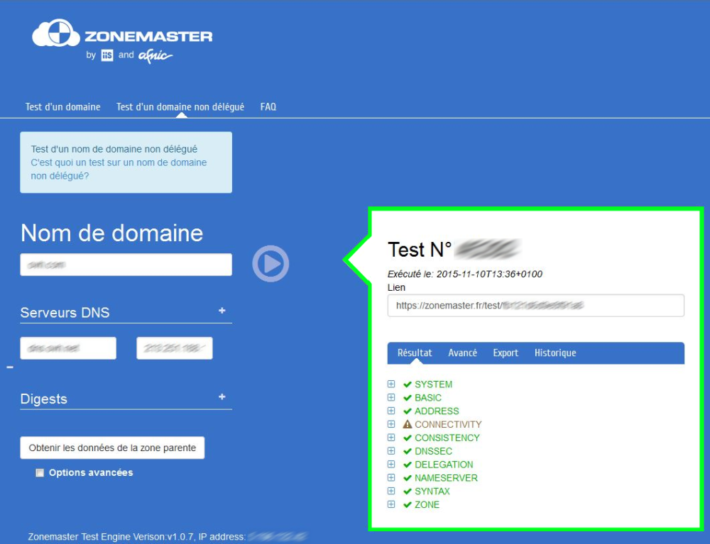
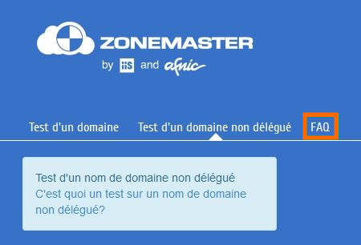

## Filling in the required fields
The AFNIC [Zone Check](https://zonemaster.fr/) tool checks that the primary and secondary DNS that you wish to declare have been properly configured. 

Go to the ZoneMaster website by [clicking here](https://zonemaster.fr/). Then click on "Pre-delegated domain", then fill in the fields below:

- Domain name: Enter the domain name to test
- Name servers: Click on the + following the number of name servers to test, then specify the server, as well as the corresponding IP/IPs. 
- Then confirm to get the result

{.thumbnail}

## Result
The result will appear a few moments after the form has been confirmed:

- If everything is green: Your zone is correct. You can confirm the change in name servers from your control panel

- If there are some elements in red: See the results in detail in order to make the necessary corrections. 

Please note, if you have elements in red, you shouldn't run an update of the name servers without knowing what you are doing, because the operation could risk being blocked and any services linked to the domains may no longer work.

{.thumbnail}

## Useful information
If you have any questions regarding this tool and its features, go to the ZoneMaster "FAQ".

{.thumbnail}

