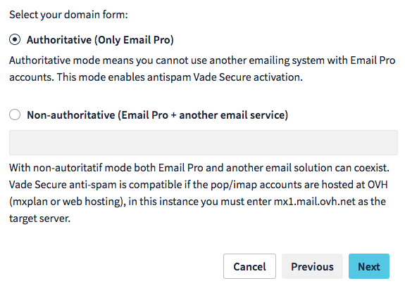
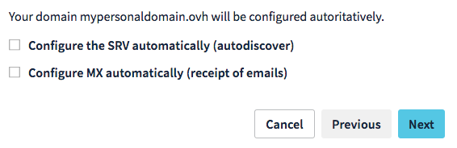
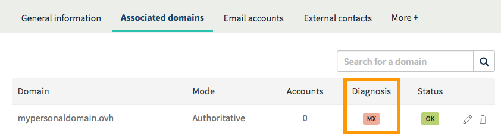

**Last updated 28th November 2018**

## Objective

You have just purchased an Email Pro solution, which gives you affordable professional email addresses to support or start up your business.

**Find out how to configure your Email Pro solution.**

## Requirements

- an [Email Pro](https://www.ovh.co.uk/emails/email-pro/){.external} solution
- an email confirming that your Email Pro solution has been set up
- a domain name
- access to the [OVH Control Panel](https://www.ovh.com/auth/?action=gotomanager){.external}

## Instructions

### Step 1: Log in to your service’s interface.

Once the Email Pro service has been created and is available, you can manage it from the [OVH Control Panel](https://www.ovh.com/auth/?action=gotomanager){.external}.

To do this, log in to the Control Panel, click on `Email Pro`{.action} in the services menu on the left, then select the appropriate service.

> [!primary]
>
> The name of an Email Pro service in the OVH Control Panel begins with *emailpro-*, contains part of your NIC handle, and ends with a figure (1 for the first Email Pro service installed, 2 for the second, etc.).
>

### Step 2: Add your domain name.

If you have just ordered your Email Pro service, a window will automatically pop up, prompting you to `Add a domain`{.action}. If the window does not pop up, go to the `Associated domains`{.action} tab, then click on the `Add a domain`{.action} button.

You will need to choose from:

- **Choose a domain from the list.** Only the domains that use the OVH configuration and are connected to your NIC handle will appear.
- **Enter a domain name which is not managed by your OVH account.** You should be able to modify the domain name’s configuration (its DNS zone) so that the Email Pro service can function correctly.

Once you have selected an option, click on the `Next`{.action} button.

{.thumbnail}

The window will then appear, showing information on configuring a mode.

- **If you have entered a non-OVH domain name**: nonauthoritative mode will be configured by default.
- **If you have selected an OVH domain name in the list**: you must choose between two modes.

|Mode|Description|
|---|---|
|Authoritative|Choose this if you only use the Email Pro solution with your domain name. In authoritative mode, you cannot use another email solution with your Email Pro service.|
|Nonauthoritative|Choose this if you use your Email Pro solution domain name with another email solution.| 

> [!primary]
>
> The mode choice is not definitive. It can be modified via the OVH Control Panel later on.
>

Click on the `Next`{.action} button to continue adding the domain.

{.thumbnail}

**If you have selected an OVH domain name in the list**, it will be automatically configured. To do this, tick the boxes and click on the `Next`{.action} button to continue adding the domain.

**If you have entered a non-OVH domain name**, it must be configured in the next step.

{.thumbnail}

At the end of the configuration process, we will ask you to check the information you have entered, then click on the `Confirm`{.action} button to add the domain.

### Step 3: Configure your domain name.

Once you have added the domain name as an associated domain, check its configuration using the table that pops up.

You can use the `Diagnosis`{.action} column to check the domain name’s MX record configuration. A red box will appear if these configurations need to be changed.

- **If you chose automatic configuration when you added the domain:** it can take a few hours before it appears on the OVH Control Panel.
- **If you entered a non-OVH domain name:** click on the red box to view the changes you need to make. If you have just made the changes, they may take a few hours to show up on the OVH Control Panel.

{.thumbnail}

### Step 4: Configure the Email Pro accounts.

To configure your email addresses, go to the `Email accounts`{.action} tab. The table displays the accounts that you have ordered in this format: “*@configureme.me*”.

To configure them, click on the pencil icon.

{.thumbnail}

Enter the information requested.

|Title|Description|
|---|---|
|Email account|Enter the name for your email address (firstname.lastname, for example) and select the appropriate domain in the list.|
|First name|Enter a first name.|
|Last name|Enter a last name.|
|Display name|Enter the sender name that you wish to be displayed when sending emails from this address.|
|Password confirmation|Type in a password, and confirm it.| 

Once the information is complete, click on the `Next`{.action} button, check the information displayed, then click `Confirm`{.action} to start configuring the account.

> [!primary]
>
> Repeat this step as necessary according to the number of accounts you have. You can order additional accounts using the `Order accounts`{.action} button.
>

{.thumbnail}

### Step 5: Use your email addresses.

Once you have configured your accounts, you can start using them straight away. To do this, OVH offers an online application (a *web app*). RoundCube is available at the following address: <https://pro1.mail.ovh.net>.You will need to enter your email credentials.

If you would like to configure your email address on an email client or device (e.g. a smartphone or tablet), please refer to our documentation via this portal: <https://docs.ovh.com/gb/en/emails-pro/>.  If you simply need the information required to configure your Email Pro account, the settings to use are listed below:

|Server type|Server name|Security type|Port|
|---|---|---|---|
|Incoming|pro1.mail.ovh.net|SSL/TLS|993|
|Outgoing|pro1.mail.ovh.net|STARTTLS|587|

## Go further

Join our community of users on [https://community.ovh.com/en/](https://community.ovh.com/en/){.external}.