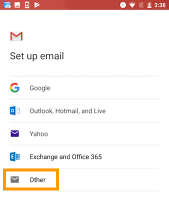

**Last updated 13th March 2018**

## Objective

You can configure Email Pro accounts on email clients, if they are compatible. By doing so, you can use your email address through your preferred email application.

**Find out how to configure an Email Pro account on Android, via the Gmail app.**

## Requirements

- You must have an [Email Pro](https://www.ovh.co.uk/emails/email-pro/){.external} solution.
- You need to have the Gmail app installed on your device. You can install the app from the Google Play Store.
- You need to have the required credentials for the email address you would like to configure.

> [!primary]
>
> This guide has been written using a Nexus 6 device, with Android version 7.1.1. For consistency purposes, we are using the Gmail app available to download from the Play Store. If you would like to use another app, the steps you need to take may differ from this guide.
>

## Instructions

### Step 1: Add the account

On your device’s homepage, open the `Gmail`{.action} app. You can add an account in two different ways:

- **If no account has been set:** Tap through the welcome screen, and tap `Add email address`{.action}. Next, choose `Other`{.action}. 

- **If an account has already been set:** Tap the three-line icon on the top left-hand corner, then the arrow icon to the right of the account name that has already been set. Next, tap `Add account`{.action}, and choose `Other`{.action}. 

{.thumbnail}

Enter your email address, then click `Next`{.action}.

When you choose an account type, select **IMAP** then enter your email password. Click `Next`{.action} to continue with the configuration.

{.thumbnail}

Enter the incoming server settings:

|Information|Description| 
|---|---| 
|Username|Enter your full email address.|  
|Password|Enter the password for your email address.|
|Server|Enter the server “pro1.mail.ovh.net”.|

Tap `Next`{.action}, then enter the outgoing server settings:

|Information|Description| 
|---|---| 
|Request a connection|Ensure that this button is enabled.|
|Username|Enter your full email address.|  
|Password|Enter the password for your email address.|
|SMTP server|Enter the server “pro1.mail.ovh.net”.|

Then tap `Next`{.action}. If all the information you have entered is correct, you will be able to log in to your account straight away.

{.thumbnail}

Enter the account options, then tap `Next`{.action}. You can now set a name for this account, so that it can be distinguished from any other accounts associated with your app. You can also set the display name, which will appear when you send emails. Once you have done this, tap `Next`{.action}.

To check that the account has been correctly configured, you can send a test email.

If you need to enter any settings manually in your account preferences, the technical settings you will need to use with our Email Pro solution are listed below:

|Server type|Server name|Security type|Port|
|---|---|---|---|
|Incoming|pro1.mail.ovh.net|SSL/TLS|993|
|Outgoing|pro1.mail.ovh.net|STARTTLS|587|

### Step 2: Use the email address

Once you have configured your email address, you can start using it! You can now send and receive emails.

OVH also offers a web application that has [collaborative features](https://www.ovh.co.uk/emails/){.external}, accessible via [https://pro1.mail.ovh.net](https://pro1.mail.ovh.net){.external}. You can log in using your email credentials.

## Go further

[Configuring an email address included in an MX Plan or web hosting plan on Android, via the Gmail app](https://docs.ovh.com/gb/en/emails/configuration-android/){.external}.

[Configuring an Exchange account on Android via the Gmail app](https://docs.ovh.com/gb/en/microsoft-collaborative-solutions/exchange_2013_how_to_configure_on_android/){.external}.

Join our community of users on [https://community.ovh.com/en/](https://community.ovh.com/en/){.external}.