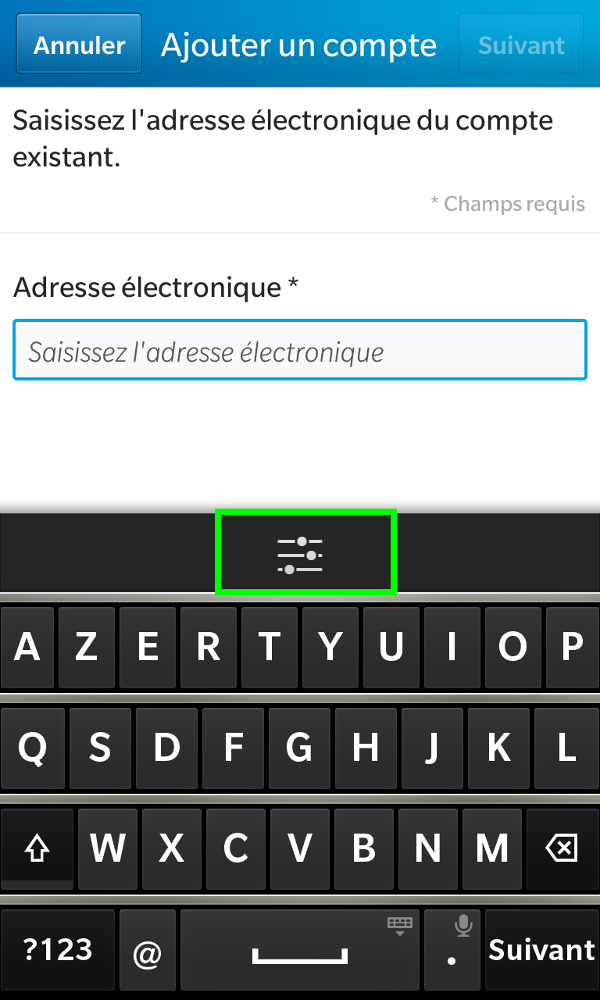
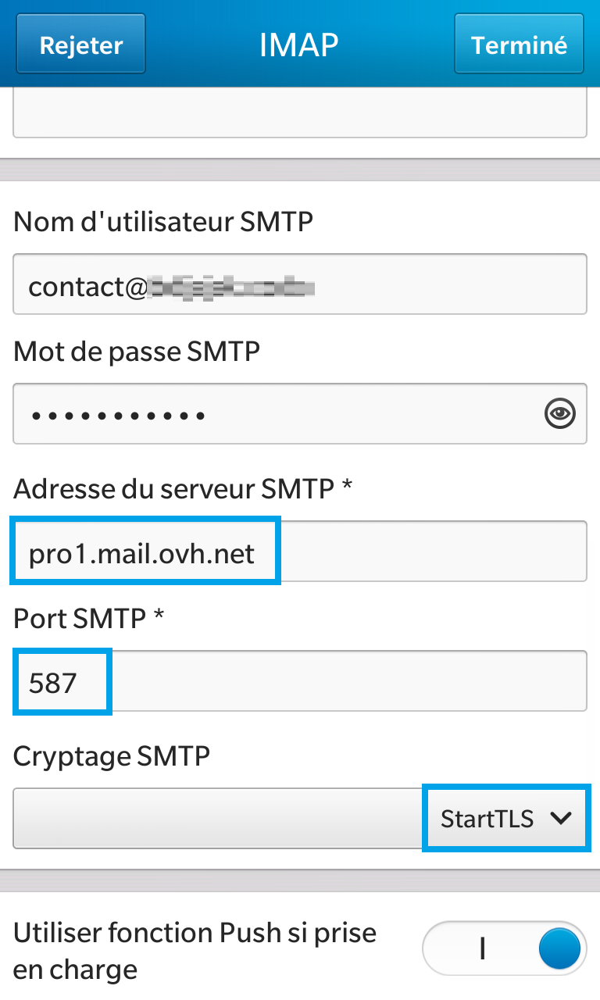
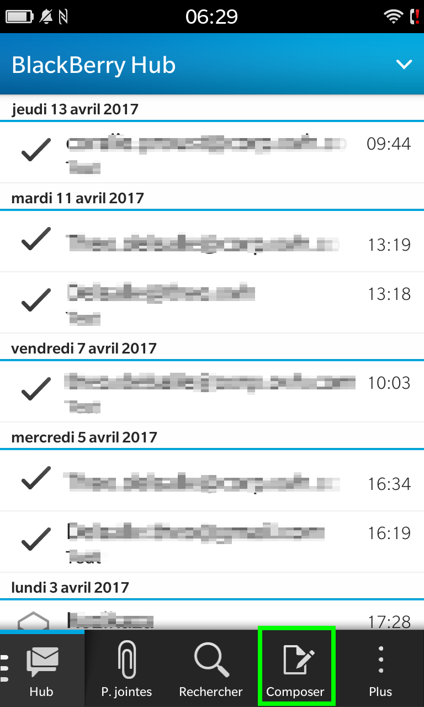

**Dernière mise à jour le 19/03/2020**

## Objectif

Les comptes E-mail Pro peuvent être configurés sur différents logiciels de messagerie compatibles. Cela vous permet d’utiliser votre adresse e-mail depuis l’appareil de votre choix.

**Apprenez à configurer un compte E-mail Pro sur un BlackBerry.**

> [!warning]
>
> OVHcloud met à votre disposition des services dont la configuration, la gestion et la responsabilité vous incombent. Il vous revient de ce fait d'en assurer le bon fonctionnement.
> 
> Nous mettons à votre disposition ce guide afin de vous accompagner au mieux sur des tâches courantes. Néanmoins, nous vous recommandons de faire appel à un prestataire spécialisé et/ou de contacter l'éditeur du service si vous éprouvez des difficultés. En effet, nous ne serons pas en mesure de vous fournir une assistance. Plus d'informations dans la section « Aller plus loin » de ce guide.
> 

### Prérequis
- Disposer d'une adresse E-mail Pro fonctionnelle
- Disposer d'un BlackBerry (version 10 dans ce guide)

## Configuration du BlackBerry

> [!primary]
>
> Dans notre exemple, nous utilisons la mention serveur : pro**X**.mail.ovh.net. Vous devrez remplacer le « X » par le chiffre désignant le serveur de votre service E-mail Pro.
> 
> Retrouvez ce chiffre dans votre [espace client OVHcloud](https://www.ovh.com/auth/?action=gotomanager){.external}, dans la rubrique `Web`{.action} puis `E-mail Pro`{.action}
>  dans la colonne de gauche. Le nom du serveur est visible dans le cadre **Connexion** de l'onglet `Informations Générales`{.action}.
> 

### Demarrage et configuration
Voici comment réaliser votre configuration en  **IMAP**  avec  **SSL** activé. Suivez les étapes en cliquant sur les différentes images.

1. Allez dans les réglages, puis Comptes.

2. Appuyez sur E-mail, calendrier et contacts.

3. Apuuyez sur l'icône permettant de réaliser une configuration avancée.

4. Sélectionnez IMAP.

5. Complétez les informations (description, nom, et compte).

6. Renseignez en adresse de serveur "pro**X**.mail.ovh.net", en port "993" et en cryptage "SSL".

7. Concernant le SMTP, renseignez en serveur SMTP "pro**X**.mail.ovh.net", en port "587" et en cryptage "StartTLS".

8. Choisissez vos options puis terminez.

9. Si un avertissement d'identité apparait, poursuivez la manipulation pour finaliser la configuration du compte.

> [!carousel]
>
> - 
> - 
> - 
> - 
> - 
> - 
> - 
> - 
> - 
> - 
> 

### Test d'envoi et reception
Dans le champ "**À**" mettez la même adresse que celle avec laquelle vous envoyez afin de vous envoyer un e-mail à vous même. Écrivez ce que vous souhaitez, ceci sert à vérifier que l'envoi et la réception fonctionnent.

1. Rendez-vous sur le BlackBerry Hub.

2. Appuyez sur le bouton pour composer un nouveau message.

3. Sélectionnez votre compte E-mail Pro.

4. En destinataire, mettez votre propre compte E-mail Pro.

5. Si le message est bien reçu, votre compte est bien configuré.

> [!carousel]
>
> - 
> - 
> - 
> - 
> - 
> 

### POP ou IMAP ?
Lors de la configuration, vous pouvez choisir le protocole **"POP"** au lieu de **"IMAP"**.

Nous vous invitons à vous renseigner sur l'utilisation de ces deux protocoles avant de faire votre choix. Dans le doute, choisissez la configuration **"IMAP"**".

## Aller plus loin

Échangez avec notre communauté d'utilisateurs sur <https://community.ovh.com>.