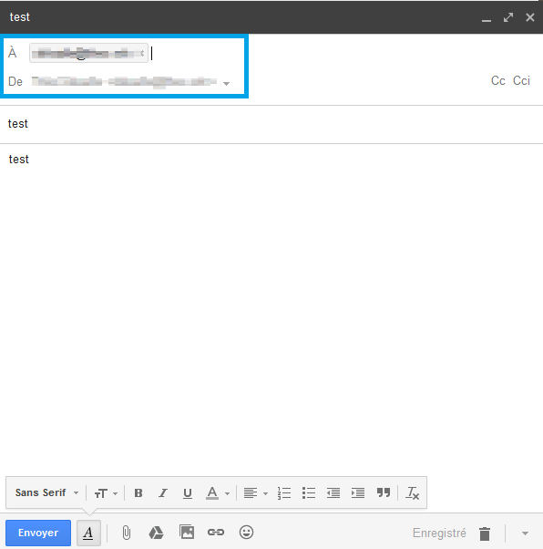

## Généralités

> [!warning]
>
> OVH met à votre disposition des services dont la configuration, la gestion et la responsabilité vous incombent. Il vous revient de ce fait d'en assurer le bon fonctionnement.
> 
> Nous mettons à votre disposition ce guide afin de vous accompagner au mieux sur des tâches courantes. Néanmoins, nous vous recommandons de faire appel à un prestataire spécialisé et/ou de contacter l'éditeur du service si vous éprouvez des difficultés. En effet, nous ne serons pas en mesure de vous fournir une assistance. Plus d'informations dans la section « Aller plus loin » de ce guide.
> 

### Prérequis

- Disposer d'une adresse E-mail Pro fonctionnelle

- Disposer d'un compte Gmail

## Configuration de Gmail

### Demarrage et configuration

Voici comment réaliser votre configuration en  **IMAP**  avec  **SSL** activé.

Connectez-vous sur **"Gmail"**, cliquez sur le rouage en haut à droite, puis `Paramètres`{.action} et onglet `Comptes et importation`{.action}.

Puis sur `Ajouter un compte de messagerie`{.action}.

{.thumbnail}

Ajoutez votre adresse E-mail Pro, puis `Suivant`{.action}. Cochez **"Importer les e-mails de mon autre compte (POP3)"**, puis `Suivant`{.action}.

À l'étape suivante, dans **"Nom d'utilisateur"**, écrivez votre adresse E-mail Pro, puis son mot de passe en dessous. Pour le Serveur POP, remplacez par **"pro1.mail.ovh.net"**. Cochez la case **"SSL"** et changez le port pour **"995"**.

Enfin, cliquez sur `Ajouter un compte`{.action}.

{.thumbnail}

Cochez **"Oui, j'aimerais envoyer des e-mails depuis l'adresse "**, puis `Suivant`{.action}.

{.thumbnail}

Il vous sera ensuite proposé de traiter votre adresse comme un alias. Pour cela nous vous invitons à lire [cette documentation de Gmail à ce sujet](https://support.google.com/a/answer/1710338?hl=fr&ref_topic=4388832&authuser=0/){.external}.

Pour la configuration SMTP, il faudra rentrer pour le serveur SMTP **"pro1.mail.ovh.net"** et votre adresse E-mail Pro OVH et son mot de passe. Laissez coché **"TLS"** et vérifiez que le port est bien **"587"**

Cliquez ensuite sur `Ajouter un compte`{.action}.

{.thumbnail}

La dernière étape sera de valider le compte par un e-mail envoyé sur cette nouvelle adresse. Pour cela, connectez-vous au webmail OVH en vous rendant sur cette adresse : [https://pro1.mail.ovh.net/](https://pro1.mail.ovh.net/){.external}

Et rentrez votre adresse E-mail Pro et son mot de passe.

Comme ci-dessous, vous pouvez, au choix, cliquez sur le lien envoyé par Google, ou copier/collez le code dans la fenêtre de confirmation.

{.thumbnail}

### Test d'envoi et reception

Sur Gmail, cliquez sur `Nouveau message`{.action}.

Dans le champ **"De"**, vous pouvez choisir votre nouvelle adresse E-mail Pro.

Dans le champ **"À"** mettez la même adresse que le champ **"De"** afin de vous envoyer un e-mail à vous même. Remplissez le champ **"Objet"** et le corps du message, puis cliquez sur `Envoyer`{.action}.

Attendez quelques secondes, vous recevrez alors votre e-mail.

Votre adresse E-mail Pro est maintenant bien configurée sur Gmail.

{.thumbnail}