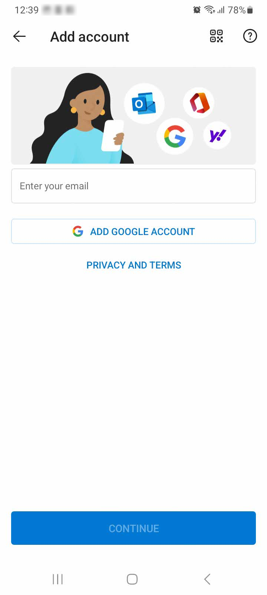

## Objective

You can configure Email Pro accounts on email clients, if they are compatible. By doing so, you can use your email address through your preferred device.

**Find out how to configure an Email Pro account on Android with the Microsoft Outlook application.**

## Requirements

- An [Email Pro](https://www.ovhcloud.com/en-gb/emails/email-pro/){.external} solution.
- You need to have Microsoft Outlook installed on your Android device. You can download it from the *Google Play Store*.

> [!warning]
>
> OVHcloud provides services that you are responsible for with regard to their configuration and management. It is therefore your responsibility to ensure that they function properly.
> 
> This guide is designed to help you with common tasks. Nevertheless, we recommend contacting a [specialist provider](https://partner.ovhcloud.com/en-gb/directory/) and/or the service’s software publisher if you encounter any difficulties. We will not be able to assist you. You can find more information in the [“Go further”](#go-further) section of this guide.
> 

## Instructions

### Step 1: Retrieve your Email Pro account information 

Log in to your [OVHcloud Control Panel](https://www.ovh.com/auth/?action=gotomanager&from=https://www.ovh.co.uk/&ovhSubsidiary=GB){.external} then go to the `Web Cloud`{.action} section. In the left-hand column, click `Professionnal emails`{.action} then choose the Email Pro platform where you want to configure your email address.

On the new page, click the `Email accounts`{.action} tab.

{.thumbnail}

Get the name of the Email Pro server that appears below the `Webmail`{.action} entry. In our example shown above, it is `proX.mail.ovh.net`.

> [!warning]
>
> Make sure to retrieve the **correct name** of the Email Pro server where the email address you want to configure is located. It may vary depending on the duration of your Email Pro solution (pro1.mail.ovh.net, pro2.mail.ovh.net, etc.).
> 

In the `Email accounts`{.action} tab of your *Email Pro* platform, a table will be displayed with your Email Pro address(es).

If you no longer remember the password to access the email address you want to configure, you can change it using the `...`{.action} button located on the same line to the right of the email account.

Then select `Edit`{.action}, choose a new password and confirm it. Then click `Next`{.action} and `Validate`{.action} in the second window.

The password change will be processed within the next 15 minutes approximately.

> [!warning]
>
> If you change the password for your email address and it is already used by another device (email software, computer, tablet, smartphone, photocopier, etc.), you will need to update the password on these other devices.
> They will no longer be able to log in to your email address using the old password.
>

At the end of this first step, you must now have the following information:

- the name of the Email Pro server (pro1.mail.ovh.net, pro2.mail.ovh.net, etc.)
- the email address to configure
- the password of the email address to be configured.

### Step 2: set up your address on Android via the Microsoft Outlook application 

Launch the Microsoft Outlook app on your Android device. If you haven't already installed it, download it from the *Google Play Store*.

|||
|---|---|
|{.thumbnail}|{.thumbnail}|

Once opened, click on `Add Account`{.action}, enter your full email address in the field labelled `Enter your email`{.action} and click `Continue`{.action}.

At the bottom of your screen, you will see two configuration choices: `IMAP`{.action} and `POP3`{.action}.

|||
|---|---|
| {.thumbnail} | {.thumbnail} |

> [!success]
>
> With the **IMAP** synchronisation protocol, you can retrieve an “image” of the emails stored in your Email Pro address on the server side, and view them in your Microsoft Outlook application. **without** deleting the email from the Email Pro server where your email address is located. This protocol is very useful especially if you have several devices configured with your email address.
>
> The **POP3** protocol will, by default, retrieve the email received on the Email Pro server where your email address is located and keep it in the application/software configured with it. As a result, the email is no longer present on the Email Pro server, only on the device configured with your email address via the POP protocol.
> This protocol is not recommended if you have several devices configured with your email address. The email will only appear on one of the devices configured in **POP3** and not on all of the devices configured with your email address.
>
> However and despite the **POP3** configuration, some email software/applications still return a copy of the email to the server where your email address is located. This copy may remain temporarily or permanently.
> To find out if your application / software applies this method, contact the software publisher directly.
>

#### Case 1: Configuring Microsoft Outlook on Android with IMAP

Select `IMAP`{.action} at the bottom of your screen.

On the new page that pops up, your email address is pre-filled.

Enter your Email Pro password in the form `Password`{.action} just below where your email address is already pre-filled.

Optionally, in the two forms that follow, you can enter a `Display name`{.action} and a `Description`{.action}.

To continue, select the button labelled `ADVANCED SETTINGS`{.action} to display the rest of the configuration menu.

Then fill in the various forms with the following information.

For the **IMAP incoming mail server** section:

 - **IMAP host name**: Enter the name of your Email Pro server retrieved earlier in [step 1](#step1): (examples: *pro1.mail.ovh.net*, *pro2.mail.ovh.net*, etc.);
 - **Port**: enter the port number **993**;
 - **Security type**: Select **SSL/TLS** security from the dropdown list.
 - **IMAP username**: Enter the email address you would like to configure
 - **IMAP password**: enter the password to access the email address you want to configure.

For the **SMTP Outgoing Mail Server** section:

 - **SMTP Host Name**: Enter the name of your Email Pro server retrieved earlier in [step 1](#step1): (examples: *pro1.mail.ovh.net*, *pro2.mail.ovh.net*, etc.);
 - **Port**: enter the port number **587**;
 - **Security type**: Select **StartTls** security from the dropdown list.
 - **SMTP username**: Enter the email address you would like to configure
 - **SMTP password**: enter the password to access the email address you want to configure.

Then make sure that all the settings you have entered match the above, and click the `V`{.action} icon in the top right-hand corner of your screen.

### Case 2: configuring Microsoft Outlook application on Android with "POP3" protocol

Click `POP3`{.action} at the bottom of your screen. 

On the new page that pops up, your email address is pre-filled.

Enter your Email Pro password in the form `Password`{.action} just below where your email address is already pre-filled.

In the two forms that follow, and completely **optional**, you can enter a `Display name`{.action} and a `Description`{.action}.

To continue, select the button labelled `ADVANCED SETTINGS`{.action} to display the rest of the configuration menu.

Then fill in the various forms with the following information.

For the **POP incoming mail server** section:

 - **POP host name**: Enter the name of your Email Pro server retrieved earlier in [step 1](#step1): (examples: *pro1.mail.ovh.net*, *pro2.mail.ovh.net*, etc.);
 - **Port**: enter the port number **995**;
 - **Security type**: Select **SSL/TLS** security from the dropdown list.
 - **POP username**: Enter the email address you would like to configure
 - **POP password**: enter the password to access the email address you want to configure.

For the **SMTP Outgoing Mail Server** section:

 - **SMTP Host Name**: Enter the name of your Email Pro server retrieved earlier in [step 1](#step1): (examples: *pro1.mail.ovh.net*, *pro2.mail.ovh.net*, etc.);
 - **Port**: enter the port number **587**;
 - **Security type**: Select **StartTls** security from the dropdown list.
 - **SMTP username**: Enter the email address you would like to configure
 - **SMTP password**: enter the password to access the email address you want to configure.

Then make sure that all the settings you have entered match the above, and click the `V`{.action} icon in the top right-hand corner of your screen.

### Step 3: Finalise Microsoft Outlook app configuration on Android

After clicking the `V`{.action} icon, the application will test the settings and connect to the Email Pro server where your email address is located.
The interface will then sync/retrieve the content of your email address, and display it on your device.

Then try sending and receiving emails from your Microsoft Outlook application to complete the configuration.

## Go further 

For specialised services (SEO, development, etc.), contact [OVHcloud partners](https://partner.ovhcloud.com/en-gb/directory/).

If you would like assistance using and configuring your OVHcloud solutions, please refer to our [support offers](https://www.ovhcloud.com/en-gb/support-levels/).

Join our community of users on <https://community.ovh.com/en/>. 