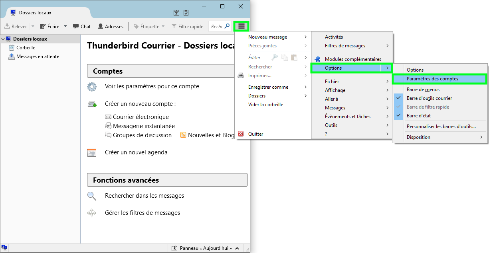

## Généralités

> [!warning]
>
> OVH met à votre disposition des services dont la configuration, la gestion et la responsabilité vous incombent. Il vous revient de ce fait d'en assurer le bon fonctionnement.
> 
> Nous mettons à votre disposition ce guide afin de vous accompagner au mieux sur des tâches courantes. Néanmoins, nous vous recommandons de faire appel à un prestataire spécialisé et/ou de contacter l'éditeur du service si vous éprouvez des difficultés. En effet, nous ne serons pas en mesure de vous fournir une assistance. Plus d'informations dans la section « Aller plus loin » de ce guide.
> 

### Prérequis

- Disposer d'une adresse E-mail Pro fonctionnelle

- Disposer du logiciel Thunderbird 45.8.0 ou supérieur

## Configuration de Thunderbird

### Démarrage

Voici comment réaliser votre configuration en **IMAP** avec **SSL** activé.

- Lancez le logiciel Thunderbird.

### Ajout du compte

> [!primary]
>
> Si l'assistant de configuration se lance au démarrage de Thunderbird, cliquez simplement sur la croix afin de fermer celui-ci.
> 

- Cliquez sur le bouton **"Menu"**, puis **"Options"**, et enfin `Paramètres des comptes`{.action}.

{.thumbnail}

- Cliquez ensuite sur **"Gestion des comptes"**, puis `Ajouter un compte de messagerie`{.action}.

{.thumbnail}

### Configuration du compte

- Renseignez les champs ci-dessous et cliquez sur `Continuer`{.action} :
    - Votre nom complet : **Indiquez votre nom complet**
    - Adresse électronique : **Indiquez votre adresse E-mail Pro OVH**
    - Mot de passe : **Indiquez le mot de passe de votre adresse E-mail Pro**
    - Cochez la case "**Retenir le mot de passe**"

{.thumbnail}

Si l'enregistrement DNS SRV est correctement paramétré, la configuration se complètera automatiquement. En cas contraire, vous devrez réaliser une  `Configuration manuelle`{.action}.

Dans le cas d'une configuration manuelle, renseignez les éléments ci-dessous et cliquez sur `Terminer`{.action} :

{.thumbnail}

|Serveur entrant||
|---|---|
|POP / IMAP|IMAP|
|Nom d'hôte du serveur|pro1.mail.ovh.net|
|Port|993|
|SSL|SSL/TLS|
|Authentification|Mot de passe normal|

|Serveur sortant||
|---|---|
|POP / IMAP|IMAP|
|Nom d'hôte du serveur|pro1.mail.ovh.net|
|Port|587|
|SSL|STARTTLS|
|Authentification|Mot de passe normal|

|Identifiants||
|---|---|
|Serveur entrant|Votre adresse E-mail Pro|
|Nom d'hôte du serveur|pro1.mail.ovh.net|

La configuration de votre compte est maintenant terminée.

## Test d'envoi et reception
À cette étape, vous constaterez que votre adresse E-mail Pro OVH apparaît bien sur la gauche de Thunderbird.

- Cliquez sur `Écrire`{.action} :

{.thumbnail}

- Effectuez un envoi vers votre propre adresse en rédigeant un message, puis cliquez sur `Envoyer`{.action}.

{.thumbnail}

- Attendez quelques secondes, vous recevrez alors votre e-mail.

{.thumbnail}

## POP ou IMAP ?
Lors de la configuration, vous pouvez choisir le protocole **"POP"** au lieu de **"IMAP"**.

Nous vous invitons à vous renseigner sur l'utilisation de ces deux protocoles avant de faire votre choix. Dans le doute, choisissez la configuration **"IMAP"**".

### Configuration POP
Si vous désirez configurer votre compte en POP, choisissez ce protocole lors de l'ajout de votre compte E-mail Pro OVH, puis indiquez ces paramètres :

|Serveur entrant||
|---|---|
|POP / IMAP|POP|
|Nom d'hôte du serveur|pro1.mail.ovh.net|
|Port|995|
|SSL|SSL/TLS|
|Authentification|Mot de passe normal|

|Serveur sortant||
|---|---|
|POP / IMAP|POP|
|Nom d'hôte du serveur|pro1.mail.ovh.net|
|Port|587|
|SSL|STARTTLS|
|Authentification|Mot de passe normal|

|Identifiants||
|---|---|
|Serveur entrant|Votre adresse E-mail Pro|
|Nom d'hôte du serveur|pro1.mail.ovh.net|

## Aller plus loin

Échangez avec notre communauté d'utilisateurs sur <https://community.ovh.com>.