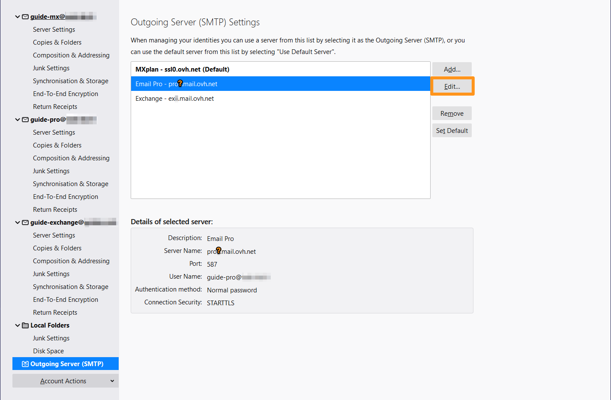

> [!primary]
> Esta tradução foi automaticamente gerada pelo nosso parceiro SYSTRAN. Em certos casos, poderão ocorrer formulações imprecisas, como por exemplo nomes de botões ou detalhes técnicos. Recomendamos que consulte a versão inglesa ou francesa do manual, caso tenha alguma dúvida. Se nos quiser ajudar a melhorar esta tradução, clique em "Contribuir" nesta página.
>

**Última atualização: 26/08/2021**

## Objetivo

As contas E-mail Pro podem ser configuradas em vários softwares de e-mail compatíveis. Isto permite-lhe usar o seu endereço de e-mail no dispositivo que preferir. A Thunderbird é um cliente de e-mails livre e gratuito.

**Saiba como configurar o seu endereço de E-mail Pro no Thunderbird no Windows.**

> [!warning]
>
> A responsabilidade sobre a configuração e a gestão dos serviços que a OVHcloud disponibiliza recai sobre o utilizador. Assim, deverá certificar-se de que estes funcionam corretamente.
> 
> Este manual fornece as instruções necessárias para realizar as operações mais habituais. No entanto, se encontrar dificuldades, recomendamos que recorra a um [prestador de serviços especializado](https://partner.ovhcloud.com/pt/directory/) e/ou que contacte o editor do serviço. Não poderemos proporcionar-lhe assistência técnica. Para mais informações, aceda à secção «Quer saber mais?» deste guia.
> 

## Requisitos

- Ter um endereço de [E-mail Pro](https://www.ovhcloud.com/pt/emails/email-pro/).
- Dispor do software Thunderbird instalado no seu Windows.
- Dispor das credenciais do endereço de e-mail que pretende configurar.
 
## Instruções

> [!primary]
>
> No nosso exemplo, utilizamos a menção servidor: pro**?**.mail.ovh.net. Deverá substituir o "? " pelo número que designa o servidor do seu serviço E-mail Pro.
>
> Encontre este número na sua [Área de Cliente OVHcloud](https://www.ovh.com/auth/?action=gotomanager&from=https://www.ovh.pt/&ovhSubsidiary=pt){.external}, na rubrica `Web Cloud`{.action} e, a seguir, `E-mail Pro`{.action}. O servidor é visível na secção **Ligação** do separador `Informações gerais`{.action}.
>

### Adicionar a conta

- **Se for a primeira vez que utiliza a aplicação**, aparecerá um assistente de configuração que lhe irá solicitar o seu endereço de e-mail.

- **Se uma conta já estiver configurada**: clique em `Ficheiro`{.action} na barra de menu no topo do seu ecrã, depois em `Novo`{.action} e, por fim, em `Obter uma nova conta de correio...`{.action}.

| | |
|---|---|
|{.thumbnail}|Na nova janela, introduza as seguintes 3 informações:  - O seu nome completo (Nome de apresentação) - Endereço eletrónico  - Palavra-passe.|
|A seguir, clique em `Configurar manualmente...`{.action} para introduzir os parâmetros do servidor **ENTRAANT**:  - Protocolo **IMAP**  - Servidor **pro?.mail.ovh.net**  - Porta **993**  - SSL **SSL/TLS**  - Autenticação da **password normal**  - Identificar **o seu endereço de e-mail completo**|{.thumbnail}|
|{.thumbnail}|Introduzir os parâmetros do servidor de **saída**:  - Protocolo **SMTP**  - Servidor **pro?.mail.ovh.net**  - Porta **587**  - SSL **STARTTLS**  - Autenticação da **password normal**  - Identificar **o seu endereço de e-mail completo**  Para terminar a configuração, clique em `Terminado`{.action}|

No âmbito de uma configuração em **POP**, os valores são os seguintes:

|Tipo de servidor|Nome do servidor|Método de encriptação|Porta|
|---|---|---|---|
|De entrada|pro**?**.mail.ovh.net (a menção **"?"** é substituída pelo número do seu servidor)|SSL/TLS|995|
|De saída|pro**?**.mail.ovh.net (a menção **"?"** é substituída pelo número do seu servidor)|STARTTLS|587|

### Utilizar o endereço de e-mail

Após a configuração, a conta de e-mail está pronta a usar e pode começar a enviar e receber mensagens no seu dispositivo.

A OVHcloud também disponibiliza uma aplicação web que permite aceder ao seu endereço de e-mail a partir de um browser. disponível no endereço <https://www.ovh.pt/mail/>. Para aceder, só precisa dos dados de acesso do seu endereço de e-mail. Para qualquer questão relativa à sua utilização, consulte o nosso manual [Consultar a sua conta Exchange a partir da interface OWA](https://docs.ovh.com/pt/microsoft-collaborative-solutions/exchange_2016_guia_de_utilizacao_do_outlook_web_app/).

### Recuperar um backup do seu endereço de e-mail

Se tiver de efetuar uma operação suscetível de causar a perda dos dados da sua conta de e-mail, sugerimos que efetue uma cópia de segurança da conta de e-mail em questão. Para isso, consulte o parágrafo "**Exportar**" na secção "**Thunderbird**" do nosso guia [Migrar manualmente o seu endereço de e-mail](https://docs.ovh.com/pt/emails/migrar-os-enderecos-email-manualmente/).

### Modificar os parâmetros existentes

> [!primary]
>
> No nosso exemplo, utilizamos a menção servidor: pro**?**.mail.ovh.net. Deverá substituir o "? " pelo número que designa o servidor do seu serviço E-mail Pro.
>
> Encontre este número na sua [Área de Cliente OVHcloud](https://www.ovh.com/auth/?action=gotomanager&from=https://www.ovh.pt/&ovhSubsidiary=pt){.external}, na rubrica `Web Cloud`{.action} e, a seguir, `E-mail Pro`{.action}. O servidor é visível na secção **Ligação** do separador `Informações gerais`{.action}.
>

Se a sua conta de e-mail já está configurada e tem de aceder aos parâmetros da conta para os alterar:

- Aceda às `Ferramentas`{.action} a partir da barra de menu no topo do ecrã.
- Clique em `Parâmetros das contas`{.action}.

{.thumbnail}

- Para alterar os parâmetros associados à **receção** dos seus e-mails, clique em `Parâmetros do servidor`{.action} na coluna da esquerda do seu endereço de e-mail.

{.thumbnail}

- Para modificar os parâmetros associados ao **envio**dos seus e-mails, clique em `Servidor de saída (SMTP)`{.action} no fundo da coluna da esquerda.
- Clique no endereço de e-mail em questão na lista e, a seguir, em `Alterar`{.action}.

{.thumbnail}

## Saiba mais

Fale com a nossa comunidade de utilizadores em <https://community.ovh.com/en/>.