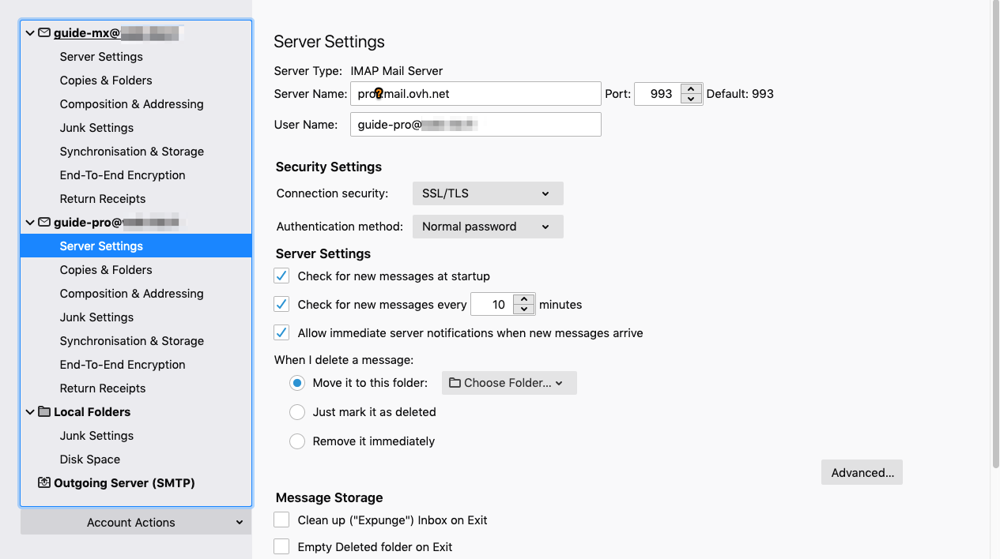

**Last updated 26th August 2021**

## Objective

You can configure Email Pro accounts on email clients, if they are compatible. By doing so, you can use your email address through your preferred email application. Thunderbird is a free email client.

**This guide explains how to configure your Email Pro address on Thunderbird for macOS.**

> [!warning]
> This guide will show you how to use one or more OVHcloud solutions with external tools, and the changes you need to make in specific contexts. You may need to adapt the instructions according to your situation.
>
> If you experience any difficulties carrying out these operations, we recommend that you contact a [specialist service provider](https://partner.ovhcloud.com/en-gb/directory/) and/or discuss the issue with our community. OVHcloud cannot provide you with technical support in this regard. You can find more information in the [Go further](#gofurther) section of this guide.
> 

## Requirements

- an [Email Pro](https://www.ovhcloud.com/en-gb/emails/email-pro/)account
- Thunderbird software installed on your macOS system
- login credentials for the email account to be configured

 
## Instructions

> [!primary]
>
> In this guide, we will use as the server name: "pro**?**.mail.ovh.net". You will need to replace the "?" with the actual number indicating the appropriate server for your Email Pro service.
> 
> You can find this information in the [OVHcloud Control Panel](https://www.ovh.com/auth/?action=gotomanager&from=https://www.ovh.co.uk/&ovhSubsidiary=GB), in the `Web Cloud`{.action} section, if you select `Professional Email`{.action}. The server name is displayed in the **Connection** box in the `General Information`{.action} tab.
>

### Adding the account

- **When you start the application for the first time**: A setup wizard will appear and prompt you to enter your email address.

- **If an account has already been set up**: click `File`{.action} in the menu bar at the top of your screen, then `New`{.action} and finally `Get a new email account...`{.action}.

| | |
|---|---|
|{.thumbnail}|In the window that appears, enter the following information:  \- Your display name \- Email  \- Password|
|Then click `Configure manually...`{.action} to enter the **INCOMING** server settings:  - Protocol **IMAP**  - Server **pro?.mail.ovh.net** (replace “**?**” with your server number) - Port **993**  - SSL **SSL/TLS**  - Authentication **Normal password**  - Username **Full email address**|{.thumbnail}|
|{.thumbnail}|Enter **OUTGOING** server settings:  - Protocol **SMTP**  - Server **pro?.mail.ovh.net** (replace “**?**” with your server number) - Port **587**  - SSL **STARTTLS**  - Authentication **Normal password**  - Username **Full email address**  To complete the configuration, click `Done`{.action}|

For **POP** configuration, the values are:

|Server type|Server name|Security type|Port|
|---|---|---|---|
|Incoming|pro**?**.mail.ovh.net (replace "?" with your server number)|SSL/TLS|995|
|Outgoing|pro**?**.mail.ovh.net (replace "?" with your server number)|STARTTLS|587|

### Using your email address

Once you have configured your email address, you can start using it! You can now send and receive emails.

OVHcloud also has a web application you can use to access your email address from your browser. You can access this application at <https://www.ovh.co.uk/mail/>. You can log in using your email credentials. If you have any questions about how to use this interface, please refer to our guide on [Using the Outlook Web App](../../microsoft-collaborative-solutions/exchange_2016_outlook_web_app_user_guide/).

### Retrieving a backup of your email address

If you need to make a change that could lead to the loss of your email account data, we advise you to make a backup of the email account concerned beforehand. To do this, please read the “**Exporting**” part of the “**Thunderbird**” section in our guide on [Manually migrating an email address](https://docs.ovh.com/gb/en/emails/migrate-email-addresses-manually/#exporting_1).

### Modifying existing settings

> [!primary]
>
> In this guide, we will use as the server name: "pro**?**.mail.ovh.net". You will need to replace the "?" with the actual number indicating the appropriate server for your Email Pro service.
> 
> You can find this information in the [OVHcloud Control Panel](https://www.ovh.com/auth/?action=gotomanager&from=https://www.ovh.co.uk/&ovhSubsidiary=GB), in the `Web Cloud`{.action} section, if you select `Professional Email`{.action}. The server name is displayed in the **Connection** box in the `General Information`{.action} tab.
>

If your email account has already been set up and you need to access the account settings to change them:

- Go to `Tools`{.action} from the menu bar at the top of your screen.
- Click `Account Settings`{.action}.

{.thumbnail}

- To change the settings for **receiving** your emails, click `Server Settings`{.action} in the left-hand column below your email address.

{.thumbnail}

- To change the settings for **sending** emails, click `Outgoing Server (SMTP)`{.action} at the bottom of the left-hand column.
- Select the email address in the list, and then click on `Edit`{.action}.

{.thumbnail}

## Go further 

Join our community of users on <https://community.ovh.com/en/>.