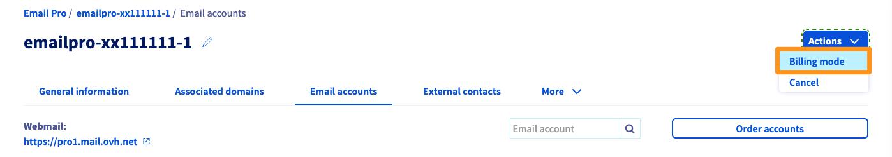

> [!primary]
> Esta traducción ha sido generada de forma automática por nuestro partner SYSTRAN. En algunos casos puede contener términos imprecisos, como en las etiquetas de los botones o los detalles técnicos. En caso de duda, le recomendamos que consulte la versión inglesa o francesa de la guía. Si quiere ayudarnos a mejorar esta traducción, por favor, utilice el botón «Contribuir» de esta página.
>

**Última actualización: 23/02/2022**

## Objetivo

La solución Email Pro dispone de una gestión flexible relativa a la facturación de las cuentas. Esta guía explica cómo configurarla.

**Esta guía explica cómo gestionar las suscripciones de las cuentas Email Pro.**

## Requisitos

- Haber iniciado sesión en el [área de cliente de OVHcloud](https://www.ovh.com/auth/?action=gotomanager&from=https://www.ovh.es/&ovhSubsidiary=es){.external}.
- Disponer de una [cuenta Email Pro](https://www.ovhcloud.com/es-es/emails/email-pro/){.external}.

## Procedimiento

### Contratar cuentas adicionales

Inicie sesión en el [área de cliente de OVHcloud](https://www.ovh.com/auth/?action=gotomanager&from=https://www.ovh.es/&ovhSubsidiary=es) y acceda a la sección `Web Cloud`{.action}. Haga clic en `Email Pro`{.action} y seleccione la plataforma Email Pro correspondiente.

Acceda a la pestaña `Cuentas de correo`{.action} y haga clic en el botón `Contratar cuentas`{.action} en la parte superior derecha.

{.thumbnail}

### Cambiar la frecuencia de sus cuentas 

En la ventana de gestión de su plataforma Email Pro, haga clic en el botón `Acciones`{.action} en la parte superior derecha y seleccione `Modo de facturación`{.action}. 

{.thumbnail}

Se abrirá una ventana en la que podrá gestionar el período de renovación de cada cuenta. Puede elegir entre realizar una selección global haciendo clic en las indicaciones **Mensual**, **Anual** o **Ninguna**. También es posible hacerlo individualmente delante de cada cuenta.

- **Mensual**: La cuenta se le facturará cada mes en la fecha indicada en la columna **Expiración.**
- **Anual**: Se le facturará durante 12 meses a la fecha indicada en la columna **Expiración.**
- **Ninguna**: la cuenta se suspenderá y se eliminará en la fecha indicada en la columna **Expiración.**

> [!primary]
>
> Para una gestión simplificada, la facturación de cada cuenta Email Pro se ajusta automáticamente a principios de mes. Para proceder a la alineación y, en su caso, mover la fecha de suscripción, recibirá una factura de su cuenta Email Pro de la parte proporcional al período restante.
>
>Ejemplo: Si el pedido se realiza el 8 de enero con una suscripción mensual, la siguiente facturación se realizará el 8 de febrero. La siguiente factura cubrirá el período comprendido entre el 8 de febrero y el 1 de marzo.

{.thumbnail}

Haga clic en `Siguiente`{.action} para consultar el resumen de los cambios solicitados y, seguidamente, haga clic en `Aceptar`{.action} para confirmar su elección.

### Eliminar cuentas

Para eliminar una cuenta de su plataforma Email Pro, primero debe darla de baja sustituyendo la configuración de su renovación por **Ninguno**. Para ello, consulte el paso ["Modificar la frecuencia de sus cuentas"](#periodicity){.external}.

Una vez dada de baja la cuenta, se suspenderá en su fecha de expiración. Si quiere eliminar la dirección de correo electrónico alojada por la cuenta antes de su fecha de expiración, reiníciela.

Acceda a la pestaña `Cuentas de correo`{.action} de su plataforma, haga clic en el botón `...`{.action} delante de la cuenta correspondiente y luego en `Restaurar la cuenta`{.action}. Una vez reiniciada, la cuenta permanecerá en blanco hasta su expiración.

{.thumbnail}

### Dar de baja la plataforma

En la ventana de gestión de su plataforma Email Pro, haga clic en el botón `Acciones`{.action} en la parte superior derecha y seleccione `Dar de baja`{.action}. 

{.thumbnail}

> [!primary]
>
> Esta acción conlleva la suspensión y la eliminación de todas las cuentas de la plataforma Email Pro en su fecha de expiración.

## Más información
  
Interactúe con nuestra comunidad de usuarios en <https://community.ovh.com/en/>.
