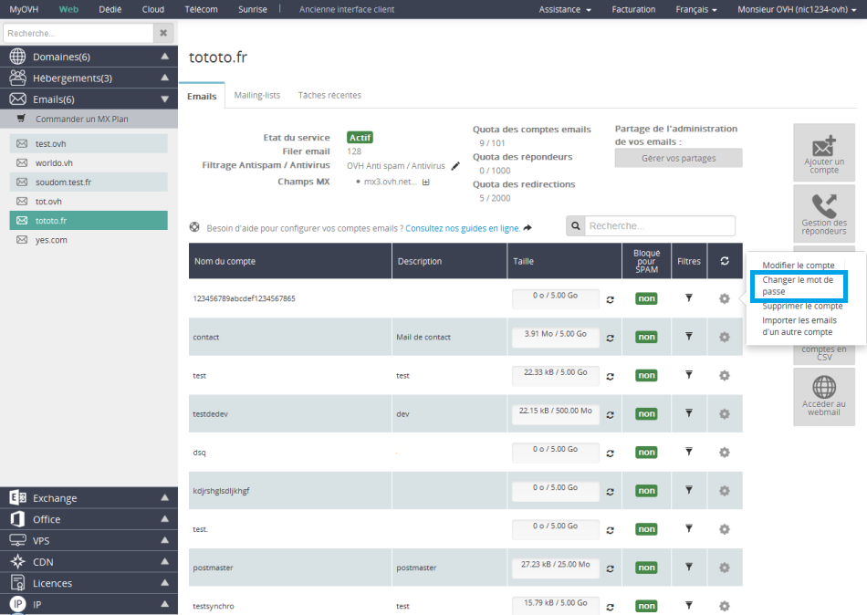

## Miten muokkaan sähköpostiosoitteideni salasanaa?

- Valitse ensi alustasi, mene sitten kohtaan "Sähköposti" ja "Vaihda salasanasi" klikkaamalla sähköpostiosoitteen vieressä olevaa hammasratasta.

{.thumbnail}

- Syötä uusi salasana ja vahvista se.

Vanha salasana ei ole tarpeellinen.

Huom! Salasanan täytyy noudattaa tiettyjä vaatimuksia:

- Vähintään 9 merkkiä.
- Enintään 30 merkkiä.
- Ei yhtään erikoismerkkiä.

Klikkaa "Vahvista" salasanamuutoksen vahvistamiseksi.

Voi kestää muutamia minuutteja ennen kuin muutos astuu voimaan.

## Miten konfiguroin sähköpostiosoitteeni?
Saatavilla on lukuisia ohjeita, joiden avulla voit konfiguroida sähköpostiosoitteen eri sähköpostiohjelmiin.
Niihin voi tutustua tämän linkin kautta:

- [Sähköpostin konfiguraatio-ohjeisiin](https://www.ovh-hosting.fi/g1474.yleista-ovh-webhotellit-sahkopostit).

## Miten postituslistojen (mailing-lists) konfigurointi tapahtuu?
Postituslista on sähköpostiosoite, joka lähettää eteenpäin osoitelistalle saapuneita viestejä. Listan jäsenet voivat olla OVH:lla tai ei.

Postituslistan toiminta on hieman monimutkaisempaa kuin muun tyyppisten sähköpostiosoitteiden toiminta.

Lue lisää postituslistan hallinnoinnista:

- .

## Miten voin tutkia tilini viestejä?
On olemassa kaksi vaihtoehtoa:

- Webmailkäyttöliittymän kautta. Mene sitä varten [Webmailin](https://webmail.ovh.com/) avuksi).

- Käytä sähköpostiohjelmistoa. Voit katsoa tästä ohjeesta kuinka ohjelmisto konfiguroidaan:
- .

## Miten luodaan sähköpostin uudelleenohjaus?
Haluatko uudelleenohjata sähköpostisi toiseen osoitteeseen?

Tässä ohje, jonka avulla voit tehdä uudelleenohjauksen:

- .

## Miten asetan tai poistan automaattisen vastauksen?
Halutako luoda automaattisen vastauksen sähköpostiosoitteesi?

Tässä ohje, jonka avulla se nnistuu:

- [Création répondeur e-mail](http://guides.ovh.com/CreerRepondeur).

## Miten sähköpostisuodattimia konfiguroidaan?
Haluatko luoda suodattimia sähköpostiosoitteisiisi?

Tässä ohje, jonka avulla se onnistuu:

- .

## Miten hallinnoin SPF-rekisteriäni?
Haluat hallinnoida SPF-tallennuksia sähköpostiosoitteilla:

Tässä ohje, jonka avulla se onnistuu:

- .

## Mitä kannattaa tarkistaa sähköpostin ongelmatapauksessa?
Mikäli sähköpostin lähettämisessä tai vastaanottamisessa on ongelmia, kannattaa seuraavat kohdat tarkistaa:

- Onko sähköpostituotteeni aktiivinen? Jotta sähköpostit toimivat, on sinulla oltava aktiivinen sähköpostituote. Mikäli sinulla on webhotelliin liitetty sähköposti, tarkista ettei webhotelli ole vanhentunut. Voit nähdä tiedot helposti hallintapaneelissa. Myös verkkotunnuksesi on oltava voimassa.

- Toimivatko sähköpostit webmailin kautta? Jotta varmistut, ettei kyse ole konfiguraatiovirheestä, testaa viestin lähetys ja vastaanotto OVH:n webmaililla. Jos kaikki toimii moitteettomasti, tarkista ohjelmiston konfiguraatio saamiesi ohjeiden avulla.

- Ongelmia webmailiin kirjautumisessa?Tarkista, että salasanasi on oikein, tarvittaessa sitä voi myös muokata. Katso tämän ohjeen aiemmat kysymykset aiheeseen liittyen.

- Suoritetaanko palvelussani huoltotoimenpidettä?Voit tarkistaa käynnissä olevat huoltotoimenpiteet [tältä sivulta](http://status.ovh-hosting.fi/).

- Osoittaako verkkotunnukseni oikealle palvelimelle? Tarkista, että verkkotunnuksesi käytää OVH:n sähköpostituoteen sähköpostipalvelimia (MX-tyypin rekisteröinti) oikein. Voit lukea lisää [tästä ohjeesta](https://www.ovh-hosting.fi/g2003.MxPlan-tuote-sahkopostiratkaisu).

## OVH:n roskapostin hallinta

## Hyvä tietää
On mahdollista, että saat suoraan sähköpostiisi roskapostia.
Tällöin kannattaa tarkistaa seuraavat kohdat:

- Ovatko verkkotunnuksen sähköpostipalvelimet [konfiguroitu roskapostitorjunnalla](#enregistrement_mx)?

- Onko sähköpostiviestit merkitty roskapostiksi?

Mikäli viestien otsikkokentissä lukee [spam], on roskapostitorjunta merkinnyt ne oikein, sinun on luotava sääntö, jolla tällaiset viestit uudelleenohjataan suoraan esim. roskapostikansioon.

Roskaposti- tai virusmerkinnästä huolimatta viestejä ei poisteta automaattisesti palvelimilta virhemerkintöjen välttämiseksi (roskapostiksi merkitty sähköposti, joka on kuitenkin omien kriteeriesi mukaan luotettava).

## Arvot
Mikäli käytät webhotelliin tai MxPlan-tuotetteeseen kuuluvaa jaettua sähköpostia, sinun on käytettävä OVH:n MX -rekisteröintejä:

- mx1.mail.ovh.net
- mx2.mail.ovh.net
- mx3.mail.ovh.net

## Tietoa:
Vanhat MX-palvelimet toimivat toistaiseksi ennen 23.05.2016 luoduilla sähköpostipalveluilla, mutta kehotamme käyttämään yllämainittuja MX-palvelimia pysyäksesi ajan tasalla.
Näitä rekisteröintejä on siis muokattava DNS-alueellasi.

- Mikäli käytät ulkopuolisen palveluntarjoajan nimipalvelimia, suosittelemme ottamaan tähän yhteyttä kenttien muokkaamiseksi.

Mikäli käytät OVH:n jaettuja nimipalvelimia, voit muokata kenttiä hallintapaneelissasi.
Kirjaudu sitä varten hallintapaneeliin.

## Yleistä
Näitä rajoituksia voidaan ylittää ammatillisten tarpeidenvuoksi [Exchange 2013 -tuotteen](https://www.ovh-hosting.fi/sahkopostit/hosted-exchange/).

Lähetysrajat

200sähköpostiviestiä/tunti/tili ja
300 sähköpostiviestiä/tunti/IP-osoite.

Sähköpostilaatikoiden kiintiö

Jokaisen sähköpostiosoitteen enimmäiskoko on 5 GB.

Liitetiedostojen maksimikoko

Sähköpostiviestien liitetiedostojen suurin sallittu koko on 20 MB selainpostissa ja 100 MB muun sähköpostiohjelman kautta.

Viestikopioiden  enimmäismäärä

Jokainen viesti voidaan lähettää kopiona enintään 100 sähköpostiosoitteeseen. 100:lle vastaanottajalle kopiona lähetetty viesti vastaa kokonaisuudessaan sataa lähetettyä viestiä.

Hyvä tietää

- Kun tilaat MxPlan-tuotteen, et saa uusia tilejä vaan webhotellissa aiemmin olleet sähköpostitilit korvataan.

Esimerkki: jos käytössä on personal 2014 (sisältää 10 POP-tiliä) ja tilaat "MX Plan 100" -tuotteen, lopullisten POP-tilien määrä on 100 eikä 110.

- Kaikkien MxPlan -tuotteiden mukana toimitetaan "postmaster@" -osoite. Tätä osoitetta ei voi muuttaa, eikä sitä ole laskettu tuotteen sähköpostitilien määrään. 

Esimerkki: jos tilaat MX Plan 5 -tuotteen, saat postmaster@-osoitteen lisäksi käyttöösi 5 sähköpostilaatikkoa, jotka voidaan kaikki konfiguroida haluamallesi nimelle.

## MxPlan-tuote?
MxPlan-tuotteesta on satavilla ohje:

## Miten voin kasvattaa sähköpostiosoitteeni kiintiötä?
Kaikissa webhotelleissa tai MxPlan-tuotteissa on mahdollista kasvattaa sähköpostitilin kokoa 25 MB:stä 5 GB:hen.

Voit nostaa sähköpostiilin kiintiötä [hallintapaneelissa](https://www.ovh.com/manager/web/).

- Valitse aluksi alustasi, mene kohtaan "Sähköposti"--"Muokkaa tiliä" klikkaamalla muokattavan sähköpostin vieressä olevaa hammasratasta.

{.thumbnail}

- Valitse haluttu kiintö sähköpostitilille.

- Klikkaa "Vahvista" vahvistaaksesi pyyntö.

{.thumbnail}
Näkyviin tulee ilmoitus, joka kertoo muokkauksen olevan käynnissä:'

Toimenpide voi kestää viidestä kymmeneen minuuttia.
Mikä on kiintiö?
Sähköpostitililläsi on olemassa tietty määrä tilaa. Kiintiöstä puhuttaessa tarkoitetaan siis sähköpostipalvelimella olevaa sähköpostitillesi varattua tilaa.

Mistä kiintiön voi nähdä?
Sen voi nähdä suoraan sähköpostipalvelimesta, esimerkiksi webmailin kautta . Tällä käyttöliitymällä pääset suoraan palvelimelle, josta voit nähdä kiintiön. Kun tarkastelet postiasi, sähköpostiohjelmistosi hakee viestit palvelimelta ja varastoi ne koneellesi. Henkilöt, jotka käyttävät ainoastaan Outlookin kaltaisia ohjelmistoja ylittävät harvoin kiintiönsä, paitsi silloin jos vaihtoehto "säilytä viestin kopio palvelimella" on aktivoituna.

Mitä tarkoitetaan kiintiön ylityksellä?
Kun tilin sallittu koko ylitetään, sähköpostipalvelin ei pysty enää vastaanottamaan postiasi. Uudet saapuvat viestit torjutaan ja lähettäjälle lisätään tieto: "user is over quota".

Miten kiintiötä voi pienentää?
Poista: riittää, että poistat sähköpostipalvelimelle varastoimiasi tiedostoja webmailin avulla. Mikäli teet tämän webmailin käyttöliittymän kautta, muista tyhjentää myös roskakori johon poistetut viestit ovat viimeksi, väärän viestin poistamisen varalta, päätyneet.

