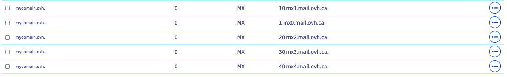

**Dernière mise à jour le 21/07/2022**

## Objectif

Il vous est impossible de recevoir ou envoyer vos e-mails depuis votre logiciel de messagerie ou depuis le webmail ?

**Découvrez comment diagnostiquer une erreur d'envoi ou de réception sur votre offre e-mail OVHcloud.**

> [!primary]
>
> Si vous avez d'autres questions qui ne sont pas traitées par ce guide, n'hésitez pas à consulter notre [FAQ E-mail](https://docs.ovh.com/ca/fr/emails/faq-emails/).
>

## Prérequis

- Posséder une offre **E-mail** associée à [solution d'hébergement OVHcloud](https://www.ovhcloud.com/fr-ca/web-hosting/) ou une offre [Exchange](https://www.ovhcloud.com/fr-ca/emails/hosted-exchange/).
- Être connecté à l'[espace client OVHcloud](https://ca.ovh.com/auth/?action=gotomanager&from=https://www.ovh.com/ca/fr/&ovhSubsidiary=qc).

## En pratique

### Mon offre e-mail et/ou mes comptes sont-ils actifs ?

Pour que vos e-mails soient fonctionnels, vous devez posséder une offre e-mail active. Si votre offre e-mail est associée à une offre d'hébergement, vérifiez que celle-ci n'est pas expirée. Vous pouvez vérifier cette information directement dans l'espace client. De la même façon, votre nom de domaine doit lui aussi être actif.

Commencez par vérifier que vous êtes à jour dans les [paiements](https://docs.ovh.com/ca/fr/billing/gerer-factures-ovh/#pay-bills) et [renouvellements](https://docs.ovh.com/ca/fr/billing/renouvellement-automatique-ovh/#renewal-management) de vos services.

Voici comment vérifier que vos services sont bien opérationnels :

- Pour votre **nom de domaine**, dirigez-vous dans la section `Web Cloud`{.action}, cliquez sur `Noms de domaine`{.action}, puis sélectionnez votre nom de domaine. Si votre nom de domaine est expiré, cela vous sera indiqué en haut de la page.
- Pour votre **Hébergement Web**, dirigez-vous dans la section `Web Cloud`{.action}, cliquez sur `Hébergements`{.action}, puis sélectionnez votre hébergement. La date d'expiration ou de renouvellement automatique de votre hébergement sera indiquée en haut de la page.
- Pour une offre **E-mail**, dirigez-vous dans la section `Web Cloud`{.action}, cliquez sur `E-mails`{.action}, puis sélectionnez le nom de domaine concerné. Cliquez sur l'onglet `Comptes e-mail`{.action}. Vérifiez l'état du compte e-mail concerné dans la colonne `Statut`.
- Pour une offre **Exchange**, dirigez-vous dans la section `Web Cloud`{.action}, cliquez sur `Microsoft`{.action}, puis cliquez sur `Exchange`{.action} et sélectionnez votre plateforme. Cliquez sur l'onglet `Comptes e-mail`{.action}. Vérifiez l'état du compte e-mail concerné dans la colonne `Statut`.

### Je ne parviens pas à envoyer d'e-mails depuis mon logiciel de messagerie

Si vous utilisez un logiciel de messagerie sur votre ordinateur (Outlook, Mail de Mac, Thunderbird, etc.) ou votre smartphone (iOS, Android, etc.), et que vous rencontrez un dysfonctionnement à l'envoi ou à la réception, vérifiez les paramètres de configuration selon votre offre e-mail et le logiciel de messagerie ou application utilisé.

- Pour une offre **E-mail**, dans la section [E-mails](https://docs.ovh.com/ca/fr/emails/) de nos guides **Web Cloud**, vérifiez la configuration de votre logiciel de messagerie dans le paragraphe `Configuration sur ordinateur` ou de votre smartphone dans `Configuration sur smartphone`.

- Pour une offre **Exchange**, dans la section [Solutions collaboratives Microsoft](https://docs.ovh.com/ca/fr/microsoft-collaborative-solutions/) de nos guides **Web Cloud**, vérifiez la configuration de votre logiciel de messagerie dans le paragraphe `Configuration Exchange sur ordinateur` ou de votre smartphone dans `Configuration Exchange sur smartphone`

### Les e-mails sont-ils fonctionnels depuis le webmail ?

Pour vous assurer que le dysfonctionnement n'est pas lié à une erreur de configuration, réalisez un test d'envoi et de réception directement via le webmail d'OVHcloud. Si tout fonctionne correctement, vérifiez la configuration de votre logiciel via les guides mis à votre disposition.

Depuis le navigateur de votre ordinateur ou depuis un smartphone, allez sur l'adresse <https://www.ovh.com/ca/fr/mail/>.

{.thumbnail}

### Je ne parviens pas à me connecter au webmail

Assurez-vous d'avoir le bon mot de passe. Si nécessaire, vous pouvez le modifier.

Voici comment modifier le mot de passe d'une adresse e-mail :

- Pour une offre **E-mail**, consultez notre guide [Modifier le mot de passe d’une adresse e-mail MX Plan](https://docs.ovh.com/ca/fr/emails/modifier-mot-de-passe-adresse-email/)

- Pour une offre **Exchange**, dirigez-vous dans la section `Web Cloud`{.action}, cliquez sur `Microsoft`{.action}, puis cliquez sur `Exchange`{.action} et sélectionnez votre plateforme. Depuis l'onglet `Comptes e-mail`{.action}, cliquez sur le bouton `...`{.action} puis sur `Modifier`{.action} pour modifier le mot de passe.

### Y a-t-il un incident ou une maintenance en cours sur mon service ?

Vous pouvez vérifier les différentes tâches travaux actuellement en cours sur <https://web-cloud.status-ovhcloud.com/>.

- Pour une offre **e-mail**, vérifiez dans la section `E-mails`
- Pour **Exchange**, dirigez-vous dans la section `Microsoft`

### Le pointage du nom de domaine vers mon service e-mail est-il correct ?

Vérifiez que votre nom de domaine pointe correctement vers les serveurs e-mail OVHcloud. Pour cela, des enregistrements de type MX doivent être configurés dans votre zone DNS.  Référez-vous à notre guide [Ajouter un champ MX à la configuration de son nom de domaine](https://docs.ovh.com/ca/fr/domains/mail-mutualise-guide-de-configuration-mx-avec-zone-dns-ovh/).

{.thumbnail}

### Après l'envoi d'un e-mail, je reçois un message indiquant que mon e-mail n'a pas pu être envoyé, comprenant un code à 3 chiffres

Il s'agit d'un retour d'erreur SMTP. Cela indique que l'échange entre le serveur d'envoi et le serveur e-mail de réception n'a pas pu se faire correctement. Le code sert à déterminer le type d'erreur que le serveur a rencontré. Il est généralement accompagné d'un message détaillant cette erreur.

Une réponse SMTP est constituée d'un nombre à trois chiffres. Les trois chiffres de la réponse ont chacun une signification particulière :

- le premier chiffre indique si la réponse est bonne, mauvaise ou incomplète. Un client SMTP sera capable de déterminer sa prochaine action par l'examen de ce premier chiffre;
- Le second et le troisième chiffre fournissent des informations complémentaires.

Il y a quatre valeurs possibles pour le premier chiffre du code de réponse :

|Code|Description|  
|---|---|  
|2 xx|Réponse positive : l'action demandée a été effectuée avec succès. Une nouvelle demande peut être initiée.|
|3 xx|Réponse positive temporaire : la commande a été acceptée, mais l'action demandée est en attente de réception de plus amples informations. Le client SMTP devrait envoyer une autre commande spécifiant cette information.|
|4 xx|Réponse négative d'achèvement transitoire : la commande n'a pas été acceptée et l'action demandée n'a pas pu se produire. Toutefois, la condition de l'erreur est temporaire et l'action peut être demandée à nouveau.|
|5 xx|Réponse négative : la commande n'a pas été acceptée et l'action demandée n'a pas pu se produire. Le client SMTP ne devrait pas répéter la même demande.|

Vous trouverez ci-dessous la majorité des codes de réponses négatives SMTP utilisés par les serveurs :

|Codes réponse|Détails|Actions|
|---|---|---|
|420|Délai dépassé, problème de connexion|Ce message d'erreur est retourné uniquement par les serveurs mail GroupWise. Contactez l'administrateur du serveur de messagerie de destination|
|421|Service non disponible, canal de transmission en cours de fermeture|Provenance de l'erreur indéterminée, assurez-vous que l'envoi vers un autre domaine fonctionne. Si oui, veuillez réessayer l'envoi initial plus tard|
|432|Réception du mail sur le serveur Exchange stoppé|Ce message d'erreur est retourne uniquement par les serveurs mail Microsoft Exchange. Contactez l'administrateur du serveur de messagerie de destination|
|449|Une erreur de routage|Ce message d'erreur est retourné uniquement par les serveurs mail Microsoft Exchange. Microsoft recommande d'effectuer un diagnostic avec leur outil WinRoute|
|450|Action de messagerie demandée non effectuée : boîte mail indisponible (par exemple, boîte mail occupée ou temporairement bloquée pour des raisons de sécurité ou de blacklistage)|Vérifiez si votre adresse IP du serveur de messagerie n'est pas blacklistée ([SpamHaus](https://check.spamhaus.org/){.external}), et vérifiez également si votre mail ne comporte pas des mots se référant à du SPAM.|
|451|Action requise abandonnée : Erreur de traitement local|Cela peut être dû à une surcharge momentanée, ou à une vérification du SPF du domaine émetteur incorrecte. Référez-vous au message complémentaire fourni par le serveur, ou contactez l'administrateur de celui-ci si cela persiste|
|452|Action demandée non effectuée : système de stockage insuffisant|Votre serveur de messagerie est « surchargé ». Cela pourrait également être causé par un trop grand nombre de messages qui tentent d'être envoyés à la fois. Veuillez vérifier votre boîte d'envoi puis réessayez|
|455|Serveur incapable de recevoir les paramètres|Patientez quelque temps puis effectuez une nouvelle tentative. En cas d'échec, contactez l'administrateur du serveur de messagerie du destinataire|
|500|Erreur de syntaxe, commande non reconnue (Cela peut inclure des erreurs comme une ligne de commande trop longue)|Cela est souvent causé par l'antivirus ou le firewall de l'expéditeur. Vérifiez cela puis essayez à nouveau|
|501|Erreur de syntaxe dans les paramètres ou les arguments|Cela est souvent causé par une adresse e-mail de destinataire erronée ou un problème d'antivirus ou firewall côté expéditeur. Veuillez vérifier l'adresse de destination ainsi que votre antivirus ou firewall|
|502|Commande non implémentée|Les paramètres ou les options utilisées lors de l'envoi de l'e-mail avec votre serveur SMTP sont reconnus mais désactivés dans sa configuration. Veuillez contacter votre fournisseur de service|
|503|Le serveur a rencontré une mauvaise séquence de commandes|Cela est généralement dû un problème d'authentification, assurez-vous d'être bien authentifié sur le serveur SMTP au niveau de la configuration de votre logiciel de messagerie|
|504|Paramètre de commande non implémentée|Les paramètres ou les options utilisées lors de l'envoi de l'e-mail avec votre serveur SMTP sont reconnus mais désactivés dans sa configuration. Veuillez contacter votre fournisseur de service|
|535|Echec lors de l'authentification|Les informations utilisateur/mot de passe sont erronées ou l'envoi est potentiellement bloqué sur votre adresse e-mail. Vérifiez l'état de votre adresse e-mail depuis votre espace client OVHcloud. Un changement de mot de passe peut débloquer l'envoi si le compte à été bloqué pour spam. Consultez notre guide [Que faire en cas de compte bloqué pour spam ?](https://docs.ovh.com/ca/fr/microsoft-collaborative-solutions/bloque-pour-spam/) pour plus d'informations.|
|550|Action demandée non effectuée : boîte aux lettres indisponible|Le serveur de messagerie de destination n'a pas pu vérifier l'adresse e-mail utilisée. Ceci est le plus souvent causé par une adresse e-mail de destination invalide, mais peut également signifier que le serveur de messagerie de destination a des problèmes de pare-feu ou de connectivité. Vérifier l'adresse e-mail du destinataire, et/ou réessayez à nouveau|
|551|Utilisateur non local|Ceci est en général utilisé comme une stratégie de prévention contre le spam. Il est indiqué que le relais de courrier n'est pas autorisé pour une raison quelconque à relayer votre message vers un autre serveur que le vôtre. Veuillez contacter votre fournisseur de service|
|552|Action de messagerie demandée interrompue : espace de stockage dépassé|L'utilisateur que vous avez essayé de contacter n'a plus d'espace disponible pour recevoir des messages. Malheureusement, la seule solution est de contacter le destinataire via une autre méthode|
|553|Action demandée non effectuée : adresse e-mail non autorisée|Cela est en général causé par une adresse e-mail de destination incorrecte. Veuillez vérifier que l'adresse e-mail en question est bien correcte|
|554|Transaction échouée, "Aucun service SMTP ici")|Il s'agit en général d'un problème de blacklist. Vérifiez si votre adresse IP du serveur de messagerie n'est pas blacklistée ([SpamHaus](https://check.spamhaus.org/){.external})|
|555|MAIL FROM / RCPT TO, paramètres non reconnus ou non mis en oeuvre|Le serveur SMTP sortant n'enregistre pas correctement l'adresse e-mail utilisée soit dans vos paramètres "De" ou "A". Veuillez vérifier que les adresses e-mail indiquées sont correctes, et vérifiez également que vous n'avez pas dépassé la limite définie par OVHcloud : 200 mails /heure /compte et 300 mails /heure /ip|

## Aller plus loin

[FAQ E-mail](https://docs.ovh.com/ca/fr/emails/faq-emails/)

Échangez avec notre communauté d'utilisateurs sur <https://community.ovh.com>.
