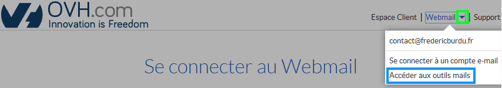
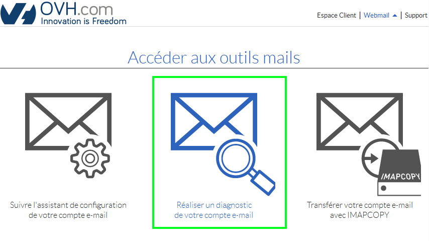
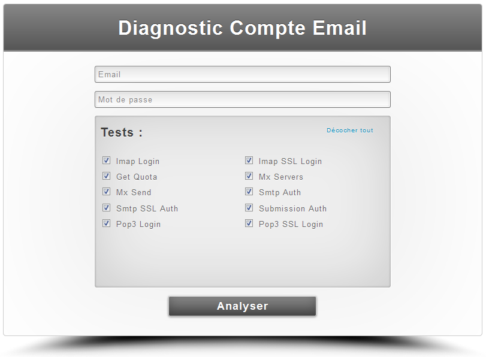
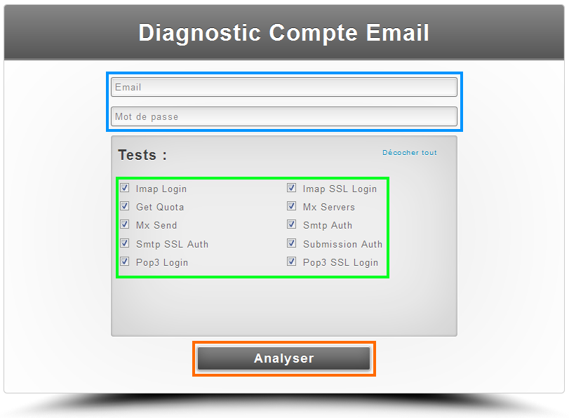
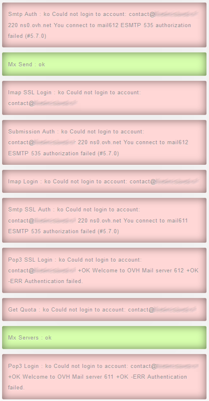

## Généralités

### Prérequis
- Un hébergement mail OVH
- Un nom de domaine associé
- Une adresse e-mail
- Un mot de passe valide pour cette adresse

### Quand effectuer un diagnostic
Cet outil est utile quand vous rencontrez un problème de réception ou d'émission de mail depuis le webmail ou un logiciel de messagerie. Une série de tests sera effectuée afin de diagnostiquer votre adresse e-mail en vous indiquant si le résultat est correct ou en erreur.

## Outil de diagnostic

### Acces a l'outil
- Afin d'accéder à l'outil de diagnostic, rendez-vous sur [OVH](http://www.ovh.com){.external} et cliquez sur "Webmail" :

{.thumbnail}

- Cliquez sur le triangle à droite de "Webmail" puis sur "Accéder aux outils mails" :

{.thumbnail}

- Cliquez sur "Réaliser un diagnostic de votre compte e-mail" :

{.thumbnail}

- Vous arrivez ensuite sur la page de diagnostic :

{.thumbnail}

> [!success]
>
> - 
> Diagnostic
> 
> 

### Fonctionnement
Voici le descriptif des tests effectués :

|---|---|
|Imap Login|Ce test vérifie si le mot de passe et l'adresse email communiqués sont bien fonctionnels en imap|
|Imap SSL Login|Ce test vérifie si le mot de passe et l'adresse email communiqués sont bien fonctionnels en imap sécurisé (SSL)|
|Get Quota|Ce test vous informe de la taille de votre boîte email en temps réel (si celle-ci est géré sur nos serveurs mx)|
|Mx Servers|Ce test vérifie les serveurs MX qui sont renseignés dans votre zone dns pour s'assurer qu'ils sont bien fonctionnels avec l'adresse email communiquée|
|Mx Send|Ce test simule l'envoi d'un email sur l'adresse email renseigné. Le test utilise les serveurs Mx de votre zone dns|
|Smtp Auth|Ce test vérifie si le mot de passe et l'adresse email communiqués sont bien fonctionnels en smtp|
|Smtp SSL Auth|Ce test vérifie si le mot de passe et l'adresse email communiqués sont bien fonctionnels en smtp sécurisé (SSL)|
|Submission Auth|Ce test vérifie si le mot de passe renseigné est bien actif pour l'adresse email donnée|
|Pop3 Login|Ce test vérifie si le mot de passe et l'adresse email communiqués sont bien fonctionnels en pop3|
|Pop3 SSL Login|Ce test vérifie si le mot de passe et l'adresse email communiqués sont bien fonctionnels en pop3 sécurisé (SSL)|

### Utilisation
- Indiquez votre adresse e-mail et le mot de passe associé.
- Laissez cocher toutes les cases .
- Cliquez sur "Analyser" .

{.thumbnail}

### Analyse des resultats
Si tous les résultats sont verts, c'est que votre adresse e-mail fonctionne parfaitement.

- Cas 1 : Tous les résultats son verts mais votre adresse ne fonctionne pas sur le webmail Roundcube :

Nous vous invitons dans ce cas à consulter son [guide d'utilisation]({legacy}1302){.ref}.

- Cas 2 : Tous les résultats sont verts mais votre adresse configurée sur votre logiciel de messagerie ne fonctionne pas :

Nous vous invitons dans ce cas à consulter son [guide d'utilisation]({legacy}1474){.ref}.

{.thumbnail}

Si vous obtenez des résultats en "Rouge", nous vous invitons dans un premier à temps à vérifier votre mot de passe sur l'interface du [Webmail Roundcube](https://mail.ovh.net/){.external}.

- Si la connexion n'est pas possible, Il vous faudra commencer par modifier votre [mot de
passe](https://www.ovh.com/fr/g1343.creation-adresse-e-mail#aide_comment_modifier_le_mot_de_passe_de_mes_adresses_e-mail){.external} . Une fois la connexion à Roundcube fonctionnelle, il vous sera possible d'effectuer un nouveau diagnostic afin que les résultats soient tous au vert .

{.thumbnail}