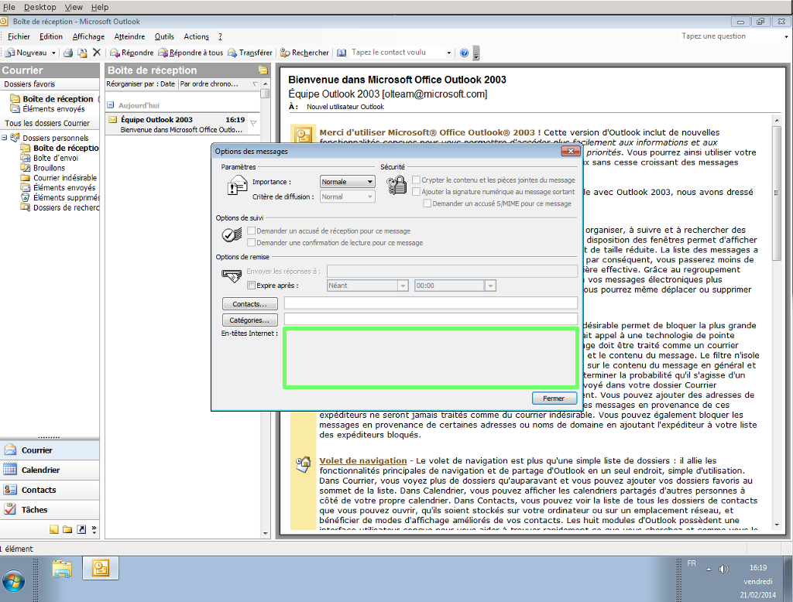
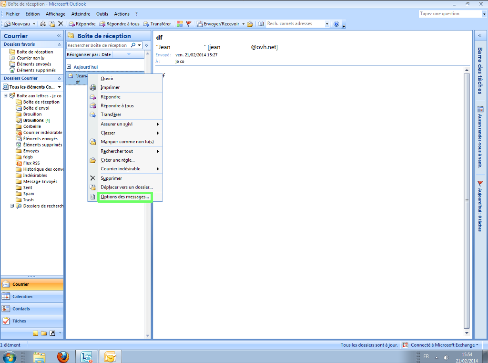
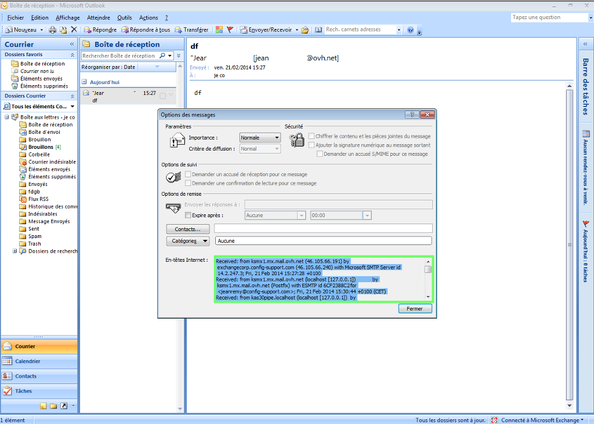
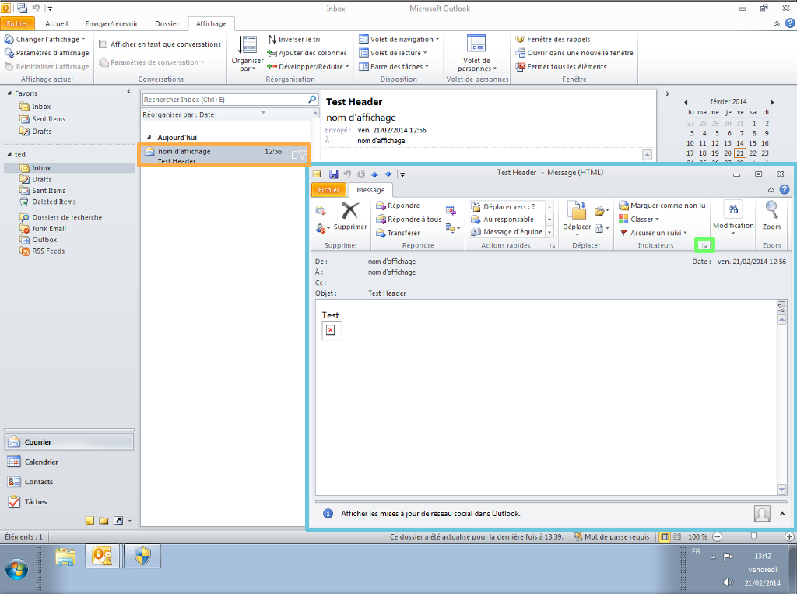
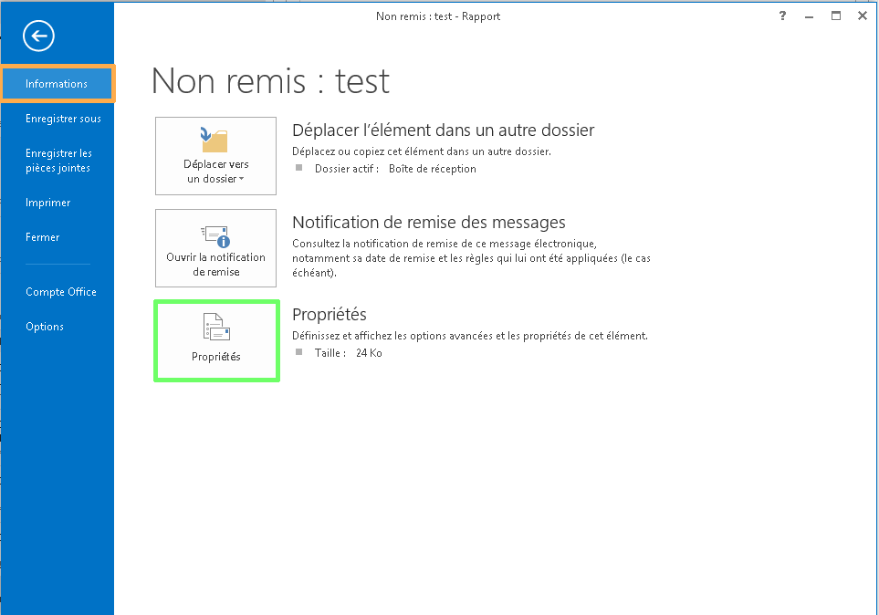
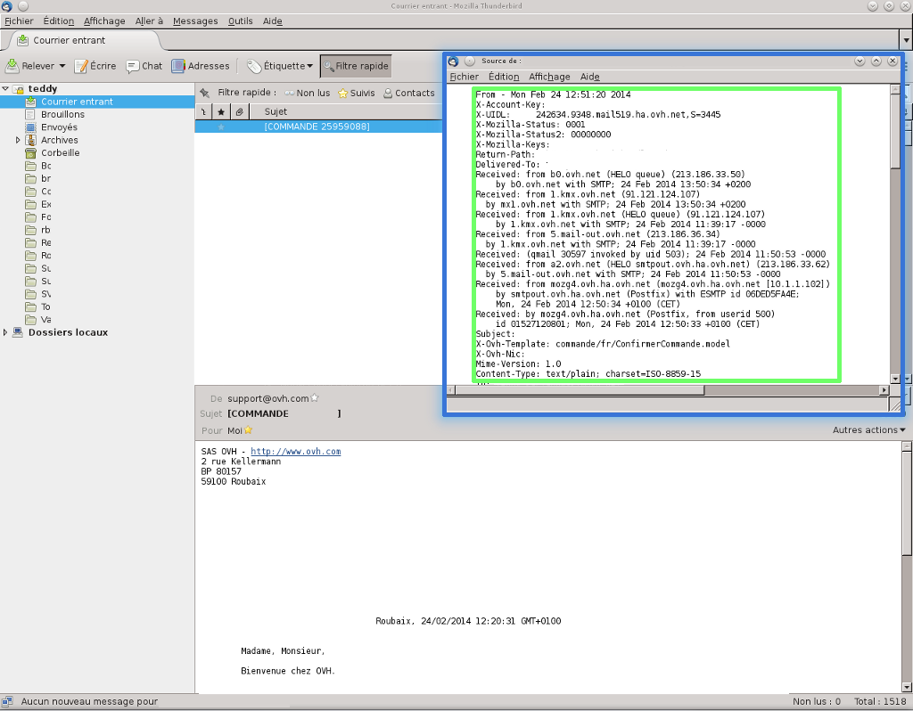
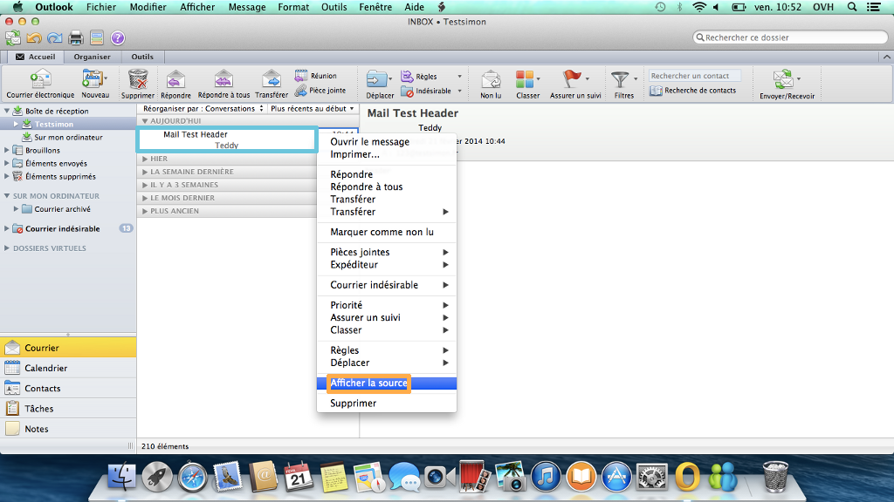
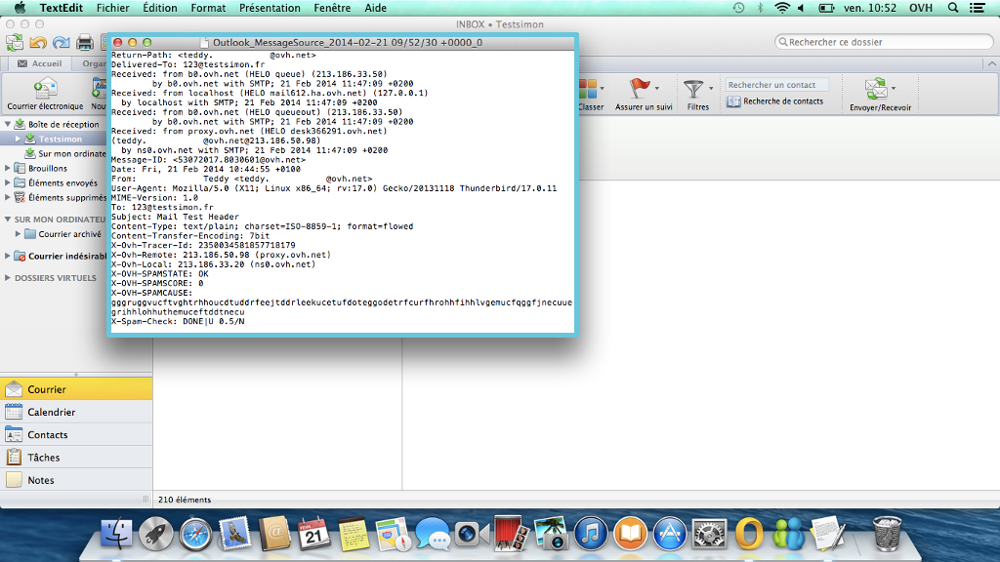
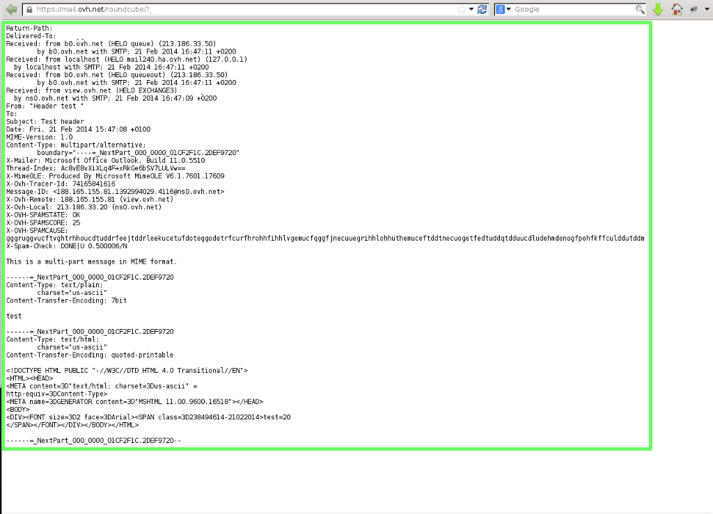
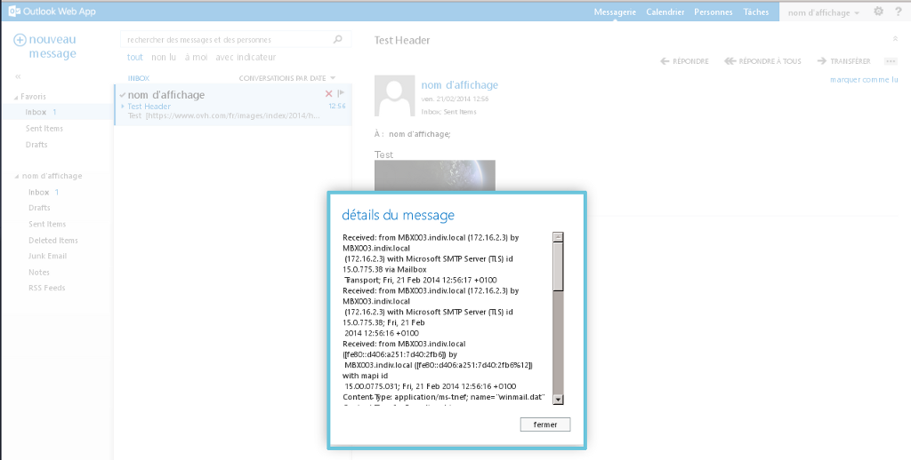

## Microsoft Outlook Express
Select the e-mail which you want to retrieve the header.

Go to "File" -> "Proprietors" then "Details".

Click "Message Source". You can retrieve the header in the e-mail.

## Microsoft Outlook 2003
Open the e-mail which you want to retrieve the header.

n the new window, go to "Display" -> "Options ...".

{.thumbnail}
The full header of the email appears (see green box in the screenshot below).

{.thumbnail}

## Microsoft Outlook 2007
Right-click on the e-mail which you want to retrieve the header.

Go to "Message Options ...".

{.thumbnail}
The full header of the email appears (see green box in the screenshot below).

{.thumbnail}

## Microsoft Outlook 2010
Open the e-mail which you want to retrieve the header.

In this new window, go to the "Message" and then click the small arrow to the right of indicators (see green box in the screenshot below).

{.thumbnail}
The full header of the email appears (see green box in the screenshot below).

{.thumbnail}

## Microsoft Outlook 2013
Open the e-mail which you want to retrieve the header.

In the new window, go to "File".

{.thumbnail}
Then select "Information" and "Properties".

{.thumbnail}
The full header of the email appears (see green box in the screenshot below).

{.thumbnail}

## Mozilla Thunderbird
Select the message which you want to retrieve the header.

Press "Ctrl+U".

{.thumbnail}
The full header of the email appears (see green box in the screenshot below).

{.thumbnail}

## Mac Mail
Select the e-mail which you want to retrieve the header.

Go to "Presentation" -> "Message" -> "All headers".

{.thumbnail}
The full header of the email appears, then you can view it.

{.thumbnail}

## Microsoft Outlook 2011 for Mac
Right click on the e-mail you want to retrieve the header.

Then select  "View Source"

{.thumbnail}
The full header of the email appears, then you can view it.

{.thumbnail}

## Microsoft Entourage 2008 for Mac
Select the e-mail which you want to retrieve the header.

Right click on the e-mail

Then select "Source".

A new window opens with the full headers of the email.

## Roundcube
Select the e-mail which you want to retrieve the header.

Visit "... (More)" -> "View source".

{.thumbnail}
A new tab will open in your browser with the full header of the email.

{.thumbnail}

## OWA 2013
Select the e-mail which you want to retrieve the header.

Go to "..." -> "display the message details".

{.thumbnail}
The full header of the email appears, then you can view it.

{.thumbnail}

## Gmail
Open the e-mail which you want to retrieve the header.

Click the arrow next to the reply button.

Select "Show original" to open a new window header of the email.

