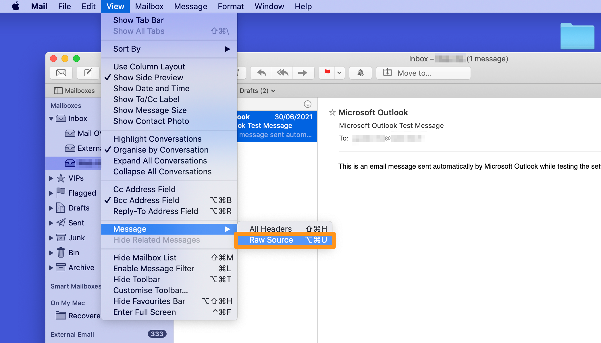

**Last updated 19th November 2021**

## Objective

The role of an email header is to trace the path taken by an email on the network, from the sender to the recipient. 
You can use it to identify malicious emails or detect slow reception.

Every email you receive has a header but it is not displayed by default when you view your email. You can however retrieve the header from your email client or webmail.

You can also export the entire email as a `.eml` file. This file may be requested to scan a malicious email you received. 
To retrieve a `.eml` file, go to the [Webmail](#webmail) section below.

**This guide explains how to retrieve an email header from your email client.**

## Requirements

- An email address using one of our [OVHcloud email solutions](https://www.ovhcloud.com/en/emails/), or an external solution
- Access to your email address via webmail or an email client

## Instructions

### Understanding the content of a header

The header is composed of several elements indicating the path of the email. These are arranged in reverse chronological order, from the newest to the oldest entry, followed by additional information. 
Below is a non-exhaustive list of the elements that can make up a header, along with their meaning. 

- The `Received` field is present in the header each time the email is sent to an outgoing server (SMTP). The host name of the server is usually found with its IP address and a timestamp. The `Received` fields are sorted from the most recent pass to the oldest pass on a server:
<pre class="console"><code>
Received: from mxplan7.mail.ovh.net (unknown [10.109.143.250])
	by mo3005.mail-out.ovh.net (Postfix) with ESMTPS id 448F4140309
	for &lt;john@mydomain.ovh&gt; ;Wed, 30 Jun 2021 13:12:40 +0000 (UTC)
</code></pre>
  *Here the email was sent from server mxplan7.mail.ovh.net to server mo3005.mail-out.ovh.net on 30 June 2021 at 13:12:40 (time zone UTC).*

- The `Return-Path` field corresponds to the return address when the message failed to be sent. The return address is usually the one that sent the email.
<pre class="console"><code>
Return-Path: &lt;john@mydomain.ovh&gt;
</code></pre>

- The `From` field indicates the email sender address and display name.
<pre class="console"><code>
From: John &lt;john@mydomain.ovh&gt;
</code></pre>

- The `To` field indicates the email recipient address and display name.
<pre class="console"><code>
To: Robert &lt;robert@hisdomain.ovh&gt;
</code></pre>

- The `Subject` field is the subject of the email.
<pre class="console"><code>
Subject: Hello my friend
</code></pre>

- The `Message-ID` field designates the unique identifier of the email and ends with the name of the outgoing server (after the "@"). 
<pre class="console"><code>
Message-ID: &lt;Dc55+mK3j7hdZkf5_r-ff=fjq380ozc2h5@mailserver.domain.ovh&gt;
</code></pre>

- The `Received-SPF` field displays the result of the [SPF](https://docs.ovh.com/us/en/domains/web_hosting_the_spf_record/) check performed on the sender's domain name. You can use the `client-ip` argument to find the IP address of the server that sent the email. 
<pre class="console"><code>
Received-SPF: Pass (mailfrom) identity=mailfrom; client-ip=000.11.222.33; helo=mail-smtp-001.domain.ovh; envelope-from=john@mydomain.ovh; receiver=robert@hisdomain.ovh
</code></pre>

- The `X-` fields are custom fields. They serve as complements to the standard fields. They are implemented by the servers that the emails pass through.
<pre class="console"><code>
X-OVH-Remote: 000.11.222.33 (mail-smtp-001.domain.ovh)
X-Ovh-Tracer-Id: 1234567891011121314
X-VR-SPAMSTATE: OK
X-VR-SPAMSCORE: 0
X-VR-SPAMCAUSE: 
</code></pre>

### Recovering a header from an email client

#### Microsoft Outlook 

To read the header, open the email of your choice in a separate window by double-clicking it in the list.

In the new window, click `File`{.action} in the top left-hand corner.

{.thumbnail}

Then select `Info`{.action} on the left, and click `Properties`{.action}.

{.thumbnail}

The full email header appears in the lower box. You can select the entire text and copy it to a file.

{.thumbnail}

#### Mozilla Thunderbird

To display the header, select the email you want, then press `Ctrl` and `U` at the same time.

{.thumbnail}

The full email header appears in a separate window, you can select the entire text and copy it to a file.

#### macOS email

To display the header, select the email you want and open `View`{.action} in the top menu bar. Then go to `Message`{.action} and click `All Headers`{.action}.

{.thumbnail}

The full email header appears in a separate window. You can select the entire text and copy it to a file.

### Retrieving a header on webmail 

#### Outlook Web Application (OWA) 

##### **Retrieving the header**

To display the header, select the email you want and click on the **arrow** to the right of `Reply All`{.action}. Click on `View Message Details`{.action}. A new window will open with the full email header, allowing you to download it.

{.thumbnail}

Also see our video tutorial:
<iframe width="560" height="315" src="https://www.youtube-nocookie.com/embed/UeNdpFwdXm0?start=36" title="YouTube video player" frameborder="0" allow="accelerometer; autoplay; clipboard-write; encrypted-media; gyroscope; picture-in-picture" allowfullscreen></iframe>

##### **Retrieving the .eml file**

To download the `.eml` file, click on `(+) New`{.action} to create a new email. 

Select the email you want to extract, then drag and drop it into the content of the new email. 

Click the down arrow next to the attachment you just created, and then click `Download`{.action} to save the file to your device.

{.thumbnail}

### Retrieving a header on external email clients

#### Gmail

To retrieve the header, select the email concerned, then click the 3 vertical dots on the right. Click on `Show original`{.action} to open a new window with the full email header, which also allows you to download it in `.eml` format.

{.thumbnail}

#### Outlook.com

To view the header in the <Outlook.com> webmail interface, see the [Outlook Web Application](#owa) topic in this guide.

## Go further

[Email FAQ](https://docs.ovh.com/us/en/emails/emails-faq/)

Join our community of users on <https://community.ovh.com/en/>.
