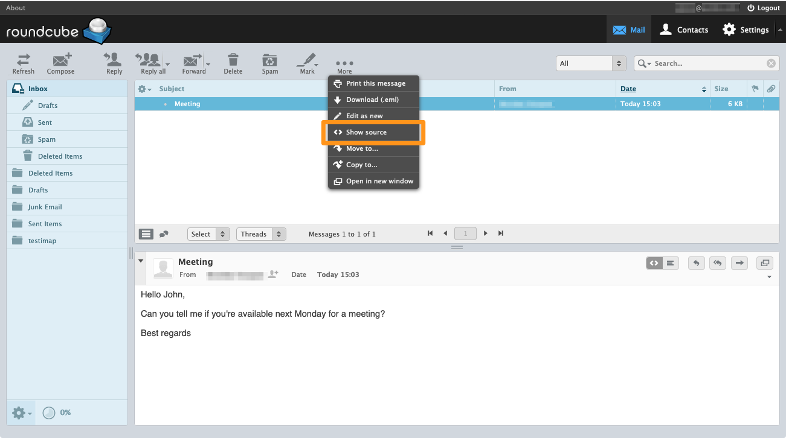

> [!primary]
> Tłumaczenie zostało wygenerowane automatycznie przez system naszego partnera SYSTRAN. W niektórych przypadkach mogą wystąpić nieprecyzyjne sformułowania, na przykład w tłumaczeniu nazw przycisków lub szczegółów technicznych. W przypadku jakichkolwiek wątpliwości zalecamy zapoznanie się z angielską/francuską wersją przewodnika. Jeśli chcesz przyczynić się do ulepszenia tłumaczenia, kliknij przycisk „Zaproponuj zmianę” na tej stronie.
>

**Ostatnia aktualizacja z dnia 19-11-2021**

## Wprowadzenie

Nagłówek e-mail ma na celu wyśledzenie ścieżki zapożyczonej przez ten e-mail w sieci, od nadawcy do odbiorcy. 
Umożliwia zwłaszcza identyfikację złośliwego e-maila lub wykrycie powolnego odbioru.

Każdy otrzymany e-mail ma nagłówek (*nagłówek*), który nie pojawia się domyślnie podczas wyświetlania wiadomości. Możesz pobrać plik z poziomu programu pocztowego lub poczty webmail.

Możesz również wyodrębnić e-mail w całości w formie pliku `.eml`. Możesz zostać poproszony o przeanalizowanie otrzymanego złośliwego maila. 
Aby pobrać plik `.eml`, sprawdź sekcję [Webmail](#webmail).

**Dowiedz się, jak pobrać nagłówek e-mail do klienta poczty elektronicznej.**

## Wymagania początkowe

- Posiadanie konta e-mail w jednym z naszych [rozwiązań e-mail OVHcloud](https://www.ovhcloud.com/pl/emails/) lub rozwiązania zewnętrznego.
- Dostęp do konta e-mail poprzez interfejs webmail lub program pocztowy.

## W praktyce

### Zrozumieć treść nagłówka

Nagłówek składa się z kilku elementów wskazujących drogę wiadomości e-mail. Składa się on z elementów hierarchicznych, od najnowszych do najstarszych, oraz z dodatkowych informacji. 
Poniżej znajduje się niewyczerpujący wykaz elementów, które mogą składać się z nagłówka oraz ich znaczenie. 

- Pole `Received` jest widoczne w nagłówku przy każdym przejściu z wiadomości e-mail na serwer poczty wychodzącej (SMTP). Nazwa hosta serwera jest zwykle widoczna wraz z adresem IP i datą. Pola `Received` są klasyfikowane od najświeższego przejścia do najstarszego przejścia na serwer:
<pre class="console"><code>
Received: from mxplan7.mail.ovh.net (unknown [10.109.143.250])
	by mo3005.mail-out.ovh.net (Postfix) with ESMTPS id 448F4140309
	for &lt;john@mydomain.ovh&gt; ;Wed, 30 Jun 2021 13:12:40 +0000 (UTC)
</code></pre>
  *Wiadomość e-mail została wysłana z serwera mxplan7.mail.ovh.net do serwera mo3005.mail-out.ovh.net w dniu 30 czerwca 2021 r. o godz. 13:12:40 (Strefa czasowa UTC)*

- Pole `Return-Path` odpowiada adresowi zwrotu, jeśli wysłanie wiadomości nie powiodło się. adres zwrotny jest zazwyczaj adresem, który wysłał przesyłkę.
<pre class="console"><code>
Return-Path: &lt;john@mydomain.ovh&gt;
</code></pre>

- Pole `From` oznacza adres nadawcy wiadomości e-mail oraz jego nazwę użytkownika.
<pre class="console"><code>
From: John &lt;john@mydomain.ovh&gt;
</code></pre>

- Pole `To` to adres odbiorcy wiadomości e-mail oraz nazwa użytkownika.
<pre class="console"><code>
To: Robert &lt;robert@hisdomain.ovh&gt;
</code></pre>

- Pole `Subject` to temat wiadomości e-mail.
<pre class="console"><code>
Subject: Hello my friend
</code></pre>

- Pole `Message-ID` to unikalny identyfikator e-maila i kończy się nazwą serwera wysyłki (po "@"). 
<pre class="console"><code>
Message-ID: &lt;Dc55+mK3j7hdZkf5_r-ff=fjq380ozc2h5@mailserver.domain.ovh&gt;
</code></pre>

- Pole `Received-SPF` wyświetla wynik kontroli [SPF](/pages/web/domains/dns_zone_spf) przeprowadzonej na domenie nadawcy. Argument `client-ip` pozwala na wskazanie adresu IP serwera, który użył do wysyłki wiadomości e-mail. 
<pre class="console"><code>
Received-SPF: Pass (mailfrom) identity=mailfrom; client-ip=000.11.222.33; helo=mail-smtp-001.domain.ovh; envelope-from=john@mydomain.ovh; receiver=robert@hisdomain.ovh 
</code></pre>

- Pola `X-` są niestandardowe, służą jako uzupełnienie pól standardowych. Są one implementowane przez serwery, przez które przechodzą e-maile.
<pre class="console"><code>
X-OVH-Remote: 000.11.222.33 (mail-smtp-001.domain.ovh)
X-Ovh-Tracer-Id: 1234567891011121314
X-VR-SPAMSTATE: OK
X-VR-SPAMSCORE: 0
X-VR-SPAMCAUSE: 
</code></pre>

### Pobierz nagłówek programu pocztowego

#### Microsoft Outlook 

Aby przeczytać nagłówek, otwórz e-mail w oddzielnym oknie, klikając dwukrotnie w jego zakładkę z listy.

W nowym oknie kliknij `Plik`{.action} w prawym górnym rogu.

{.thumbnail}

Następnie wybierz `Informacje`{.action} po lewej stronie, po czym kliknij `Właściwości`{.action}.

{.thumbnail}

Pełny nagłówek wiadomości e-mail wyświetla się w dolnym polu. Możesz wybrać cały tekst i skopiować go do pliku.

{.thumbnail}

#### Mozilla Thunderbird

Aby wyświetlić nagłówek, wybierz e-mail, po czym naciśnij jednocześnie klawisze `Ctrl` + `U`.

{.thumbnail}

Pełny nagłówek wiadomości e-mail pojawia się w osobnym oknie, możesz wybrać cały tekst i skopiować do pliku.

#### Mail macOS

Aby wyświetlić nagłówek, wybierz e-mail, po czym przejdź do sekcji `Prezentacja`{.action} na górnym pasku menu, następnie w sekcji `Wiadomość`{.action} i kliknij `Wszystkie nagłówki`{.action}.

{.thumbnail}

Pełny nagłówek wiadomości e-mail pojawia się w osobnym oknie. Możesz wybrać cały tekst i skopiować go do pliku.

### Pobierz nagłówek dla interfejsu Webmail 

#### Roundcube

##### **Pobierz nagłówek**

Aby wyświetlić nagłówek, wybierz odpowiedni e-mail. Kliknij przycisk `... Więcej`{.action} następnie na `< > Wyświetl źródło`{.action}.

{.thumbnail}

Otworzy się nowe okno z pełnym nagłówkiem wiadomości e-mail. Możesz wybrać cały tekst i skopiować go do pliku.

##### **Pobierz plik .eml**

Aby pobrać plik `.eml`, wybierz odpowiedni adres e-mail. Kliknij przycisk `... Więcej`{.action}, a następnie `Pobierz (.eml)`{.action}.

{.thumbnail}

#### Outlook Web Application (OWA) 

##### **Pobierz nagłówek**

Wybierz e-mail, dla którego chcesz wyświetlić nagłówek. Kliknij **strzałkę** po prawej stronie, aby `Odpowiedzieć wszystkim`{.action}, a następnie `Wyświetl szczegóły wiadomości`{.action}. Otworzy się nowe okno z pełnym nagłówkiem wiadomości e-mail, dzięki czemu możesz je pobrać.

{.thumbnail}

Zobacz także nasz samouczek wideo:

<iframe width="560" height="315" src="https://www.youtube-nocookie.com/embed/UeNdpFwdXm0?start=36" title="YouTube video player" frameborder="0" allow="accelerometer; autoplay; clipboard-write; encrypted-media; gyroscope; picture-in-picture" allowfullscreen></iframe>

##### **Pobierz plik .eml**

Aby pobrać plik `.eml`, kliknij przycisk `(+) Nowy`{.action}, aby utworzyć nowy e-mail. 

Wybierz e-mail, który chcesz pobrać i przeciągnij go do zawartości nowej wiadomości. 

Kliknij strzałkę, która wskazuje w dół obok utworzonego przez Ciebie załącznika, a następnie kliknij polecenie `Pobierz`{.action}, aby zapisać plik na Twoim komputerze.

{.thumbnail}

### Pobierz nagłówek dla innego klienta poczty

#### Gmail

Aby pobrać nagłówek, wybierz odpowiedni e-mail, po czym kliknij 3 pionowe kropki po prawej stronie, a następnie `Wyświetl źródło wiadomości`{.action}. Otworzy się nowe okno z pełnym nagłówkiem wiadomości e-mail, dzięki któremu będziesz mógł również pobrać e-mail w formacie `.eml`.

{.thumbnail}

#### Outlook.com

Aby wyświetlić nagłówek w interfejsie webmail <Outlook.com>, zapoznaj się z sekcją [Outlook Web Application](#owa) tego przewodnika.

## Sprawdź również

[FAQ E-mail](/pages/web/emails/faq-emails)

Dołącz do społeczności naszych użytkowników na stronie <https://community.ovh.com/en/>.
