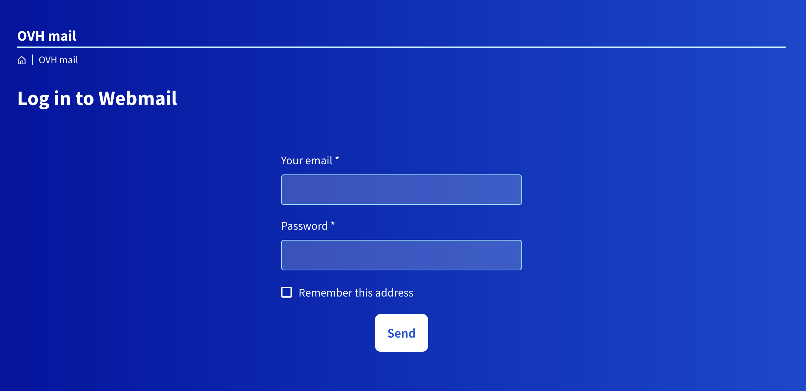
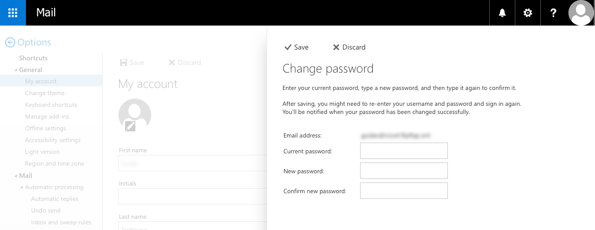

**Dernière mise à jour le 05/05/2020**

## Objectif

Les adresses e-mail de l’offre MX Plan vous permettent d’envoyer et de recevoir vos messages depuis l’appareil de votre choix. Cet accès est possible grâce au mot de passe qui lui est associé.

**Apprenez à modifier le mot de passe d'une adresse e-mail créée dans le cadre de l'offre MX Plan.**

## Prérequis

- Disposer d'une offre MX Plan. Celle-ci est disponible via : une offre d’[hébergement web](https://www.ovh.com/ca/fr/hebergement-web/){.external}, l'[hébergement gratuit Start 10M]({ovh_www}/domaines/offre_hebergement_start10m.xml){.external}, ou l'offre MX Plan commandée séparément.
- Selon la méthode que vous utilisez : être connecté à l'[espace client OVHcloud](https://www.ovh.com/auth/?action=gotomanager){.external} dans la partie `Web`{.action}, ou être connecté à l'adresse e-mail depuis le [webmail](https://www.ovh.com/ca/fr/mail/){.external} Outlook Web Messenger (OWA).

> [!primary]
>
> En modifiant le mot de passe de votre adresse e-mail, vous devrez également répercuter ce changement sur tous les appareils où l’adresse e-mail a été configurée.
>

## En pratique

Selon la date d'activation de votre service ou si [celui-ci a été récemment migré](../mxplan-migration/){.external}, il est possible que vous disposiez de la version historique ou de la nouvelle version de l'offre MX Plan. Avant de poursuivre, vous devez identifier celle-ci. 

Pour cela, connectez-vous à votre [espace client OVHcloud](https://www.ovh.com/auth/?action=gotomanager){.external}, partie « Web ». Cliquez sur `E-mails`{.action} dans la barre de services à gauche, puis choisissez le nom du service MX Plan concerné. Poursuivez selon la version que vous possédez.

|Version historique de l'offre MX Plan|Nouvelle version de l'offre MX Plan|
|---|---|
|{.thumbnail}  Repérez l'offre dans le cadre « Abonnement ».|{.thumbnail} Repérez la « Référence serveur » dans le cadre « Résumé ».|
|Poursuivre vers « [Version historique de l'offre MX Plan](./#version-historique-de-loffre-mx-plan_2) ».|Poursuivre vers « [Nouvelle version de l'offre MX Plan](./#nouvelle-version-de-loffre-mx-plan) ».|

### Nouvelle version de l'offre MX Plan

Vous possédez la nouvelle version de l'offre MX Plan. Voici l'affichage que vous devez obtenir. Si ce n'est pas le cas, assurez-vous d'avoir suivi le bon cheminement [en vous reportant aux informations ci-dessus](./#en-pratique).  

{.thumbnail}

Il existe deux possibilités pour modifier le mot de passe d'une adresse e-mail. Poursuivez vers celle que vous souhaitez effectuer.

- [Modifier le mot de passe depuis le webmail OWA](./#modifier-le-mot-de-passe-depuis-le-webmail-owa). Pour cela, vous devez être en possession du mot de passe actuel. 
- [Modifier le mot de passe depuis l'espace client OVHcloud](./#modifier-le-mot-de-passe-depuis-lespace-client-ovh). Pour cela, vous n'avez pas besoin d'être en possession du mot de passe actuel.

#### Modifier le mot de passe depuis le webmail OWA

Commencez en accédant à la page « [Connexion au webmail](https://www.ovh.com/ca/fr/mail/){.external} ». Sur celle-ci, renseignez votre adresse e-mail complète, ainsi que son mot de passe actuel. Cliquez ensuite sur le bouton `Connexion`{.action}. 

{.thumbnail}

Votre boîte de réception s'affiche alors. Cliquez sur l'icône en forme de roue dentée dans la partie supérieure, puis sur `Options`{.action}.

{.thumbnail}

Sur la nouvelle page qui s'affiche, dans la partie latérale de gauche, dépliez l'onglet « Général » dans l'arborescence, puis cliquez sur `Mon compte`{.action}. Cliquez enfin sur `Modifier votre mot de passe`{.action}.

{.thumbnail}

Sur la nouvelle fenêtre qui apparaît, commencez par renseigner votre mot de passe actuel. Écrivez alors votre nouveau mot de passe, puis confirmez-le. Cliquez sur le bouton `Enregistrer`{.action} pour sauvegarder la modification.

> [!primary]
>
> Vous devrez renseigner le nouveau mot de passe sur tous les appareils où l’adresse e-mail a été configurée.
>

{.thumbnail}

#### Modifier le mot de passe depuis l'espace client OVHcloud

Commencez en vous positionnant sur l'onglet `Comptes e-mail`{.action}. Le tableau qui s'affiche contient toutes les adresses e-mail créées dans le cadre de votre offre. Cliquez alors sur le bouton `...`{.action} à droite de l'adresse concernée, puis sur `Modifier`{.action}.

{.thumbnail}

Dans la fenêtre qui s'affiche, définissez un nouveau mot de passe et confirmez-le. Pour des raisons de sécurité, nous vous recommandons de ne pas utiliser deux fois le même mot de passe, d'en choisir un qui n'a aucun rapport avec vos informations personnelles (évitez les mentions à vos nom, prénom et date de naissance, par exemple) et de le renouveler régulièrement.

Une fois ceci fait, cliquez sur le bouton `Suivant`{.action}, puis sur `Valider`{.action}. Le changement nécessite quelques minutes avant d'être effectif.

{.thumbnail}

Une fois le mot de passe modifié, vous pouvez accéder à l'adresse e-mail. Pour cela, vous disposez de deux possibilités.

- **Utiliser notre webmail** : accédez à la page « [Connexion au webmail](https://www.ovh.com/ca/fr/mail/){.external} », puis renseignez l'adresse e-mail concernée ainsi que son nouveau mot de passe. Si vous venez à l'instant de modifier le mot de passe et que l'authentification échoue, patientez quelques instants puis effectuez une nouvelle tentative de connexion. Pour découvrir comment utiliser votre adresse e-mail depuis le webmail OWA, aidez-vous de notre guide « [Utiliser son adresse e-mail depuis le webmail Outlook Web Access (OWA)](../utilisation-owa/){.external} ».

- **Utiliser un logiciel de messagerie compatible** : vous devez renseigner le nouveau mot de passe sur tous les appareils où l’adresse e-mail a été configurée. Pour cela, il se peut qu'une fenêtre apparaisse automatiquement, vous demandant de le renseigner. Dans le cas contraire, [aidez-vous de nos guides de configuration](../) ou rapprochez-vous de l'éditeur du logiciel ou de l'aplication que vous utilisez, cette manipulation étant inhérente à ce dernier.

### Version historique de l'offre MX Plan

Vous possédez la version historique de l'offre MX Plan. Voici l'affichage que vous devez obtenir. Si ce n'est pas le cas, assurez-vous d'avoir suivi le bon cheminement [en vous reportant aux informations ci-dessus](./#en-pratique). 

{.thumbnail}

Pour modifier le mot de passe d'une adresse e-mail, positionnez-vous sur l'onglet `E-mails`{.action}. Le tableau qui s'affiche contient toutes les adresses e-mail créés dans le cadre de votre offre. Cliquez alors sur le bouton `...`{.action} à droite de l'adresse concernée, puis sur `Changer le mot de passe`{.action}.

{.thumbnail}

Dans la fenêtre qui s'affiche, définissez un nouveau mot de passe et confirmez-le. Pour des raisons de sécurité, nous vous recommandons de ne pas utiliser deux fois le même mot de passe, d'en choisir un qui n'a aucun rapport avec vos informations personnelles (évitez les mentions à vos nom, prénom et date de naissance, par exemple) et de le renouveler régulièrement.

Une fois ceci fait, cliquez sur le bouton `Valider`{.action}. Le changement nécessite quelques minutes avant d'être effectif.

{.thumbnail}

Une fois le mot de passe modifié, vous pouvez accéder à l'adresse e-mail. Pour cela, vous disposez de deux possibilités.

- **Utiliser notre webmail** : accédez à la page « [Connexion au webmail](https://www.ovh.com/ca/fr/mail/){.external} », puis renseignez l'adresse e-mail concernée ainsi que son nouveau mot de passe. Si vous venez à l'instant de modifier le mot de passe et que l'authentification échoue, patientez quelques instants puis effectuez une nouvelle tentative de connexion. Pour découvrir comment utiliser votre adresse e-mail depuis le webmail RoundCube, aidez-vous de notre guide « [Utiliser son adresse e-mail depuis le webmail RoundCube](../utilisation-roundcube/){.external} ».

- **Utiliser un logiciel de messagerie compatible** : vous devez renseigner le nouveau mot de passe sur tous les appareils où l’adresse e-mail a été configurée. Pour cela, il se peut qu'une fenêtre apparaisse automatiquement, vous demandant de le renseigner. Dans le cas contraire, [aidez-vous de nos guides de configuration](../) ou rapprochez-vous de l'éditeur du logiciel ou de l'application que vous utilisez, cette manipulation étant inhérente à ce dernier.

## Aller plus loin

Échangez avec notre communauté d'utilisateurs sur <https://community.ovh.com>.
