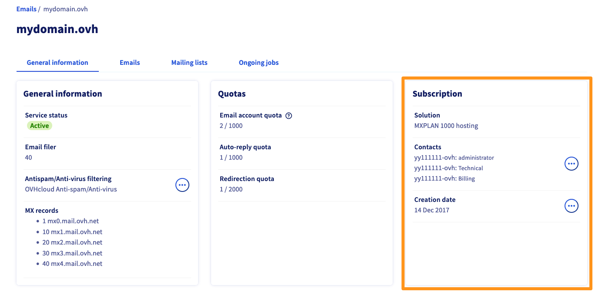
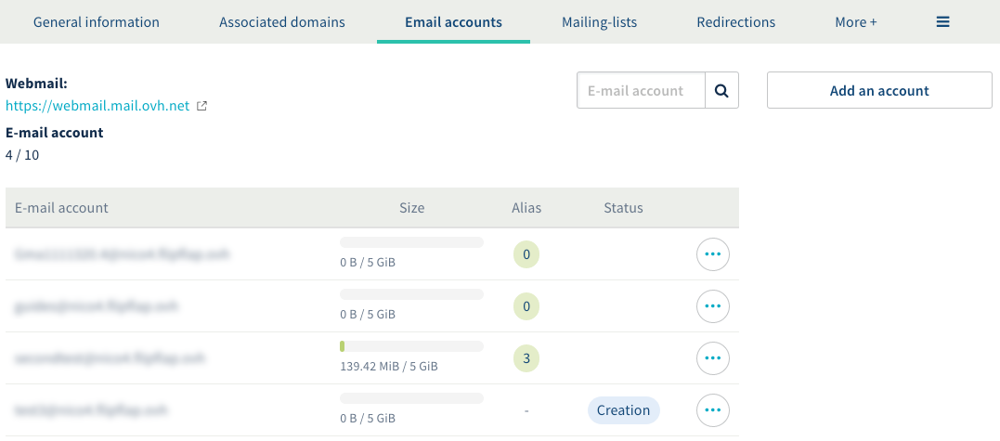
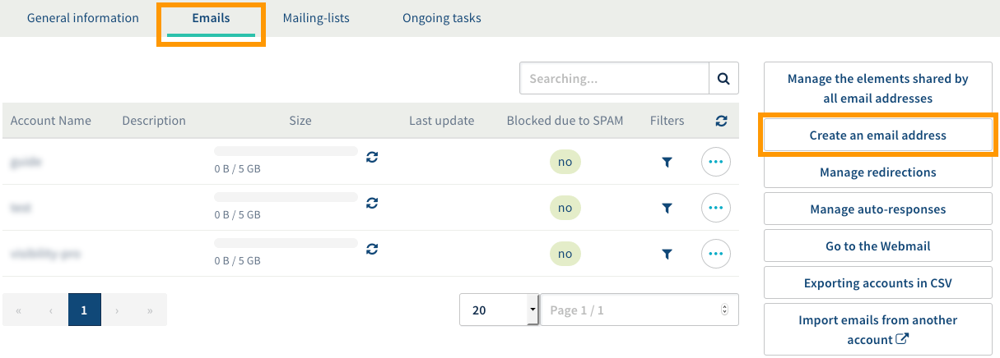
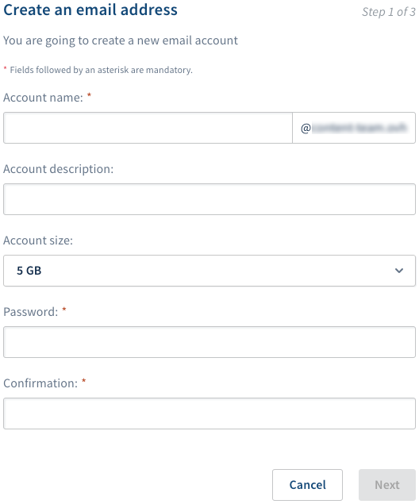

**Last updated 26th March 2019**

## Objective

You can use an email address in your MX Plan solution to send and receive emails through your preferred device.

**Find out how to create an email address with an MX Plan solution.**

## Requirements

- an MX Plan solution, available via a [Web Hosting plan](https://www.ovh.co.uk/web-hosting/){.external}, [a free Start 10M hosting solution](https://www.ovh.co.uk/domains/start10m_hosting_offer.xml){.external} including a domain name (activated in advance), or the MX Plan solution, ordered separately
- the ability to create email addresses as part of your solution
- access to the [OVH Control Panel](https://www.ovh.com/auth/?action=gotomanager){.external}

> [!primary]
>
> Regarding the free Start 10M hosting solution, you will need to activate it beforehand in order to create an email address. You can do this via the [OVH Control Panel](https://www.ovh.com/auth/?action=gotomanager){.external} by going to the domain name concerned.
>

## Instructions

Depending on when your service was activated or if [it was recently migrated](https://www.ovh.co.uk/mxplan-migration/){.external}, you will have either the legacy version or the new version of the MX Plan solution. Before you proceed any further, you will need to establish which version you are using. 

To do this, log in to the [OVH Control Panel](https://www.ovh.com/auth/?action=gotomanager){.external}, and go to the `Web`{.action} section. Click `Emails`{.action} in the service bar on the left-hand side, and then choose the name of the MX Plan service concerned. Then you can proceed in accordance with the version you are using.

|MX Plan legacy version|MX Plan new version|
|---|---|
|{.thumbnail}  Find the solution in the "Subscription" box|{.thumbnail} Locate the `Server model` in the "Summary" box|
|Go to [MX Plan legacy version](./#mx-plan-legacy-version_2)|Go to [MX Plan new version](./#mx-plan-new-version)|

### MX Plan new version

#### Step 1: Log in to your email service’s management interface.

Since you are using the new version of the MX Plan solution, your display should look like this. If not, please ensure that you are following the right set of instructions [by referring to the information above](./#instructions).  

{.thumbnail}

#### Step 2: Create your email addresses.

To set up a new email address, go to the `Email accounts`{.action} tab. The window that opens will display the email accounts that are already available, as well as those you can still create. Next, click the `Add an account`{.action} button.

{.thumbnail}

In the pop-up window, enter the following information:

|Information|Description|  
|---|---|  
|Email account|A temporary name is already auto-filled in the text box. You can delete it and enter the name you want your email address to include (e.g. firstname.surname). The domain name for the email address is already pre-selected in the list.|  
|First name|Enter a first name.|  
|Name|Enter a surname.|  
|Display name|Enter the name you want to be displayed as a sender when you send emails from this address.|
|Password|Type in a password, and confirm it. For security reasons, we recommend not using the same password twice, choosing one that does not contain any personal information (e.g. your surname, first name, and date of birth) and we also recommend renewing it regularly.|

Once you have filled in all of the required fields, click `Next`{.action}. 

{.thumbnail}

Next, check that all the information displayed in the summary is correct. If it is, click `Confirm`{.action}. The account you have just added will now appear in the table. You will need to wait a few minutes for the account to become available.

Repeat this step as necessary according to the number of accounts you have.

{.thumbnail}

#### Step 3: Use your email addresses.

Once you have created your email addresses, you can start using them straight away. There are two ways you can do this.

##### 1. Use Outlook Web Access (OWA) webmail.

Go to the [Webmail login](https://www.ovh.co.uk/mail/){.external} page, then enter your email address and password. Then click the `Login`{.action} button.

When you first log in to the webmail interface, you are prompted to set the interface language and your time zone. Your inbox will then appear. To find out how to use your email address via the OWA webmail interface, please refer to our [Outlook Web App user guide](https://docs.ovh.com/gb/en/microsoft-collaborative-solutions/exchange_2016_outlook_web_app_user_guide/){.external}.

{.thumbnail}

##### 2. Use a device of your choice.

You will need to configure your email address on the device you want to use (e.g. a smartphone or tablet). To do this, you can use our configuration guides:

|Windows|Outlook|Apple|Android|Other|
|---|---|---|---|---|
|[Windows 10](https://docs.ovh.com/gb/en/emails/mail-configuration-windows-10/){.external}|[Outlook 2016](https://docs.ovh.com/gb/en/emails/configuration-outlook-2016/){.external}|[MacOS Mail (latest version)](https://docs.ovh.com/gb/en/emails/guide-configuring-mail-on-macos/){.external}|[Android (latest version)](https://docs.ovh.com/gb/en/emails/configuration-android/){.external}|[Gmail](https://docs.ovh.com/gb/en/emails/gmail-configuration/){.external}|[Mail for iPhone and iPad (iOS 7 and later)](https://docs.ovh.com/gb/en/emails/email_hosting_iphone_ios_91_configuration/){.external}|

If you just need the information required to configure your email address, the settings to use are listed below:

- **For IMAP configuration (recommended)**

|Server type|Server name|Port (with SSL)|Port (without SSL)|
|---|---|---|---|
|Incoming|SSL0.OVH.NET|993|143|
|Outgoing|SSL0.OVH.NET|465|587|

- **For POP configuration**

|Server type|Server name|Port (with SSL)|Port (without SSL)|
|---|---|---|---|
|Incoming|SSL0.OVH.NET|995|110|
|Outgoing|SSL0.OVH.NET|465|587|

> [!warning]
>
> If you have any problems configuring your email address on your device, we recommend using our configuration guides or getting in touch with the publishers of the application you are using, because you may need to make a change that is specific to the application.
>

### MX Plan legacy version

#### Step 1: Log in to your email service’s management interface.

If you are using the legacy version of the MX Plan solution, your display should look like this. If not, please ensure that you are following the right set of instructions [by referring to the information above](./#instructions). 

{.thumbnail}

#### Step 2: Create your email addresses.

To create a new email address, go to the `Emails`{.action} tab. The table shown contains all the email addresses created as part of your MX Plan package. Then click the `Create Email Address`{.action} button.

{.thumbnail}

In the pop-up window, enter the following information:

|Information|Description|  
|---|---|  
|User name|Enter the name for your email address (firstname.lastname, for example). The domain name concerned is already entered by default.|  
|Account description|Enter a short description that will distinguish this account from any other accounts added in the OVH Control Panel.|  
|Account size|Select the size of account you want. This size refers to the space available to your account for storing messages.|  
|Password|Type in a password, and confirm it. For security reasons, we recommend not using the same password twice, choosing one that does not contain any personal information (e.g. your surname, first name, and date of birth) and we also recommend renewing it regularly.|

Once you have filled in all of the required fields, click `Next`{.action}. 

{.thumbnail}

Check that all the information displayed in the summary is correct. If it is, click on `Next`{.action} again. Finally, click `Confirm`{.action} to launch the creation of the email address. You will need to wait a few minutes for it to become available.

Repeat this step as necessary, according to the number of accounts you have.

#### Step 3: Use your email addresses.

Once you have created your email addresses, you can start using them straight away. There are two ways you can do this.

##### 1. Use Roundcube webmail.

Go to the [Webmail login](https://www.ovh.co.uk/mail/){.external} page, then enter your email address and password. Then click the `Login`{.action} button.

Your inbox will then appear.

{.thumbnail}

##### 2. Use a device of your choice.

You will need to configure your email address on the device you want to use (e.g. a smartphone or tablet). To do this, you can refer to our configuration guides:

|Windows|Outlook|Apple|Android|Other|
|---|---|---|---|---|
|[Windows 10](https://docs.ovh.com/gb/en/emails/mail-configuration-windows-10/){.external}|[Outlook 2016](https://docs.ovh.com/gb/en/emails/configuration-outlook-2016/){.external}|[MacOS Mail (latest version)](https://docs.ovh.com/gb/en/emails/guide-configuring-mail-on-macos/){.external}|[Android (latest version)](https://docs.ovh.com/gb/en/emails/configuration-android/){.external}|[Gmail](https://docs.ovh.com/gb/en/emails/gmail-configuration/){.external}|[Mail for iPhone and iPad (iOS 7 and later)](https://docs.ovh.com/gb/en/emails/email_hosting_iphone_ios_91_configuration/){.external}|

If you just need the information required to configure your email address, the settings to use are listed below:

- **For IMAP configuration (recommended)**

|Server type|Server name|Port (with SSL)|Port (without SSL)|
|---|---|---|---|
|Incoming|SSL0.OVH.NET|993|143|
|Outgoing|SSL0.OVH.NET|465|587|

- **For POP configuration**

|Server type|Server name|Port (with SSL)|Port (without SSL)|
|---|---|---|---|
|Incoming|SSL0.OVH.NET|995|110|
|Outgoing|SSL0.OVH.NET|465|587|

> [!warning]
>
> If you have any problems configuring your email address on your device, we recommend using our configuration guides or getting in touch with the publishers of the application you are using, because you may need to make a change that is specific to the application.
>

## Go further

Join our community of users on <https://community.ovh.com/en/>.