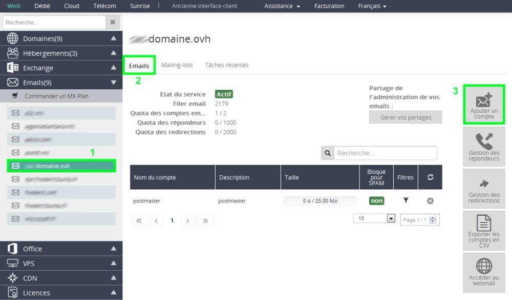
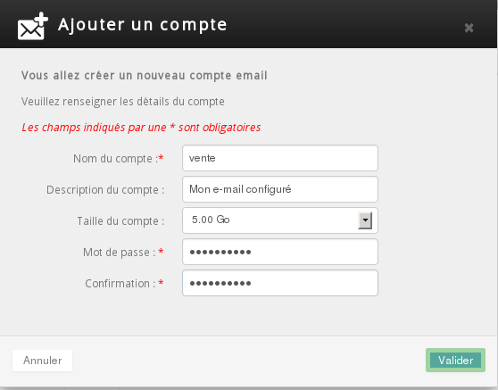
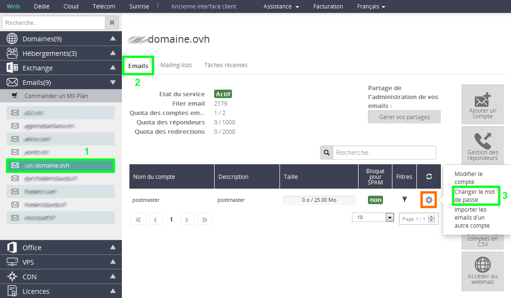
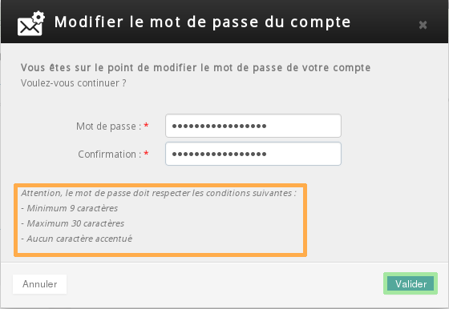

## Log in to your control panel
Log in to the [control panel](https://www.ovh.com/manager/web/) with your username (NIC handle) and password.

- Select your domain in the "Emails" menu. 

- Select theEmail tab.

- Click Add an account.

{.thumbnail}
You must have a valid email service to be able to add email accounts:

- Start10M free offer (1 email account)
- [OVH Web Hosting](http://www.ovh.co.uk/web-hosting/) (10-1000 email accounts)
- [MX Plan](http://www.ovh.co.uk/products/mxplan.xml) (5-1000 email accounts)

## Your email account details
Enter the following information in the new window:

Account name: the email address.

Description: a description of the email account.

Account size: your email account quota.

Password: a password for your email account.

Confirmation: confirm your password.

Please note that the password must comply with certain conditions: 

- Minimum 9 characters.
- Maximum 30 characters.
- No accented characters.

Click Confirm/Ok to continue.

A notification will appear to inform you that your email account has been created.

We recommend the following guides for configuring your email accounts:

- [Email configuration guides](https://www.ovh.co.uk/web-hosting/guides/).

{.thumbnail}

## How do you change your email password?

- Firstly select your domain in the "Emails" menu then go to "Email" -- Change the password by clicking on the cogwheel next to the relevant email account.

{.thumbnail}

- Re-enter the new password and confirm it.

You will not need to enter your old password.

Please note that the password must comply with certain conditions: 

- Minimum 9 characters.
- Maximum 30 characters.
- No accented characters.

Click Confirm/Ok to complete the password change.

It may take a few minutes for your password change to take effect.

{.thumbnail}