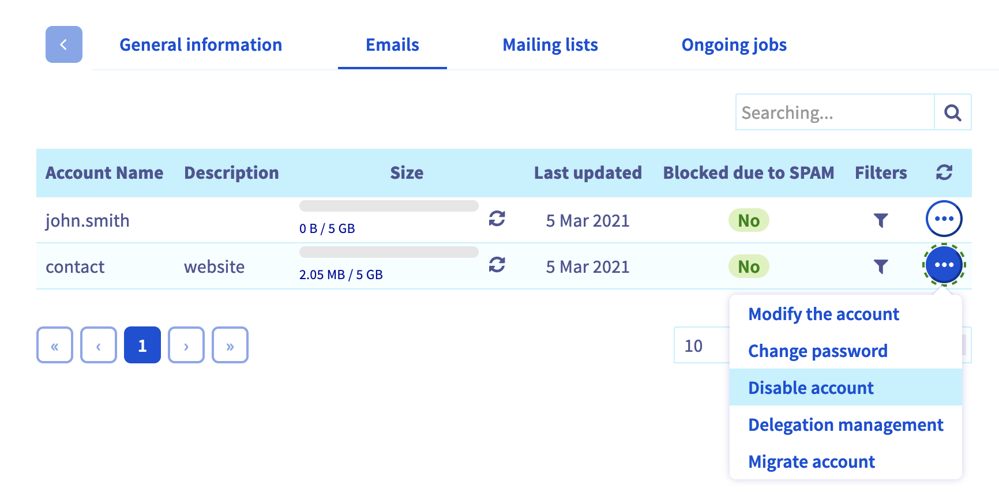

**Dernière mise à jour le 07/10/2022**

## Objectif

Vous venez d'acquérir une solution e-mail MX Plan. Celle-ci vous permet de bénéficier d'adresses e-mail associées à un nom de domaine.

**Découvrez comment créer une adresse e-mail avec votre offre MX Plan.**

## Prérequis

- Disposer d'une offre MX Plan. Celle-ci est disponible via : une offre d’[hébergement web](https://www.ovhcloud.com/fr/web-hosting/){.external}, l'[hébergement gratuit Start 10M](https://www.ovhcloud.com/fr/domains/free-web-hosting/){.external} compris avec un nom de domaine (activé au préalable) ou l'offre MX Plan commandée séparément.
- Être connecté à l'[espace client OVHcloud](https://www.ovh.com/auth/?action=gotomanager&from=https://www.ovh.com/fr/&ovhSubsidiary=fr){.external}, partie `Web Cloud`{.action}.

> [!primary]
>
> **Cas particuliers**
>
> - Concernant l’hébergement gratuit Start 10M : il est impératif de l’activer au préalable afin de pouvoir créer une adresse e-mail. Vous pouvez effectuer cette opération depuis votre [espace client OVHcloud](https://www.ovh.com/auth/?action=gotomanager&from=https://www.ovh.com/fr/&ovhSubsidiary=fr){.external}, en vous positionnant sur le nom de domaine concerné.
> - Dans le cadre d'un [hébergement web](https://www.ovhcloud.com/fr/web-hosting/){.external}, il est nécessaire d'activer votre offre MX Plan incluse avant de poursuivre la lecture de cette documentation. Pour cela, consultez notre guide « [Activer les adresses e-mail incluses dans votre hébergement web](https://docs.ovh.com/fr/hosting/activer-email-hebergement-web/) ».

## En pratique 

Selon la date d'activation de votre service ou si [celui-ci a été récemment migré](https://www.ovhcloud.com/fr/web-hosting/mxplan-migration/){.external}, il est possible que vous disposiez de la version historique ou de la nouvelle version de l'offre MX Plan. Avant de poursuivre, vous devez identifier celle-ci. 

Pour cela, connectez-vous à votre [espace client OVHcloud](https://www.ovh.com/auth/?action=gotomanager&from=https://www.ovh.com/fr/&ovhSubsidiary=fr){.external}, partie `Web Cloud`{.action}. Cliquez sur `Emails`{.action}, puis choisissez le nom du service MX Plan concerné. Poursuivez selon la version que vous possédez.

|Version historique de l'offre MX Plan|Nouvelle version de l'offre MX Plan|
|---|---|
|{.thumbnail}  Repérez l'offre dans le cadre « Abonnement »|{.thumbnail} Repérez la `Référence serveur` dans le cadre « Résumé »|
|Poursuivre vers « [Version historique de l'offre MX Plan](./#version-historique-de-loffre-mx-plan_2) »|Poursuivre vers « [Nouvelle version de l'offre MX Plan](./#nouvelle-version-de-loffre-mx-plan) »|

### Nouvelle version de l'offre MX Plan 

#### Accéder à la gestion du service e-mail

Vous possédez donc la nouvelle version de l'offre MX Plan. Voici l'affichage que vous devez obtenir. Si ce n'est pas le cas, assurez-vous d'avoir suivi le bon cheminement [en vous reportant aux informations ci-dessus](./#en-pratique).  

{.thumbnail}

#### Créer un compte e-mail

Pour obtenir une nouvelle adresse e-mail, positionnez-vous sur l'onglet `Comptes e-mail`{.action}. La fenêtre qui apparaît affiche les comptes e-mail déjà disponibles, ainsi que ceux que vous pouvez encore créer. Cliquez alors sur le bouton `Ajouter un compte`{.action}.

{.thumbnail}

Dans la fenêtre qui s'affiche, renseignez les informations demandées :

- **Compte e-mail** : Un nom temporaire est déjà prérempli dans la zone de texte. Remplacez-le par celui que vous souhaitez pour votre adresse e-amil (votre prénom.nom, par exemple). Le nom de domaine composant l'adresse e-mail est déjà présélectionné dans la liste.
- **Prénom**: Renseignez un prénom.
- **Nom**: Renseignez un nom.
- **Nom à afficher**: Indiquez le nom qui s'affichera en tant qu'expéditeur lorsque des e-mails seront envoyés avec cette adresse.
- **Mot de passe**: Définissez un mot de passe et confirmez-le. Pour des raisons de sécurité, nous vous recommandons de ne pas utiliser deux fois le même mot de passe, d'en choisir un qui n'a aucun rapport avec vos informations personnelles (évitez les mentions à vos nom, prénom et date de naissance, par exemple) et de le renouveler régulièrement.

Une fois les champs complétés, cliquez sur `Suivant`{.action}. 

{.thumbnail}

Vérifiez maintenant les informations qui s'affichent dans le récapitulatif ; si celles-ci sont correctes, cliquez sur `Valider`{.action}. Le compte nouvellement ajouté apparaît alors dans le tableau. Patientez quelques instants le temps que le compte soit disponible.

Réalisez cette étape autant de fois que nécessaire, selon le nombre de comptes à votre disposition.

#### Consulter les e-mails

Accédez à la page « [Connexion au webmail](https://www.ovh.com/fr/mail/){.external} », puis renseignez l'adresse e-mail concernée ainsi que son mot de passe. Cliquez ensuite sur le bouton `Connexion`{.action}.

Lors d'une première connexion au webmail, vous êtes invité à définir la langue de l'interface ainsi que le fuseau horaire sur lequel vous vous trouvez. Votre boîte de réception s'affiche ensuite. Pour découvrir comment utiliser votre adresse e-mail depuis le webmail Outlook Web Access (OWA), aidez-vous de notre guide « [Utiliser son adresse e-mail depuis le webmail Outlook Web Access (OWA)](../utilisation-owa/){.external} ».

{.thumbnail}

Pour consulter vos e-mails depuis un logiciel de messagerie, référez-vous la rubrique « [Consulter un compte e-mail depuis un appareil](#configdevices) ».

#### Supprimer un compte e-mail

Depuis la nouvelle version MXplan, on parle de *réinitialisation de compte* lorsque vous devez supprimer celui-ci.

> [!warning]
>
> Avant de supprimer des comptes e-mail, assurez-vous qu'ils ne sont pas utilisés. Une sauvegarde de ces comptes peut s'avérer nécessaire. Au besoin, consultez le guide [Migrer manuellement votre adresse e-mail](https://docs.ovh.com/fr/emails/migrer-ses-adresses-email-manuellement/) qui vous décrira comment exporter les données d'un compte depuis votre espace client ou un logiciel de messagerie.

Depuis l'onglet `Comptes e-mail`{.action}, cliquez sur le bouton `...`{.action} à droite du compte à supprimer, puis cliquez sur `Réinitialiser ce compte`{.action}.

{.thumbnail}

### Version historique de l'offre MX Plan 

#### Accéder à la gestion du service e-mail

Vous possédez donc la version historique de l'offre MX Plan. Voici l'affichage que vous devez obtenir. Si ce n'est pas le cas, assurez-vous d'avoir suivi le bon cheminement [en vous reportant aux informations ci-dessus](#instructions). 

{.thumbnail}

#### Créer un compte e-mail

Pour obtenir une nouvelle adresse e-mail, positionnez-vous sur l'onglet `Emails`{.action}. Le tableau qui s'affiche contient tous les comptes e-mail créés dans le cadre de votre offre MX Plan. Cliquez alors sur le bouton `Créer une adresse E-mail`{.action}.

{.thumbnail}

Dans la fenêtre qui s'affiche, renseignez les informations demandées :

- **Nom du compte**: Renseignez le nom que vous souhaitez pour votre adresse e-mail (votre prénom.nom, par exemple). Le nom de domaine concerné est déjà complété par défaut.|  
- **Description du compte**: Indiquez une courte description vous permettant de reconnaître ce compte parmi d'autres affichés dans votre espace client OVHcloud.|  
- **Taille du compte**: Sélectionnez la taille du compte souhaitée. Il s'agit de l'espace dont bénéficiera votre adresse pour stocker les messages.|  
- **Mot de passe**: Définissez un mot de passe et confirmez-le. Pour des raisons de sécurité, nous vous recommandons de ne pas utiliser deux fois le même mot de passe, d'en choisir un qui n'a aucun rapport avec vos informations personnelles (évitez les mentions à vos nom, prénom et date de naissance, par exemple) et de le renouveler régulièrement.|

Une fois les champs complétés, cliquez sur `Suivant`{.action}. 

{.thumbnail}

Vérifiez alors les informations qui s'affichent dans le récapitulatif ; si celles-ci sont correctes, cliquez de nouveau sur `Suivant`{.action}. Enfin, sélectionnez `Valider`{.action} pour lancer la création de l'adresse e-mail. Patientez quelques instants le temps que celle-ci soit disponible.

Réalisez cette étape autant de fois que nécessaire, selon le nombre de comptes à votre disposition.

#### Consulter les e-mails 

Accédez à la page « [Connexion au webmail](https://www.ovh.com/fr/mail/){.external} », puis renseignez l'adresse e-mail concernée ainsi que son mot de passe. Cliquez ensuite sur le bouton `Connexion`{.action}.

Votre boîte de réception s'affiche alors. Pour découvrir comment utiliser votre adresse e-mail depuis le webmail OWA, aidez-vous de notre guide « [Utiliser son adresse e-mail depuis le webmail RoundCube](../utilisation-roundcube/){.external} ».

{.thumbnail}

Pour consulter vos e-mails depuis un logiciel de messagerie, référez-vous la rubrique [Consulter un compte e-mail depuis un appareil](#configdevices)

#### Supprimer un compte e-mail

> [!warning]
>
> Avant de supprimer des comptes e-mail, assurez-vous qu'ils ne sont pas utilisés. Une sauvegarde de ces comptes peut s'avérer nécessaire. Au besoin, consultez le guide [Migrer manuellement votre adresse e-mail](https://docs.ovh.com/fr/emails/migrer-ses-adresses-email-manuellement/) qui vous décrira comment exporter les données d'un compte depuis votre espace client ou un logiciel de messagerie.

Depuis l'onglet `Comptes e-mail`{.action}, cliquez sur le bouton `...`{.action} à droite du compte à supprimer, puis cliquez sur `Supprimer le compte`{.action}

{.thumbnail}

### Consulter un compte e-mail depuis un appareil 

Vous devez configurer votre adresse e-mail sur l'appareil souhaité (comme un smartphone ou une tablette). Pour cela, vous pouvez vous aider de nos guides de configuration :

> [!tabs]
> **Windows**
>>
>> - [Courrier sur Windows 10](https://docs.ovh.com/fr/emails/configuration-courrier-sur-windows-10/)
>> - [Outlook](https://docs.ovh.com/fr/emails/configuration-outlook-2016/)
>> - [Thunderbird](https://docs.ovh.com/fr/emails/configuration-email-configuration-pour-thunderbird/)
>>
> **Apple**
>>
>> - [Mail de macOS](https://docs.ovh.com/fr/emails/guide-configuration-mail-de-mac-el-capitan/)
>> - [Mail pour iPhone ou iPad](https://docs.ovh.com/fr/emails/mail-mutualise-guide-configuration-iphone-ios-91/)
>> - [Outlook Mac OS](https://docs.ovh.com/fr/emails/configuration-outlook-2016-mac/)
>> - [Thunderbird](https://docs.ovh.com/fr/emails/guide-de-configuration-email-pour-thunderbird-mac/)
>>
> **Android**
>>
>> - [Android](https://docs.ovh.com/fr/emails/configuration-android-6/)
>>
> **Autre**
>>
>> - [Interface Gmail](https://docs.ovh.com/fr/emails/mail-mutualise-guide-configuration-dun-e-mail-mutualise-ovh-sur-linterface-de-gmail/)
>>

Si vous désirez simplement obtenir les éléments nécessaires pour configurer votre adresse e-mail, retrouvez ci-dessous les paramètres à utiliser :

> [!tabs]
> **Pour une configuration en IMAP (recommandée)**
>>
>> |Type du serveur|Nom du serveur|Port (avec SSL)|Port (sans SSL)|
>> |---|---|---|---|
>> |Entrant|SSL0.OVH.NET|993|143|
>> |Sortant|SSL0.OVH.NET|465|587|
>>
> **Pour une configuration en POP**
>>
>>|Type du serveur|Nom du serveur|Port (avec SSL)|Port (sans SSL)|
>>|---|---|---|---|
>>|Entrant|SSL0.OVH.NET|995|110|
>>|Sortant|SSL0.OVH.NET|465|587|
>>

> [!warning]
>
> Si vous éprouvez des difficultés dans la configuration de votre adresse e-mail sur votre appareil, [aidez-vous de nos guides de configuration](../) ou rapprochez-vous de l'éditeur de l'application que vous utilisez, la manipulation étant inhérente à cette dernière.
>

## Aller plus loin

Échangez avec notre communauté d'utilisateurs sur <https://community.ovh.com>.