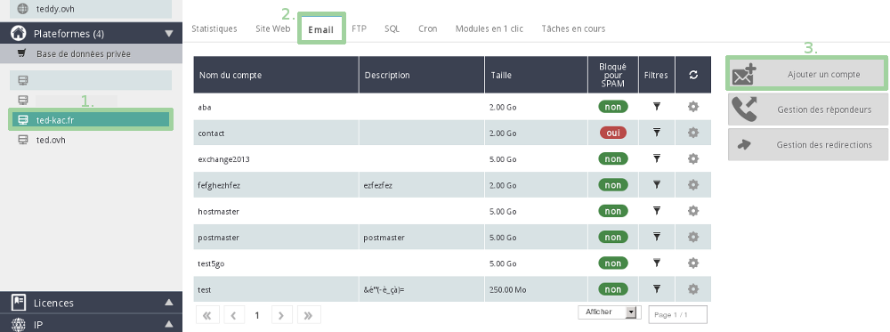
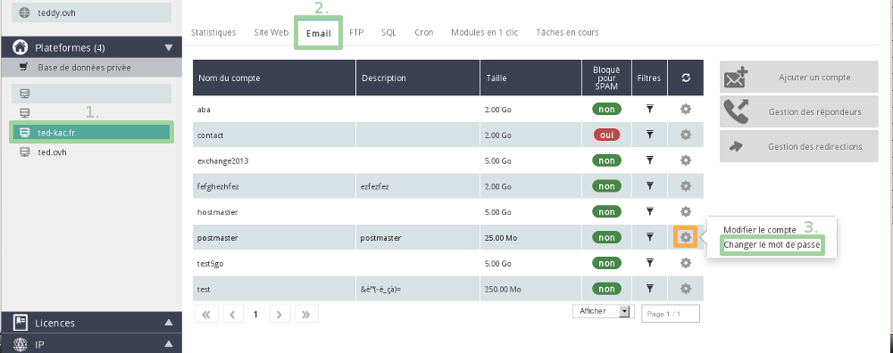

## Inloggen op het control panel
Log in op het [Control Panel](https://www.ovh.com/managerv3/) met uw gebruikersnaam (NicHandle) en wachtwoord.

-Selecteer het platform of het e-mail aanbod.

-Selecteer de tab "E-mail".

-Klik op "Account toevoegen".

{.thumbnail}
U moet over een geldige hosting beschikken om e-mailaccounts te kunnen toevoegen:

- Gratis Start1M aanbod (1 e-mail account)
- [OVH Webhosting](https://www.ovh.com/fr/hebergement-web/) (10 tot 1.000 e-mailaccounts)
- [MXplan](http://www.ovh.com/fr/produits/mxplan.xml) (5 tot 1.000 e-mailaccounts)

## E-mailaccount gegevens
Vul de gewenste gegevens in voor uw e-mailadres, in de nieuwe interface die verschijnt:

Accountnaam: bepaal de naam van het e-mail adres.

Beschrijving: stel een beschrijving van de e-mailaccount in.

Grootte van de account: bepaal de quota van uw e-mailadres.

Wachtwoord: kies het wachtwoord van uw e-mailaccount .

Bevestiging: bevestig het wachtwoord van uw e-mailaccount.

Let op: het wachtwoord moet voldoen aan bepaalde voorwaarden:

- Minimaal 9 tekens.
- Maximaal 30 tekens.
- Geen letter met accent.

Klik op "Valideren" om verder te gaan.

Een melding betreffende het aanmaken van de e-mailaccount verschijnt.

Om uw e-mailadressen te configureren, bevelen we deze handleidingen aan:

- [E-mail configuratie handleidingen](https://www.ovh.com/fr/hebergement-web/guides/).

{.thumbnail}

## Hoe kan ik het wachtwoord van mijn e-mailadressen wijzigen? (1)

- Selecteer eerst uw platform, ga naar "E-mail" -- "Wijzig het wachtwoord" en klik op het tandwieltje bij de e-mail die u wilt wijzigen.

{.thumbnail}

- Voer het nieuwe wachtwoord in en bevestig het.

Het vorige wachtwoord is niet noodzakelijk.

Let op: het wachtwoord moet voldoen aan bepaalde voorwaarden:

- Minimaal 9 tekens.
- Maximaal 30 tekens.
- Geen letter met een accent.

Klik op "Valideren" om de wijziging van uw wachtwoord te voltooien. 

Na de wijziging van uw wachtwoord kan het een paar minuten duren voordat het effectief is.

{.thumbnail}