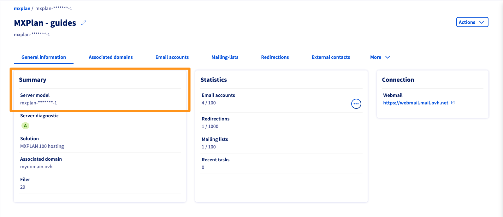
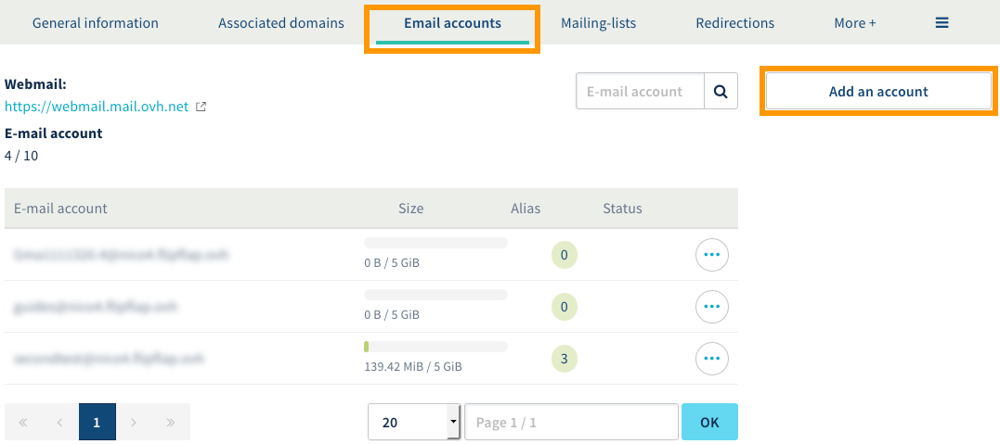
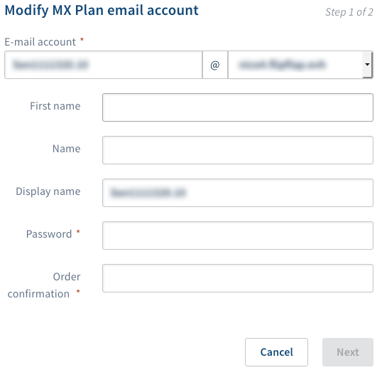
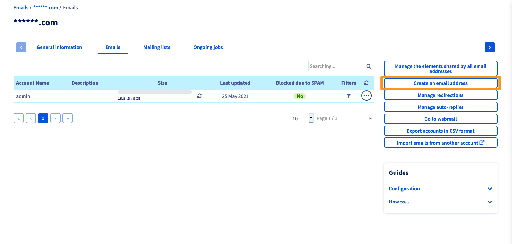

**Last updated 26th March 2019**

## Objective

If you have just purchased an MX Plan solution, you can have email addresses, which can be used to send and receive messages from any device. 

**Find out how to get started with an MX Plan solution.**

## Requirements

- an MX plan solution, available via a [Web Hosting plan]({ovh_www}/web-hosting/){.external}, [the free Start10M Hosting plan]({ovh_www}/domains/start10m_hosting_offer.xmll){.external} or an MX Plan solution ordered separately
- access to the [OVH Control Panel](https://www.ovh.com/auth/?action=gotomanager){.external}

## Instructions

Once the MX Plan solution is created and available, you can manage it from the [OVH Control Panel](https://www.ovh.com/auth/?action=gotomanager){.external}. Depending on its activation date or if [it has been migrated recently]({ovh_www}/mxplan-migration/){.external}, you may have the old or new version of the solution. You will need to check this before you proceed any further. 

To do this, log in to the [OVH Control Panel](https://www.ovh.com/auth/?action=gotomanager){.external}, and open the `Web`{.action} section. Click `Emails`{.action} in the services bar on the left-hand side, then choose the name of the plan concerned. Continue with the next steps, depending on which version you own.

|MX Plan solution legacy version|MX Plan solution new version|
|---|---|
|{.thumbnail}  Find the solution in the "Subscription" box|{.thumbnail} Locate the `Server reference` in the "Summary" box|
|Continue to [Legacy version of the MX Plan solution](./#mx-plan-solution-legacy-version_2)|Continue to [New version of the MX Plan solution](./#new-version-of-the-mx-plan-solution)|

### New version of the MX Plan solution.

#### Step 1: Log in to your solution’s interface.

You have the new version of the MX Plan solution. This is the display you should get. If not, please ensure you follow the right path [by referring to the information above](./#instructions).  

{.thumbnail}

#### Step 2: Create your email addresses.

To configure your email addresses, go to the `Email accounts`{.action} tab. The window that opens will list the email accounts already available, as well as those you can still create. Then click the `Add an account`{.action} button.

{.thumbnail}

In the pop-up window, enter the following information:

|Information|Description|  
|---|---|  
|Email account|A temporary name is already auto-filled in the text field. You can delete it and enter the name you would like for your email address (e.g. firstname.surname). The email address domain name is already pre-selected in the list.|  
|First name|Enter a first name.|  
|Last name|Enter a last name.|  
|Display name|Enter the name that will be displayed when sending emails from this address.|
|Password|Type in a password, and confirm it. For security reasons, we recommend not using the same password twice, and choosing one that does not contain any personal information (e.g. first name, surname and date of birth). We also recommend changing your password regularly.|

Once you have completed the text fields, click `Next`{.action} and then check the information that appears in the summary. If it is all correct, click `Confirm`{.action} . Repeat this step as necessary according to the number of accounts you have.

{.thumbnail}

#### Step 3: Use your email addresses.

Once you have configured your email addresses, you can start using them straight away. There are two ways you can do this.

##### 1. Use Outlook Web Access (OWA) webmail.

Go to the [Webmail login]({ovh_www}/mail/){.external} page, then enter the email address and password. Then click the `Login`{.action} button.

When you first log in to webmail, you will be prompted to set the interface language, and the time zone you are in. Your inbox will then appear. To find out how to use your email address via OWA webmail, you can refer to our {.external}Outlook Web App user guide.

{.thumbnail}

##### 2. Use the device of your choice.

You will need to set up your email address on the device you want to check your email from (e.g. a smartphone or tablet). To do this, you can use our configuration guides:

|Windows|Outlook|Apple|Android|Other|
|---|---|---|---|---|
|[Windows 10 Mail](../mail-configuration-windows-10/){.external}|[Outlook 2016](../configuration-outlook-2016/){.external}|[macOS Mail](../guide-configuring-mail-on-macos/){.external}|[Android](../configuration-android/){.external}|[Gmail online interface](../gmail-configuration/){.external}|
| | |[iPhone and iPad](../email_hosting_iphone_ios_91_configuration/){.external}| | |

If you simply need the information required to configure your email account, the settings to use are listed below:

- **For IMAP configuration (recommended)**

|Server type|Server name|Port (with SSL)|Port (without SSL)|
|---|---|---|---|
|Incoming|SSL0.OVH.NET|993|143|
|Outgoing|SSL0.OVH.NET|465|587|

- **For POP configuration**

|Server type|Server name|Port (with SSL)|Port (without SSL)|
|---|---|---|---|
|Incoming|SSL0.OVH.NET|995|110|
|Outgoing|SSL0.OVH.NET|465|587|

> [!warning]
>
> If you encounter any issues configuring your email address on your device, [you can use our configuration](../) guides or get in touch with the publishers of the application you are using, because the change required may be particular to the application.
>

### MX Plan solution legacy version.

#### Step 1: Log in to your solution’s interface.

If you have the legacy version of the MX Plan solution, this is the display you should see. If not, please ensure you follow the right path [by referring to the information above](./#instructions) . 

{.thumbnail}

#### Step 2: Create your email addresses.

To create an email address, please go to the `Emails`{.action} tab. The table that opens will contain all of the email addresses created as part of your solution. Then click the `Create Email Address`{.action} button.

{.thumbnail}

In the pop-up window, enter the following information:

|Information|Description|  
|---|---|  
|User name|Enter the name for your email address (firstname.lastname, for example). The domain name concerned is already entered by default.|  
|Account description|Enter a short description that will distinguish this account from any other accounts added in your OVH Control Panel.|  
|Account size|Select the size of account you want. This size refers to the space available to your account for storing messages.|  
|Password|Type in a password, and confirm it. For security reasons, we recommend not using the the same password twice, and choosing one that does not contain any personal information (e.g. first name, surname and date of birth). We also recommend changing your password regularly.|

Once you have completed the text fields, click `Next`{.action} and then check the information that appears in the summary. If it is all correct, click `Confirm`{.action} . Repeat this step as necessary according to the number of accounts you have.

{.thumbnail}

#### Step 3: Use your email addresses.

Once you have configured your email addresses, you can start using them straight away. There are two ways you can do this.

##### 1. Use the Roundcube webmail interface.

Go to the [Webmail login]({ovh_www}/mail/){.external} page, then enter the email address and password. Then click the `Login`{.action} button. Your inbox will appear.

{.thumbnail}

##### 2. Use the device of your choice.

You will need to set up your email address on the device you want to check your email from (e.g. a smartphone or tablet). To do this, you can refer to our configuration guides:

|Windows|Outlook|Apple|Android|Other|
|---|---|---|---|---|
|[Windows 10 Mail](../mail-configuration-windows-10/){.external}|[Outlook 2016](../configuration-outlook-2016/){.external}|[macOS Mail](../guide-configuring-mail-on-macos/){.external}|[Android](../configuration-android/){.external}|[Gmail online interface](../gmail-configuration/){.external}|
| | |[iPhone and iPad](../email_hosting_iphone_ios_91_configuration/){.external}| | |

If you simply need the information required to configure your email account, the settings to use are listed below:

- **For IMAP configuration (recommended)**

|Server type|Server name|Port (with SSL)|Port (without SSL)|
|---|---|---|---|
|Incoming|SSL0.OVH.NET|993|143|
|Outgoing|SSL0.OVH.NET|465|587|

- **For POP configuration**

|Server type|Server name|Port (with SSL)|Port (without SSL)|
|---|---|---|---|
|Incoming|SSL0.OVH.NET|995|110|
|Outgoing|SSL0.OVH.NET|465|587|

> [!warning]
>
> If you encounter any issues configuring your email address on your device, [you can use our configuration](../) guides or get in touch with the publishers of the application you are using, because the change required may be particular to the application.
>

## Go further

Join our community of users on <https://community.ovh.com/en/>.