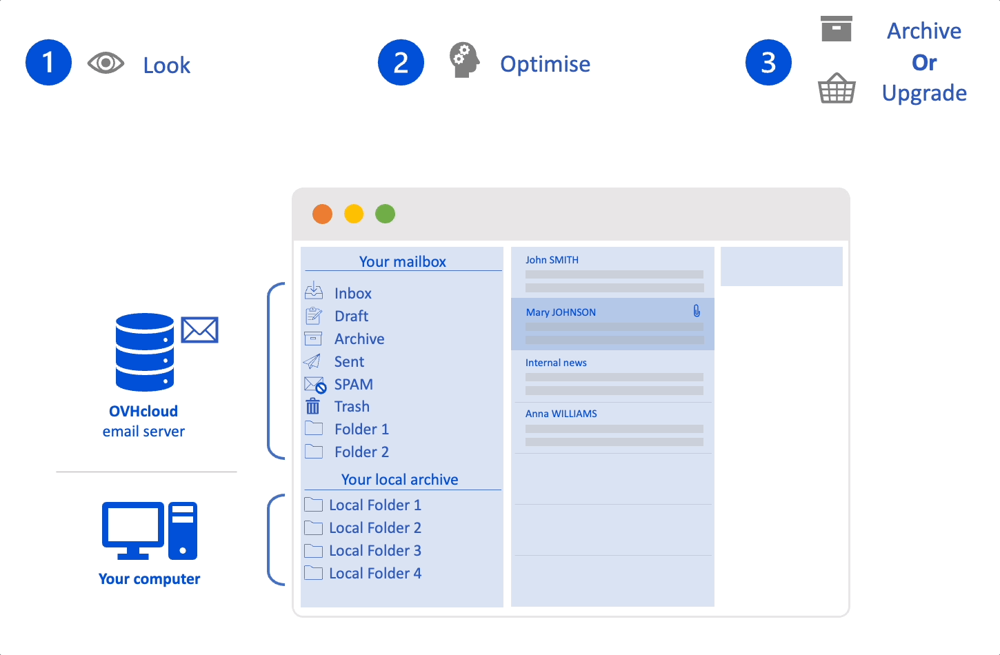
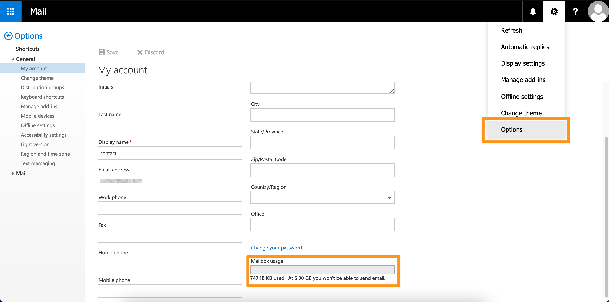
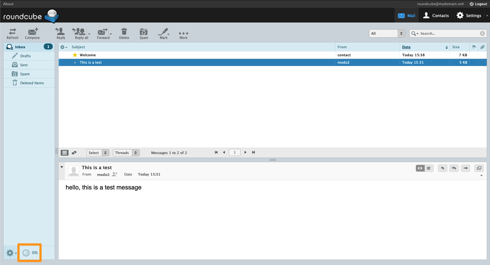
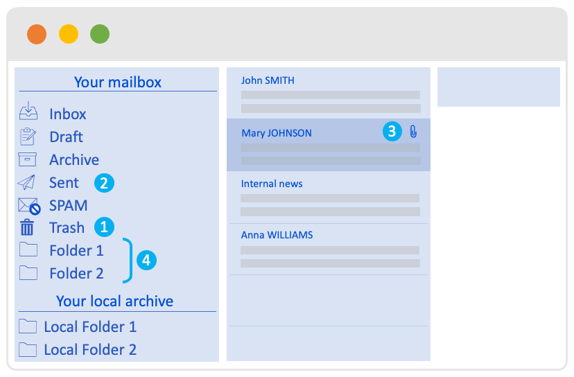
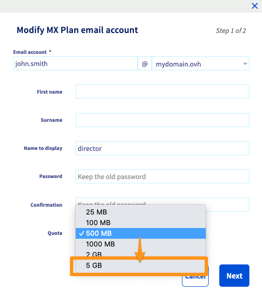
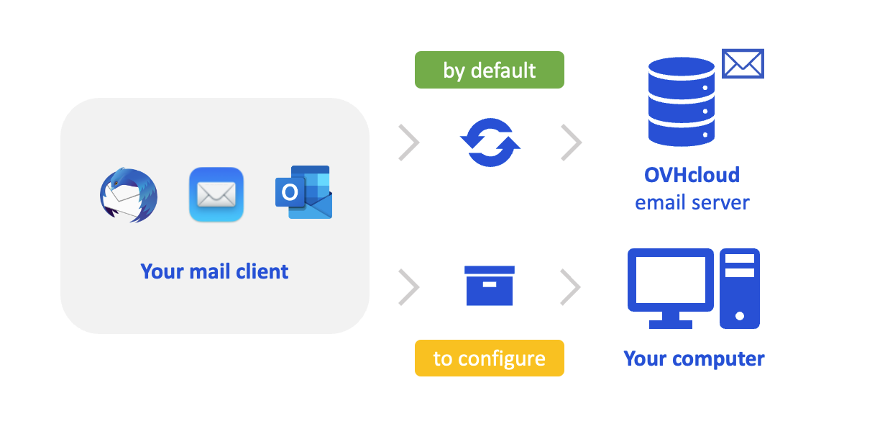

**Last updated 17th November 2022**

## Objective

Every OVHcloud email account has a dedicated storage space. By managing your storage space properly, you can avoid it becoming saturated, also known as “overquota”. By default, the emails you receive and send are stored on the server of your email account. You can also store your emails locally on your computer using an email client (Outlook, MacOS Mail, Thunderbird, etc.).

**Find out how to manage and optimise an email address storage space.**

## Requirements

- a pre-configured OVHcloud email solution (**MX Plan**, available as part of our [web hosting plans](https://www.ovhcloud.com/en-ie/web-hosting/), included in a [free Start10M hosting](https://www.ovhcloud.com/en-ie/domains/free-web-hosting/) package or ordered separately as a standalone solution, such as [**Hosted Exchange**](https://www.ovhcloud.com/en-ie/emails/hosted-exchange/) or [**Email Pro**](https://www.ovhcloud.com/en-ie/emails/email-pro/)) ;
- access to the [OVHcloud Control Panel](https://www.ovh.com/auth/?action=gotomanager&from=https://www.ovh.ie/&ovhSubsidiary=ie){.external}, and `Web Cloud`{.action} section ;
- access to the email addresses concerned.

> [!primary]
>
> **Special cases**
>
> - Regarding the free Start 10M hosting solution, you will need to activate it beforehand in order to create an email address. You can do this from your [OVHcloud Control Panel](https://www.ovh.com/auth/?action=gotomanager&from=https://www.ovh.ie/&ovhSubsidiary=ie){.external} by going to the domain name concerned.
> - For [web hosting plans](https://www.ovhcloud.com/en-ie/web-hosting/){.external}, you will need to activate your MX Plan package before continuing to read this guide. To do this, please refer to our guide on [Activating the email addresses included in your web](https://docs.ovh.com/ie/en/hosting/activate-email-web-hosting/) hosting plan.

## In practice 

The storage space management for your email account will be broken down into 3 steps in this guide. They can be done in order or independently, depending on your need.

- [**Check**](#check-quota) the current quota for your email account. In this step, you can evaluate your current resource usage, for the next 2 steps.
- [**Optimise**](#optimise) your email account. In this step, you will find tips that will help you maintain a storage space without any extra elements.
- [**Archive** or **Change email**](#archiveorswitch) offer. If the previous step is not enough, you will find the information you need to set up a local archive space (on your computer) for your emails via your email software. You will also find the information you need to change your account’s email solution to an offer with more storage space.

{.thumbnail}

### 1- **Check** your email account quota 

You can do this via the OVHcloud Control Panel if you are managing the email service concerned, or via webmail if you are the sole user of the email account.

#### From the Control Panel 

In the [OVHcloud Control Panel](https://www.ovh.com/auth/?action=gotomanager&from=https://www.ovh.ie/&ovhSubsidiary=ie){.external}, go to the `Web Cloud`{.action} section, then follow the instructions for your solution:

> [!tabs]
> **Emails (MXplan)**
>>
>> Click `Emails`{.action}, then choose the name of the MX Plan service concerned. Go to the `Email`{.action} accounts tab. The window that appears will display the existing email accounts. In the `Size` column, you can see your email address’s current storage consumption.  
>>{.thumbnail} 
>>
> **Email Pro**
>>
>> Click `Email Pro`{.action}, then choose the name of the platform concerned. Go to the `Email`{.action} accounts tab. The window that appears will display the existing email accounts. In the `Size` column, you can see your email address’s current storage consumption.  
>>{.thumbnail} 
>>
> **Exchange**
>>
>> Click `Microsoft`{.action} / `Exchange`{.action}, then choose the name of the platform concerned. Go to the `Email`{.action} accounts tab. The window that appears will display the existing email accounts. In the `Size` column, you can see your email address’s current storage consumption.  
>>{.thumbnail} 
>>

#### From webmail 

To log in to webmail, go to the page <https://www.ovhcloud.com/en-ie/mail/> and enter the login information for your email account. Then select the webmail address for your solution below:

> [!tabs]
> **OWA**: **Emails (MXplan)** / **Email Pro** / **Exchange**
>>
>> Click the button on the <i class="icons-gear-concept icons-masterbrand-blue"></i>top right of your screen, then click `Options`{.action}. Click `My Account`{.action} in the `General`{.action} section in the left-hand column. You can view your account’s current quota in the lower right-hand corner of the form.  
>>{.thumbnail} 
>>
> **Roundcube**: **Emails (MXplan)**
>>
>> When you are logged in to Roundcube webmail, the quota is visible in the lower left-hand corner, marked with a pie chart and the percentage used.  
>>{.thumbnail} 
>>

### 2- **Optimise** your email account 

If your email account is full, you will no longer be able to receive emails. 
When a person sends you an email, they receive an error email in the form of an automatic reply, such as *"552, "5.2.2". The email account to which you sent a message has exhausted its quota."*. 
When your email account is full, you can always send emails on your side. However, these emails cannot be stored in your "sent messages".

#### Optimise the space allocated to your email account

Before you perform any other operation on your email account, you will need to familiarise yourself with the content of your email account, in order to remove any unnecessary elements. Please check some of them:

- `1`{.action} **The Trash**: it contains the items you have deleted. To avoid cumulating emails in this folder, we recommend emptying the trash regularly.
- `2`{.action} **Items sent (sent messages)**: when you send an email, it is sent to the recipient. However, it is also stored on your email account in the “sent items”. We recommend that you regularly purge this folder, or archive its contents locally on your computer or on a remote cloud storage space.
- `3`{.action} **Stored emails containing large** attachments: emails with attachments take up more space on your email account. We recommend storing large items on local (computer) or remote (cloud) storage space.
- `4`{.action}**Sort records**: when you have a lot of folders on your email account, it is less easy to measure the space taken up on your email account. Take regular inventory of your files and their contents.

{.thumbnail}

#### Increase the capacity of your email account

You can increase the storage capacity of your email account, if it has not reached its maximum capacity. Below, you will find the approach to follow, depending on your solution:

> [!tabs]
> **Emails (MXplan)**
>>
>> The capacity of an MXplan account can range from 2.5 MB to 5 GB. If it is full and its capacity is less than 5 GB, you can modify its capacity via the [OVHcloud Control Panel](https://www.ovh.com/auth/?action=gotomanager&from=https://www.ovh.com/fr/&ovhSubsidiary=fr). 
>> In the `Email accounts`{.action} tab, click the button to the right <i class="icons-ellipsis icons-border-rounded icons-masterbrand-blue"></i>of the account you want to change, and then click `Edit`{.action}.
>> From the `Quota`{.action} box, select the size that suits you, click `Next`{.action}, then `Confirm`{.action}.  
>> {.thumbnail} 
>>
> **Email Pro**
>> 
>> La solución Email Pro dispone de una capacidad única de 10 GB. Si necesita un mayor almacenamiento, deberá contratar un plan que le ofrezca más espacio. Para ello, lea el apartado [cambiar de plan para aumentar su capacidad](#switchingoffer) de esta guía. 
>>
> **Exchange**
>>
>> If your Exchange account reaches 50 GB saturation, it is possible for the **Hosted** and **Provider** offers to subscribe to an extension option to extend its capacity to 300 GB. 
>> From the `Email accounts`{.action} tab on your platform, click the <i class="icons-ellipsis icons-border-rounded icons-masterbrand-blue"></i> button to the right of the account you want to modify, then click on `Increase capacity to 300GB`{.action}. Choose the billing method that best suits you and click `Validate`{.action}.  
>>{.thumbnail} 
>>
>> If your Exchange account has already filled up its 300 GB of storage on a **Hosted** or **Provider** offer, you will need to free up space on your Exchange account by deleting unnecessary items or [archive your emails](#archiveorswitch) on your computer locally. This also applies to 50 GB Exchange accounts that are included in a **Private** solution.
>>

### 3- **Archive** or **change your email solution** 

#### Archive your emails locally on your computer

> [!warning]
> 
> The following information is based on an IMAP configuration for your email account, which is the most common configuration. The POP configuration is based on the principle of storing emails locally. In our context, it is therefore not relevant to archive emails that are already stored locally on your computer.

When you set up your email address on your email client in IMAP, by **default**, the visible content corresponds to what is **synced on the email** server. This means that the emails are loaded on your computer but disappear if they are deleted from the server. To **archive them to your computer**, you must configure your email software.

{.thumbnail}

If you want, you can free the storage space of your email account by storing your emails directly on your computer. To do this, you will need to use an email client installed on your computer.
The role of email software is to convert your emails into files, so that they can be stored on your computer. However, you will need to configure your email software’s archive feature. The emails will then be in a "local" folder and not directly on the server of your email account.

Below is a non-exhaustive list of configuration guides for email clients on computers, depending on the solution you have:

Below is a non-exhaustive list of configuration guides for email clients using:

- IMAP protocol on the **MXplan** and **Email Pro** offers
- the MAPI protocol on the **Exchange** offer for Outlook Windows
- the EWS protocol on the **Exchange** offer for Outlook macOS.

> [!tabs]
> **Emails (MXplan)**
>>
>> Configuring an MXplan account on **Windows**:  
>> - [Mail on Windows 10](https://docs.ovh.com/ie/en/emails/mail-configuration-windows-10/) (included with Windows) 
>> - [Outlook for Mxplan](https://docs.ovh.com/ie/en/emails/configuration-outlook-2016/)
>> - [Thunderbird](https://docs.ovh.com/ie/en/emails/configure-email-for-thunderbird-windows/) (free)  
>> Configuring an MXplan account on **macOS**:  
>> - [Mail](https://docs.ovh.com/ie/en/emails/guide-configuring-mail-on-macos/) (included with macOS) 
>> - [Outlook](https://docs.ovh.com/ie/en/emails/configuration-outlook-2016-mac/) 
>> - [Thunderbird](https://docs.ovh.com/ie/en/emails/configure-email-for-thunderbird-mac/) (free) 

>>
> **Email Pro**
>>
>> Configuring an Email Pro account on **Windows**:  
>> - [Mail on Windows 10](https://docs.ovh.com/ie/en/emails-pro/mail-configuration-windows-10/) (included with Windows) 
>> - [Outlook](https://docs.ovh.com/ie/en/emails-pro/configuration-outlook-2016/) 
>> - [Thunderbird](https://docs.ovh.com/ie/en/emails-pro/configure-emailpro-for-thunderbird-windows/) (free)  
>> Configuring an Email Pro account on **macOS**:  
>> - [Mail](https://docs.ovh.com/ie/en/emails-pro/configuring-email-pro-macos-mail/) (included with macOS) 
>> - [Outlook](https://docs.ovh.com/ie/en/emails-pro/configuration-outlook-2016-mac/) 
>> - [Thunderbird](https://docs.ovh.com/ie/en/emails-pro/configure-emailpro-for-thunderbird-mac/) (free) 
>>
> **Exchange**
>>
>> Configuring an Exchange account on **Windows**:  
>> - [Mail on Windows 10](https://docs.ovh.com/ie/en/microsoft-collaborative-solutions/mail-configuration-windows-10/) (included with Windows) 
>> - [Outlook](https://docs.ovh.com/ie/en/microsoft-collaborative-solutions/configuration-outlook-2016/) 
>> - [Thunderbird](https://docs.ovh.com/ie/en/microsoft-collaborative-solutions/exchange-configuration-thunderbird/) (free)  
>> Configuring an Exchange account on **macOS**:  
>> - [Mail](https://docs.ovh.com/ie/en/microsoft-collaborative-solutions/exchange-automatic-configuration-on-mail-mac/) (included with macOS) 
>> - [Outlook](https://docs.ovh.com/ie/en/microsoft-collaborative-solutions/configuration-outlook-2016-mac/) 
>> - [Thunderbird](https://docs.ovh.com/ie/en/microsoft-collaborative-solutions/exchange-configuration-thunderbird-mac/) (free) 
>>

Once you have installed your email software, follow the instructions below to prepare the archive folder on your email software.

> [!tabs]
> **Outlook**
>>
>> In Outlook, make sure that the folder "archive" or "on my computer" is present in your left-hand column so that you can put the items you want to keep locally on your computer. See the Microsoft documentation for preparing your archive folder:  
>> - [Archiving in Outlook for Windows](https://support.microsoft.com/en-us/office/archive-in-outlook-for-windows-25f75777-3cdc-4c77-9783-5929c7b47028){.external} 
>> - [About folders on my computer in Outlook for Mac](https://support.microsoft.com/en-us/office/about-on-my-computer-folders-in-outlook-for-mac-c91b8729-924d-4c25-a5f6-38883d0f763d){.external} 
>>
> **Mail macOS**
>>
>> From Mail on macOS, create a folder that will appear in the "On my Mac" section in the left-hand column. To do this, follow the Apple documentation:  
>> - [Create or delete mailboxes in Mail on Mac](https://support.apple.com/en-ie/guide/mail/mlhlp1021/15.0/mac/12.0){.external} 
>>
> **Thunderbird**
>>
>> Via thunderbird from Windows, macOS or Linux, you can move your emails to a folder in the left pane. Use the Mozilla documentation:  
>> - [Message Archiving](https://support.mozilla.org/en-US/kb/archived-messages){.external} 
>>

#### Change solution to increase capacity 

Select the current solution for your email account from the menu below:

> [!tabs]
> **Emails (MXplan)**
>>
>> If your email account already has a maximum capacity of 5 GB, you can opt for a migration to a [10 GB **Email Pro** offer](https://www.ovhcloud.com/en-ie/emails/email-pro/) or a 50 GB [**Hosted Exchange** offer](https://www.ovhcloud.com/en-ie/emails/hosted-exchange/). To do this, please order the solution that suits you, and follow our guide on [Migrating an MX Plan email address to an Email Pro or Exchange](https://docs.ovh.com/ie/en/microsoft-collaborative-solutions/migration-email-address-to-exchange/) account. 
>>
> **Email Pro**
>>
>> The Email Pro offer has a unique capacity of 10GB. You can choose to migrate to a [50 GB **Hosted Exchange** solution](https://www.ovhcloud.com/en-ie/emails/hosted-exchange/). To do this, please order the solution that suits you, and follow our guide on [Migrating your email addresses from one OVHcloud email platform to another](https://docs.ovh.com/ie/en/microsoft-collaborative-solutions/migration-email-platform/).
>>
> **Exchange**
>>
>> If your Exchange account is saturated with 50 GB of space, you can subscribe to an extension option to expand its capacity to 300 GB. This only if the Exchange account is on a **Hosted** or **Provider** offer. 
>> In the `Email accounts`{.action} tab on your Exchange platform, click the button to the right <i class="icons-ellipsis icons-border-rounded icons-masterbrand-blue"></i>of the account you want to modify, then click `Increase capacity to 300 GB`{.action}.  
>> {.thumbnail} 
>>

## Go further

[Migrate an MX Plan email address to an Email Pro or Exchange account](https://docs.ovh.com/ie/en/microsoft-collaborative-solutions/migration-email-address-to-exchange/)

[Manually migrate your email address](https://docs.ovh.com/ie/en/emails/migrate-email-addresses-manually/)

[Migrate your email addresses from one OVHcloud email platform to another](https://docs.ovh.com/ie/en/microsoft-collaborative-solutions/migration-email-platform/)

If you would like assistance using and configuring your OVHcloud solutions, please refer to our [support offers](https://www.ovhcloud.com/en-ie/support-levels/).

Join our community of users on <https://community.ovh.com/en/>.
