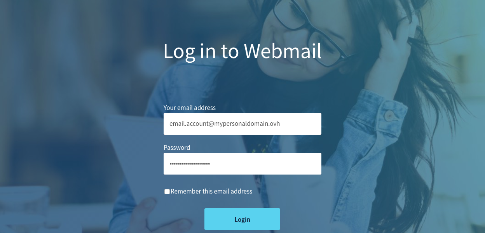
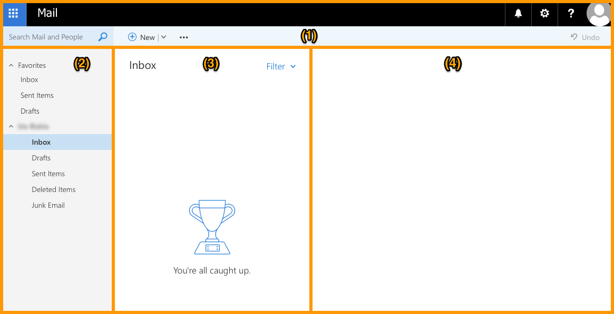
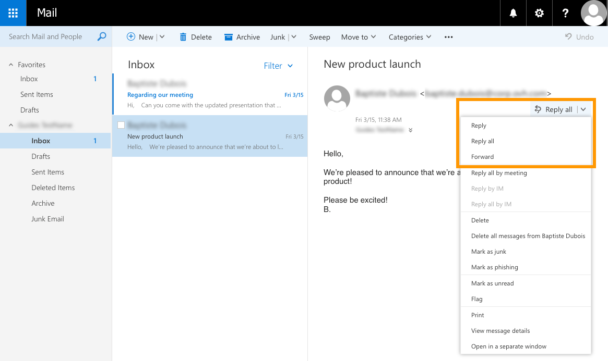
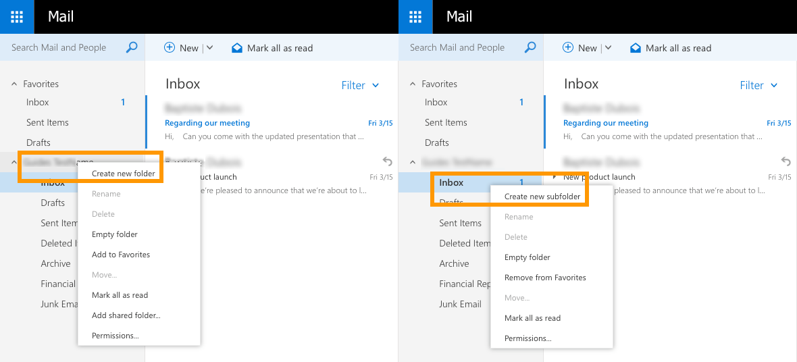
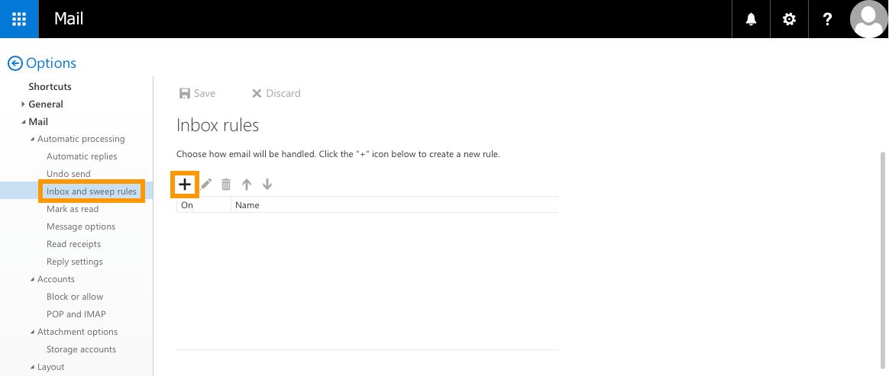
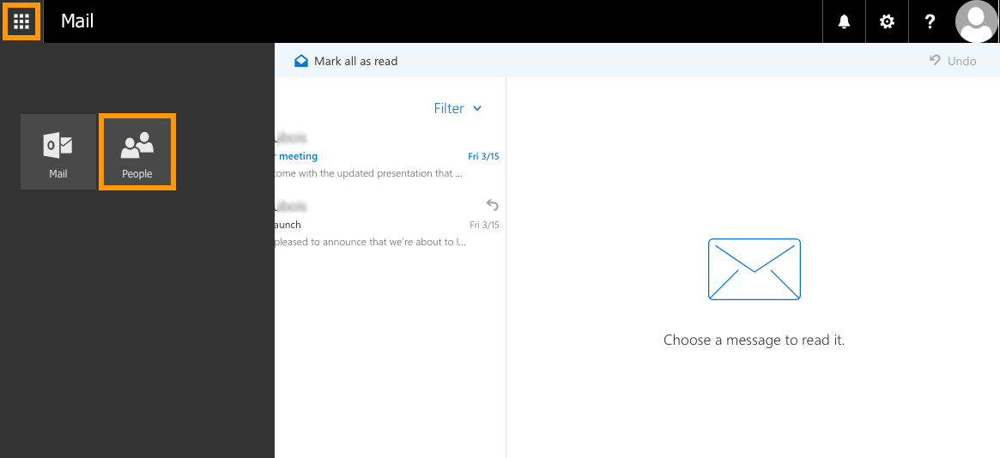
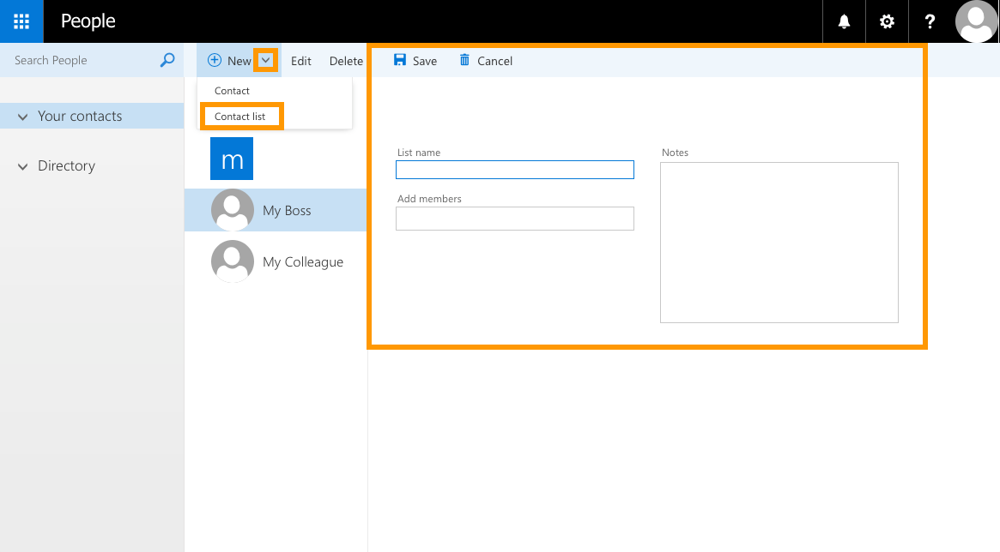

**Ultimo aggiornamento: 05/07/2019**

## Obiettivo

Gli account email della soluzione MX Plan consentono di inviare e ricevere messaggi da qualsiasi dispositivo. Per semplificarne l’utilizzo, OVH mette a disposizione l’applicazione online _Outlook on the web_, disponibile all’indirizzo: [https://www.ovh.it/mail/](https://www.ovh.it/mail/){.external} 

**Questa guida ti mostra come eseguire le operazioni più comuni sul tuo account di posta tramite la Webmail Outlook on the web.**

## Prerequisiti

- Disporre di una soluzione MX Plan (il servizio è disponibile con un piano di [hosting Web OVH](https://www.ovh.it/hosting-web/){.external}, un [hosting gratuito Start 10M](https://www.ovh.it/domini/offerta_hosting_start10m.xml){.external} o una soluzione MX Plan ordinata separatamente)
- Disporre delle credenziali associate all’account email da utilizzare

## Procedura

Il servizio _Outlook on the web_ permette di gestire il proprio account direttamente da browser ed eseguire operazioni base come, ad esempio:

1. [Connettersi alla Webmail _Outlook on the web_](./#1-connettersi-alla-webmail-owa)
2. [Comprendere l’interfaccia della Webmail](./#2-comprendere-l-interfaccia-della-webmail)
3. [Consultare le email](./#3-consultare-le-email)
4. [Inviare o rispondere a un’email](./#4-inviare-o-rispondere-a-un-email)
5. [Organizzare la casella della posta in arrivo](./#5-organizzare-la-casella-della-posta-in-arrivo)
6. [Gestire la rubrica](./#6-gestire-la-rubrica_1)
7. [Modificare la password](./#7-modificare-la-password)
8. [Configurare una risposta automatica](./#8-configurare-una-risposta-automatica)
9. [Aggiungere una firma](./#9-aggiungere-una-firma)
10. [Accedere alle opzioni](./#10-accedere-alle-opzioni)

> [!primary]
>
> L’interfaccia di _Outlook on the web_ non è stata creata da OVH ed è quindi possibile che alcune operazioni non siano descritte in questa guida. In caso di difficoltà o dubbi, ti consigliamo di consultare le informazioni disponibili online o rivolgerti a un esperto del settore.
>

### 1. Connettersi alla Webmail _Outlook on the web_

Per consultare il tuo account di posta dalla Webmail _Outlook on the web_ accedi alla [pagina di connessione](https://www.ovh.it/mail/){.external}, inserisci le tue credenziali e clicca sul pulsante `Connessione`{.action}.

{.thumbnail}

Se è la prima volta che esegui l’accesso da questo indirizzo email, ti verrà chiesto di selezionare la lingua dell’interfaccia utente e definire il fuso orario della tua area geografica. Una volta impostati questi parametri, clicca su `Salva`{.action}.

{.thumbnail}

Si apre di default la casella della posta in arrivo:

{.thumbnail}

### 2. Comprendere l’interfaccia della Webmail

La pagina principale della Webmail è suddivisa in diverse sezioni, descritte nella tabella e nell’immagine qui sotto:

|Sezione|Descrizione|  
|---|---|  
|Parte superiore (1)|Contiene due righe orizzontali: la prima consente di gestire i parametri generali (ad esempio, accedere alle impostazioni), la seconda di effettuare azioni precise (come inviare e rispondere a un messaggio).|  
|Parte laterale sinistra (2)|Contiene l’elenco delle cartelle della casella di posta, con una struttura espandibile e comprimibile.|
|Parte centrale (3)|Contiene la lista dei messaggi (letti e non letti) della cartella selezionata nella parte laterale sinistra oppure mostra i risultati di una ricerca.|
|Parte laterale destra (4)|Mostra il contenuto del messaggio selezionato.|

{.thumbnail}

### 3. Consultare le email

Per visualizzare i messaggi di posta, posizionati su una delle cartelle nella colonna a sinistra. Tutte le email ricevute si trovano di default nella cartella “Posta in arrivo”. L’eventuale numero presente in corrispondenza di una cartella indica i nuovi messaggi ricevuti.

Per consultare un’email, clicca su una cartella: i messaggi in essa contenuti verranno mostrati nella parte centrale. Quelli non letti saranno di colore diverso per poter essere facilmente distinti dagli altri. 

{.thumbnail}

Clicca sull’email per visualizzarne il contenuto nella parte laterale destra.

{.thumbnail}

### 4. Inviare o rispondere a un’email

**Per inviare un nuovo messaggio** clicca sul pulsante `Nuovo`{.action} nella parte superiore dell’interfaccia: l’area di testo compare nella parte laterale destra. Completa i campi del messaggio (destinatari, oggetto, testo, eventuali allegati) e clicca su `Invia`{.action}.

{.thumbnail}

**Per rispondere a un’email** ricevuta seleziona il messaggio per visualizzarne il contenuto e clicca su `Rispondi a tutti`{.action}. Utilizza l’icona a forma di freccia verso il basso per inoltrare l’email o rispondere al mittente escludendo i contatti in copia.

{.thumbnail}

Una volta selezionata l’opzione desiderata, sopra il messaggio compare una nuova area di testo: scrivi la risposta e clicca su `Invia`{.action}.

{.thumbnail}

### 5. Organizzare la casella della posta in arrivo

Per gestire la posta in arrivo sono disponibili diverse opzioni: 

- [creare cartelle e sottocartelle](./#creare-una-cartella)
- [spostare messaggi](./#spostare-un-messaggio)
- [creare regole](./#creare-una-regola) per eseguire azioni automatiche alla ricezione di nuovi messaggi 

#### Creare una cartella

**Per aggiungere una cartella**, seleziona il nome del tuo indirizzo email nella colonna a sinistra e clicca su `Crea nuova cartella`{.action}. Se invece vuoi creare una sottocartella, seleziona una cartella esistente e clicca su `Crea nuova sottocartella`{.action}. 

{.thumbnail}

#### Spostare un messaggio

Per effettuare questa operazione seleziona il messaggio e trascinalo nella cartella in cui vuoi spostarlo.
**Per spostare più messaggi contemporaneamente**, selezionali spuntando la casella corrispondente e clicca su `Sposta`{.action} (nella parte laterale destra) o `Sposta in`{.action} (nella barra superiore). A questo punto, scegli la cartella di destinazione.

{.thumbnail}

#### Creare una regola

Per effettuare questa operazione clicca sull’icona a forma di ingranaggio in alto a destra e seleziona `Opzioni`{.action}.

{.thumbnail}

Nella colonna a sinistra della nuova pagina, clicca su `Regole Posta in arrivo e organizzazione`{.action} nella sezione “Posta” > “Elaborazione automatica”. Questa opzione permette di creare, modificare, rimuovere o spostare le regole della lista. 

> [!primary]
>
> Nel caso in cui vengano create più regole con le stesse condizioni, verrà eseguita solo la prima della lista.
>

Per aggiungere una nuova regola, clicca sul simbolo `+`{.action}. 

{.thumbnail}

Completa le informazioni richieste in base all’azione da effettuare e clicca su `OK`{.action}. 

{.thumbnail}

### 6. Gestire la rubrica

Per accedere alla gestione dei contatti clicca sull’icona con nove quadrati in alto a sinistra e seleziona `Persone`{.action}.

{.thumbnail}

Nella nuova pagina è possibile aggiungere nuovi contatti, creare una lista o rimuovere contatti già esistenti. 

**Per aggiungere nuovi contatti** clicca su `Nuovo`{.action}, inserisci le informazioni richieste e clicca su `Salva`{.action} per confermare l’operazione.

{.thumbnail}

**Per creare una lista di contatti** clicca sull’icona a forma di freccia verso il basso vicino a “Nuovo” e seleziona `Elenco contatti`{.action}. Assegna un nome, aggiungi i membri della lista e clicca su `Salva`{.action} per confermare l’operazione.

{.thumbnail}

### 7. Modificare la password

Una volta effettuato l’accesso a _Outlook on the web_, è possibile modificare la password associata. Per prima cosa clicca sull’icona a forma di ingranaggio in alto a destra e seleziona `Opzioni`{.action}.

{.thumbnail}

Apri la sezione “Generale” nella colonna di sinistra, clicca su `Il mio account`{.action} e seleziona ` Modifica password`{.action}.

{.thumbnail}

Si apre una finestra: inserisci prima la password corrente e poi quella nuova, confermala e infine clicca su `Salva`{.action}.

> [!primary]
>
> Se imposti una nuova password per il tuo account, sarà necessario apportare la stessa modifica su tutti i dispositivi su cui l’account email è stato configurato.
>

{.thumbnail}

### 8. Configurare una risposta automatica

Una volta effettuato l’accesso a _Outlook on the web_, è possibile creare risposte automatiche in caso di assenza o esigenze particolari. Per utilizzare questa funzionalità clicca sull’icona a forma di ingranaggio in alto a destra e seleziona `Risposte automatiche`{.action}.

{.thumbnail}

Nella nuova finestra seleziona “Invia risposte automatiche”. Questa opzione può essere configurata secondo diversi criteri:
- invio di messaggi durante intervalli di tempo definiti o fino alla disattivazione
- definizione dei destinatari dei messaggi di risposta automatici (solo persone interne alla propria organizzazione o anche mittenti esterni)

Completa le informazioni richieste in base all’azione da effettuare e clicca su `OK`{.action}. 

{.thumbnail}

### 9. Aggiungere una firma

Per utilizzare questa funzionalità clicca sull’icona a forma di ingranaggio in alto a destra e seleziona `Opzioni`{.action}.

{.thumbnail}

Nella colonna a sinistra della nuova pagina, clicca su `Firma di posta elettronica`{.action} nella sezione “Posta” > “Layout”. Da questa interfaccia è possibile attivare o disattivare l’utilizzo della firma e modificarne il contenuto.

{.thumbnail}

Per modificare la firma, utilizza l’apposita area di testo. Puoi anche scegliere se includere automaticamente la firma nei nuovi messaggi, in quelli inoltrati o nelle email di risposta. Una volta completata la configurazione clicca su `Salva`{.action} per confermare i parametri inseriti. 

### 10. Accedere alle opzioni

Per eseguire questa operazione clicca sull’icona a forma di ingranaggio in alto a destra e seleziona `Opzioni`{.action}.

{.thumbnail}

Le opzioni disponibili per il tuo account sono elencate nella colonna a sinistra:

{.thumbnail}

## Per saperne di più

Contatta la nostra Community di utenti all’indirizzo <https://www.ovh.it/community/>.