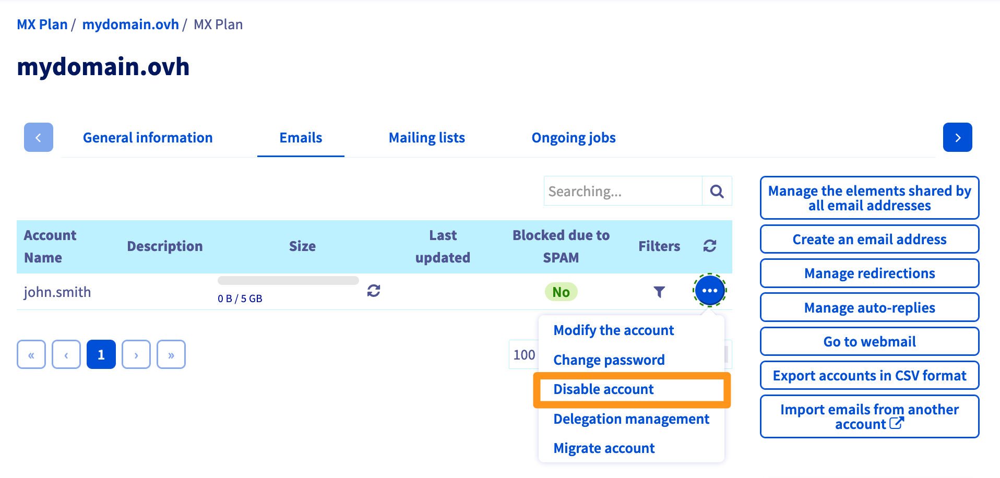

**Dernière mise à jour le 17/11/2022**

## Objectif

Vous souhaitez supprimer une adresse e-mail que vous n'utilisez plus. Réinitialiser un compte e-mail pour l'utiliser sur une nouvelle adresse e-mail. Ou encore réinitialiser un compte e-mail pour le résilier.

**Découvrez comment supprimer ou réinitialiser une adresse e-mail sur votre offre e-mail**

## Prérequis

- Disposer d'une solution e-mail OVHcloud préalablement configurée (**MX Plan**, proposée parmi nos [offres d’hébergement web](https://www.ovhcloud.com/fr/web-hosting/), incluse dans un [hébergement Start10M gratuit](https://www.ovhcloud.com/fr/domains/free-web-hosting/) ou commandée séparément comme solution autonome, telle que [**Hosted Exchange**](https://www.ovhcloud.com/fr/emails/hosted-exchange/) ou [**Email Pro**](https://www.ovhcloud.com/fr/emails/email-pro/)).
- Être connecté à l'[espace client OVHcloud](https://www.ovh.com/auth/?action=gotomanager&from=https://www.ovh.com/fr/&ovhSubsidiary=fr){.external}, partie `Web Cloud`{.action}.
- Disposer des informations de connexion aux adresses e-mail concernées.

## En pratique 

OVHcloud propose 3 solutions e-mail, la notion de suppression de compte est différente selon votre offre.

- **Email MXplan** : cette offre est vendue par pack de plusieurs comptes e-mail. Lorsque vous supprimez un compte, vous libérez un emplacement sur votre pack. 
- **Email Pro** et **Hosted Exchange** : Ces deux offres sont à la carte, vous commandez un abonnement individuel par compte e-mail. Lorsque vous voulez supprimer une adresse e-mail, on parlera de **réinitialisation**. Une fois le compte e-mail réinitialisé, vous pouvez réutiliser ce compte pour créer une nouvelle adresse e-mail. Vous pouvez aussi résilier l'abonnement de ce compte si vous souhaitez le supprimer définitivement.

### Supprimer ou réinitialiser un compte e-mail

Sélectionnez l'onglet correspondant à votre offre e-mail (S) :

> [!tabs]
> **Emails MXplan historique**
>>
>> Pour vérifier si votre offre MXplab est une version historique, référez-vous au tableau de la partie [Identifiez votre offre MXplan](#whichmxplan")  
>>
>> Cliquez sur `Emails`{.action} puis choisissez le nom du service MX Plan concerné. Positionnez-vous sur l'onglet `Comptes e-mail`{.action}. La fenêtre qui apparaît affiche les comptes e-mail existants. Cliquez sur le bouton <i class="icons-ellipsis icons-border-rounded icons-masterbrand-blue"></i> à droite du compte à modifier, puis cliquez sur `Supprimer le compte`{.action}.  
>>{.thumbnail} 
>>
> **Emails MXplan nouvelle version**
>>
>> Pour vérifier si votre offre MXplan est une version historique, référez-vous au tableau de la partie [Identifiez votre offre MXplan](#whichmxplan")  
>> Cliquez sur `Emails`{.action} puis choisissez le nom du service MX Plan concerné. Positionnez-vous sur l'onglet `Comptes e-mail`{.action}. La fenêtre qui apparaît affiche les comptes e-mail existants. Cliquez sur le bouton <i class="icons-ellipsis icons-border-rounded icons-masterbrand-blue"></i> à droite du compte à modifier, puis cliquez sur `Réinitialiser ce compte`{.action}.  
>>{.thumbnail} 
>>
> **Email Pro**
>>
>> Cliquez sur `E-mail Pro`{.action}, puis choisissez le nom de la plateforme concernée. Positionnez-vous sur l'onglet `Comptes e-mail`{.action}. La fenêtre qui apparaît affiche les comptes e-mail existants. Cliquez sur le bouton <i class="icons-ellipsis icons-border-rounded icons-masterbrand-blue"></i> à droite du compte à modifier, puis cliquez sur `Réinitialiser ce compte`{.action}.  
>> Après réinitialisation de votre compte, si vous souhaitez le supprimer définitivement, vous devrez le résilier. [Premiers pas avec la solution E-mail Pro](https://docs.ovh.com/fr/emails-pro/premiere-configuration/)  
>>{.thumbnail} 
>>
> **Exchange**
>>
>> Cliquez sur `Microsoft`{.action} / `Exchange`{.action}, puis choisissez le nom de la plateforme concernée. Positionnez-vous sur l'onglet `Comptes e-mail`{.action}. Cliquez sur le bouton <i class="icons-ellipsis icons-border-rounded icons-masterbrand-blue"></i> à droite du compte à modifier, puis cliquez sur `Réinitialiser`{.action}.  
>> Après réinitialisation de votre compte, si vous souhaitez le supprimer définitivement, vous devrez le résilier. Pour cela, consultez notre guide [Gérer la facturation de vos comptes Exchange](https://docs.ovh.com/fr/microsoft-collaborative-solutions/gestion-facturation-exchange/)  
>>{.thumbnail} 
>>

### Identifiez votre offre MXplan 

Vous trouverez dans le tableau ci-dessous, les informations nécessaires pour identifier votre offre MXplan

|Version historique de l'offre MX Plan|Nouvelle version de l'offre MX Plan|
|---|---|
|{.thumbnail}  Repérez l'offre dans le cadre « Abonnement »|{.thumbnail} Repérez la « Référence serveur » dans le cadre « Résumé »|
|Sélectionnez l'onglet **Emails MXplan historique** ci-dessous |Sélectionnez l'onglet **Emails MXplan nouvelle version** ci-dessous | 

## Aller plus loin

[Premiers pas avec la solution MXplan](https://docs.ovh.com/fr/emails/generalites-sur-les-emails-mutualises/)

[Premiers pas avec la solution E-mail Pro](https://docs.ovh.com/fr/emails-pro/premiere-configuration/)

[Premiers pas avec la solution Hosted Exchange](https://docs.ovh.com/fr/microsoft-collaborative-solutions/premiere-configuration-exchange/)

[Gérer la facturation de vos comptes Email Pro](hhttps://docs.ovh.com/fr/emails-pro/gestion-facturation-emailpro/)

[Gérer la facturation de vos comptes Exchange](https://docs.ovh.com/fr/microsoft-collaborative-solutions/gestion-facturation-exchange/)

Si vous souhaitez bénéficier d'une assistance à l'usage et à la configuration de vos solutions OVHcloud, nous vous proposons de consulter nos différentes [offres de support](https://www.ovhcloud.com/fr/support-levels/).

Échangez avec notre communauté d'utilisateurs sur <https://community.ovh.com/>.