## Desde la web de OVH
Acceda a [OVH.es](http://www.ovh.es) y haga clic en el enlace «Webmail» situado en la esquina superior derecha.

{.thumbnail}


## Página de conexión al webmail de OVH
Llegará a una pantalla en la que deberá introducir su dirección de correo electrónico. La interfaz le redirigirá directamente al webmail correspondiente a su servicio de correo OVH.

Si ya sabe qué tipo de servicio de correo tiene en OVH, puede seleccionar directamente el webmail en la parte inferior de la página, haciendo clic en el icono .

Haciendo clic en , accederá directamente a las guías relativas al webmail seleccionado.

{.thumbnail}
Si marca la casilla «Memorizar esta dirección», la dirección de correo introducida se guardará en el menú «Webmail» situado en la esquina superior derecha. Así podrá conectarse más fácilmente a esa dirección.


## Página de conexión al webmail de OVH
Llegará a la página de conexión al webmail de su servicio de correo.

Si la dirección de correo no aparece cumplimentada en el campo «Nombre de usuario», introdúzcala. Introduzca también la contraseña y haga clic en «Iniciar sesión».

{.thumbnail}


## Bandeja de entrada
Una vez se haya conectado a su cuenta de correo, podrá consultar sus mensajes. En la columna izquierda podrá ver las principales carpetas de su cuenta, entre las que se encuentra la bandeja de entrada y la carpeta de mensajes enviados.

En la parte inferior de esa misma columna se encuentra el botón de configuración de las carpetas y se puede visualizar el espacio utilizado de la cuenta de correo.

En el área derecha de la pantalla podrá visualizar todos los mensajes recibidos y ver los siguientes datos:


- asunto
- remitente
- fecha de recepción
- tamaño del mensaje
- si tiene archivos adjuntos (columna con un clip al final de la línea)
- posibles marcas asociadas al mensaje
- si ya ha leído el mensaje o no


Algunas columnas no aparecen por defecto, como las prioridades atribuidas a los mensajes. Para mostrarlas, es posible cambiar la visualización como se describe en el siguiente apartado.

{.thumbnail}


## Opciones de visualización y ordenación
Para acceder a esta opción, haga clic en el icono «Lista de opciones...» (con forma de engranaje), situado a la izquierda del asunto, en el área principal del correo.

Desde ahí podrá:

- elegir las columnas que quiere que muestren (prioridad del correo, etc.),
- elegir la columna sobre la que quiere que se aplique la ordenación por defecto,
- elegir el orden ascendente o descendente.


Acepte los cambios haciendo clic en «Guardar».

{.thumbnail}


## Mensajes de correo
El cliente de correo web Roundcube gestiona muy bien las principales opciones relativas al correo (acuses de recibo, marcas, archivos adjuntos, protección de la privacidad...).

La captura de pantalla de la imagen muestra una vista global de todas estas funcionalidades.

El número de mensajes no leídos se indica en la columna izquierda, junto a «Entrada».

En el área derecha, los emails no leídos se destacan en negrita.

Para cada mensaje, puede realizar las siguientes acciones:

- Responder: Permite responder directamente al emisor.
- Responder a todos: Permite responder a todas las direcciones que figuran en los campos «Destinatario» y «Cc».
- Reenviar: Permite transferir el mensaje seleccionado al destinatario o destinatarios que usted indique.
- Eliminar: Permite mover el mensaje seleccionado a la papelera.
- SPAM: Permite enviar el mensaje seleccionado directamente a la bandeja de correo no deseado, marcándolo como spam.
- Marcar: Para más información sobre esta opción, ver el siguiente apartado.
- Más: Para más información sobre esta opción, ver el siguiente apartado.


Si se marca un mensaje «como marcado» (ver siguiente apartado), se mostrará una bandera roja en la columna de marca.

Si se ha otorgado alguna prioridad al mensaje, se mostrará una flecha ascendente (la más alta, alta) o descendente (baja).

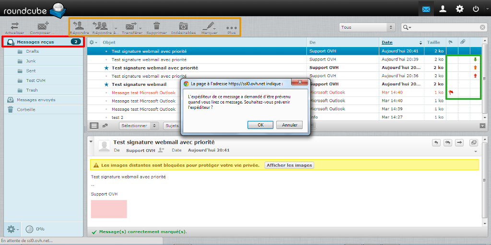{.thumbnail}
Si el emisor del mensaje ha solicitado notificación de lectura, cuando abra el email aparecerá el siguiente mensaje: «El emisor de este mensaje desea ser notificado cuando usted lo lea. ¿Quiere enviar esta notificación?» (ver imagen).


## Marcar un mensaje
Al hacer clic en la opción «Marcar», se abre el menú de la imagen. Desde ahí puede marcar un mensaje, eliminar la marca y marcar un mensaje como leído o no leído. Esta opción también funciona seleccionando varios emails. 

Estas opciones son útiles para destacar unos mensajes sobre otros.

{.thumbnail}


## Más
Al hacer clic en la opción «Más», se abre el menú de la imagen. Desde ahí puede realizar las siguientes acciones:

Imprimir este mensaje: Abre el mensaje en una nueva ventana, donde debe aceptar la impresión.
Descargar (.eml): Permite descargar el email en el ordenador en formato .eml.
Editar como nuevo: Permite editar un email conservando la maquetación del original.
Mostrar código: Permite ver el código fuente completo del mensaje, muy útil cuando necesita [la cabecera](https://www.ovh.es/g1365.obtener-cabeceras-email#clientes_de_correo_web_roundcube).
Abrir en nueva ventana: Permite abrir el mensaje en una nueva ventana, útil para consultar varios mensajes a la vez.

{.thumbnail}


## Acceder a la configuración
Es necesario estar conectado a su cuenta de correo en el webmail RoundCube.

Para acceder a la configuración de su buzón de correo, haga clic en el engranaje situado en la esquina superior derecha de la pantalla.

{.thumbnail}


## Interfaz de usuario
En «Interfaz de usuario» puede cambiar elementos como el idioma, el formato de fecha y hora o la apariencia de la interfaz.

En la imagen puede ver las otras opciones disponibles.

{.thumbnail}


## Vista de buzón
En «Vista de buzón» puede cambiar el número de mensajes mostrados para generar menos páginas, por ejemplo, si tiene muchos emails. También puede configurar la interfaz para que no se muestre la vista preliminar de los mensajes seleccionados y que sea necesario hacer doble clic para consultarlo.

En la imagen puede ver las otras opciones disponibles.

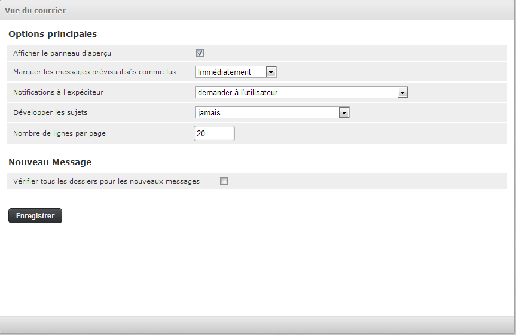{.thumbnail}


## Vista de mensajes
En «Vista de mensajes» puede configurar las opciones de visualización de sus mensajes en la interfaz (HTML o no, imágenes externas, juego de caracteres...).

En la imagen puede ver las otras opciones disponibles.

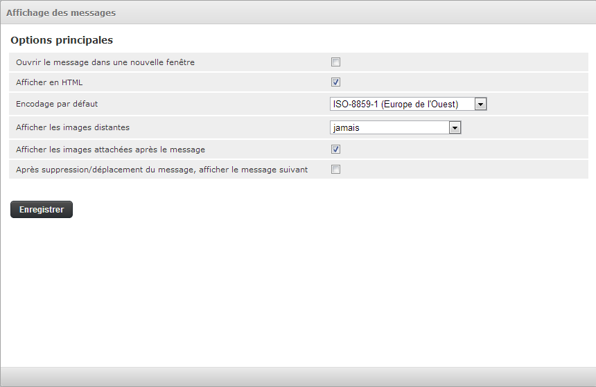{.thumbnail}


## Composición de mensajes
En «Composición de mensajes» puede elegir las distintas opciones relacionadas con la redacción del correo, como el formato, acuse de recibo, notificación de lectura, el tipo de letra, etc.

En la imagen puede ver las otras opciones disponibles.

En la nueva interfaz de Roundcube «Larry», la opción «Componer mensaje en HTML» está configurada por defecto en el valor «sólo en respuesta a un mensaje HTML».

Puede cambiarlo a «siempre» para enviar sus mensajes de correo en formato HTML.

{.thumbnail}


## Contactos
En «Contactos» puede elegir la libreta de direcciones utilizada por defecto (si se han creado varias [libretas de direcciones](#CARNET)) y las opciones de ordenación y visualización de los contactos.

En la imagen puede ver las otras opciones disponibles.

{.thumbnail}


## Bandejas especiales
En «Bandejas especiales» puede indicar usted mismo en qué carpeta guardar los borradores, los mensajes enviados, el spam y los emails que se envíen a la papelera.

Para crear carpetas personalizadas, consulte el apartado [«Configuración: Carpetas»](#DOSSIERS).

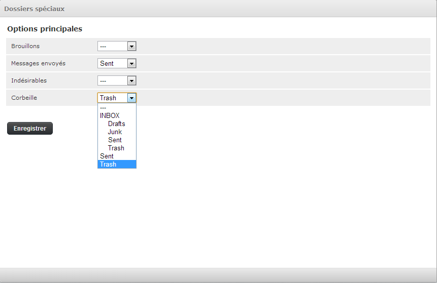{.thumbnail}


## Configuración del servidor
En «Configuración del servidor» puede configurar todo lo relativo a la eliminación del correo del servidor (desde el webmail).

En la imagen puede ver las opciones disponibles.

{.thumbnail}
Problema frecuente:
Si ya no recibe el correo porque el buzón está lleno e intenta eliminar mensajes para hacer espacio y volver a recibir emails, puede aparecer un mensaje de error indicando que no es posible eliminar los mensajes.
¿Qué ocurre?
Cuando se elimina un mensaje, este se copia en la papelera antes de borrarlo de la bandeja de entrada (de forma invisible para el usuario). Como el buzón está lleno, no es posible copiarlos. Por eso aparece el mensaje de error.
¿Cómo solucionarlo?
En la pantalla «Configuración del servidor», marque «Cuando falle trasladar los mensajes a la papelera, borrarlos». Así podrá eliminar los mensajes sin problemas.


## Crear una carpeta (1)
Para crear una carpeta personalizada y aislar los mensajes de un tema o un interlocutor concreto, haga clic en el icono «+», en la parte inferior de la segunda columna.

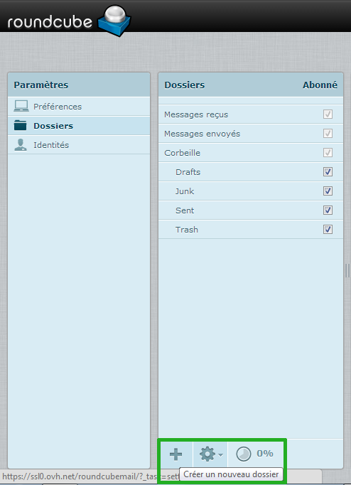{.thumbnail}


## Crear una carpeta (2)
En este caso, creamos la carpeta «Test OVH» en INBOX y los mensajes que contenga se visualizarán en forma de lista.

La INBOX es el término inglés para «Bandeja de entrada», así que la carpeta «Test OVH» se creará en la bandeja de entrada.

Haga clic en «Guardar» para finalizar la creación de la carpeta.

{.thumbnail}


## Crear una carpeta (3)
En la imagen podemos ver que la carpeta se ha creado correctamente.

En la estructura de carpetas podemos ver las siguientes:

- Entrada
- Borradores
- Enviados
- SPAM
- Papelera


{.thumbnail}


## Eliminar o editar una carpeta
Es muy sencillo eliminar una carpeta (atención a los mensajes que contiene una carpeta al eliminarla) o editarla.

Para eliminarla, seleccione la carpeta y haga clic en el engranaje situado en la parte inferior de la columna, donde podrá elegir entre eliminarla o vaciarla. También puede ver el porcentaje utilizado del buzón.

Para editar una carpeta, haga clic en ella. Podrá cambiar el nombre de la carpeta, la carpeta contenedora y el tipo de visualización, y podrá consultar el número de mensajes que contiene y el tamaño que ocupan. El enlace «Haga clic para saber el tamaño de la bandeja» permite calcular el tamaño de los mensajes que contiene (debe haber al menos uno).

{.thumbnail}
Los elementos nativos «Entrada», «Borradores», «Enviados», «SPAM» y «Papelera» no pueden eliminarse.


## Propiedades de las carpetas principales
Como se ha mencionado anteriormente, las carpetas principales tienen ciertas restricciones en cuanto a los cambios que pueden realizarse.

Solo es posible cambiar el modo de visualización de la lista. Las dos opciones posibles son «Lista» e «Hilos».

{.thumbnail}


## Crear una firma
Para crear una firma, que se añadirá automáticamente a todos los mensajes enviados, acceda a «Configuración» > «Identidades».

Seleccione la dirección de correo desde la que esté conectado al webmail e introduzca el contenido de la firma. El campo «Correo» aparecerá precumplimentado. Cumplimente los otros campos que considere pertinentes:

Nombre para mostrar: Si no indica un nombre, el destinatario del mensaje verá en su lugar la dirección de correo.
Organización: Empresa, asociación u otra entidad.
Responder a: Si quiere que el destinatario responda a una dirección diferente de la de envío.
Cco: Para poner una dirección de correo en copia oculta para todos los mensajes enviados.
Seleccionar opción predeterminada: Marque esta casilla si ha creado una o varias identidades y quiere poner esta por defecto en todos los envíos.
Firma: Para personalizar el pie de página de los mensajes enviados (apellidos, nombre, función, frases, imágenes...).
Firma HTML: Cuando lo que ha introducido en «Firma» contiene código HTML y/o quiere que sea compatible con el cliente de correo del destinatario, si este tiene configurado en HTML el correo recibido.

Haga clic en «Guardar» para aceptar los cambios de la identidad.

Para insertar la firma asociada a una identidad, consulte el apartado [«Insertar una firma en formato HTML»](#SIGNATURE).

{.thumbnail}


## Crear una firma con imagen (1)
Esta etapa requiere que la imagen esté alojada en un servidor (en el servidor de alojamiento de OVH o en cualquier otro).

Para subir una imagen a su alojamiento de OVH, siga esta [guía](http://guias.ovh.es/FtpFileZilla).

Marcando la casilla «Firma HTML», se abrirá el editor WYSWYG (what you see is what you get, lo que ves es lo que obtienes).
Haga clic en el icono «HTML» para abrir la ventana que le permitirá insertar código HTML.

Para añadir una imagen, puede escribir el siguiente código:


```

```


Haga clic en «Actualizar» para aceptar los cambios.

{.thumbnail}


## Crear una firma con imagen (2)
Después de actualizar la firma, la imagen aparecerá en la zona de edición de la firma.

También puede editar el texto con las distintas opciones de negrita, cursiva, subrayado, tachado, alineación de párrafo, fuente, tamaño, color, etc.

En la imagen puede ver las otras opciones disponibles.

Cuando haya terminado, haga clic en «Guardar».

Para insertar la firma asociada a la identidad, consulte el apartado [«Insertar una firma en formato HTML»](#SIGNATURE).

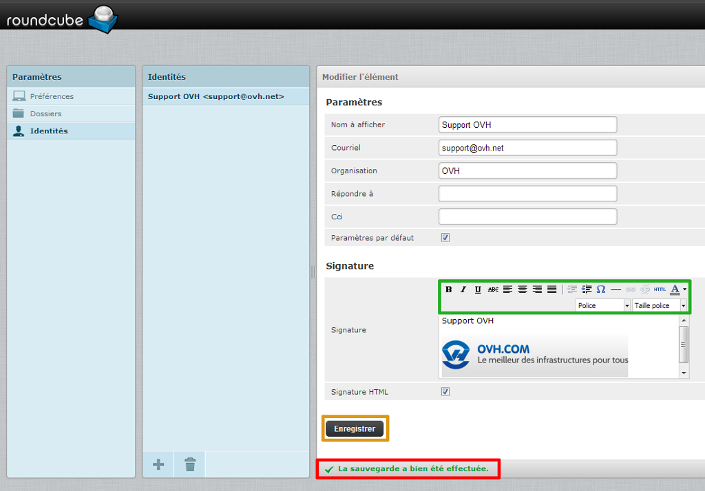{.thumbnail}


## Nueva identidad (1)
Si solo tiene una dirección de correo (con un plan de alojamiento Start 10 M, por ejemplo) o solo quiere tener que gestionar una dirección, puede crear distintas identidades. Así podrá enviar mensajes de parte de otra cuenta sin desconectarse de su dirección de correo.

La situación que vamos a describir es la siguiente:
Tenemos una cuenta de correo support@ovh.net y queremos enviar mensajes como no-reply@ovh.net pero sin tener que conectarnos a la cuenta no-reply@ovh.net con el webmail.

En «Identidades», haga clic en el icono «+» para añadir una nueva identidad.

{.thumbnail}


## Nueva identidad (2)
Como se ve en la imagen, vamos a crear una identidad llamada «Guides OVH» asociada a la dirección no-reply@ovh.net, que es la dirección que queremos que vean los destinatarios. Cuando estos respondan a los mensajes, la respuesta se enviará a la dirección support@ovh.net. Personalizamos la firma (opcional) y hacemos clic en «Guardar».

Una vez guardada, la nueva identidad «Guides OVH <no-reply@ovh.net>» aparecerá en la columna de identidades.

Para insertar la firma asociada a dicha identidad, consulte el apartado [«Insertar una firma en formato HTML»](#SIGNATURE).

{.thumbnail}


## Redactar un nuevo mensaje
Para escribir un nuevo mensaje haga clic en «Redactar...». Si no puede ver este botón (desde la configuración o los contactos), haga clic en el sobre blanco «Correo» situado en la barra superior para mostrarlo.

{.thumbnail}


## Opciones
Al hacer clic en «Redactar...» aparecerán las opciones de redacción del correo, como añadir contactos de la libreta de direcciones, adjuntar archivos y configurar el propio mensaje.

Para añadir un destinatario, haga clic en el tipo de copia que quiere asignarle:

To+: Añadir como destinatario directo.
Cc+: Añadir en copia simple.
Bcc+: Añadir en copia oculta. Los demás destinatarios del correo no verán a aquellos que estén en copia oculta.

{.thumbnail}


## Insertar una firma en formato HTML
Según las opciones de firma configuradas en «Preferencias» > «Composición de mensajes», esta se añadirá automáticamente al pie del mensaje. 

Si no, para insertar una firma en formato HTML (como hemos visto anteriormente en el apartado «Identidades»), seleccione el tipo de editor HTML (ver imagen).

Haga clic en «Firma» (botón de lápiz en la parte superior) para insertarla. La imagen incluida en la firma se mostrará en el área de edición. 

1. En el menú desplegable «Remitente», puede elegir la identidad que desee de las que haya creado (ver apartado «Identidad»). Si cambia de remitente después de insertar la firma, vuelva a hacer clic en «Firma» para actualizarla.
2. En «Destinatario» puede establecer el destinatario o destinatarios principales.
3. Si lo desea, añada destinatarios en copia simple, copia oculta o seleccione una opción «Responder a» o «Seguir a».
4. Introduzca el asunto del mensaje.
5. Utilice el editor WYSWYG (what you see is what you get, lo que ves es lo que obtienes) para dar formato al contenido del mensaje.

{.thumbnail}


## Enviar el mensaje
Para enviar el mensaje, haga clic en «Enviar» (icono con forma de avión de papel).

{.thumbnail}


## Recibir el mensaje
El mensaje anterior, enviado a support@ovh.net desde esa misma cuenta, se recibe como se ve en la imagen.

Si el mensaje no se recibe automáticamente, puede hacer clic en «Actualizar» en la esquina superior izquierda (flechas horizontales opuestas).

Como podemos ver, el remitente es «Support OVH» y la firma se muestra correctamente.

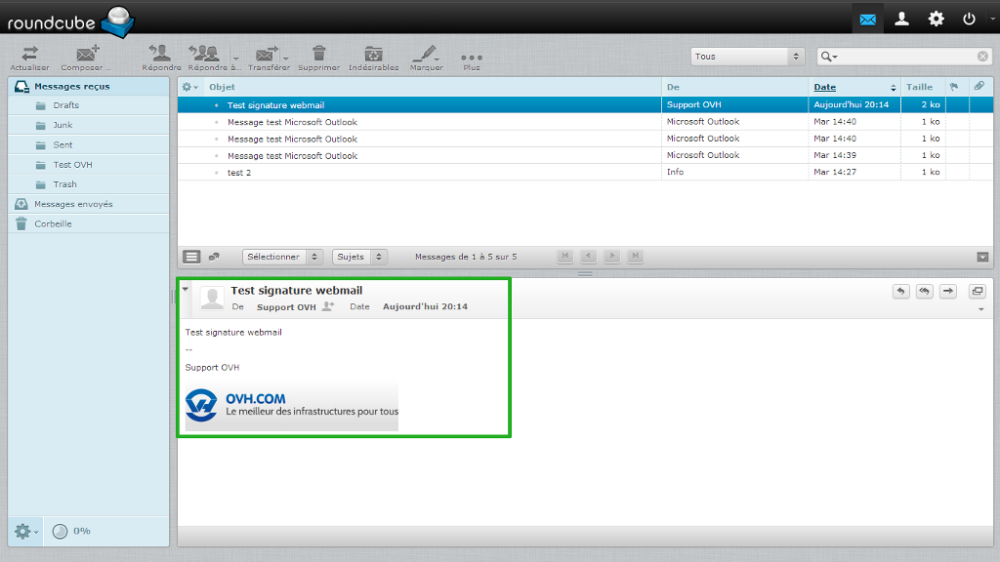{.thumbnail}


## Adjuntar un archivo (1)
Para adjuntar uno o más archivos digitales  (PDF, documento de Office, imagen...), haga clic en «Adjuntar» en el menú superior (botón con forma de clip).

También puede acceder a la misma ventana desde el botón «Adjuntar un archivo» que aparece a la derecha del área de redacción del mensaje.

Otra posibilidad es arrastrar el documento desde el explorador de archivos de su ordenador a la zona de adjuntar archivos.

{.thumbnail}


## Adjuntar un archivo (2)
Utilizando el clip o el botón «Adjuntar archivo» (no arrastrándolo), se abrirá la ventana de la imagen para cargar el archivo seleccionado.

Selecciónelo y haga clic en «Abrir».

En este caso, hemos adjuntado el archivo «MaConfig_win».

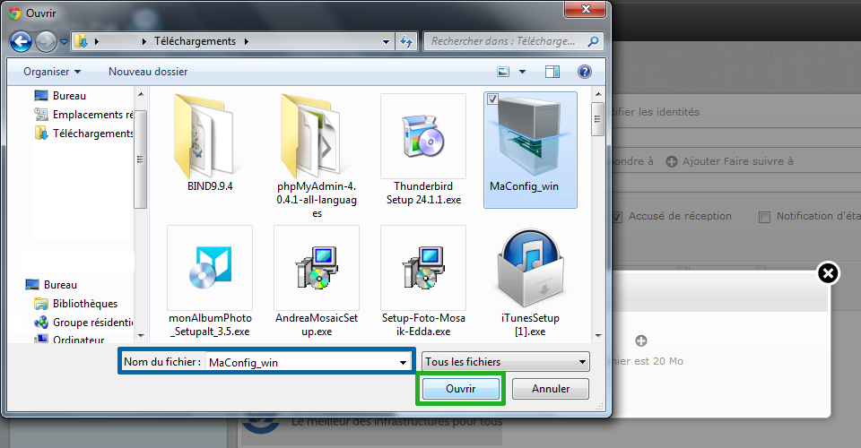{.thumbnail}


## Adjuntar un archivo (3)
Al pinchar en «Abrir» se abrirá el siguiente cuadro de diálogo con el nombre del archivo seleccionado. Desde ahí podrá aceptar la carga del archivo o añadir otros haciendo clic en el icono «+».

Haga clic en «Subir» cuando haya finalizado la selección.

{.thumbnail}
Como muestra la imagen, el tamaño máximo de los archivos adjuntos desde el webmail es de 20 MB.


## Organizar la libreta
Según sus necesidades, su empresa y su uso cotidiano, puede ser muy útil organizar la libreta de direcciones en carpetas (grupos de contactos).

En este ejemplo, vamos a crear dos grupos para ilustrar las distintas situaciones.

Para empezar, haga clic en el icono «Contactos» (con forma de persona), situado en la barra superior, para acceder a la gestión de los contactos.

Para agrupar todos los contactos relacionados con las guías OVH, vamos a crear un grupo llamado «Guides».

Haga clic en el icono «+» situado en la parte inferior de la primera columna para crear un grupo de contactos. El cursor se colocará automáticamente en el campo de texto.

Tenga en cuenta que es posible crear contactos directamente en el grupo por defecto («Direcciones personales») sin necesidad de crear un nuevo grupo de contactos. Para ello, simplemente haga clic el «+» en la parte inferior de la segunda columna («Crear nueva tarjeta de contacto»).

{.thumbnail}


## Acciones en los grupos de contactos
Una vez creado el grupo, tendrá acceso a las opciones relacionadas con los grupos:

Renombrar grupo
Borrar grupo
Guardar búsqueda: Activo cuando hay una búsqueda en un grupo.
Borrar búsqueda: Activo cuando hay una búsqueda guardada.

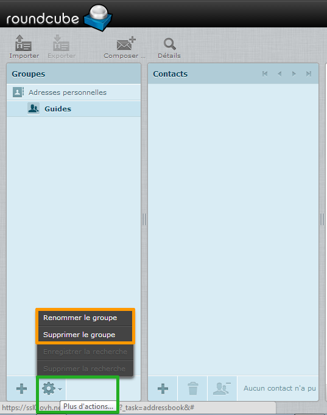{.thumbnail}


## Añadir un contacto (1): Propiedades
Para añadir un contacto al grupo «Guides», seleccione el grupo (debe aparecer en negrita) y haga clic en el «+» de la segunda columna (columna de contactos).
Para este ejemplo, hemos creado un grupo llamado «Support».

Cada ficha de contacto consta de cuatro zonas:
General: Nombre, apellidos, etc.
Propiedades: Direcciones de correo electrónico, teléfonos, etc.
Información personal: Fecha de nacimiento, sexo, etc.
Notas: Cualquier tipo de información que considere necesaria sobre su contacto.

Haga clic en el menú desplegable «Añadir campo...» para introducir más datos del contacto en alguna de las cuatro zonas.
Por ejemplo, para la información general, puede añadir los siguientes campos:

- Prefijo: Tratamiento
- Segundo nombre: Middle name en EE.UU.
- Sufijo
- Nombre para mostrar
- Alias
- Organización: Empresa, asociación, etc.
- Departamento
- Tratamiento: Puesto o función en la organización


Indique la información de contacto en la zona de «Propiedades».

Cuando haya introducido los datos necesarios, haga clic en «Guardar».

{.thumbnail}

## Consejo:
Para recibir mensajes sin esperas, puede hacer clic en el icono «+».

{.thumbnail}


## Añadir un contacto (2): Información personal
En la imagen puede ver los elementos añadidos en el apartado general con el menú desplegable «Añadir un campo...»: prefijo, nombre, apellidos, alias y organización.

También está seleccionada la pestaña «Información personal», que contiene otro menú desplegable para añadir campos adicionales.

Cuando haya introducido los datos necesarios, haga clic en «Guardar».

{.thumbnail}


## Añadir un contacto (3): Notas
La sección «Notas» es un área de texto en la que podrá anotar cualquier tipo de comentarios en relación al contacto.

Cuando haya introducido la información necesaria, haga clic en «Guardar».

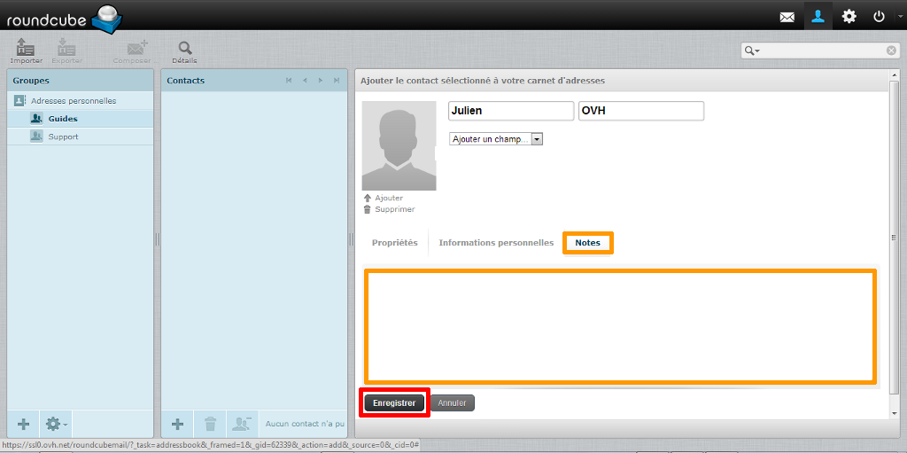{.thumbnail}


## Añadir un contacto (4): Avatar
Es muy fácil asociar una foto o imagen (avatar) a los contactos.

Haga clic en «Añadir», situado bajo el recuadro reservado a la imagen, y, en la nueva ventana, seleccione un archivo y haga clic en «Abrir». En el cuadro de diálogo «Subir foto», haga clic en «Subir» para aceptar.

En cualquier momento puede cambiar la imagen haciendo clic en «Reemplazar».

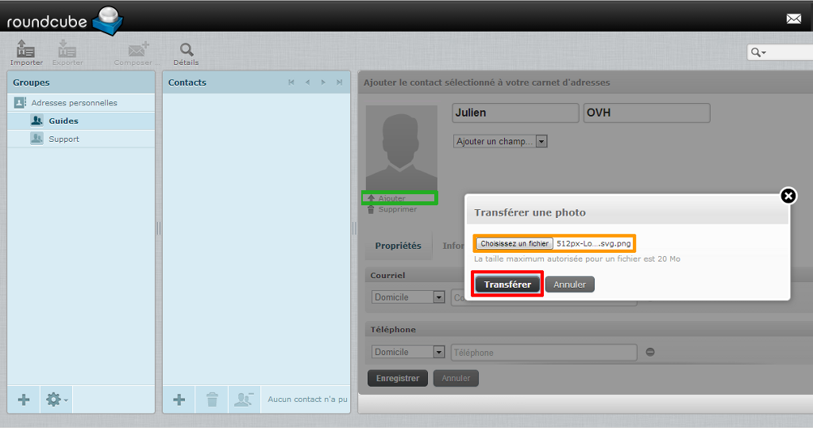{.thumbnail}


## Añadir un contacto (5): Finalizar
Cuando haya introducido toda la información relativa al contacto y haya añadido una imagen si lo desea, cree el contacto haciendo clic en «Guardar».

{.thumbnail}


## Añadir un contacto (6): Comprobaciones
Al guardar el contacto, aparece un mensaje de confirmación «Guardado correctamente» en la barra inferior. Para consultar o revisar la ficha del contacto, haga clic en su nombre en la lista de contactos (después de seleccionar el grupo al que pertenece o efectuando una búsqueda).
Por defecto, se mostrará la pestaña «Propiedades», que recoge la información introducida en esta sección (ver «Añadir un contacto (1): Propiedades»).

Cuando se ha creado un contacto en un grupo, es posible borrarlo del grupo haciendo clic en el icono situado en la parte inferior de la columna de contactos (forma de persona y un «-»).

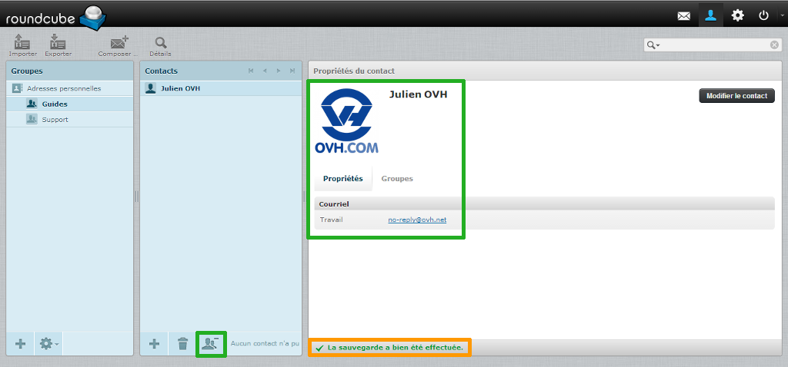{.thumbnail}


## Editar un contacto
Naturalmente, es posible editar la información de un contacto.

Para ello, seleccione el contacto y haga clic en «Editar contacto», en la esquina superior derecha de la ficha del contacto.
Podrá ver todos los datos en modo de edición.

En la imagen está seleccionada la pestaña «Grupos», que muestra los grupos a los que pertenece el contacto. Desde ella puede añadir un contacto a un grupo marcando la casilla correspondiente.

También puede arrastrar los contactos para cambiarlos de grupo.

{.thumbnail}


## Realizar una búsqueda
Si quiere realizar una búsqueda entre todos los contactos, haga clic en «Avanzadas».
Se mostrarán todos los campos de búsqueda posibles para poder realizar una búsqueda avanzada.

Introduzca uno o más criterios de búsqueda y haga clic en «Buscar».

{.thumbnail}


## Exportar contactos
Si quiere obtener todos sus contactos del webmail Roundcube OVH, puede hacerlo exportando el archivo de la libreta de direcciones.

En «Contactos», haga clic en «Exportar».

Se generará un archivo rcube_contacts.vcf que podrá descargar (según la configuración de su navegador, el archivo se descargará automáticamente).

{.thumbnail}


## Importar una libreta de direcciones existente
Si antes trabajaba y gestionaba sus contactos con otro cliente de correo y ha exportado sus contactos, puede importarlos haciendo clic en «Importar», a la izquierda de «Exportar».

El único formato compatible es la extensión .vcf, pero también soporta la importación de direcciones en formato vCard o CSV (campos separados por una coma).

Se abrirá la pantalla de la imagen.
Haga clic en «Elegir archivos» para cargar el archivo que contiene la libreta de direcciones que quiera importar.

Podrá elegir si desea sustituir la libreta de direcciones completa o no.

A continuación, haga clic en «Importar».

{.thumbnail}


## Responder a todos
En caso de que su lista de destinatarios incluya una lista de correo y destinatarios individuales, haga clic en «Responder a todos» en el menú superior (ver imagen).

De esa forma, la respuesta se enviará a todos los destinatarios, tanto a los incluidos en la lista de correo como a las direcciones individuales.

Si, por el contrario, desea responder únicamente a la lista de correo, haga clic en «Responder». Esto excluirá a las direcciones individuales de los destinatarios del mensaje.

{.thumbnail}

