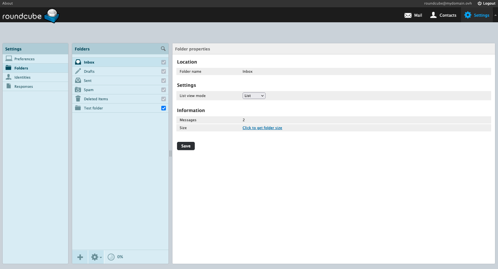
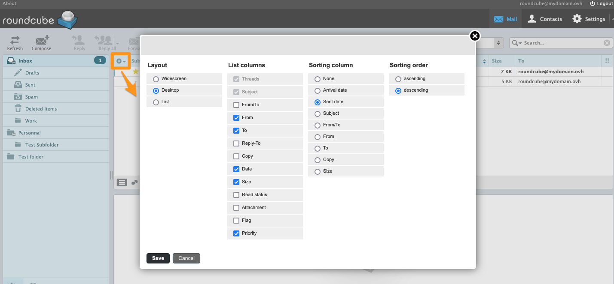
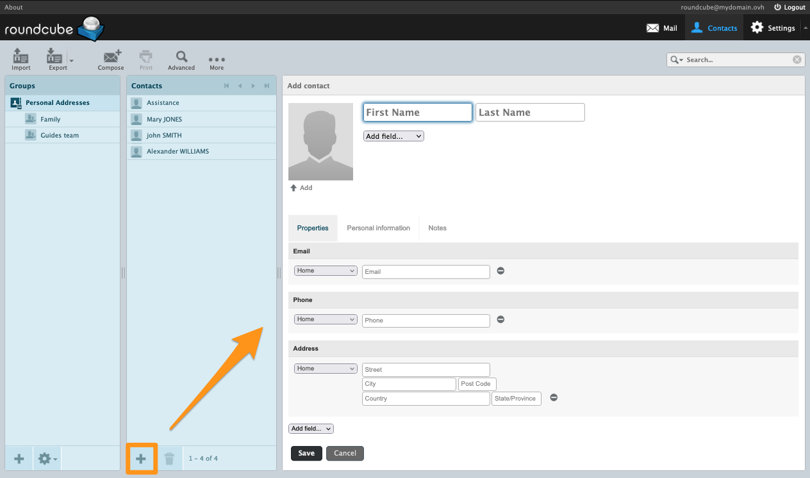

> [!primary]
> Tłumaczenie zostało wygenerowane automatycznie przez system naszego partnera SYSTRAN. W niektórych przypadkach mogą wystąpić nieprecyzyjne sformułowania, na przykład w tłumaczeniu nazw przycisków lub szczegółów technicznych. W przypadku jakichkolwiek wątpliwości zalecamy zapoznanie się z angielską/francuską wersją przewodnika. Jeśli chcesz przyczynić się do ulepszenia tłumaczenia, kliknij przycisk „Zaproponuj zmianę” na tej stronie.
>

**Ostatnia aktualizacja z dnia 31-05-2022**

## Wprowadzenie

Dzięki usłudze MX Plan OVHcloud możesz wysyłać i odbierać e-maile za pośrednictwem programu pocztowego lub webmaila. OVHcloud dostarcza usługę poczty elektronicznej o nazwie RoundCube, która pozwala za pośrednictwem przeglądarki internetowej na dostęp do konta e-mail.

**Dowiedz się, jak korzystać z interfejsu Webmail RoundCube dla kont e-mail OVHcloud**

## Wymagania początkowe

- Posiadanie rozwiązania poczty elektronicznej OVHcloud **MX Plan**, zaproponowanego w naszej [ofercie hostingu www](https://www.ovhcloud.com/pl/web-hosting/), zawartego w darmowym [hostingu Start10M](https://www.ovhcloud.com/pl/domains/free-web-hosting/) lub zamówionego oddzielnie jako rozwiązanie autonomiczne.
- Dane do logowania do konta e-mail MX Plan, które chcesz sprawdzić Więcej informacji znajdziesz w przewodniku [Pierwsze kroki z usługą MX Plan](https://docs.ovh.com/pl/emails/hosting_www_informacje_ogolne_o_kontach_e-mail_ovh/).

## W praktyce

### Logowanie do interfejsu Webmail RoundCube

Do zobaczenia na stronie <https://www.ovh.com/pl/mail/>. Wprowadź adres e-mail i hasło, a następnie kliknij `Łącze`{.action}. 

{.thumbnail}

Zostaniesz wówczas przekierowany do interfejsu RoundCube.

{.thumbnail}

> [!warning]
> 
> Jeśli zostaniesz przekierowany do interfejsu **O**utlook **W**eb **A**ccess (OWA), oznacza to, że jesteś na najnowszej wersji usługi MX Plan. Aby uzyskać więcej informacji na temat oferty MX Plan, sprawdź naszą stronę [Pierwsze kroki z ofertą MX Plan](https://docs.ovh.com/pl/emails/hosting_www_informacje_ogolne_o_kontach_e-mail_ovh/).
>
> Aby zapoznać się z interfejsem **OWA**, zapoznaj się z naszym przewodnikiem [Sprawdź jego konto e-mail w interfejsie OWA](https://docs.ovh.com/pl/microsoft-collaborative-solutions/exchange_2016_przewodnik_dotyczacy_korzystania_z_outlook_web_app/).

### Ogólny interfejs webmail RoundCube <a name="general-interface"></a>

Po zalogowaniu się do konta e-mail masz dostęp do głównego okna Roundcube, które składa się z 3 stref:

- [**Lewa**](#leftcolumn) kolumna: drzewo konta e-mail, składające się z folderów i podfolderów. Głównym folderem jest `Odebrane`.

- [**Okno wyższe**](#topwindow): listę e-maili zawartych w wybranym katalogu w kolumnie z lewej strony.

- [**Okno dolne**](#lowerwindow): treść wybranego e-maila w górnej części okna.

#### Zarządzanie folderami (kolumna po lewej stronie) <a name="leftcolumn"></a>

W tej strefie znajdują się katalogi znajdujące się na Twoim koncie e-mail.

Aby lepiej zarządzać folderami, kliknij koło zębate na dole kolumny, a następnie kliknij `Zarządzaj folderami`{.action}

{.thumbnail}

Aby utworzyć katalog, kliknij przycisk `+`{.action} na dole kolumny `Foldery`.

Aby usunąć katalog, wybierz odpowiedni folder, kliknij koło zębate w dolnej kolumnie `Foldery`, a następnie `Usuń`{.action}. Aby usunąć zawartość, ale zachować folder, kliknij `Opróżnij`{.action}.

Pola, które należy zaznaczyć na poziomie katalogów odpowiadają "subskrypcjom". Subskrypcja określa, czy folder ma się wyświetlać na poziomie interfejsu webmail lub programu pocztowego, zachowując jednocześnie zawartość folderu. Celem jest tylko ukrycie lub wyświetlenie folderu na koncie e-mail.

> [!primary]
>
> Katalogi z szarym kratką do zaznaczenia są specjalnymi katalogami. Nie można ich usunąć lub usunąć z abonamentu.

#### Lista e-maili otrzymanych / wysłanych (okno wyższe) <a name="topwindow"></a>

W oknie tym wyświetla się zawartość wybranego katalogu w kolumnie z lewej strony. 

##### **Typ wyświetlacza**

Okno jest przedstawione w formie, która może być spersonalizowana. W tym celu kliknij ikonkę koła zębatego w lewym górnym rogu tego okna.

{.thumbnail}

Można dokonać konfiguracji:

- **Układ**: pozwala określić sposób instalacji okna do zarządzania kontem e-mail.
- **Kolumny**: pozwala na dodawanie kolumn do wyświetlania (priorytety dla e-maili, itp.).
- **Porządek sortowania**: pozwala wybrać kolumnę, w której zostanie przeprowadzona domyślna sortowanie.
- **Kierunek sortowania**: pozwala wybrać kolejność sortowania w górę lub w dół, w zależności od kolumny sortowania.

##### **Operacja na wybranym e e-mailu**

Jeśli wybrano wiadomość e-mail, możesz podjąć działania w tym celu. Poniżej możesz wykonać następujące czynności:

- `Odpowiedz`{.action}: odpowiadać bezpośrednio do nadawcy.
- `Odpowiedz wszystkim`{.action}: odpowiadać bezpośrednio wszystkim odbiorcom w polach "A" i "Copie".
- `Przekaż`{.action}: przenieść wybrany e-mail do jednego lub kilku odbiorców.
- `Usuń`{.action}: umieścić wybrany e-mail w sekcji "Kosz".
- `Spam`{.action}: umieść wybrany e-mail bezpośrednio w skrzynce pocztowej ("Junk"), zakwalifikować go jako **spam**.
- `Oznacz`{.action}: określić ręcznie status e-maila.
- `Więcej`{.action} 
    - `Drukuj wiadomość`{.action}.
    - `Pobierz (.eml)`{.action}: pobrać nagłówek wiadomości e-mail i jej treść.
    - `Edytuj jako nową`{.action}: utworzyć nowy e-mail na podstawie wybranego e-maila.
    - `Pokaź źródło`{.action}: wyświetlić email w jego wersji pierwotnej w nagłówku.
    - `Przenieś do`{.action}: przenieść e-mail do folderu.
    - `Kopiuj do`{.action}: skopiować e-mail do folderu.
    - `Otwórz w nowym oknie`{.action}.

{.thumbnail}

> [!primary]
>
> Jeśli osoba z Twojej korespondencji poprosi o przesłanie jej wiadomości e-mail z potwierdzeniem odbioru, otrzymasz następujący komunikat: `nadawca tej wiadomości poprosił o powiadomienie, kiedy przeczytasz tę wiadomość. Czy chcesz poinformować nadawcę?`.
> 

##### **Wyszukaj e-mail**

Narzędzie wyszukiwania jest dostępne w górnej prawej części interfejsu.

Kliknij strzałkę po prawej stronie lupy, aby wyświetlić filtry wyszukiwania.

#### Treść wiadomości e-mail (okno dolne) <a name="lowerwindow"></a>

Jeśli na liście zostanie wybrany e-mail, zostanie on wyświetlony w dolnym oknie.

Skróty po prawej stronie znajdują się następujące funkcje:

- Wyświetl w formacie HTML (domyślnie)
- Wyświetl w formacie tekstowym
- Odpowiedz
- Odpowiedz wszystkim
- Przekaż
- Otwórz w nowym oknie 

{.thumbnail}

### Konfiguracja ustawień interfejsu Roundcube

Kolejne rozdziały niniejszego przewodnika odpowiadają zakładkom, które tworzą część `Preferencje`{.action} w `Ustawienia`{.action} Roundcube. Opis jest niewyczerpujący.

{.thumbnail}

#### Interfejs użytkownika

Tutaj zdefiniuj `język`, w którym interfejs Roundcube jest używany, `strefę czasową`, `format godzinowy` i `format daty`.

Opcja `ładne daty` pozwala na wyświetlenie daty odbioru/wysłania z terminami względnymi, takimi jak "Dzisiaj", "Wczoraj", itp.<br>
**Na przykład**: jesteśmy **19/05/2022**, e-mail wysłany/otrzymany w dniu **17/05/2002** o **17:38** zostanie wyświetlony w dniu **Śro 17:38**, ponieważ e-mail odpowiada poprzedniemu wtorkowi.

W polu `Po usunięciu elementu listy wyświetl następny` oznacza, że po usunięciu lub przesunięciu w e-mailu element dolnej linii zostanie systematycznie wybrany, niezależnie od kolejności sortowania.

#### Widok skrzynki pocztowej

Zdefiniuj tutaj ergonomię, aby wyświetlać i działać na e-mailach. Opcja `Układ` pozwala na wyświetlenie 3 okna opisanych w ogólnej części [Interfejs interfejsu Webmail RoundCube](#topwindow).

#### Wyświetlanie wiadomości

Określ sposób wyświetlania e-maili.<br>
Zalecamy posiadanie kratki `Domyślny HTML`, aby upewnić się, że e-maile sformatowane przez nadawcę wyświetlają się poprawnie.<br>
Zalecamy również zachowanie opcji `Zezwól na zdalne zasoby (obrazki, style)` na `nigdy`. Dzięki temu nie można ładować elementów e-maila, który wygląda złośliwie.

#### Tworzenie wiadomości

Określ domyślną formę podczas tworzenia wiadomości e-mail lub odpowiedzi.<br>
Zalecamy, aby włączyć opcję `Twórz wiadomości HTML` na `zawsze`, aby korzystać domyślnie z narzędzi edycji HTML i nie zmieniać podpisu HTML.

#### Kontakty

Spersonalizuj układ informacji w książce adresowej.

#### Foldery specjalne

Roundcube dysponuje 4 specjalnymi katalogami: `Kopie robocze`, `Wysłane`, `Spam`, `Kosz`.

Nie zalecamy ich modyfikacji, ale możliwe jest przypisanie zachowania jednego folderu innemu folderowi utworzonemu w późniejszym czasie dzięki rozwijanym menu.<br>
**Na przykład** możesz przypisać zachowanie "Motyle" do innego utworzonego przez Ciebie folderu. E-maile, które zostaną tam zapisane, będą traktowane jako szkice do czasu ich faktycznego wysłania.

#### Ustawienia serwera

W tej zakładce możesz zoptymalizować obszar zajęty na koncie e-mail. Opcja `Przy wylogowaniu opróżnij Kosz` pozwala bowiem uniknąć kumulacji elementów, które zostały usunięte. Opcja `Kasuj wiadomości bezpośrednio w folderze Spam` automatycznie usunie wszystkie e-maile uznawane za SPAM.

> [!warning]
> 
> Odradzamy włączenie opcji `Kasuj wiadomości bezpośrednio w folderze Spam` IP w przypadku, gdy fałszywie dodatni (błędnie zadeklarowany jako "SPAM") zostanie uznany za SPAM dla serwera poczty przychodzącej. W przypadku gdy e-mail jest umieszczony w folderze "Porady", istnieje możliwość sprawdzenia, czy e-mail jest zgodny z prawem.

### Zarządzanie tożsamością i jej podpisem <a name="identity"></a>

W Roundcube kliknij `Ustawienia`{.action} na górnym pasku, a następnie `Tożsamości`{.action} w kolumnie po lewej stronie. "Tożsamości" umożliwia personalizację informacji wysyłanych do odbiorców, np. nazwy wyświetlacza lub podpisu.

{.thumbnail}

#### Skonfiguruj atrybuty tożsamości 

- **Nazwa wyświetlacza**: nazwa ta pojawi się w części "nadawca" odbiorcy
- **E-mail**: odpowiada adresowi, z którego wysłany jest e-mail.
- **Organizacja**: pole przeznaczone dla nazwy spółki, stowarzyszenia lub innego podmiotu.
- **Odpowiedz**: przypisać inny adres e-mail odpowiedzi niż adres nadawcy.
- **Odpowiedź do**: umieścić w ukrytej kopii adres e-mail podczas wysyłki.
- **Ukryta kopia**: w przypadku gdy istnieje więcej niż jedna tożsamość (podpisy), domyślnie przydziela się tę tożsamość.
- **Podpis**: personalizuj stopkę e-maila podczas jego pisania (nazwisko, imię, stanowisko zajęte, zdania, zdjęcia...).
- **Podpis w HTML**: aktywuje format HTML na podpisze. 

> [!alert]
> 
> Uzupełnienie pola **E-mail** innym adresem e-mail niż adres, na którym jesteś zalogowany, jest uważane za kradzież tożsamości elektronicznej (*spoofing*). Adres IP używany do wysyłki może być "zablokowany" i/lub oznaczony jako "SPAM" u odbiorców. 

#### Dodanie podpisu

Domyślnie pole `Podpis` znajduje się w "tekście niekodowanym". Format ten nie pozwala na zaawansowane edycje lub wstawić obrazek do podpisu. Aby móc korzystać z zaawansowanych opcji edycji podpisu, zaleca się aktywację trybu HTML, klikając **Podpis HTML** pod ramką wprowadzania.

> [!warning]
> 
> W związku z tym, jeśli podpis jest w formacie HTML, konieczne będzie przejście do trybu HTML do napisania e-maila. Możesz aktywować tę opcję domyślnie dla każdej edycji wiadomości e-mail, w sekcji `Ustawienia`{.action} interfejsu Roundcube.
> Kliknij `Preferencje`{.action} w kolumnie po lewej stronie, a następnie `Tworzenie wiadomości`{.action}. W celu uzupełnienia **Zapisz e-maile HTML** wybierz `Zawsze`.
>

Aby dodać obraz do podpisu, obraz musi być przechowywany na serwerze (hosting OVHcloud lub inny).<br>
**Telewizja obrazu z komputera nie pozwoli na jego wyświetlanie**.

Kliknij przycisk `< >`{.action} na pasku narzędzi HTML, następnie wprowadź następujący kod, zastępując `your-image-url` adresem (URL) obrazu i `text-if-image-is-not-displayed` tekstem, który zastępuje obraz, jeśli nie może się wyświetlić.

```bash

```

{.thumbnail}

### Książka kontaktów

Kliknij `Kontakty`{.action} na górnym pasku, aby uzyskać dostęp do książki kontaktów. Jest on podzielony na **3 kolumny**:

- **Grupy**: w książce adresowej możesz tworzyć grupy, aby sortować kontakty.
- **Kontakt**: wyświetl kontakty w wybranej grupie lub książce adresowej.
- **Właściwości kontaktu** lub **Dodaj kontakt**: okno to wyświetla się, gdy wybrany zostanie kontakt lub gdy zostanie utworzony. Możesz przeczytać lub zmienić dane kontaktu.

{.thumbnail}

#### Grupy <a name="group"></a>

Grupy to podkategorie książki adresowej. Umożliwiają klasyfikowanie kontaktów jako podzbiorów. Na przykład, możesz łatwiej znaleźć kontakt w grupie, którą stworzyłeś, niż w całej książce adresowej. Dzięki temu możesz również wysyłać e-maile dodając grupę na odbiorcę, zamiast dodawać jeden do jednego z kontaktów grupy.

Aby utworzyć grupę, kliknij przycisk `+`{.action} w dolnej części kolumny `Grupy`. Zdefiniuj nazwę grupy i kliknij przycisk `Zapisz`{.action}, aby zatwierdzić.

{.thumbnail}

Aby przypisać kontakt do jednej z grup, wybierz kontakt w kolumnie `Kontakty`, a następnie w oknie, które się pojawi, kliknij zakładkę `Grupy`{.action}. Zaznacz grupę, którą chcesz przydzielić do kontaktu.

#### Kontakty <a name="contacts"></a>

W kolumnie `Grupy` wybierz książkę adresową lub jedną z grup.

> [!primary]
> 
> Po utworzeniu kontaktu z wybranej grupy kontakt zostanie automatycznie dodany do grupy.

Kliknij przycisk `+`{.action} w dolnej części kolumny `Kontakty`, aby utworzyć kontakt.

{.thumbnail}

Następnie uzupełnij dane kontaktu.

> [!primary]
> Możesz dodawać pola poprzez rozwijane menu `Dodaj pole...`{.action}, znajduje się pod polami `Imię` i `adres`.

#### Importuj kontakty

W oknie `Kontakty`{.action} na górnym pasku kliknij `importuj`{.action}, aby otworzyć okno importu.

- `Import z pliku`: wybierz plik CSV lub plik vCard na Twoim komputerze. Kontakty w pliku CSV muszą być oddzielone przecinkami. Plik nie może mieć więcej niż 20 MB.
- `Importuj powiązania z grupami`: Jeśli kontakty w Twoim pliku są podzielone na grupy, możesz włączyć tę opcję, aby odnaleźć tę organizację lub pozostawić tę opcję na `żadnej` grupie, aby nie przydzielać do kontaktów.
- `Zastąp całą książkę adresową`: Jeśli książka jest już skonfigurowana, zalecamy wyeksportowanie jej przed zaznaczeniem tej opcji lub upewnić się, że chcesz ją wymienić.

{.thumbnail}

#### Eksportuj Kontakty Roundcube

W oknie `Kontakty`{.action} na górnym pasku kliknij ikonkę skierowaną w dół po prawej stronie przycisku `Eksportuj`{.action}.

Możesz wybrać:

- `Eksportuj wszystkie`{.action} całości i wszystkich kontaktów będzie wywożone do pliku **.vcf**.
- `Eksportuj zaznaczone`{.action}, aby wyeksportować tylko te elementy, które wybiorą Cię w kolumnie `Kontakty`{.action}.

{.thumbnail}

### Odpowiedzi (szablony) <a name="responses"></a>

Funkcja ta pozwala na tworzenie szablonów odpowiedzi podczas tworzenia wiadomości e-mail.

W Roundcube kliknij `Ustawienia`{.action} na górnym pasku, a następnie `Odpowiedzi`{.action} w kolumnie po lewej stronie.

Aby dodać odpowiedź, kliknij przycisk `+`{.action} w dolnej części kolumny `Odpowiedzi`.

{.thumbnail}

> [!primary]
> 
> "Odpowiedzi" mają formę "tekstu niekodowanego".

### Redakcja e-maila

W zakładce `Poczta`{.action} na górnym pasku kliknij `Zapisz`{.action}.

W oknie wiadomości e-mail znajdują się następujące pola: 

- **Od**: wybrać [tożsamość](#identity) do określenia nadawcy.
- **Do+**: dodać odbiorców i/lub [grupę odbiorców](#group).

> [!primary]
> 
> Pole **"Do"** nie może przekraczać 100 odbiorców, obejmuje to kontakty zawarte w [grupie](#group).

- **Dodaj Cc+**: dodawanie odbiorców w prostej kopii.
- **Dodaj Bcc +**: dodawanie odbiorców w ukrytej kopii. Pozostali odbiorcy wiadomości e-mail nie zobaczą adresów w tym e-mailu.
- **Dodaj Followup-To**: wysyłać wiadomości do odbiorców.
- **Typ edytora**:  
    - `Tekst niekodowany`: tylko tekst bez formatu.
    - `HTML`: tekst w formie. Pasek narzędzi HTML pojawia się nad oknem wprowadzania danych.
- **Priorytet** dla e-maila.
- **Potwierdzenie odbioru**: adresat jest proszony o potwierdzenie odbioru.
- **Status dostarczenia (DSN)**, jeżeli e-mail został wysłany do odbiorcy.
- **Zapisz wiadomość w**: wybrać katalog, w którym będzie przechowywana kopia e-maila.

Na górnym pasku dostępne są następujące operacje:

- `Anuluj`{.action} pisanie wiadomości e-mail, korzystając z prośby o potwierdzenie.
- `Wyślij`{.action} e-mail.
- `Zapisz`{.action} e-mail w specjalnym folderze "szkic"
- `Pisownia`{.action}, aby sprawdzić tekst, z menu umożliwiającego wybór języka.
- `Załącz`{.action} plik do wiadomości e-mail.
- `Podpis`{.action}: dodaje podpis przypisany [do wybranej tożsamości](#identity).
- `Odpowiedzi`{.action}: dodaje wstępnie zarejestrowany szablon w części [Odpowiedzi](#responses).

{.thumbnail}

## Sprawdź również

[Pierwsze kroki z usługą MX Plan](https://docs.ovh.com/pl/emails/hosting_www_informacje_ogolne_o_kontach_e-mail_ovh/)

[Zmiana hasła do konta e-mail MX Plan](https://docs.ovh.com/pl/emails/zmiana-hasla-do-konta-email/)

[Tworzenie filtrów dla Twoich kont e-mail](https://docs.ovh.com/pl/emails/hosting_www_konfiguracja_filtrow_e-mail_w_panelu_klienta/)

[Korzystanie z przekierowań e-mail](https://docs.ovh.com/pl/emails/hosting_www_przekierowania_e-mail/)

Dołącz do społeczności naszych użytkowników na stronie<https://community.ovh.com/en/>.
