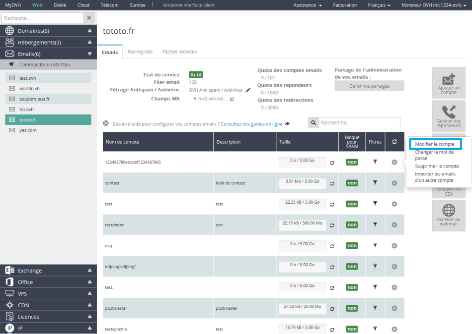
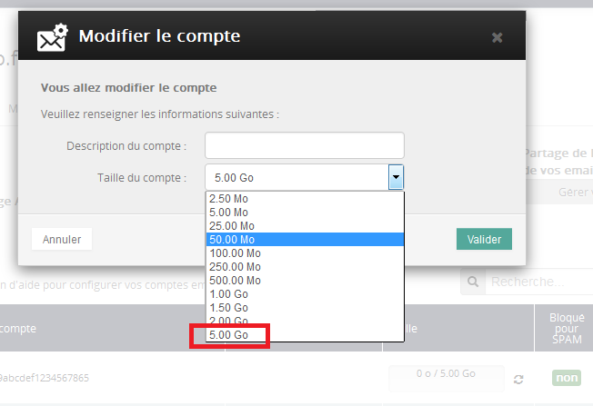

## ¿Cómo cambiar la contraseña de mis direcciones de correo electrónico?
En el [área de cliente](https://www.ovh.com/manager/web/login/), haga clic en «Correo electrónico» en la columna izquierda y seleccione su nombre de dominio. A continuación, haga clic en el icono con forma de rueda dentada correspondiente a la cuenta de correo y seleccione la opción «Cambiar la contraseña».

{.thumbnail}
Introduzca la nueva contraseña y haga clic en «Aceptar».

No es necesario disponer de la antigua contraseña. 

Atención, la contraseña debe cumplir los siguientes criterios: 

- mínimo 9 caracteres 
- máximo 30 caracteres
- sin caracteres acentuados

La operación se hará efectiva en unos minutos.

## ¿Cómo configurar mis direcciones de correo electrónico?
Ponemos a su disposición diversas guías para ayudarle a configurar su dirección de correo electrónico en los distintos clientes de correo.
Puede consultarlas en el siguiente enlace: 

- [Guías de configuración del correo](https://docs.ovh.com/es/emails/).

## ¿Cómo configurar las listas de correo («mailing-lists»)?
Una lista de correo o «mailing-list» es una dirección de correo que reenvía los mensajes recibidos a una lista de direcciones de correo, que pueden estar registradas en OVH o en otro proveedor. 

El funcionamiento de una lista de correo es algo más complejo que el de otro tipo de direcciones de correo electrónico.

Si desea más información sobre cómo administrar una lista de correo, consulte esta guía: 

- 

## ¿Cómo consultar los mensajes de una cuenta?
Existen dos opciones: 

- Utilizar nuestro webmail. Para ello, acceda al [webmail](https://webmail.ovh.com/), seleccione «Roundcube» e introduzca su dirección de correo completa y su contraseña. Si desea más información, consulte nuestra [guía sobre Roundcube](https://docs.ovh.com/es/emails/webmail_guia_de_uso_de_roundcube/).

- Utilizar un cliente de correo instalado en su equipo. Si desea más información sobre cómo configurarlo, consulte nuestra [guía de correo en alojamiento compartido OVH](https://docs.ovh.com/es/emails/).

## ¿Cómo crear una redirección de correo?
Si desea redirigir sus mensajes de una dirección de correo a otra, consulte esta guía: 

- 

## ¿Cómo crear o eliminar un contestador?
Si desea crear un contestador para sus direcciones de correo electrónico, consulte esta guía: 

- 

## ¿Cómo configurar los filtros de correo?
Si desea crear filtros para sus direcciones de correo electrónico, consulte esta guía: 

- 

## ¿Cómo gestionar los registros SPF?
Si desea gestionar los registros SPF de sus direcciones de correo electrónico, consulte esta guía: 

- 

## ¿Qué debo comprobar si tengo algún problema con el correo?
Si los mensajes no se envían o reciben correctamente, compruebe los siguientes elementos: 

¿Su servicio de correo está activo?
Para que sus mensajes funcionen correctamente, debe tener un servicio de correo activo. Si utiliza las cuentas incluidas con un plan de hosting, compruebe que este no haya expirado. Puede consultar esta información directamente en el área de cliente. Igualmente, su dominio también debe estar activo.

¿El correo funciona desde el webmail?
Para asegurarse de que el problema no se deba a un error de configuración, realice una prueba de envío y recepción directamente desde el webmail de OVH. Si todo funciona correctamente, compruebe la configuración de su cliente de correo sirviéndose de las guías que ponemos a su disposición.

¿No puede conectarse al webmail?
Asegúrese de estar utilizando la contraseña correcta. Si lo necesita, puede cambiarla. Para ello, consulte el apartado correspondiente de esta guía.

¿Se está realizando una intervención en el servicio?
Puede consultar las intervenciones abiertas en la página [Status OVH](http://status.ovh.es/).

¿El dominio apunta correctamente al servidor de correo?
Compruebe que su dominio utilice los servidores de correo (registro MX) de su servicio de correo en OVH. Si desea más información, consulte nuestra [guía](https://www.ovh.es/g2003.correo_servidores_mx).

## Gestión del spam en OVH

## Importante
Es posible que reciba spam en su bandeja de entrada. En ese caso, compruebe los siguientes aspectos. 

- Los servidores de correo de su dominio deben estar [configurados con el antispam](#registro_mx).

- Si los mensajes están etiquetados como spam (etiqueta [spam] en el asunto del mensaje), han sido correctamente marcados por nuestro sistema antispam. En ese caso, cree una regla para trasladarlos a una carpeta de correo no deseado, por ejemplo.

Para evitar falsos positivos (mensajes etiquetados como spam pero que puedan ser legítimos según su criterio), el correo no se elimina automáticamente de nuestros servidores aunque esté marcado como spam o virus.

## Valores
Si utiliza el servicio de correo compartido incluido con el alojamiento o el producto MX Plan, debe utilizar los registros MX de OVH:

- mx1.mail.ovh.net
- mx2.mail.ovh.net
- mx3.mail.ovh.net

## Información:
Para los servicios de correo creados antes del 23 de mayo de 2016, los antiguos servidores MX siguen operativos, pero le recomendamos que actualice a los servidores MX arriba indicados.
Estos registros pueden modificarse en la zona DNS del dominio. 

Si los servidores DNS están gestionados por otro proveedor, contacte con él para editar dichos registros.

Si utiliza los servidores DNS compartidos de OVH, puede editarlos desde el área de cliente.

## Introducción
Los límites que se especifican a continuación pueden rebasarse para fines profesionales con la solución [Exchange 2013](https://www.ovh.es/emails/hosted-exchange/).

Límites de envío
200 mensajes por hora y cuenta y 300 mensajes por hora e IP.

Capacidad de las cuentas de correo
Cada dirección de correo tiene una capacidad máxima de 5 GB.

Tamaño máximo de los archivos adjuntos
Los archivos adjuntos a los mensajes de correo pueden tener un tamaño máximo de 20 MB con el webmail o 100 MB con un cliente de correo instalado en su ordenador.

Número máximo de personas en copia
Cada mensaje enviado puede tener en copia un máximo de 100 direcciones de correo. Un mensaje enviado con 100 destinatarios en copia se contabiliza como 100 mensajes enviados.

Importante:

Contratando un producto MX Plan, las nuevas cuentas no se añaden a las anteriores, sino que las sustituyen. Por ejemplo, si tiene un plan de hosting Personal (que incluye 10 cuentas POP) y contrata un MX Plan 100, podrá disfrutar de 100 cuentas POP, no 110.

Todos los MX Plan se entregan con una dirección «postmaster@». Esta dirección no puede modificarse y no se contabiliza en el límite de cuentas de correo. Por ejemplo, si adquiere un MX Plan 5, además de la dirección «postmaster@» tendrá otras 5 cuentas de correo configurables con su nombre.

## MX Plan
Si desea información el servicio MX Plan, consulte esta guía: 

- 

## ¿Cómo aumentar la capacidad de mi dirección de correo?
En los planes de web hosting o los productos MX Plan, puede aumentar el tamaño de sus cuentas de correo electrónico de 25 MB a 5 GB directamente desde el [área de cliente](https://www.ovh.com/manager/web/). 

Para ello, en el [área de cliente](https://www.ovh.com/manager/web/login/), haga clic en «Correo electrónico» en la columna izquierda y seleccione su nombre de dominio. A continuación, haga clic en el icono con forma de rueda dentada correspondiente a la cuenta de correo y seleccione la opción «Editar la cuenta».

{.thumbnail}
A continuación, seleccione el tamaño de la cuenta que desee y haga clic en «Aceptar» para confirmar la operación.

{.thumbnail}
Aparecerá un mensaje de confirmación en la parte superior en el que se le indica que la cuenta de correo se está modificando. 

La operación se hará efectiva en los próximos 5-10 minutos.
¿A qué hace referencia la capacidad (quota) de mi cuenta?
Su cuenta de correo dispone de un espacio con un tamaño específico. Cuando hablamos de capacidad nos referimos al espacio asignado a su cuenta de correo electrónico en nuestro servidor de correo. 

¿Dónde podemos ver la capacidad?
Directamente en el servidor de correo, por ejemplo, a través del [webmail](https://ssl0.ovh.net). Esta interfaz le permite acceder directamente al servidor, donde podrá ver su capacidad. Cuando el usuario consulta sus mensajes desde un cliente de correo instalado en su ordenador, estos se eliminan del servidor y se almacenan en el equipo local. Por consiguiente, aquellos usuarios que solo utilizan clientes de correo como Outlook rara vez superarán la capacidad permitida, a no ser que hayan activado la opción que permite conservar una copia del mensaje en el servidor. 

¿Qué sucede cuando superamos la capacidad permitida (overquota)?
Si se supera la capacidad asignada a la cuenta, el servidor de correo no podrá recibir más mensajes de correo electrónico, de modo que devolverá al remitente los mensajes de correo entrantes añadiendo el mensaje «User is over quota». 

¿Cómo volver a estar por debajo de la capacidad permitida?
Puede eliminar los archivos que almacena en su servidor de correo mediante el [webmail](https://ssl0.ovh.net). Si lo hace en esta interfaz, no se olvide de vaciar también la papelera en la que se conservan los mensajes eliminados (y que permite recuperar los mensajes que pueda haber eliminado por error).

