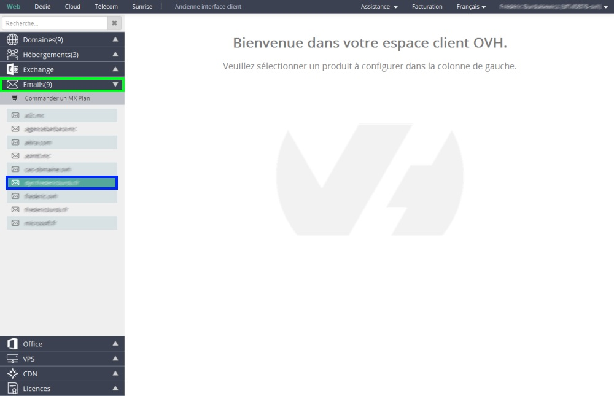
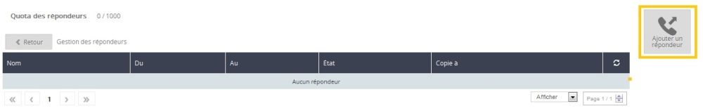
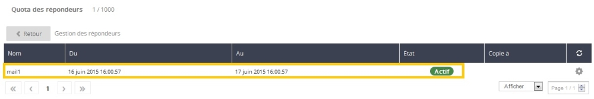

## Voraussetzungen

- Zugang zum Kundencenter
- Nutzung eines OVH Angebots, das die Erstellung von E-Mails erlaubt
- Verwendung der MX* Server von OVH

*Weitere Informationen zu MX finden Sie in folgender Anleitung: 

## Verbindung zum Kundencenter

- Loggen Sie sich mit Ihrer Kundenkennung (nic-handle) und dem zugehörigen Passwort in Ihr [Kundencenter](https://www.ovh.com/manager/web) ein.

{.thumbnail}

## Auswahl der Domain des Mailing-Angebots
Wenn Sie eingeloggt sind, klicken Sie im Menü links auf E-Mails und wählen Sie anschließend die gewünschte Domain aus.

{.thumbnail}

## Menüpunkt E-Mails
Um Ihre Auto-Antworten zu verwalten, wählen Sie den Menüpunkt "E-Mails" (1) und klicken Sie anschließend rechts auf "Verwaltung der Auto-Antworten" (2).

{.thumbnail}

## Verwaltung der Auto-Antworten
Dann klicken Sie rechts auf "Eine Auto-Antwort hinzufügen".

{.thumbnail}

## Konfiguration der Auto-Antwort
Typ der Auto-Antwort (1):

- "An eine Mailbox gebunden" (wenn Sie eine existierende Mailbox verwenden und kein Alias).
- "Frei" (wenn Sie ein Alias verwenden).

Mailbox:
- die E-Mail-Adresse/das Alias, für die/das Sie die Auto-Antwort einrichten.

Verwendungszeitraum der Auto-Antwort (2):
- "Temporär": Geben Sie Anfangs- und Enddatum für Ihre Auto-Antwort an (wenn Sie beispielsweise im Urlaub nicht erreichbar sind).

- "Permanent": Die Auto-Antwort wird so lange versendet, bis Sie sie deaktivieren.

Die Nachrichten auf dem Server belassen bzw. Eine Kopie versenden (3):
- Setzen Sie hier das Häkchen, wenn Sie eine Kopie der Nachricht

speichern möchten. Wenn Sie eine "freie" Auto-Antwort einrichten, müssen Sie die E-Mail-Adresse angeben, an die eine Kopie der Nachricht verschickt werden soll.

Nachricht (4):

- Ihre Auto-Antwort. Diese Nachricht werden die Personen erhalten, die Ihnen im definierten Zeitraum eine E-Mail schicken.

Bestätigung (5):
- Klicken Sie anschließend auf "bestätigen", um die Auto-Antwort zu aktivieren.

{.thumbnail}

- Anschließend wird die Aktivierung der Auto-Antwort bestätigt.

{.thumbnail}

## Anzeige der Auto-Antwort
Nun erscheint die soeben eingerichtete Auto-Antwort in der Liste der Auto-Antworten. Wenn Sie die Auto-Antwort löschen oder ändern wollen, klicken Sie auf das kleine Zahnrad rechts.

{.thumbnail}

