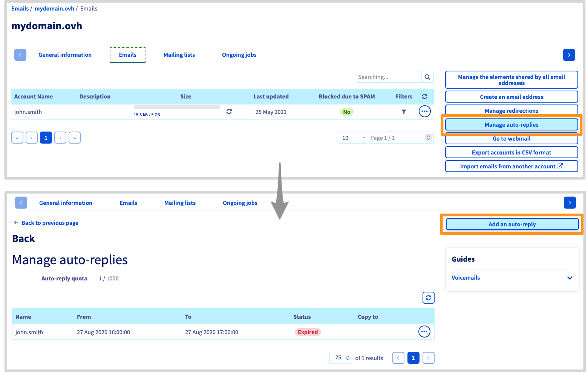

> [!primary]
> Questa traduzione è stata generata automaticamente dal nostro partner SYSTRAN. I contenuti potrebbero presentare imprecisioni, ad esempio la nomenclatura dei pulsanti o alcuni dettagli tecnici. In caso di dubbi consigliamo di fare riferimento alla versione inglese o francese della guida. Per aiutarci a migliorare questa traduzione, utilizza il pulsante "Contribuisci" di questa pagina.
>

**Ultimo aggiornamento: 28/08/2020**

## Obiettivo

In caso di assenza al tuo ufficio, puoi installare una segreteria email che lascerà un messaggio agli interlocutori che desiderano contattarti via email.

**Questa guida ti mostra come configurare una risposta automatica.**

## Prerequisiti

- Disporre di una soluzione MX Plan Puoi effettuare questa operazione tramite: un'offerta di [hosting Web](https://www.ovhcloud.com/it/web-hosting/){.external}, l'[hosting gratuito Start 10M](https://www.ovhcloud.com/it/domains/free-web-hosting/){.external} incluso con un dominio (attivato in precedenza) o la soluzione MX Plan ordinata separatamente.
- Avere accesso allo [Spazio Cliente OVHcloud](https://www.ovh.com/auth/?action=gotomanager&from=https://www.ovh.it/&ovhSubsidiary=it)

## Procedura

> [!primary]
>
> Se il tuo indirizzo email è su un'offerta [**Exchange**](https://www.ovhcloud.com/it/emails/hosted-exchange/), [**Email Pro**](https://www.ovhcloud.com/it/emails/email-pro/) o non hai una sezione `Gestione delle risposte automatiche`{.action} nel tuo MXplan, dovrai creare la risposta automatica dalla tua Webmail utilizzando la documentazione ["Installare una risposta automatica dall'interfaccia OWA"](/pages/web/microsoft-collaborative-solutions/owa_automatic_replies).

### Crea la risposta automatica

Accedi allo [Spazio Cliente OVHcloud](https://www.ovh.com/auth/?action=gotomanager&from=https://www.ovh.it/&ovhSubsidiary=it){.external}. 

Seleziona il dominio nella sezione `Email`{.action}.

Clicca sulla scheda `Email`{.action} e poi su `Gestisci le risposte automatiche`{.action}.

Verrai reindirizzato alla finestra `Gestione delle risposte` automatiche che visualizzeranno tutte le risposte automatiche attive sulla tua soluzione di posta.

Clicca su `Aggiungi una risposta automatica`{.action}

{.thumbnail}

Si apre la finestra di aggiunta. completandola con le informazioni indicate qui sotto.

- `Tipo di segreteria`:

"Associato a una casella email": da utilizzare se questo è un indirizzo email esistente sulla tua soluzione di posta.
Libero: da utilizzare nel caso di un alias. e non risulta quindi associato a un indirizzo esistente.

- `Casella email` o `Nome della segreteria`: indirizzo email o alias della segreteria.

- `Durata della risposta automatica`:

"Temporaneo": definisci una data di inizio e di fine da prendere in considerazione per il funzionamento della tua segreteria (utile, ad esempio, in caso di congedo).
"Permanente": la segreteria funzionerà finché non l'avrai disattivato.

- `Invia una copia` o `Mantieni i messaggi sul server`: permette di reindirizzare i messaggi ricevuti durante la tua assenza verso l'indirizzo di tua scelta o di conservarli sull'indirizzo email.

> [!warning]
> Se deselezionate questa casella, i messaggi ricevuti durante la vostra assenza saranno automaticamente eliminati.

- `Indirizzo in copia` (solo in modalità libera): nel caso di un alias, seleziona l'indirizzo email che riceverà le email inviate all'alias.

- `Messaggio`: È il messaggio che riceverai i tuoi interlocutori quando ti invieranno un'email.

Clicca su `Conferma`{.action} per impostare la risposta automatica.

### Modifica o eliminazione della risposta automatica

Una volta creata la risposta automatica, comparirà nella lista visibile nella sezione Gestione delle risposte automatiche` `{.action} della tua soluzione di posta. Per eliminarlo o modificarlo, clicca sui tre puntini in corrispondenza del servizio interessato.

{.thumbnail}

## Per saperne di più

Contatta la nostra Community di utenti all’indirizzo <https://community.ovh.com/en/>.
