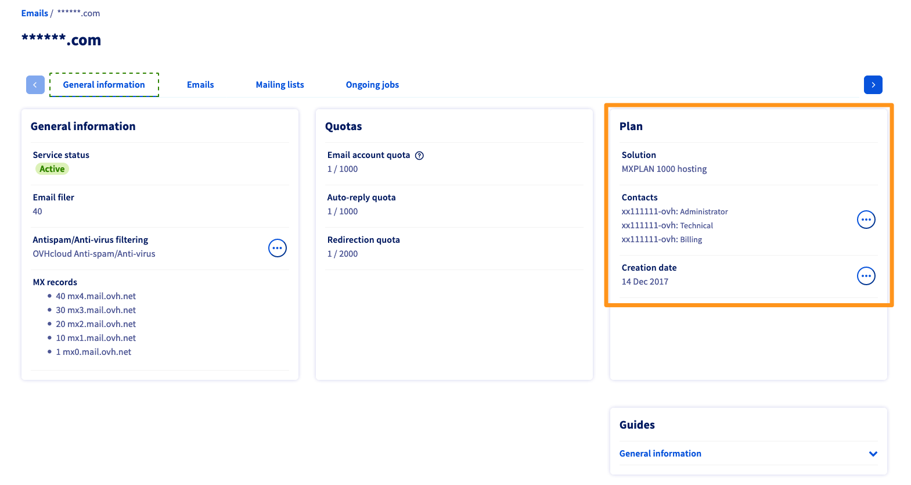
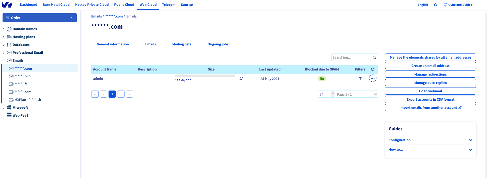

> [!primary]
> Diese Übersetzung wurde durch unseren Partner SYSTRAN automatisch erstellt. In manchen Fällen können ungenaue Formulierungen verwendet worden sein, z.B. bei der Beschriftung von Schaltflächen oder technischen Details. Bitte ziehen Sie beim geringsten Zweifel die englische oder französische Fassung der Anleitung zu Rate. Möchten Sie mithelfen, diese Übersetzung zu verbessern? Dann nutzen Sie dazu bitte den Button “Mitmachen“ auf dieser Seite.
>

**Letzte Aktualisierung am 11.10.2021**

## Ziel 

Die Delegation gibt dem Benutzer eines E-Mail-Accounts die Möglichkeit, verschiedene Funktionen (insbesondere die Änderung des Passworts) selbst zu verwalten. Diese Funktionen hängen vom Typ der eingerichteten Übertragung ab:

- Alle **Ihre E-Mail-Accounts** einem oder mehreren OVHcloud Accounts übertragen. Diese Art der Übertragung ermöglicht es Kunden-Accounts, die Filter, E-Mail-Beantworter, Weiterleitungen/Alias sowie Mailinglisten zu verwalten.

- Einen **oder mehrere E-Mail-Accounts** und deren Filter einem einzigen OVHcloud-Account zuweisen. Diese Art der Übertragung erlaubt es den Empfängern nicht, die E-Mail Beantworter, Weiterleitungen oder Mailinglisten zu verwalten. Außerdem ist es den Empfängern nicht möglich, das oder die betreffenden E-Mail-Accounts zu löschen, E-Mails von einem anderen Account zu importieren oder Delegationen zu verwalten.

**Diese Anleitung erklärt, wie Sie die E-Mail-Accounts Ihres MX Plan Angebots delegieren können.**

## Voraussetzungen

 - Sie verfügen über ein MX Plan Angebot, entweder in einem [OVHcloud Webhosting](https://www.ovhcloud.com/de/web-hosting/) enthalten, separat bestellt, oder als Teil eines kostenlosen [Start 10M Hostings](https://www.ovhcloud.com/de/domains/free-web-hosting/).
- Sie haben Zugriff auf Ihr [OVHcloud Kundencenter](https://www.ovh.com/auth/?action=gotomanager&from=https://www.ovh.de/&ovhSubsidiary=de).

> [!warning]
>
> Die folgende Anleitung ist nur anwendbar auf den Dienst MX Plan *Legacy*. Für unsere aktuelle Version dieses Angebots gibt es keine Delegationsverwaltung. Die Änderung des Passworts, die Eingangsfilter und Auto-Antworten eines E-Mail-Accounts können direkt über das OWA Webmail (**O**utlook **W**eb **A**pplication) verwaltet werden. Sie können anhand der nachstehenden Tabelle identifizieren, welche Version des MX Plan Sie verwenden.
>

|MX Plan Legacy|MX Plan neuere Version|
|---|---|
|{.thumbnail}  Die Angebotsbezeichnung steht in der Box "Abo".|{.thumbnail} Die `Server-Referenz` befindet sich in der Box "Zusammenfassung".|
|Lesen Sie weiter in dieser `[Anleitung](#oldmxplan)`.|Fahren Sie fort mit unserer Anleitung zur [Verwendung der Outlook Web App](/pages/web/microsoft-collaborative-solutions/owa_user_guide#passwort-andern).|

## In der praktischen Anwendung 

> [!primary]
>
>Die Einrichtung einer Delegation für einen E-Mail-Account führt dazu, dass er im betreffenden [Kundencenter](https://www.ovh.com/auth/?action=gotomanager&from=https://www.ovh.de/&ovhSubsidiary=de) angezeigt wird. Für den delegierten Account sind jedoch nur die im Abschnitt [Ziel](#objective) dieser Anleitung aufgeführten Änderungen möglich.
>

Loggen Sie sich in Ihr [OVHcloud Kundencenter](https://www.ovh.com/auth/?action=gotomanager&from=https://www.ovh.de/&ovhSubsidiary=de) ein und wechseln Sie zum Bereich `Web Cloud`{.action}.

Wählen Sie die Domain im Bereich `E-Mails`{.action} aus und gehen Sie auf den Tab `E-Mails`{.action}, um die Liste der E-Mail-Accounts Ihres MX Plan Angebots anzuzeigen.

{.thumbnail}

### Alle Ihre E-Mail-Accounts an einen oder mehrere OVHcloud Kundenkennungen delegieren

Diese Art der Delegation ermöglicht es dem begünstigten Account, Passwörter, Filter, E-Mail-Beantworter, Weiterleitungen/Alias sowie Mailinglisten zu verwalten.

Klicken Sie rechts auf `Freigaben für alle E-Mail-Adressen verwalten`{.action}.

{.thumbnail}

Es öffnet sich ein neuer Bereich. Klicken Sie auf `+`{.action} neben `Eine Kennung hinzufügen`. Geben Sie die OVHcloud Kundenkennung an, die diese Delegation erhält, und bestätigen Sie Ihre Eingabe.

{.thumbnail}

Sie können die Verwaltung Ihres MX Plan Dienstes an mehrere OVHcloud Kundenkennungen delegieren.

### Einen oder mehrere E-Mail-Accounts an einen Benutzer delegieren

Mit dieser Delegation können Sie das Passwort des betreffenden E-Mail-Accounts ändern und dessen Filter verwalten.

Klicken Sie rechts neben dem E-Mail-Account, den Sie delegieren möchten, auf `...`{.action} und dann `Delegationsverwaltung`{.action}.

{.thumbnail}

Geben Sie die OVHcloud Kundenkennung an, die diese Delegation erhält, und bestätigen Sie Ihre Eingabe.

{.thumbnail}

Sie können mehrere Kundenkennung angeben, um einen E-Mail-Account zu verwalten.

## Weiterführende Informationen

[Erste Schritte mit MX Plan](/pages/web/emails/email_generalities)

Für den Austausch mit unserer User Community gehen Sie auf <https://community.ovh.com/en/>.
