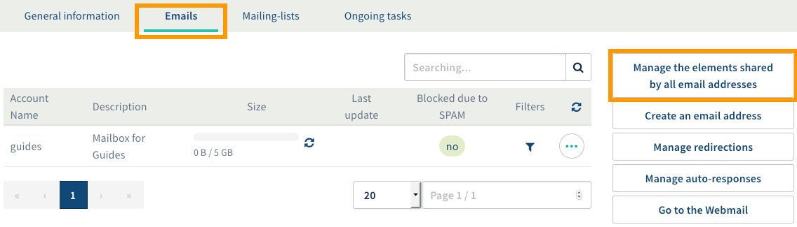

**Dernière mise à jour le 05/05/2020**

## Informations et pre-requis

### Informations

Deux choix s'offrent à vous :

- Déléguer tout le service email d'un domaine à un identifiant

Utile dans le cas ou vous souhaitez déléguer  **tous**  les comptes emails lié à un nom de domaine, à un ou plusieurs identifiants OVHcloud. Cela permettra aussi à l'identifiant final de gérer  **les filtres, les répondeurs emails, les redirections/alias, ainsi que les Mailing Lists** .

- Déléguer un ou plusieurs comptes emails à un identifiant

Utile dans le cas ou vous souhaitez déléguer  **seulement un ou certains comptes emails et leur filtres**  d'un nom de domaine, à un identifiant OVHcloud. Cela  **ne permet pas**  à l'identifiant final de gérer  **les répondeurs emails, les redirections, ni les Mailing Lists** . Cela ne permet pas non plus à l'identifiant final de supprimer le compte, ou d'importer les emails d'un autre compte, ni de lui-même redéléguer le compte.

### Pre-requis

Dans un premier temps, connectez-vous à votre [espace client](https://ca.ovh.com/auth/?action=gotomanager){.external} à l'aide de votre couple identifiant (nic- handle) - mot de passe. Puis rendez-vous dans la section "Emails" sur la gauche.

{.thumbnail}

## Deleguer vos emails

### Deleguer tout le service email d'un domaine a un identifiant

- Sélectionnez le service e-mail concerné dans le menu de gauche puis positionnez-vous sur l'onglet "Emails"
- Cliquez alors sur "Gérer vos partages pour toutes les adresses email"

{.thumbnail}

- Enfin, entrez l'identifiant OVHcloud avec qui partager l'administration de vos adresses emails et validez l'opération .

{.thumbnail}

Il est possible d'ajouter plusieurs identifiants OVHcloud pour gérer chaque adresse email. La délégation permet de gérer les adresses email de mon domaine, ainsi que les répondeurs, les redirections/alias, et les Mailing Lists.

### Deleguer un ou plusieurs comptes emails a un identifiant

- Sélectionnez le domaine concerné sur la gauche
- A droite du compte email que vous souhaitez déléguer, cliquez sur le bouton "..."
- Cliquez sur " Délégation de la gestion "

{.thumbnail}

Vous pourrez saisir l'identifiant OVHcloud avec qui partager l'administration de cette adresse email et valider l'opération. Il est possible d'ajouter plusieurs identifiants OVHcloud pour gérer chaque adresse email.

{.thumbnail}
